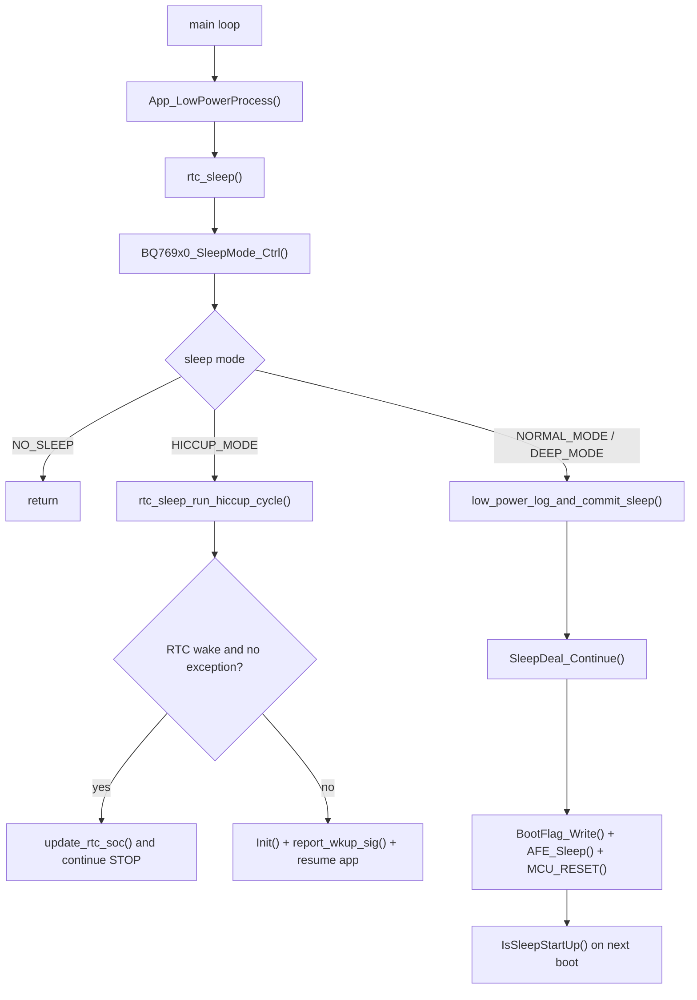

# 低功耗与项目框架收敛说明

日期：2026-04-23

## 本次目标

这次改动不做大规模重构，先解决当前代码里已经影响行为或维护性的几个问题：

1. 把主循环正在生效的低功耗入口显式化。
2. 修正 RTC 唤醒周期“配置按分钟、执行按秒”的单位错配。
3. 让 `NORMAL_MODE` 不再停留在空分支，真正进入现有休眠链路。
4. 把低功耗请求接口收敛成一条主路径，减少 `sleep()` / `entersleep()` / `SleepDeal_Continue()` 分散调用造成的理解成本。
5. 给 HICCUP 唤醒补一层来源判定，便于后续继续做功耗验证。

## 当前有效框架

### 1. 主循环入口

主循环现在统一调用 `App_LowPowerProcess()`，由它进入 `rtc_sleep()`。

- 位置：`Project/Source/main.c`
- 作用：避免继续直接使用名字过于泛化的 `sleep()` 作为主流程入口

### 2. 低功耗请求接口

新增统一请求接口 `LowPower_Request()`，用于表达“请求哪一种休眠模式”。

- `HICCUP_MODE`：RTC 间歇休眠
- `NORMAL_MODE`：通过 `SleepDeal_Continue()` 进入 reset-based normal sleep
- `DEEP_MODE`：通过 `SleepDeal_Continue()` 进入 deep sleep
- `NO_SLEEP`：清空请求和状态

`entersleep()` 仍然保留，但只作为兼容包装层，内部直接转发给 `LowPower_Request()`。

### 3. RTC/HICCUP 路径

`rtc_sleep()` 每 1 秒评估一次：

1. `BQ769x0_SleepMode_Ctrl()` 根据状态决定是否请求休眠。
2. 如果请求的是 `HICCUP_MODE`，进入 `rtc_sleep_run_hiccup_cycle()`。
3. 如果是 RTC 正常唤醒且无异常，只做轻量检测后继续下一轮 STOP。
4. 如果不是 RTC 唤醒，退出 HICCUP，恢复系统并上报唤醒来源。

### 4. NORMAL/DEEP 路径

`NORMAL_MODE` 和 `DEEP_MODE` 现在都走统一链路：

1. `rtc_sleep()` 置 `b1_ToSleepFlag` 和日志标志。
2. 写入休眠事件。
3. 调 `SleepDeal_Continue()`。
4. 由原有逻辑写 BootFlag、AFE 休眠并软件复位。
5. 复位后的启动早期逻辑再决定是否继续 STOP。

这样做的原因是：项目里真正落地且被启动流程识别的深休眠机制，本来就建立在 `SleepDeal_Continue()` 这条链上，直接复用风险最低。

## 本次修复点

### 1. RTC 周期单位统一

新增 `RTC_GetWakeupPeriodSeconds()`：

- 配置项 `OtherElement.u16Sleep_TimeRTC` 继续按“分钟”理解
- 统一在 RTC 层转换成秒
- `RTC_WKTimeConfig()` 与 `rtc_sleep` 休眠时长统计共用同一换算口径

结果：默认值 `3` 现在表示 3 分钟，而不是实际只睡 3 秒。

### 2. `NORMAL_MODE` 真正生效

此前 `entersleep(NORMAL_MODE)` 在 `rtc_sleep.c` 中没有落到任何实际动作，属于“请求了但没执行”。

现在 `NORMAL_MODE` 会：

- 设置 `b1ForceToSleep_L2`
- 进入统一日志与 `SleepDeal_Continue()` 提交流程

### 3. 主循环职责更清晰

新增 `App_LowPowerProcess()` 作为主循环入口，目的是把“主循环驱动逻辑”和“底层兼容接口”分开。

后续如果继续拆分模块，可以直接围绕 `App_LowPowerProcess()` 做服务化，不必再从 `sleep()` 这个模糊接口向下追。

### 4. HICCUP 唤醒来源补充

HICCUP 退出时增加一层 best-effort 判定：

- PA0 高电平：判定为充电唤醒
- PA9 低电平：判定为按键唤醒
- PB12 高电平：判定为 RS485 唤醒
- PB7 高电平：判定为 UART1 唤醒

说明：

- 这一步是兜底判定，不替代真实中断来源记录。
- 当前 `Sci_Upper.c` 与 `stm32f10x_it.c` 文件编码不是 UTF-8，暂未在这些文件里继续做“首中断即记录来源”的收敛，以避免改坏旧工程文件。

## 调用时序

## 对项目框架的建议拆分

这次只做了入口收敛，没有大改目录。下一阶段如果继续优化，建议按下面顺序拆：

### 第一阶段：低功耗域内聚

- 新建 `low_power/` 目录
- 把 `rtc_sleep.c`、`SleepDeal.c` 中“模式选择、唤醒源、RTC 周期、启动恢复”拆成独立文件
- 目标：先把低功耗从大杂烩业务文件里剥离出来

建议子模块：

- `low_power_manager.c`：模式决策与主入口
- `low_power_rtc.c`：RTC/HICCUP 周期
- `low_power_boot.c`：BootFlag 与复位恢复
- `low_power_wakeup.c`：唤醒源归因与唤醒脚配置

### 第二阶段：系统服务层

- 把 `SOC`、`LogRecord`、`Fault`、`Can`、`Sci` 对低功耗的依赖收敛成接口
- 目标：由“模块彼此直接读全局变量”过渡到“低功耗读取服务状态”

优先收敛的接口：

- `LowPower_IsCommBusy()`
- `LowPower_IsChargeActive()`
- `LowPower_IsBalanceActive()`
- `LowPower_IsThermalActive()`
- `LowPower_RecordWakeupReason()`

### 第三阶段：清理历史兼容层

- 删除主流程中不再需要的 `sleep()` 旧入口
- 逐步减少 `entersleep()` 的外部直接调用
- 统一保留一个“请求接口”和一个“执行入口”

## 本次验证

Keil 命令行编译通过：

- 工程：`Project/Users/CommomSH367309_16series_103RCT6_C.uvprojx`
- 目标：`Target 1`
- 编译器：ARMCC 5.06 update 7
- 结果：0 error，19 warning

产物：

- `Project/Users/Objects/CommomSH367309_16series_103RCT6_C.axf`
- `Project/Users/Objects/CommomSH367309_16series_103RCT6_C.bin`

说明：19 个 warning 为工程原有 `rtc_sleep.c` 历史问题，本次改动未新增 error。
