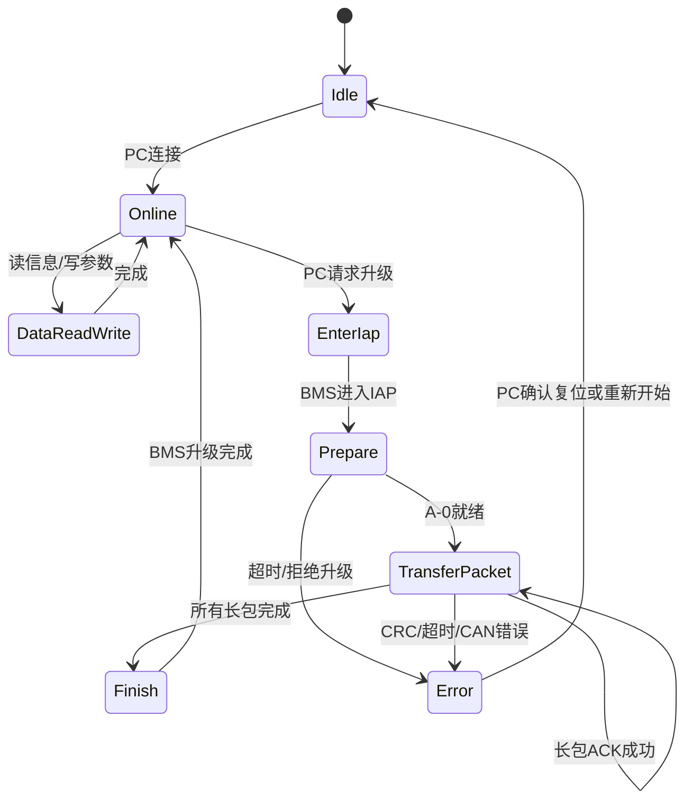

# CAN 升级器 MCU 完整开发方案

本文档用于固化后续开发方向：最终产品不要求客户购买 CAN 盒，PC 只通过串口/USB 与专用升级器 MCU 通信；升级器 MCU 通过 CAN 与 BMS 通信，完成电池信息读取、保护参数读写和 BMS 固件升级。

## 1. 目标

1. PC 不直接连接 CAN，不要求安装 CAN 盒驱动。
2. 升级器 MCU 同时具备两类能力：
   - PC 通信：通过 USB CDC 或 USB 转串口与 PC 软件交互。
   - BMS 通信：通过 CAN 与 BMS App / IAP 通信。
3. BMS 固件升级必须使用《飞道CAN通信协议V1.6》“七、固件升级部分”的 CAN 升级协议。
4. 电池信息读取和保护参数修改也通过升级器 MCU 转发，不另做 PC 直连 CAN 上位机。
5. 任意升级失败、断电、CRC 错误、通信中断后，BMS 必须能重新进入 IAP 继续升级，不能出现死机或无法再次升级。

## 2. 总体架构


角色划分：

| 模块 | 职责 |
| --- | --- |
| PC 软件 | 选择串口、选择 bin、显示电池信息、读写参数、显示升级进度和错误原因 |
| 升级器 MCU | 串口协议解析、CAN 协议封包、BMS ACK 管理、超时重试、数据缓存、日志上报 |
| BMS App | 正常运行，响应电池信息读取、保护参数读写、进入 IAP 请求 |
| BMS IAP | 独立 Bootloader，响应 PDF 第七节固件升级协议，擦写 App 区并校验跳转 |

## 3. 是否还需要 CAN 盒

最终客户使用不需要 CAN 盒。

开发阶段建议保留 CAN 盒作为调试工具，作用是抓包和验证升级器 MCU 发出的 CAN 帧是否符合协议。CAN 盒不是交付必需品，不是最终使用路径。

## 4. 硬件方案

### 4.1 升级器 MCU 选型

MCU 必须满足：

| 资源 | 要求 |
| --- | --- |
| CAN | 至少 1 路 CAN 控制器 |
| PC 通信 | USB CDC 或 UART |
| RAM | 至少能缓存 1 个 CAN 长包，建议 >= 4KB 可用 RAM |
| Flash | 能放下升级器固件，建议 >= 64KB |
| 看门狗 | 需要硬件或独立看门狗 |
| Boot | 升级器 MCU 自身建议预留 SWD 和后续自升级能力 |

推荐路径：

1. 当前指定目标：`STM32F103C8 + USB转串口芯片 + CAN收发器`。
2. 低成本扩展：`STM32F103CB/RC + USB转串口芯片 + CAN收发器`。
3. 单芯片 USB CDC：选择带 USB 和 CAN 且引脚不冲突或可重映射的 MCU。
4. 如果用 STM32F103C8 的原生 USB，同时使用 CAN，要注意 USB 使用 `PA11/PA12`，CAN 默认也在 `PA11/PA12`，需要 CAN 重映射到 `PB8/PB9`，并确认封装引脚可用。若 PC 侧使用 CH340/CP2102/FT232 这类 USB 转串口芯片，CAN 可以继续使用默认 `PA11/PA12`。

### 4.2 外设连接

| 接口 | 建议 |
| --- | --- |
| PC 侧 | USB CDC，或 CH340/CP2102/FT232 转 UART |
| BMS 侧 | CANH/CANL/GND，CAN 收发器建议 TJA1051/TJA1050/SN65HVD230 按电平选择 |
| 终端电阻 | 升级器端预留 120R 可开关终端 |
| 防护 | CANH/CANL 加 TVS，USB 加 ESD |
| 指示灯 | 电源、PC连接、CAN通信、升级中、错误 |
| 按键 | 升级器 MCU 进入 Boot/恢复出厂 |

### 4.3 接线

```text
PC USB
  |
  | USB CDC / USB转串口
  |
升级器 MCU
  |
  | CAN_TX / CAN_RX
  |
CAN收发器
  |
  | CANH / CANL / GND
  |
BMS CAN接口
```

## 5. BMS CAN 协议基础

飞道 CAN 协议使用扩展帧，29bit ID：

```text
ID[28:24] = SrcID
ID[23:19] = DstID
ID[18:16] = CtrlCMD
ID[15:8]  = Index
ID[7:0]   = ChdIndex
```

节点定义：

| 节点 | 值 |
| --- | --- |
| IOT/主节点 | `0x10` |
| 控制器 | `0x12` |
| 仪表 | `0x13` |
| 电池/BMS | `0x14` |
| 广播 | `0x1F` |

控制码：

| CtrlCMD | 含义 |
| --- | --- |
| `0x00` | 点对点写/发布 |
| `0x01` | 点对点读 |
| `0x02` | 正常应答 |
| `0x03` | 出错应答 |
| `0x04` | 长数据起始 |
| `0x05` | 长数据传输 |
| `0x06` | 长数据结束 |
| `0x07` | 告警 |

固定参数：

| 项目 | 值 |
| --- | --- |
| 帧格式 | CAN 2.0B 扩展帧 |
| 波特率 | 默认 `250 kbit/s` |
| 多字节字节序 | 大端 |
| 固件升级 CRC | CRC16-Modbus |

## 6. PC 与升级器 MCU 串口协议

PC 和升级器 MCU 之间使用自定义二进制串口协议。原因是串口链路不承载 CAN 原始总线时序，只需要可靠传输命令、数据、进度和错误码。

### 6.1 串口默认参数

| 参数 | 建议值 |
| --- | --- |
| 波特率 | `921600`，不稳定时退到 `460800` 或 `115200` |
| 数据位 | 8 |
| 校验 | None |
| 停止位 | 1 |
| 流控 | 默认无；批量升级可选 RTS/CTS |

USB CDC 模式下不强依赖波特率，但 PC 软件仍按同一参数显示。

### 6.2 串口帧格式

所有多字节字段采用大端，与飞道 CAN 协议一致。

| 字段 | 长度 | 说明 |
| --- | --- | --- |
| SOF | 2 | 固定 `0x55 0xAA` |
| Version | 1 | 当前 `0x01` |
| Cmd | 1 | 命令码 |
| Seq | 2 | PC 发起递增序号，响应必须原样返回 |
| Flags | 1 | bit0: ACK帧，bit1: 错误帧，其他保留 |
| Len | 2 | Payload 长度，建议单帧 <= 512 |
| HeaderCRC16 | 2 | 从 Version 到 Len 的 CRC16-Modbus |
| Payload | Len | 命令数据 |
| PayloadCRC16 | 2 | Payload CRC16-Modbus，Len=0 时为 `0xFFFF` |

接收方策略：

1. 扫描 `0x55 0xAA` 对齐帧。
2. 检查 Header CRC。
3. 检查 Len 不超过本地最大值。
4. 检查 Payload CRC。
5. 同一个 Seq 的重复命令可以重发同一响应，避免 PC 超时后重复造成状态错乱。

### 6.3 通用响应格式

所有命令都必须有响应。

| Payload 字段 | 长度 | 说明 |
| --- | --- | --- |
| Status | 1 | `0x00` 成功，非 0 失败 |
| Detail | 1 | 细分错误码 |
| Data | N | 可选响应数据 |

通用 Status：

| Status | 含义 |
| --- | --- |
| `0x00` | 成功 |
| `0x01` | 参数错误 |
| `0x02` | 当前状态不允许 |
| `0x03` | 串口 CRC 错误 |
| `0x04` | CAN 超时 |
| `0x05` | BMS 返回错误 |
| `0x06` | BMS CRC 错误 |
| `0x07` | 文件/镜像非法 |
| `0x08` | 内部缓存不足 |
| `0x09` | 升级被中止 |
| `0x0A` | 看门狗/系统保护触发 |
| `0xFF` | 未知错误 |

### 6.4 命令列表

| Cmd | 方向 | 名称 | 用途 |
| --- | --- | --- | --- |
| `0x01` | PC -> MCU | GET_DEVICE_INFO | 获取升级器版本、能力、缓冲区大小 |
| `0x02` | PC -> MCU | SET_CAN_CONFIG | 设置 CAN 波特率、主节点、目标 BMS 节点 |
| `0x03` | PC -> MCU | PING_BMS | 检查 BMS 是否在线 |
| `0x10` | PC -> MCU | READ_BMS_SNAPSHOT | 读取 MCU 缓存的 BMS 广播快照 |
| `0x11` | PC -> MCU | CAN_OBJECT_READ | 按 Index/ChdIndex 主动读取 BMS 数据 |
| `0x12` | PC -> MCU | CAN_OBJECT_WRITE | 按 Index/ChdIndex 写 BMS 数据 |
| `0x13` | PC -> MCU | PARAM_READ | 按参数 ID 读取保护参数 |
| `0x14` | PC -> MCU | PARAM_WRITE | 按参数 ID 写保护参数 |
| `0x15` | PC -> MCU | PARAM_WRITE_BATCH | 批量写参数，带统一校验和回读 |
| `0x20` | PC -> MCU | ENTER_BMS_IAP | 请求 BMS App 复位进入 IAP |
| `0x21` | PC -> MCU | UPGRADE_PREPARE | 发送文件大小、总 CRC、总长包数 |
| `0x22` | PC -> MCU | UPGRADE_PACKET_DATA | 发送一个固件长包的数据片段 |
| `0x23` | PC -> MCU | UPGRADE_PACKET_COMMIT | 提交当前长包，由 MCU 发 CAN 并等 BMS ACK |
| `0x24` | PC -> MCU | UPGRADE_FINISH | 等待 BMS 最终完成 ACK |
| `0x25` | PC -> MCU | UPGRADE_ABORT | 中止当前升级 |
| `0x26` | PC -> MCU | GET_UPGRADE_STATUS | 查询升级状态和进度 |
| `0x30` | PC -> MCU | CAN_RAW_TX | 调试用，发送原始 CAN 帧 |
| `0x31` | PC -> MCU | CAN_RAW_LISTEN | 调试用，监听原始 CAN 帧 |
| `0x40` | MCU -> PC | EVENT_REPORT | MCU 主动上报状态、日志、进度 |
| `0x7F` | PC -> MCU | MCU_RESET | 重启升级器 MCU |

## 7. 电池信息读取方案

电池信息读取分两类：被动缓存和主动读取。

### 7.1 被动缓存广播

BMS App 正常运行时会周期广播电池数据。升级器 MCU 应监听并缓存最近一次数据，PC 读取时不必每次都打扰 BMS。

缓存建议字段：

| 字段 | 来源 | 说明 |
| --- | --- | --- |
| 总压 | CAN 广播 | mV |
| 电流 | CAN 广播 | mA，有符号 |
| SOC | CAN 广播 | % |
| SOH | CAN 广播 | % |
| 温度 | CAN 广播 | 摄氏度 |
| 循环次数 | CAN 广播 | 次 |
| 满充容量 | CAN 广播 | 协议原始单位 |
| 当前容量 | CAN 广播 | 协议原始单位 |
| 设计容量 | CAN 广播 | 协议原始单位 |
| 工作状态 | CAN 广播 | bit 位 |
| 异常状态 | CAN 广播 | bit 位 |
| 协议版本 | CAN 广播 | 版本 |
| 软件版本 | CAN 广播 | 版本 |

PC 命令：`READ_BMS_SNAPSHOT`

响应需要包含：

| 字段 | 说明 |
| --- | --- |
| valid_mask | 哪些字段有效 |
| age_ms | 缓存距当前时间 |
| raw_data | 解析后的结构体 |

如果 `age_ms` 超过配置阈值，例如 3000ms，PC 应提示“BMS 无广播或通信异常”。

### 7.2 主动读取 BMS 对象

当 PC 要读取指定信息时，使用 `CAN_OBJECT_READ`：

PC Payload：

| 字段 | 长度 | 说明 |
| --- | --- | --- |
| index | 1 | 飞道 CAN Index |
| chd_index | 1 | 飞道 CAN ChdIndex |
| timeout_ms | 2 | 等待 BMS ACK 超时 |
| reserved | 4 | 保留 |

MCU 行为：

1. 构造扩展帧：`Src=0x10, Dst=0x14, Ctrl=0x01, Index=index, ChdIndex=chd_index`。
2. 发送 8 字节请求数据，保留字段填 `0x00`。
3. 等待 BMS 返回 `Ctrl=0x02` 正常应答或 `Ctrl=0x03` 错误应答。
4. 将原始 8 字节返回 PC。

这样 PC 软件可以先使用通用读对象能力，后续再逐步增加友好的字段解析。

## 8. 保护参数读写方案

保护参数不要让 PC 直接乱写原始 CAN 对象，推荐在升级器 MCU 和 PC 侧都维护同一份参数表。

### 8.1 参数表结构

每个参数定义：

| 字段 | 说明 |
| --- | --- |
| param_id | PC 侧稳定参数 ID |
| name | 参数名 |
| can_index | 飞道 CAN Index |
| can_chd_index | 飞道 CAN ChdIndex |
| byte_offset | 位于 8 字节 payload 的偏移 |
| data_type | u8/u16/u32/i16/i32 |
| endian | 大端 |
| scale | 物理量比例 |
| unit | 单位 |
| min | 最小允许值 |
| max | 最大允许值 |
| writable | 是否允许写 |
| require_confirm | 是否需要 PC 二次确认 |

参数表必须从正式协议文档和当前 BMS 参数范围整理生成，不能靠聊天记忆。

### 8.2 单参数读取

PC 命令：`PARAM_READ`

流程：

1. PC 发送 `param_id`。
2. MCU 查参数表。
3. MCU 通过 CAN_OBJECT_READ 读取对应 BMS 对象。
4. MCU 按 `byte_offset/data_type/scale` 解析。
5. MCU 返回原始值和物理值。

### 8.3 单参数写入

PC 命令：`PARAM_WRITE`

流程：

1. PC 发送 `param_id` 和目标物理值。
2. MCU 查表并做范围检查。
3. MCU 先读当前对象。
4. MCU 只修改目标字段，不破坏同一 payload 内其他字段。
5. MCU 发送写命令：`Src=0x10, Dst=0x14, Ctrl=0x00`。
6. MCU 等待 BMS ACK。
7. MCU 再读回同一对象。
8. 读回一致才返回成功。

### 8.4 批量参数写入

PC 命令：`PARAM_WRITE_BATCH`

批量写入必须采用“两阶段”：

1. 预检查阶段：
   - 所有 `param_id` 必须存在。
   - 所有值必须在范围内。
   - 需要确认的参数必须带确认标记。
2. 写入阶段：
   - 按对象分组，避免同一个 CAN payload 被重复读写。
   - 每组读当前值，合并多个字段，再写一次。
   - 每组写完必须读回验证。

任何一项失败，PC 必须显示失败参数和失败原因。

### 8.5 参数写入安全规则

1. 默认禁止写关键保护参数，PC 需要明确进入“参数维护模式”。
2. 写过压、欠压、过流、温度保护参数必须弹确认。
3. 写入前显示旧值、新值、单位、允许范围。
4. 写入后必须读回。
5. 参数表要有版本号，PC 和 MCU 参数表版本不一致时禁止写，只允许读。

## 9. BMS 固件升级方案

BMS 固件升级仍然由 BMS IAP 执行。升级器 MCU 只是 PC 和 BMS IAP 之间的可靠协议桥。

### 9.1 固定地址

| 区域 | 地址 |
| --- | --- |
| IAP/Bootloader | `0x08000000` |
| App 起始 | `0x08004800` |
| App 推荐安全上限 | `0x0801BFFF` |
| 参数区起始 | `0x0801C000` |
| 升级标志 | `0x0801F800` |

规则：

1. 禁止把 App bin 写到 `0x08000000`。
2. IAP 只能擦写 `0x08004800` 之后的 App 区。
3. IAP 禁止擦写 `0x0801C000` 之后的参数/日志区。
4. App 文件大小必须小于等于 `0x0801C000 - 0x08004800`。

### 9.2 PDF 第七节 CAN 升级帧

A-0 固件升级起始帧：

| 字段 | 值 |
| --- | --- |
| 方向 | 主节点 -> BMS |
| Ctrl | `0x00` |
| Index | `0x04` |
| ChdIndex | `0x00` |
| Byte1-2 | 长包总包数 U16 |
| Byte3-4 | 文件总 CRC16 U16 |
| Byte5-8 | 文件总长度 U32 |

A-1 设备应答：

| 字段 | 值 |
| --- | --- |
| 方向 | BMS -> 主节点 |
| Ctrl | `0x02` |
| Index | `0x04` |
| ChdIndex | `0x01` |
| Byte1 | `0` 不可升级，`1` 升级就绪 |
| Byte2-8 | 保留 |

B-0 长包起始：

| 字段 | 值 |
| --- | --- |
| Ctrl | `0x04` |
| Index | `0x05` |
| ChdIndex | `0x00` |
| Byte1-2 | 长包索引 U16 |
| Byte3-4 | 当前长包数据帧数 U16，默认最多 256 |
| Byte5-8 | 保留 |

B-0 数据帧：

| 字段 | 值 |
| --- | --- |
| Ctrl | `0x05` |
| Index | `0x05` |
| ChdIndex | 包号 `0~255` |
| Byte1-8 | 固件数据，不足 8 字节补 `0x00` |

B-0 长包结束：

| 字段 | 值 |
| --- | --- |
| Ctrl | `0x06` |
| Index | `0x05` |
| ChdIndex | `0x00` |
| Byte1-2 | 当前长包 CRC16 |
| Byte3-8 | 保留 |

B-1 设备应答：

| 状态 | 含义 |
| --- | --- |
| `0` | 长包传输成功 |
| `1` | 长包 CRC 校验失败 |
| `2` | 文件总校验错误 |
| `3` | 升级完成 |
| `0xFF` | 其他错误 |

### 9.3 推荐升级数据流

推荐升级器 MCU 采用“每次缓存一个 2048 字节长包”的方式，不要求 MCU 存完整固件。

流程：

1. PC 读取 App bin。
2. PC 检查：
   - 文件非空。
   - 向量表 MSP 合法。
   - Reset_Handler 位于 App 区。
   - 文件大小不超过 App 安全区。
3. PC 计算：
   - 文件总长度。
   - 文件 CRC16。
   - 总数据帧数。
   - 总长包数。
4. PC 发送 `UPGRADE_PREPARE` 给升级器 MCU。
5. MCU 向 BMS 发送 A-0 起始帧。
6. BMS IAP 返回 A-1 升级就绪。
7. PC 发送第 N 个长包数据给 MCU。
8. MCU 缓存完整长包，计算长包 CRC。
9. MCU 向 BMS 发送 B-0 长包起始、数据帧、长包结束。
10. BMS IAP 校验长包 CRC 后写入 Flash，并返回 B-1。
11. MCU 把 BMS ACK 和进度返回 PC。
12. 循环直到所有长包完成。
13. BMS IAP 做文件总 CRC、App 向量表校验、清升级标志、返回升级完成。
14. MCU 把最终结果返回 PC。

### 9.4 BMS IAP 端的稳定性要求

为了保证“不能死机、不能升级失败后无法恢复”，BMS IAP 必须按下面原则实现：

1. IAP 本身永远在 `0x08000000`，不能被 CAN 升级擦写。
2. 收到 A-0 后先检查文件长度、总包数、目标范围。
3. 不允许擦写 App 以外的 Flash。
4. 每个长包先接收到 RAM 缓冲区，长包 CRC 正确后再写 Flash。
5. 每写入 Flash 后必须回读校验。
6. 升级过程中断电，重启后 App 向量表无效，必须继续停留 IAP。
7. 总 CRC 错误，必须停留 IAP，不跳 App。
8. App 向量表非法，必须停留 IAP，不跳 App。
9. 只有完整成功后才清 `0x0801F800` 升级标志。
10. 看门狗如果开启，擦写 Flash 和等待 CAN 时必须喂狗。

### 9.5 进入 IAP

有两种方式：

1. App 正常运行时，PC 通过升级器 MCU 发送“进入 IAP”命令，BMS App 写 `0x0801F800 = 0x00AB` 后复位。
2. App 已损坏或空白时，IAP 上电检测 App 向量表无效，自动停留 IAP，等待升级。

进入 IAP 命令本身可以使用现有 App CAN 命令，也可以统一迁移到飞道 CAN 点对点写命令。最终建议统一到飞道协议，便于升级器 MCU 只维护一套 CAN 封包逻辑。

## 10. 升级器 MCU 固件模块划分

```text
upgrader_mcu/
  app_main.c
  bsp_uart.c/.h
  bsp_usb_cdc.c/.h
  bsp_can.c/.h
  protocol_serial.c/.h
  protocol_feidao_can.c/.h
  bms_object_table.c/.h
  bms_data_service.c/.h
  bms_param_service.c/.h
  bms_iap_upgrade.c/.h
  crc16_modbus.c/.h
  ring_buffer.c/.h
  app_config.h
```

模块职责：

| 模块 | 职责 |
| --- | --- |
| `protocol_serial` | PC 串口帧解析、ACK、重发、错误码 |
| `protocol_feidao_can` | 飞道 29bit CAN ID 封包/解包 |
| `bms_data_service` | 广播缓存、主动读对象 |
| `bms_param_service` | 参数表、范围检查、写入、读回验证 |
| `bms_iap_upgrade` | PDF 第七节升级状态机 |
| `bsp_can` | CAN 初始化、发送队列、接收队列、BusOff 恢复 |
| `crc16_modbus` | 串口协议和 CAN 升级共用 CRC16 |

## 11. 升级器 MCU 状态机



状态要求：

1. 读写参数时不能同时升级。
2. 升级过程中禁止普通参数写入。
3. CAN BusOff 后必须上报 PC，并尝试恢复。
4. PC 断开时，如果 BMS 已开始升级，升级器 MCU 应保持当前状态，等待 PC 重连查询；超时后上报升级中断。

## 12. PC 软件功能

第一阶段先做命令行，第二阶段做 GUI。

### 12.1 命令行功能

| 命令 | 功能 |
| --- | --- |
| detect | 查找串口、读取升级器信息 |
| read-snapshot | 读取 BMS 缓存快照 |
| read-object | 读取原始 CAN 对象 |
| write-object | 写原始 CAN 对象，默认仅调试模式允许 |
| read-param | 读取参数 |
| write-param | 写参数并读回 |
| upgrade-dry-run | 检查 bin、计算 CRC 和分包 |
| upgrade | 执行升级 |
| logs | 显示升级器 MCU 日志 |

### 12.2 GUI 功能

界面建议分为：

1. 连接页：串口、升级器版本、BMS 在线状态。
2. 实时信息页：总压、电流、SOC、SOH、温度、状态、故障。
3. 参数页：保护参数读取、修改、批量导入导出。
4. 升级页：选择 bin、dry-run、进入 IAP、升级进度、错误原因。
5. 日志页：PC、MCU、CAN、BMS ACK 记录。

## 13. 开发流程

### 阶段 1：文档和协议冻结

交付物：

1. 本文档。
2. PC 串口协议头文件或 JSON 描述。
3. BMS CAN 对象表和参数表初版。
4. PDF 第七节升级协议测试用例。

通过标准：

1. 地址规则写入仓库文档。
2. 升级流程、错误码、超时策略明确。
3. PC、升级器 MCU、BMS 三端职责明确。

### 阶段 2：BMS IAP 开发

交付物：

1. 独立 IAP 工程或独立构建脚本。
2. CAN 升级协议实现。
3. Flash 擦写和边界保护。
4. CRC 校验和失败留在 IAP。

通过标准：

1. IAP bin 固定烧 `0x08000000`。
2. App bin 只能写 `0x08004800` 后。
3. 断电/CRC 错误/空 App 都能重新升级。

### 阶段 3：BMS App CAN 读写服务

交付物：

1. BMS App 响应数据读取。
2. BMS App 响应保护参数读写。
3. BMS App 响应进入 IAP。
4. 参数写入复用现有范围检查和 Flash 保存逻辑。

通过标准：

1. 电池信息能通过升级器 MCU 读取。
2. 保护参数写入后能读回一致。
3. 写非法参数被 BMS 拒绝。

### 阶段 4：升级器 MCU 固件

交付物：

1. 串口协议。
2. CAN 驱动和飞道 CAN 封包。
3. 数据读取服务。
4. 参数读写服务。
5. 固件升级状态机。
6. 错误日志和进度上报。

通过标准：

1. PC 能读取升级器版本。
2. PC 能读取 BMS 快照。
3. PC 能写参数并读回。
4. PC 能通过升级器完成 BMS App 升级。

### 阶段 5：PC 工具

交付物：

1. 命令行工具。
2. GUI 工具。
3. 参数表导入导出。
4. 升级日志保存。

通过标准：

1. 不安装 CAN 盒驱动也能升级。
2. 操作员可以看到明确进度和错误原因。
3. 升级失败后能重新执行。

### 阶段 6：系统联调和量产流程

测试项目：

| 测试 | 预期 |
| --- | --- |
| 正常升级 | BMS 返回完成，重启后 App 正常 |
| 升级前拔 CAN | PC 显示 BMS 超时 |
| 传输中拔 CAN | BMS 停留 IAP，可重试 |
| 传输中断 PC 串口 | 升级器上报中断，BMS 可重试 |
| 固件 CRC 错误 | BMS 拒绝跳 App |
| App 空白 | BMS 上电停留 IAP |
| App 向量表错误 | BMS 上电停留 IAP |
| 文件过大 | PC/MCU/IAP 都拒绝 |
| 参数区保护 | 升级后参数不被擦除 |
| 重复升级 50 次 | 无死机、无无法升级 |

## 14. 关键风险和规避

| 风险 | 规避 |
| --- | --- |
| PC 传输中断 | MCU 每个长包提交一次，BMS 失败留 IAP |
| CAN 长包 CRC 错误 | BMS 先缓存长包，CRC 正确后再写 Flash |
| App 区擦错 | IAP 固定边界检查，禁止擦 IAP 和参数区 |
| 参数写错 | 参数表范围检查 + 写后读回 + 关键参数二次确认 |
| MCU 与 PC 协议不同步 | 协议版本和参数表版本不一致时禁止写 |
| CAN BusOff | MCU 自动恢复并上报 PC |
| 客户误选错误 bin | PC 检查向量表、大小、产品 ID、CRC |

## 15. 推荐的最终交付形态

1. 一个专用升级器小盒子：
   - USB 接 PC。
   - CANH/CANL/GND 接 BMS。
   - 带状态灯。
2. 一个 PC 软件：
   - 读取电池信息。
   - 修改保护参数。
   - 选择 bin 并升级。
   - 保存升级日志。
3. BMS 固件：
   - App 支持数据/参数 CAN 服务和进入 IAP。
   - IAP 支持 PDF V1.6 第七节升级协议。

结论：采用专用升级器 MCU 后，PC 不需要 CAN 盒，不需要直接做 CAN 上位机。CAN 协议复杂性集中在升级器 MCU 和 BMS 固件中，PC 软件只面对稳定的串口协议，现场使用和售后维护更简单。
