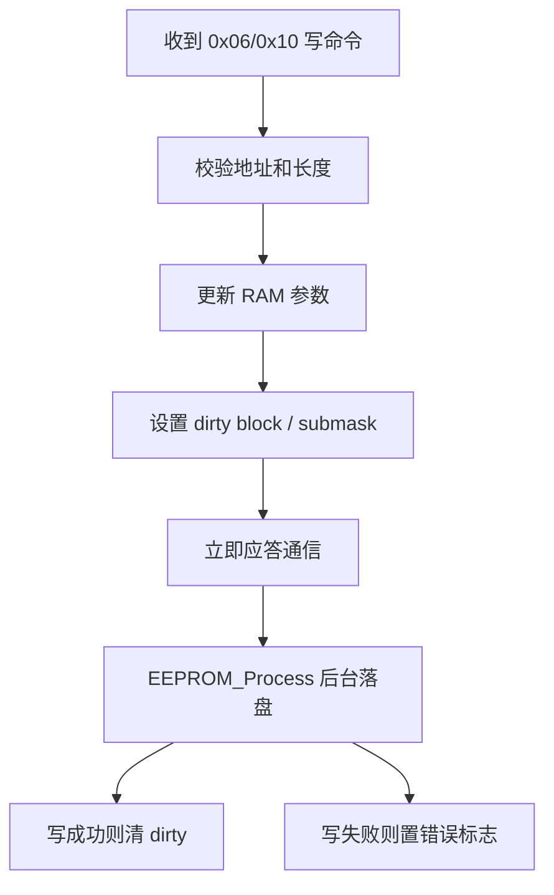

# 通信写 EEPROM 标志位收敛与 Keil 调试方案

本文只讨论一件事：**不改 EEPROM 地址、不改通信地址**，把当前过多的写标志位收敛掉，同时让逻辑更适合 Keil 在线调试。

## 1. 当前现状

### 1.1 通信写入口

`0x10` 写寄存器最终会进入 `Sci_Deal_WrRegs_0x10()`，再分发到：

- `Sci_WrRegs_0x10_CalibCoef()`
- `Sci_WrRegs_0x10_Protect()`
- `Sci_WrRegs_0x10_SocTable()`
- `Sci_WrRegs_0x10_CopperLoss()`
- `Sci_WrRegs_0x10_RTC()`
- `Sci_WrRegs_0x10_Balance()`
- `Sci_WrRegs_0x10_SysOther()`
- `Sci_WrRegs_0x10_SleepElement()`
- `Sci_WrRegs_0x10_SocElement()`
- `Sci_WrRegs_0x10_SystemElement()`
- `Sci_WrRegs_0x10_HeatCoolElement()`
- `Sci_WrRegs_0x10_SN_Version()`
- `Sci_WrRegs_0x10_FlashConnect()`

这些函数大多数不是直接写 EEPROM，而是先改 RAM，再把一堆全局写标志位拉起来。

### 1.2 现有写标志

当前写标志比较分散，典型的有：

- `u8E2P_KB_WriteFlag`
- `u32E2P_Pro_VolCur_WriteFlag`
- `u32E2P_Pro_Temp_WriteFlag`
- `u32E2P_Pro_Other_WriteFlag`
- `u32E2P_OtherElement1_WriteFlag`
- `u32E2P_HeatCool_WriteFlag`
- `u32E2P_RTC_Element_WriteFlag`
- `u8E2P_SocTable_WriteFlag`
- `u8E2P_CopperLoss_WriteFlag`
- `gu8_Reset_EventRecord`
- `ProductionInfor.BMS_*_WriteFlag`

问题不在于“有标志”，而在于“标志过细、过散、职责混杂”。

### 1.3 当前调度方式

`App_E2promDeal()` 现在会轮询这些标志，只要命中就调用 `WriteEEPROM_ByteData_Circle()`。

这个模式本身没错，但它的问题是：

- 上层通信和下层存储耦合太深
- 标志位多到难以一眼看懂
- Keil 调试时很难判断“这次到底该写哪一块”

## 2. 目标

目标保持很明确：

- EEPROM 地址不变
- 通信寄存器地址不变
- 参数含义不变
- 但写入逻辑更简单
- 更稳定
- 更适合 Keil 在线调试

## 3. 推荐的收敛方案

### 3.1 只保留“块级 dirty”

建议把所有写标志收敛成一个总 dirty 掩码，例如：

- `u32EepromDirtyMask`

每一位代表一个大块：

- bit0: 校准块
- bit1: 保护块
- bit2: RTC 块
- bit3: SOC 表块
- bit4: 铜损块
- bit5: OtherElement1 块
- bit6: 热管理块
- bit7: 产品信息块
- bit8: 事件记录块
- bit9: AFE 参数块
- bit10: 偏移量块
- bit11: 系统功能位块

通信层只做：

1. 更新 RAM
2. `mark_dirty(block_id)`

EEPROM 层只做：

1. 找到 dirty 块
2. 写一个最小单元
3. 清掉对应 dirty 位

### 3.2 大块再保留少量子位图

如果你还想保留“分段写”的优势，可以只给少数大块保留子 mask：

- `u32ProtectDirtyMask`
- `u32Other1DirtyMask`
- `u32HeatCoolDirtyMask`
- `u32CalibDirtyMask`

这样：

- 大块只写变动字段
- 小块直接整块写
- 不需要再扩展一堆全局 flag

### 3.3 旧标志的归并思路

可以这样合并：

| 旧标志 | 建议归属 |
|---|---|
| `u8E2P_KB_WriteFlag` | 校准块 |
| `u32E2P_Pro_VolCur_WriteFlag` | 保护块 |
| `u32E2P_Pro_Temp_WriteFlag` | 保护块 |
| `u32E2P_Pro_Other_WriteFlag` | 保护块 |
| `u32E2P_OtherElement1_WriteFlag` | OtherElement1 块 |
| `u32E2P_HeatCool_WriteFlag` | 热管理块 |
| `u32E2P_RTC_Element_WriteFlag` | RTC 块 |
| `u8E2P_SocTable_WriteFlag` | SOC 表块 |
| `u8E2P_CopperLoss_WriteFlag` | 铜损块 |
| `gu8_Reset_EventRecord` | 事件记录块 |
| `ProductionInfor.BMS_*_WriteFlag` | 产品信息块 |

### 3.4 最终接口建议

建议最后只保留这类高层接口：

- `EEPROM_MarkDirty(block_id)`
- `EEPROM_Process()`
- `EEPROM_LoadAll()`
- `EEPROM_WriteWordVerified()`
- `EEPROM_ReadWord()`

通信层不要再直接调用底层单字节写。

## 4. 推荐的执行流程

### 4.1 通信写流程

### 4.2 EEPROM 落盘流程

1. 只看 dirty mask
2. 挑一个块
3. 按块内顺序写
4. 每次写完回读校验
5. 成功后清 dirty
6. 失败则保留 dirty，下一轮继续

这样可以避免：

- 通信里堆大量落盘逻辑
- 一次性写很多块
- 出错后不知道哪一步停了

## 5. Keil 在线调试建议

这一部分是为了你实际下断点好用。

### 5.1 建议重点观察的变量

在 Keil Watch 里优先看这些：

- `u32EepromDirtyMask`
- `u32ProtectDirtyMask`
- `u32Other1DirtyMask`
- `u32HeatCoolDirtyMask`
- `u32CalibDirtyMask`
- `u8E2P_KB_WriteFlag`  如果还没删干净
- `gu8_Reset_EventRecord`
- `System_ErrFlag.u8ErrFlag_Com_EEPROM`
- `u8FlashUpdateE2PROM`
- `MCUO_E2PR_WP`

如果先做过渡版本，还可以继续盯：

- `u32E2P_Pro_VolCur_WriteFlag`
- `u32E2P_Pro_Temp_WriteFlag`
- `u32E2P_Pro_Other_WriteFlag`
- `u32E2P_OtherElement1_WriteFlag`
- `u32E2P_HeatCool_WriteFlag`

### 5.2 建议下断点的位置

优先下在这些函数上：

1. `Sci_Deal_WrRegs_0x10()`
2. 对应的 `Sci_WrRegs_0x10_*()` 分发函数
3. `App_E2promDeal()`
4. `WriteEEPROM_ByteData_Circle()`
5. `WriteEEPROM_Word_NoZone()`
6. `WriteEEPROM_Byte()`
7. `ReadEEPROM_ByteData_StartUp()`
8. `InitData_E2prom()`

### 5.3 观察顺序

建议按这个顺序看：

1. 通信收到写命令后，RAM 有没有先改对
2. dirty 位有没有被正确置位
3. `App_E2promDeal()` 有没有被周期调用
4. EEPROM 写函数有没有真的进来
5. `MCUO_E2PR_WP` 有没有在退出时恢复为 1
6. `WriteEEPROM_Word_NoZone()` 回读是否一致
7. 失败时错误标志有没有设置

### 5.4 Keil 调试技巧

- 在 `Sci_WrRegs_0x10_*()` 里先观察 RAM 是否已经更新
- 在 `App_E2promDeal()` 里看 dirty 位是否被消耗
- 在 `WriteEEPROM_Byte()` 里看 WP 引脚是否在异常路径上恢复
- 在 `WriteEEPROM_Word_NoZone()` 里看 `result` 和 `tmp16` 是否一致
- 如果怀疑地址写错，直接看 `addr` 和对应的 RAM 字段值

## 6. 建议的过渡方案

不建议一下子把所有旧 flag 删光。

更稳的方式是三步走：

### 第一步

新增：

- 总 dirty mask
- 块级处理函数
- 新的统一调度入口

### 第二步

让 `Sci_WrRegs_0x10_*()` 只负责：

- 更新 RAM
- 设置新 dirty 位

旧 flag 先保留一段时间，便于对照调试。

### 第三步

确认新流程稳定后，再逐步删掉：

- 字段级写标志
- 多余的 `else if` 分支
- 旧的散乱写入口

## 7. 可变标志与 dirty 位映射表

如果需要逐项替换当前字段级写标志，或确认通信字段与 EEPROM 参数块的对应关系，优先参考这份对照表：

- [COMMUNICATION_EEPROM_FLAG_MAPPING.md](COMMUNICATION_EEPROM_FLAG_MAPPING.md)
