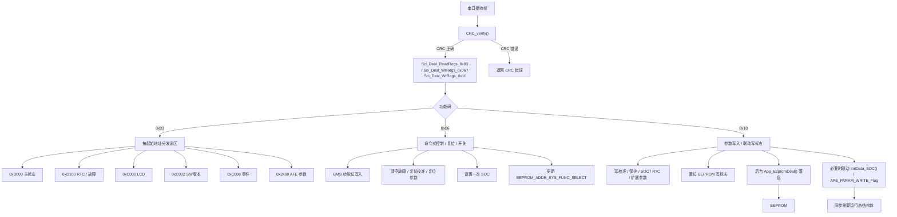

# 通信逻辑与地址整理文档

本文梳理当前工程中与通信相关的逻辑、地址映射和数据落点，重点覆盖 RS485/SCI、CAN、通信触发的 EEPROM 写入，以及与通信有关的工程地址信息。

本文基于当前仓库中的 `103 + 309` 工程源码整理，主要参考：

- [`E:\TODO\103 + 309 - 副本 - 副本\103 + 309\Project\Source\Sci_Upper.h`](E:/TODO/103%20+%20309%20-%20%E5%89%AF%E6%9C%AC%20-%20%E5%89%AF%E6%9C%AC/103%20+%20309/Project/Source/Sci_Upper.h)
- [`E:\TODO\103 + 309 - 副本 - 副本\103 + 309\Project\Source\Sci_Upper.c`](E:/TODO/103%20+%20309%20-%20%E5%89%AF%E6%9C%AC%20-%20%E5%89%AF%E6%9C%AC/103%20+%20309/Project/Source/Sci_Upper.c)
- [`E:\TODO\103 + 309 - 副本 - 副本\103 + 309\Project\Source\SH367309_DataDeal.h`](E:/TODO/103%20+%20309%20-%20%E5%89%AF%E6%9C%AC%20-%20%E5%89%AF%E6%9C%AC/103%20+%20309/Project/Source/SH367309_DataDeal.h)
- [`E:\TODO\103 + 309 - 副本 - 副本\103 + 309\Project\Source\SH367309_DataDeal.c`](E:/TODO/103%20+%20309%20-%20%E5%89%AF%E6%9C%AC%20-%20%E5%89%AF%E6%9C%AC/103%20+%20309/Project/Source/SH367309_DataDeal.c)
- [`E:\TODO\103 + 309 - 副本 - 副本\103 + 309\Project\Source\Can_HDX.h`](E:/TODO/103%20+%20309%20-%20%E5%89%AF%E6%9C%AC%20-%20%E5%89%AF%E6%9C%AC/103%20+%20309/Project/Source/Can_HDX.h)
- [`E:\TODO\103 + 309 - 副本 - 副本\103 + 309\Project\Source\System_Monitor.c`](E:/TODO/103%20+%20309%20-%20%E5%89%AF%E6%9C%AC%20-%20%E5%89%AF%E6%9C%AC/103%20+%20309/Project/Source/System_Monitor.c)
- [`E:\TODO\103 + 309 - 副本 - 副本\103 + 309\Project\Source\LogRecord.c`](E:/TODO/103%20+%20309%20-%20%E5%89%AF%E6%9C%AC%20-%20%E5%89%AF%E6%9C%AC/103%20+%20309/Project/Source/LogRecord.c)
- [`E:\TODO\103 + 309 - 副本 - 副本\103 + 309\Project\Users\Objects\CommomSH367309_16series_103RCT6_C.build_log.htm`](E:/TODO/103%20+%20309%20-%20%E5%89%AF%E6%9C%AC%20-%20%E5%89%AF%E6%9C%AC/103%20+%20309/Project/Users/Objects/CommomSH367309_16series_103RCT6_C.build_log.htm)
- [`E:\TODO\103 + 309 - 副本 - 副本\103 + 309\Project\Users\Objects\CommomSH367309_16series_103RCT6_C.sct`](E:/TODO/103%20+%20309%20-%20%E5%89%AF%E6%9C%AC%20-%20%E5%89%AF%E6%9C%AC/103%20+%20309/Project/Users/Objects/CommomSH367309_16series_103RCT6_C.sct)

## 1. 通信总览

当前工程的通信主要分成两条线：

- RS485 / SCI：主通信协议，采用类 Modbus 的寄存器地址风格，支持 `0x03` 读寄存器、`0x06` 单寄存器写、`0x10` 多寄存器写。
- CAN：主要用于检查帧和状态发送，当前工程中的 CAN 主要是固定 ID 的功能检查，不承担 EEPROM 地址映射。

通信执行的核心入口在 `App_CommonUpper()` 和各路 `App_CommonUpperSCI1/SCI2/SCI3()` 中，主循环通过 `App_Sci()` 持续处理接收和应答。

## 2. RS485 基本信息

### 2.1 基本参数

定义在 [`Sci_Upper.h`](E:/TODO/103%20+%20309%20-%20%E5%89%AF%E6%9C%AC%20-%20%E5%89%AF%E6%9C%AC/103%20+%20309/Project/Source/Sci_Upper.h)：

- 广播地址：`0x00`
- 从机地址：`0x01`
- TX 缓冲长度：`251`
- 最大接收缓冲长度：`251`
- 支持命令：
  - `0x03` 读寄存器
  - `0x06` 写单寄存器
  - `0x10` 写多寄存器

### 2.2 RS485 地址分区

RS485 采用寄存器地址做逻辑分区，不同地址段对应不同数据区或功能区。

#### 2.2.1 可写区

| 起始地址 | 宏定义 | 含义 |
|---|---|---|
| `0x2000` | `RS485_ADDR_RW_CALIB` | 校准区，K/B 系数等 |
| `0x2100` | `RS485_ADDR_RW_PORTECT` | 保护参数区 |
| `0x2200` | `RS485_ADDR_RW_OTHER` | 其它参数区 |
| `0x2300` | `RS485_ADDR_RW_OTHER_CANADD` | 扩展可写区 |

#### 2.2.2 只读区

| 起始地址 | 宏定义 | 含义 |
|---|---|---|
| `0xD000` | `RS485_ADDR_RO_START0` | 主状态数据区 |
| `0xD100` | `RS485_ADDR_RO_START1` | RTC、故障记录等区 |
| `0xD200` | `RS485_ADDR_RO_START2` | 扩展只读区 |
| `0xC000` | `RS485_ADDR_RO_LCD` | LCD 显示数据区 |
| `0xC001` | `RS485_ADDR_RO_FA_RTC` | RTC 相关区 |
| `0xC002` | `RS485_ADDR_SN_READ` | 序列号/版本号读取区 |
| `0xC008` | `RS485_ADDR_EVENT_RECORD` | 事件记录区 |
| `0xFFF0` | `RS485_ADDR_SN_SERIAL_NUM` | 序列号区 |
| `0xFFF1` | `RS485_ADDR_SN_HAEDWARE_VER` | 硬件版本区 |
| `0xFFF2` | `RS485_ADDR_SN_SOFTWARE_VER` | 软件版本区 |
| `0xFFFD` | `RS485_CMD_ADDR_FLASH_CONNECT` | 进入 IAP/Flash 更新触发地址 |

### 2.3 RS485 命令地址

命令地址定义在 `enum RS485_CMD_RW_E` 中，按功能分段。

#### 2.3.1 复位/控制类

| 地址 | 含义 |
|---|---|
| `0x1000` | 复位校准系数 |
| `0x1001` | 复位保护记录 |
| `0x1002` | 复位保护参数 |
| `0x1003` | 复位其它可写区 |
| `0x1004` | 复位加热/冷却参数 |
| `0x1005` | 设定一次 SOC |
| `0x1006` | 复位 AFE 参数 |
| `0x1007` | 复位事件记录 |

#### 2.3.2 开关和系统功能类

| 地址 | 含义 |
|---|---|
| `0x1100` | 开机 / 开关动作 |
| `0x1101` | 关机 / 开关动作 |
| `0x1102` | 系统功能开启 |
| `0x1103` | 系统功能关闭 |

#### 2.3.3 校准类

| 地址段 | 含义 |
|---|---|
| `0x2000` 起 | `VC1CALIB_K`，之后 K/B 交替排列到 32 串电芯、AFE、总压等通道 |

#### 2.3.4 AFE 参数区

| 地址段 | 含义 |
|---|---|
| `0x2400 ~ 0x2417` | AFE ROM 参数区，共 `24` 个寄存器 |

## 3. RS485 读寄存器逻辑

### 3.1 读请求分发

`Sci_Deal_ReadRegs_0x03()` 根据起始地址决定应答数据来源，判断顺序大致为：

1. `>= 0xD200`：扩展只读区
2. `>= 0xD100`：RTC / 故障记录区
3. `>= 0xD000`：主数据区
4. `>= 0xC000`：LCD/序列号/事件记录区
5. `>= 0x2400`：AFE 参数区
6. `>= 0x2300`：扩展可写区
7. `>= 0x2200`：其它参数区
8. `>= 0x2100`：保护参数区
9. 否则：校准区

### 3.2 主要读区内容

#### `0xD000`

主状态数据区，通常承载：

- 单体电压
- 总压
- 温度
- 电流
- SOC / SOH
- 相关状态位和故障位

#### `0xD100`

RTC 和故障相关区，通常承载：

- RTC 时间
- 前几段故障记录
- 系统错误状态
- 开关机状态

#### `0xC000`

LCD 数据区，给上位机或显示端读取。

#### `0xC001`

RTC 相关快速读取区。

#### `0xC002`

序列号、硬件版本、软件版本。

#### `0xC008`

事件记录区。

#### `0x2400 ~ 0x2417`

AFE 参数区，共 `24` 个寄存器。

## 4. RS485 写寄存器逻辑

### 4.1 `0x06` 单寄存器写

`Sci_WrReg_0x06_*()` 主要用于“单点动作型”控制或状态写入，包括：

- 复位校准
- 复位保护参数
- 复位事件记录
- 开关机
- 系统功能开关
- 设置一次 SOC

其中部分动作会同时置位 EEPROM 写标志，或者直接改写内部状态量。

### 4.2 `0x10` 多寄存器写

`Sci_WrRegs_0x10_*()` 是通信写参数的主路径，写入后通常会同步置位对应的 EEPROM 落盘标志。

### 4.3 `0x06` 控制命令与魔术值

这部分是最容易和上位机联调出问题的地方，建议直接按下面的值核对。

| 命令 | 允许值 | 行为 |
|---|---|---|
| `RS485_CMD_ADDR_RESET_CALIB_COEF` | `0x55AA` / `0x55AB` / `0x55AC` / `0x55AD` / `0x55AE` / `0x55AF` / `0x55B0` | 复位全部或指定通道的 K/B 校准值 |
| `RS485_CMD_ADDR_RESET_PROTECT_RECORD` | `0x0001` | 清空故障记录缓存 |
| `RS485_CMD_ADDR_RESET_PROTECT_ELEMENT` | `0x0001` | 恢复保护参数默认值并触发后台落盘 |
| `RS485_CMD_ADDR_RESET_OTHER_CANADD` | `0x0001` | 恢复 OtherElement 扩展参数默认值 |
| `RS485_CMD_ADDR_RESET_HEAT_COOL` | `0x0001` | 恢复加热/冷却参数默认值 |
| `RS485_CMD_ADDR_SET_ONCE_SOC` | `0 ~ 100` | 设置一次 SOC，写入后由刷新逻辑接管 |
| `RS485_CMD_ADDR_RESET_AFE_PARAMETERS` | 复位命令值 | 恢复 AFE 参数默认值 |
| `RS485_CMD_ADDR_RESET_EVENT_RECORD` | `0x0001` / `0x0000` | `0x0001` 清空事件记录，`0x0000` 保留事件记录并正常应答 |
| `RS485_CMD_ADDR_SWITCH_ON` / `RS485_CMD_ADDR_SWITCH_OFF` | `1 ~ 32` | 打开/关闭指定功能位 |
| `RS485_CMD_ADDR_SYSTEM_FUNCTION_ON` / `RS485_CMD_ADDR_SYSTEM_FUNCTION_OFF` | `1 ~ 32` | BMS 功能开关，带初始化标记 |

其中：

- `0x55AA`：全部校准通道复位
- `0x55AB`：AFE1 校准复位
- `0x55AC`：AFE2 校准复位
- `0x55AD`：VBUS 校准复位
- `0x55AE`：温度通道校准复位
- `0x55AF`：放电电流校准复位
- `0x55B0`：充电电流校准复位

### 4.4 `0x10` 请求字段索引规则

`0x10` 的请求数据按标准 Modbus RTU 风格解析，代码中使用的关键索引如下：

| 字段 | 缓冲区索引 | 说明 |
|---|---|---|
| 起始地址 | `u16Buffer[2]` / `u16Buffer[3]` | 高字节在前，低字节在后 |
| 寄存器数量 | `u16Buffer[4]` / `u16Buffer[5]` | 高字节在前，低字节在后 |
| 字节数 | `u16Buffer[6]` | 这次写入的数据总字节数 |
| 写入数据 | `u16Buffer[7]` 起 | 每个寄存器 2 字节，高字节在前 |

因此，后续所有 `Sci_WrRegs_0x10_*()` 基本都按：

- `u16Buffer[3] + (u16Buffer[2] << 8)` 读取起始地址
- `u16Buffer[5] + (u16Buffer[4] << 8)` 读取寄存器数量
- `u16Buffer[7...]` 读取实际数据

### 4.5 `0x10` 地址段与函数对应表

| 起始地址 | 处理函数 | 作用 |
|---|---|---|
| `0x2400` ~ `0x2417` | `Sci_WrRegs_0x10_AFE_Parameters()` | AFE 参数写入 |
| `0x2000` 起 | `Sci_WrRegs_0x10_CalibCoef()` | K/B 校准系数 |
| `0x2100` 起 | `Sci_WrRegs_0x10_Protect()` | 保护参数 |
| `0x2200` 起 | `Sci_WrRegs_0x10_SocTable()` / `Sci_WrRegs_0x10_CopperLoss()` / `Sci_WrRegs_0x10_RTC()` | SOC 表、铜损、RTC |
| `0x2300` 起 | `Sci_WrRegs_0x10_Balance()` / `Sci_WrRegs_0x10_SysOther()` / `Sci_WrRegs_0x10_SleepElement()` / `Sci_WrRegs_0x10_SocElement()` / `Sci_WrRegs_0x10_SystemElement()` / `Sci_WrRegs_0x10_HeatCoolElement()` | 扩展参数 |
| `0xFFF0` ~ `0xFFF2` | `Sci_WrRegs_0x10_SN_Version()` | SN / HW / SW |
| `0xFFFD` | `Sci_WrRegs_0x10_FlashConnect()` | Flash 更新触发 |

#### 4.2.1 校准参数

写入 `0x2000` 起的 K/B 校准系数。

#### 4.2.2 保护参数

写入保护参数区，分为电压电流、温度和其它保护项。

#### 4.2.3 SOC 表和铜损补偿

支持写入：

- SOC 表
- CopperLoss
- CopperLoss_Num

#### 4.2.4 RTC

通信写 RTC 后，会触发 RTC 参数落盘。

#### 4.2.5 扩展参数

包括：

- 均衡相关参数
- 系统参数
- 睡眠参数
- SOC 扩展项
- 加热/冷却参数

#### 4.2.6 AFE 参数

`0x2400 ~ 0x2417` 的 AFE 参数写入后，会同步写 EEPROM 的 AFE 参数区。

#### 4.2.7 产品 ID

通信可写：

- 序列号
- 硬件版本
- 软件版本

#### 4.2.8 Flash 更新触发

`0xFFFD` 作为 Flash 更新触发地址，写入后会设置更新标志并进入 IAP 流程。

## 5. AFE 参数通信与 EEPROM 落点

### 5.1 通信地址

AFE 参数通信地址固定为：

- 起始：`0x2400`
- 结束：`0x2417`
- 总长度：`24`

### 5.2 EEPROM 实际存储

AFE 参数的 EEPROM 实际落点起始地址为：

- `E2P_ADDR_E2POS_AFE_Parameters = 3000`

逻辑关系是：

- 通信区 `0x2400 ~ 0x2417`
- EEPROM 区 `3000` 起连续存储

写入时会按寄存器偏移同步更新 `AFE_Parameters_RS485_Struction` 和 EEPROM。

### 5.3 默认值和恢复

AFE 参数支持默认值回写，通信触发复位后会恢复默认参数并重新落盘。

## 6. CAN 通信逻辑和地址

CAN 在当前工程中主要是固定 ID 检查帧，不做 RS485 那种寄存器地址映射。

### 6.1 基本 ID

| 名称 | 值 | 说明 |
|---|---|---|
| `CANID_TX_Test` | `0x001` | 测试发送 ID |
| `CANID_CHECK_0x00` ~ `CANID_CHECK_0x11` | `0x00 ~ 0x11` | 检查帧 ID 序列 |
| `CAN_ADRESS_STD_ID` | `0x00` | 标准帧地址偏移 |
| `CANID_RX_COMMON_MSG_FILTER` | `0x0000` | 通用接收过滤器 |
| `CANID_RX_COMMON_MSG_MASK` | `0x0780` | 通用接收掩码 |

### 6.2 逻辑说明

- `CAN_Tx_Data()` 发送时会在 `StdId` 上叠加地址偏移。
- `CAN_TX_0x00()` 到 `CAN_TX_0x11()` 对应不同功能检查帧。
- 当前 CAN 没有像 RS485 那样的寄存器地址树，更多是状态帧和检查帧。

## 7. 通信驱动的 EEPROM 落点

通信写入后，最终会落到 EEPROM 的几个关键区域：

| EEPROM 起始地址 | 含义 | 通信触发 |
|---|---|---|
| `0` | 保护参数 | `0x10` 写保护参数、复位保护参数 |
| `130` | RTC 参数 | `0x10` 写 RTC |
| `154` | K 校准值 | `0x10` 写校准区 |
| `248` | B 校准值 | `0x10` 写校准区 |
| `342` | SOC 表 | `0x10` 写 SOC 表 |
| `426` | CopperLoss | `0x10` 写铜损参数 |
| `458` | CopperLoss_Num | `0x10` 写铜损参数 |
| `490` | 故障记录 | `0x06` / `0x10` 触发复位或更新 |
| `676` | OtherElement1 | 均衡、睡眠、系统相关参数 |
| `740` | HeatCool 参数 | `0x10` 写加热/冷却参数 |
| `790` | SOC 扩展项 | SOC 相关扩展参数 |
| `830` | 序列号 | 产品 ID 写入 |
| `870` | 硬件版本 | 产品 ID 写入 |
| `910` | 软件版本 | 产品 ID 写入 |
| `1000` | 事件记录 | 事件写入 / 清除 |
| `1200` | 事件指针 | 事件记录更新 |
| `1500` | SH367309 偏移值 | 电流偏移校准逻辑 |

### 7.1 关键入口对照

| 通信入口 | 最终落点 |
|---|---|
| `Sci_WrRegs_0x10_CalibCoef()` | `E2P_ADDR_START_CALIB_K` / `E2P_ADDR_START_CALIB_B` |
| `Sci_WrRegs_0x10_Protect()` | `E2P_ADDR_E2POS_PROTECT` |
| `Sci_WrRegs_0x10_SocTable()` | `E2P_ADDR_START_SOC_TABLE` |
| `Sci_WrRegs_0x10_CopperLoss()` | `E2P_ADDR_START_COPPERLOSS` / `E2P_ADDR_START_COPPERLOSS_NUM` |
| `Sci_WrRegs_0x10_RTC()` | `E2P_ADDR_E2POS_RTC` |
| `Sci_WrRegs_0x10_Balance()` | `E2P_ADDR_START_OTHER_ELEMENT1` |
| `Sci_WrRegs_0x10_SysOther()` | `E2P_ADDR_START_OTHER_ELEMENT1`，并联动系统电流/AFE 参数 |
| `Sci_WrRegs_0x10_SleepElement()` | `E2P_ADDR_START_OTHER_ELEMENT1` |
| `Sci_WrRegs_0x10_SocElement()` | `E2P_ADDR_START_OTHER_ELEMENT1` |
| `Sci_WrRegs_0x10_SystemElement()` | `E2P_ADDR_START_OTHER_ELEMENT1` |
| `Sci_WrRegs_0x10_HeatCoolElement()` | `E2P_ADDR_E2POS_HEAT_COOL` |
| `Sci_WrRegs_0x10_SN_Version()` | `E2P_ADDR_E2POS_SERIAL_NUM` / `E2P_ADDR_E2POS_HAEDWARE_VER` / `E2P_ADDR_E2POS_SOFTWARE_VER` |
| `Sci_WrReg_0x06_BMS_FunctionON()` / `OFF()` | `EEPROM_ADDR_SYS_FUNC_SELECT` |
| `Sci_WrRegs_0x10_FlashConnect()` | `FLASH_ADDR_UPDATE_FLAG` |

## 8. 通信相关状态位

通信命令写入后，很多逻辑不会直接立刻刷 EEPROM，而是先置位写标志，等待后台统一落盘。

常见写标志包括：

- `u8E2P_KB_WriteFlag`
- `u32E2P_Pro_VolCur_WriteFlag`
- `u32E2P_Pro_Temp_WriteFlag`
- `u32E2P_Pro_Other_WriteFlag`
- `u32E2P_OtherElement1_WriteFlag`
- `u32E2P_HeatCool_WriteFlag`
- `u32E2P_RTC_Element_WriteFlag`
- `u8E2P_SocTable_WriteFlag`
- `u8E2P_CopperLoss_WriteFlag`
- `AFE_PARAM_WRITE_Flag`

这种设计的目的，是把通信写入和 EEPROM 擦写解耦，降低频繁写 EEPROM 的风险。

### 8.1 常见联动行为

以下联动在排查“写了但没生效”时很重要：

- 写保护参数后，通常会联动 `InitData_SOC()`
- 写 `OtherElement` 或 `SystemElement` 后，会重新计算 `SeriesNum`、`g_u32CS_Res_AFE`
- 写 `SysOther` 或 `SystemElement` 后，会把 `AFE_PARAM_WRITE_Flag` 置位
- 写 `SocElement` 后，会刷新 SOC 相关计算数据
- 写 `BMS_FunctionON/OFF` 后，会同步改 `System_OnOFF_Func` 并写入 `EEPROM_ADDR_SYS_FUNC_SELECT`

## 9. 初始化与主循环中的通信顺序

### 9.1 初始化顺序

主程序中通信相关初始化通常位于：

1. EEPROM 初始化
2. AFE 初始化
3. SCI 初始化
4. CAN 初始化

### 9.2 主循环顺序

主循环中通信相关任务会周期执行，包含：

- `App_Sci()`
- `App_Can()`，当前工程中可能处于关闭或弱化状态
- 参数写回处理
- 事件记录处理
- Flash 更新处理

### 9.3 运行时入口

`App_CommonUpper()` 会按编译宏分别调度：

- `App_CommonUpperSCI1(&g_stCurrentMsgPtr_SCI1)`
- `App_CommonUpperSCI2(&g_stCurrentMsgPtr_SCI2)`
- `App_CommonUpperSCI3(&g_stCurrentMsgPtr_SCI3)`

也就是说，协议框架是共用的，只是物理串口入口不同。

## 10. 工程地址与构建信息

通信代码本身部署在应用区，不单独占用特殊启动区。

### 10.1 链接地址

scatter 文件显示：

- `LR_IROM1 0x08004800 0x00020000`
- `RW_IRAM1 0x20000000 0x00005000`

说明：

- 应用代码从 `0x08004800` 开始链接
- Flash 载入区为 `128KB`
- RAM 为 `20KB`

### 10.2 当前工程大小

当前构建摘要显示：

- `Code = 50104`
- `RO-data = 4318`
- `RW-data = 2932`
- `ZI-data = 1512`
- `Total ROM Size = 53556 bytes = 52.30 KB`
- `Total RW Size = 7592 bytes = 7.41 KB`

## 11. 重点结论

1. RS485 是当前工程中最核心的通信入口，地址分区非常清晰，分为校准、保护、其它参数、扩展参数和只读数据区。
2. `0x03` 负责读数据，`0x06` 和 `0x10` 负责写参数和触发状态动作。
3. 通信写入通常不直接写 EEPROM，而是先置位写标志，由后台统一落盘。
4. AFE 参数是一个独立闭环，通信地址为 `0x2400 ~ 0x2417`，EEPROM 落点从 `3000` 开始。
5. CAN 目前主要承担检查帧和状态发送，不是主寄存器型协议。
6. 工程应用区从 `0x08004800` 开始，当前 ROM 约 `52.30KB`。

## 12. 通信总速查表

这一节用于快速定位“地址 - 功能 - 落点 - 触发函数”。

| 类别 | 地址 / 范围 | 功能 | 触发函数 / 说明 |
|---|---|---|---|
| RS485 读 | `0xD000` | 主状态区 | `Sci_ACK_0x03_ReadRegs_Data()` |
| RS485 读 | `0xD100` | RTC / 故障区 | `Sci_ACK_0x03_ReadRegs_Data()` |
| RS485 读 | `0xD200` | 扩展只读区 | `Sci_ACK_0x03_ReadRegs_Data()` |
| RS485 读 | `0xC000` | LCD 区 | `Sci_ACK_0x03_ReadRegs_LCD()` |
| RS485 读 | `0xC001` | RTC 快速读取区 | `Sci_ACK_0x03_ReadRegs_LCD()` |
| RS485 读 | `0xC002` | SN / HW / SW | `Sci_ACK_0x03_ReadRegs_LCD()` |
| RS485 读 | `0xC008` | 事件记录 | `Sci_ACK_0x03_ReadRegs_LCD()` -> `Sci_ACK_0x03_ReadRegs_EventRecord()` |
| RS485 读写 | `0x2000` | 校准区 | `Sci_WrRegs_0x10_CalibCoef()` / `Sci_ACK_0x03_RW_Data_Cali()` |
| RS485 读写 | `0x2100` | 保护区 | `Sci_WrRegs_0x10_Protect()` / `Sci_ACK_0x03_RW_Data_Pro()` |
| RS485 读写 | `0x2200` | SOC 表、铜损、RTC | `Sci_WrRegs_0x10_SocTable()` 等 |
| RS485 读写 | `0x2300` | OtherElement / Sleep / System / HeatCool | `Sci_WrRegs_0x10_Balance()` 等 |
| RS485 读写 | `0x2400 ~ 0x2417` | AFE 参数 | `Sci_WrRegs_0x10_AFE_Parameters()` |
| RS485 写 | `0xFFF0 ~ 0xFFF2` | SN / HW / SW | `Sci_WrRegs_0x10_SN_Version()` |
| RS485 写 | `0xFFFD` | Flash 更新触发 | `Sci_WrRegs_0x10_FlashConnect()` |
| EEPROM | `0` | 保护参数 | 写保护参数后台落盘 |
| EEPROM | `130` | RTC 参数 | 写 RTC 后落盘 |
| EEPROM | `154 / 248` | K / B 校准 | 写校准后落盘 |
| EEPROM | `342` | SOC 表 | 写 SOC 表后落盘 |
| EEPROM | `426 / 458` | 铜损及数量 | 写铜损后落盘 |
| EEPROM | `490` | 故障记录 | 复位 / 清除 |
| EEPROM | `676` | 扩展参数 1 | 均衡、睡眠、系统参数 |
| EEPROM | `740` | 加热/冷却参数 | 热管理参数 |
| EEPROM | `830 / 870 / 910` | 产品 ID | 序列号 / 硬件 / 软件版本 |
| EEPROM | `1000 / 1200` | 事件记录 / 指针 | 事件写入与更新 |
| EEPROM | `1500` | 电流偏移 | SH367309 偏移值 |
| Flash | `0x08004800` 起 | 应用区 | 链接脚本定义 |
| Flash | `0x0801F800` | 更新标志 | IAP / APP 切换 |
| Flash | `0x0801FC00` | 休眠标志 | 睡眠模式记忆 |
| CAN | `0x00 ~ 0x11` | 检查帧 | `CAN_TX_0x00()` ~ `CAN_TX_0x11()` |

## 13. 报文字段速查

### 13.1 `0x03` 读寄存器

请求：

| 字段 | 索引 | 说明 |
|---|---|---|
| 从机地址 | `u16Buffer[0]` | 默认 `0x01`，广播为 `0x00` |
| 功能码 | `u16Buffer[1]` | `0x03` |
| 起始地址高字节 | `u16Buffer[2]` |  |
| 起始地址低字节 | `u16Buffer[3]` |  |
| 寄存器数量高字节 | `u16Buffer[4]` |  |
| 寄存器数量低字节 | `u16Buffer[5]` |  |
| CRC 低 / 高 | 尾部两个字节 | CRC16RTU |

应答：

| 字段 | 说明 |
|---|---|
| 从机地址 | 保持原值或转为从机地址 |
| 功能码 | 仍为 `0x03` |
| 字节数 | 返回数据字节长度 |
| 数据区 | 按寄存器顺序返回，高字节在前 |
| CRC | 末尾追加 |

### 13.2 `0x06` 写单寄存器

| 字段 | 说明 |
|---|---|
| 地址 | 作为命令地址使用，例如 `0x55AA`、`0x0001`、`1~32` |
| 数据 | 单个寄存器值 |
| 逻辑 | 常用于复位、开关、一次性设置 |

### 13.3 `0x10` 写多寄存器

| 字段 | 说明 |
|---|---|
| 起始地址 | 决定写入哪个参数块 |
| 寄存器数量 | 决定写多少个 halfword |
| 字节数 | 等于 `寄存器数量 * 2` |
| 数据区 | 按半字顺序写入 |
| 结果 | 写成功后大多只回显起始地址和数量 |

## 14. 排查要点

如果上位机写参数后“看起来成功但实际没生效”，优先排查下面几项：

1. 起始地址是否落在正确段上，例如 `0x2100`、`0x2200`、`0x2400` 不能混用。
2. `0x10` 的寄存器数量是否正确，很多函数会严格校验数量，不匹配直接返回错误。
3. 数据是否按高字节在前发送，当前代码按 halfword 大端拆包读取。
4. 是否只置位了写标志但后台还没执行 EEPROM 落盘。
5. 是否触发了需要联动刷新逻辑的项，例如 `InitData_SOC()`、`AFE_PARAM_WRITE_Flag`。
6. 复位类命令是否使用了正确的魔术值，例如 `0x55AA`、`0x0001`。
7. `BMS_FunctionON/OFF` 是否已经写入 `EEPROM_ADDR_SYS_FUNC_SELECT`。
8. `FlashConnect` 是否真的写到了 `FLASH_ADDR_UPDATE_FLAG`，并且后续流程进入 IAP。

## 15. 按模块的地址总表

这一节把地址按功能模块重新聚合，便于直接按业务查找。

### 15.1 校准模块

| 通信地址 | 含义 | EEPROM 落点 | 触发函数 |
|---|---|---|---|
| `0x2000` 起 | 电芯/AFE/总压/电流/温度校准 | `154` / `248` 等 | `Sci_WrRegs_0x10_CalibCoef()` |
| `0x55AA` | 全部校准复位 | `154` / `248` 等 | `Sci_WrReg_0x06_Reset_CalibCoef()` |
| `0x55AB` | AFE1 校准复位 | 对应通道 | `Sci_WrReg_0x06_Reset_CalibCoef()` |
| `0x55AC` | AFE2 校准复位 | 对应通道 | `Sci_WrReg_0x06_Reset_CalibCoef()` |
| `0x55AD` | VBUS 校准复位 | 对应通道 | `Sci_WrReg_0x06_Reset_CalibCoef()` |
| `0x55AE` | 温度校准复位 | 对应通道 | `Sci_WrReg_0x06_Reset_CalibCoef()` |
| `0x55AF` | 放电电流校准复位 | 对应通道 | `Sci_WrReg_0x06_Reset_CalibCoef()` |
| `0x55B0` | 充电电流校准复位 | 对应通道 | `Sci_WrReg_0x06_Reset_CalibCoef()` |

### 15.2 保护模块

| 通信地址 | 含义 | EEPROM 落点 | 触发函数 |
|---|---|---|---|
| `0x2100` 起 | 电压/温度/电流/其他保护参数 | `0` | `Sci_WrRegs_0x10_Protect()` |
| `0x0001` | 保护参数复位 | `0` | `Sci_WrReg_0x06_Reset_ProtectElement()` |
| `0x0001` | 故障记录清空 | `490` | `Sci_WrReg_0x06_Reset_ProtectRecord()` |

### 15.3 运行参数模块

| 通信地址 | 含义 | EEPROM 落点 | 触发函数 |
|---|---|---|---|
| `0x2200` | SOC 表 | `342` | `Sci_WrRegs_0x10_SocTable()` |
| `0x2200` | CopperLoss / Num | `426` / `458` | `Sci_WrRegs_0x10_CopperLoss()` |
| `0x2200` | RTC | `130` | `Sci_WrRegs_0x10_RTC()` |
| `0x2300` | 均衡参数 | `676` | `Sci_WrRegs_0x10_Balance()` |
| `0x2300` | 系统参数 | `676` | `Sci_WrRegs_0x10_SysOther()` |
| `0x2300` | 睡眠参数 | `676` | `Sci_WrRegs_0x10_SleepElement()` |
| `0x2300` | SOC 扩展 | `790` | `Sci_WrRegs_0x10_SocElement()` |
| `0x2300` | 系统串数/检流/预充 | `676` | `Sci_WrRegs_0x10_SystemElement()` |
| `0x2300` | 热管理参数 | `740` | `Sci_WrRegs_0x10_HeatCoolElement()` |

### 15.4 产品信息模块

| 通信地址 | 含义 | EEPROM 落点 | 触发函数 |
|---|---|---|---|
| `0xFFF0` | 序列号 | `830` | `Sci_WrRegs_0x10_SN_Version()` |
| `0xFFF1` | 硬件版本 | `870` | `Sci_WrRegs_0x10_SN_Version()` |
| `0xFFF2` | 软件版本 | `910` | `Sci_WrRegs_0x10_SN_Version()` |
| `0xC002` | 序列号/版本号读区 | 读取上面三块 | `Sci_ACK_0x03_ReadRegs_LCD()` |

### 15.5 事件与日志模块

| 通信地址 | 含义 | EEPROM 落点 | 触发函数 |
|---|---|---|---|
| `0xC008` | 事件记录读区 | `1000` / `1200` | `Sci_ACK_0x03_ReadRegs_LCD()` |
| `0x0001` / `0x0000` | 事件记录清空 / 保留 | `1000` / `1200` | `Sci_WrReg_0x06_Reset_EventRecord()` |

### 15.6 Flash / 启动模块

| 通信地址 / 地址 | 含义 | 触发函数 | 备注 |
|---|---|---|---|
| `0xFFFD` | Flash 更新触发 | `Sci_WrRegs_0x10_FlashConnect()` | 写入更新标志 |
| `0x0801F800` | 更新标志位 | `InitAreaSelect()` / 启动流程 | 判断是否进 IAP |
| `0x0801FC00` | 休眠标志位 | `SleepDeal.c` | 记忆睡眠模式 |

## 16. 通信处理流程图

### 16.1 流程说明

- `0x03` 主要负责“读”，按地址段路由到不同数据源。
- `0x06` 主要负责“控制动作”，很多命令会直接修改系统位或复位状态。
- `0x10` 主要负责“参数写入”，先改内存，再置写标志，最后由后台统一落盘。
- AFE 参数是独立闭环，通信地址和 EEPROM 落点是一一对应的。
- Flash 更新是特殊路径，写的是更新标志，不是业务参数。

## 17. 系统功能位速查

`System_OnOFF_Func` 是通信里最容易被上位机误用的状态位集合。`0x06` 的 `SwitchON/SwitchOFF` 和 `BMS_FunctionON/BMS_FunctionOFF` 最终都会操作这组位。

### 17.1 位定义

| 位号 | 成员名 | 含义 | 相关入口 |
|---|---|---|---|
| 0 | `b1OnOFF_Balance` | 均衡功能 | `0x06` 开关命令 |
| 1 | `b1OnOFF_BMS_Source` | BMS 电源相关 | 初始化默认位 |
| 2 | `b1OnOFF_MOS_Relay` | MOS / 继电器功能 | `0x06` 开关命令 |
| 3 | `b1OnOFF_Relay_Rec` | 继电器记录位 | 系统内部 |
| 4 | `b1OnOFF_SOC_Fixed` | SOC 固定功能 | `0x06` 功能开关 |
| 5 | `b1OnOFF_Heat` | 加热功能 | `0x06` 开关命令 |
| 6 | `b1OnOFF_Cool` | 冷却功能 | `0x06` 开关命令 |
| 7 | `b1OnOFF_AFE1` | AFE1 状态 | 初始化默认位 |
| 8 | `b1OnOFF_AFE2` | AFE2 状态 | 初始化默认位 |
| 9 | `b1OnOFF_Sleep` | 睡眠功能 | 初始化默认位 / 开关命令 |
| 10 | `b1OnOFF_SOC_Zero` | SOC 清零 | `0x06` 功能开关 |

### 17.2 当前默认状态

从 `System_Monitor.c` 的初始化逻辑可以看到，当前工程默认大致是：

- `Balance = 1`
- `BMS_Source = 1`
- `MOS_Relay = 1`
- `AFE1 = 1`
- `Sleep = 1`
- `Heat = 1`
- `Cool = 0` 或按初始化路径设定
- `SOC_Fixed = 0`

这意味着：

- 很多功能默认是打开的，上位机写 `OFF` 时需要确认不会与系统启动逻辑冲突。
- `BMS_FunctionON/OFF` 不只是简单开关，还会影响启动验证标记 `System_Func_StartUp`。

### 17.3 开关命令和功能位关系

| `0x06` 命令值 | 功能位 | 行为 |
|---|---|---|
| `1` | 均衡 | 设置/清除 `b1OnOFF_Balance` |
| `2` | BMS Source | 设置/清除 `b1OnOFF_BMS_Source` |
| `3` | MOS / Relay | 设置/清除 `b1OnOFF_MOS_Relay` |
| `4` | Relay Rec | 设置/清除 `b1OnOFF_Relay_Rec` |
| `5` | SOC Fixed | 设置/清除 `b1OnOFF_SOC_Fixed` |
| `6` | Heat | 设置/清除 `b1OnOFF_Heat` |
| `7` | Cool | 设置/清除 `b1OnOFF_Cool` |
| `8` | AFE1 | 设置/清除 `b1OnOFF_AFE1` |
| `9` | AFE2 | 设置/清除 `b1OnOFF_AFE2` |
| `10` | Sleep | 设置/清除 `b1OnOFF_Sleep` |
| `11` | SOC Zero | 设置/清除 `b1OnOFF_SOC_Zero` |

## 18. 事件记录结构

事件记录是一个独立的环形缓冲区，既能通过 `0x03` 读取，也能通过 `0x06` 控制是否清空。

### 18.1 记录格式

| 项目 | 值 |
|---|---|
| 记录长度 | `100` 条 |
| 每条记录 | `2` 字节 |
| 第 1 字节 | 事件号 |
| 第 2 字节 | 时间间隔编码 |

### 18.2 读取逻辑

`Sci_ACK_0x03_ReadRegs_EventRecord()` 读取顺序是倒序：

- 从当前写指针 `BMS_LOG_POINT` 往前读
- 读取 `EVENT_RECORD_LENGTH = 100` 条
- 如果指针回绕，则按环形缓冲处理

### 18.3 清空逻辑

`Sci_WrReg_0x06_Reset_EventRecord()` 的写入值语义：

- `0x0001`：清空事件记录
- `0x0000`：保留事件记录，正常应答
- 其他值：返回数据无效

执行清空时会：

- 将 `BMS_LOG_RECORD` 全部清零
- 将 `BMS_LOG_POINT` 置 0
- 将 `gu8_Reset_EventRecord` 置 0
- 调用 `StorageFlash_SaveLogData()` 写回内部 Flash 日志区

### 18.4 时间编码

`LogTime_Map()` 会把时间压缩成一个字节存储。当前代码中这部分是事件第二字节的来源，便于在 EEPROM / RAM 中节省空间。

## 19. 详细地址索引

完整的 `0x03 / 0x06 / 0x10` 子地址清单已经单独展开到：

- [`COMMUNICATION_ADDRESS_INDEX.md`](E:/TODO/103%20+%20309%20-%20%E5%89%AF%E6%9C%AC%20-%20%E5%89%AF%E6%9C%AC/COMMUNICATION_ADDRESS_INDEX.md)

如果后续要继续补细，优先看这份索引，再回到主报告看分组逻辑和读写流程。

## 20. 0x10 详细写地址清单

`0x10` 的子地址已经进一步展开为寄存器级清单，按功能块列出了完整写入地址、宏名和入口函数。

- [`COMMUNICATION_WRITE_DETAIL.md`](E:/TODO/103%20+%20309%20-%20%E5%89%AF%E6%9C%AC%20-%20%E5%89%AF%E6%9C%AC/COMMUNICATION_WRITE_DETAIL.md)

这份文档适合直接给上位机联调、测试和排障使用；如果需要看总览逻辑，仍然先回到本主报告，再跳到地址索引。

## 21. EEPROM д��־��������Է���

�����Ҫ�Ż�ͨ��д EEPROM �ı�־λ������ϣ���� Keil ���ߵ���ʱ�����׹۲����̣�����ֱ�ӿ���ݷ�����

- [COMMUNICATION_EEPROM_FLAG_REFACTOR_DEBUG.md](E:/TODO/103%20+%20309%20-%20%E5%89%AF%E6%9C%AC%20-%20%E5%89%AF%E6%9C%AC/COMMUNICATION_EEPROM_FLAG_REFACTOR_DEBUG.md)

## 22. �ɱ�־λ���� dirty λ����

Ҫ�����ڵ��ֶμ�д��־���������ȿ����������ձ���

- [COMMUNICATION_EEPROM_FLAG_MAPPING.md](E:/TODO/103%20+%20309%20-%20%E5%89%AF%E6%9C%AC%20-%20%E5%89%AF%E6%9C%AC/COMMUNICATION_EEPROM_FLAG_MAPPING.md)

