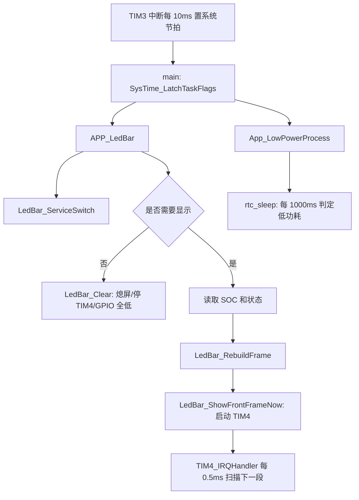

# LED 软件框架与时序梳理

> 2026-05-11 更新：当前量产代码已删除 `74HC595` 兼容分支，只保留 GPIO Charlieplexing 扫描路径。数码管最新代码边界、扩展规则和验收点以 [数码管 GPIO Charlie 重写说明](数码管GPIO查理复用重写说明.md) 为准；本文保留为时序和低功耗联动参考。

## 目的

本文用于快速熟悉当前 LED 数码管软件框架、显示刷新链路、休眠交互链路，以及后续修改入口。当前需求已经纳入代码：

- `GPIO_MCU_WK` 为高电平时，LED 数码管持续显示 SOC，不再受按键 5 秒显示窗口限制。
- `GPIO_MCU_WK` 为高电平时，低功耗状态机不继续累计 RTC/低压自动休眠计时，并清除待提交休眠请求。
- `GPIO_MCU_WK` 为高电平时，显示上仍沿用充电图标策略。

相关代码文件：

| 文件 | 职责 |
| --- | --- |
| `103 + 309/Project/Source/LedBar.c` | LED 数码管显示驱动、帧构建、按键显示窗口、休眠熄屏 |
| `103 + 309/Project/Source/LedBar.h` | LED 对外接口、编译开关、显示窗口常量 |
| `103 + 309/Project/Source/main.c` | 主循环调用 `APP_LedBar()` 和 `App_LowPowerProcess()` |
| `103 + 309/Project/Source/rtc_sleep.c` | 当前实际运行的低功耗入口、RTC 打嗝休眠、休眠阻断判断 |
| `103 + 309/Project/Source/SleepDeal.c` | 旧休眠状态机、复位后休眠启动标志、休眠中 SOC 预览 |
| `103 + 309/Project/Source/conf/conf.c` | GPIO 初始化、STOP 前 IO 状态、RTC 唤醒配置 |
| `103 + 309/Project/Source/System_Init.c` | 10ms/100ms/1000ms 系统节拍 |

## 当前编译配置

当前工程关键宏：

| 宏 | 当前值/状态 | 影响 |
| --- | --- | --- |
| `LEDBAR_SLEEP_ENABLE` | `1u` | 未请求显示或进入休眠时允许熄屏、关 TIM4、GPIO 进入确定关断态 |
| `_DI_SWITCH_longKEY_ONOFF` | 已定义 | DI1 长按 3 秒会触发深度休眠 |
| `__FUNC_RTC__` | 已定义 | 当前低功耗主路径走 RTC 打嗝休眠 |
| `wdog_enable` | 已定义 | RTC 周期会按看门狗安全窗口裁剪 |
| `AFE_TYPE` | `sh36xx` | RTC 唤醒检测走 `SH367309` 分支 |

## 硬件抽象

### LED 引脚

当前 `LedBar.h` 定义 5 个 Charlieplexing 管脚：

| LED 逻辑管脚 | 实际 GPIO | 说明 |
| --- | --- | --- |
| `P1` | `GPIO_DBG_LED / PIN_DBG_LED`，PB15 | 复用调试 LED 引脚 |
| `P2` | `GPIO_SPI1_NSS / PIN_SPI1_NSS`，PA4 | LED 扫描复用引脚 |
| `P3` | `GPIO_SPI1_SCK / PIN_SPI1_SCK`，PA5 | LED 扫描复用引脚 |
| `P4` | `GPIO_SPI_MOSI / PIN_SPI_MOSI`，PA6 | LED 扫描复用引脚 |
| `P5` | `GPIO_SEG_EN / PIN_SEG_EN`，PB10 | LED 扫描复用引脚 |

`LedBar.c` 内部实际扫描顺序由 `s_ledbar_gpio_pins[]` 再映射一次：

```c
{P5, P4, P2, P3, P1}
```

这意味着 `s_ledbar_routes[]` 中的 `low_pin/high_pin` 编号不是直接等同于 `P1~P5` 的自然顺序，改段位映射时必须同时核对实物丝印和该数组。

### GPIO_MCU_WK

`GPIO_MCU_WK` 定义为 `PB13`：

```c
#define GPIO_MCU_WK GPIOB
#define PIN_MCU_WK  GPIO_Pin_13
```

初始化位置：

- `InitIO()` 中配置为 `GPIO_Mode_IN_FLOATING`。
- `InitWakeUp_NormalMode()` 中配置为 `GPIO_Mode_IN_FLOATING`，并使能 `EXTI_Line13` 上升沿中断，用于 STOP 唤醒。

当前代码按“高电平有效”处理。

## 模块分层

### 驱动层

驱动层只负责“把一个帧里的 route 逐个点亮”：

- `LedBar_GpioInitForDisplay()`：打开 GPIO 时钟，所有 LED 管脚先设为输入高阻。
- `LedBar_OutputRoute(route_id)`：先把 5 个 LED 管脚全部高阻，再将目标 route 的一端拉低、一端拉高。
- `LedBar_OutputOff()`：所有 LED 管脚高阻。
- `LedBar_GpioPrepareForStop()`：所有 LED 管脚先高阻再统一输出低电平，避免 STOP 前后引脚漂浮导致段位误亮。
- `TIM4_IRQHandler()`：每 0.5ms 调用一次 `LedBar_Scan1ms()`。

当前代码只保留 GPIO Charlieplexing 扫描路径，没有旧驱动兼容分支。

### 帧构建层

帧构建层把“业务上要显示的 SOC/图标”转换成 route 列表：

- `LedBar_BuildTargetMask(value, indicator_mask)`：把 `0~100` SOC 和 `%/charge` 图标转成目标段位 bitmask。
- `LedBar_BuildRouteFrameToBuffer()`：当前 Charlieplexing 模式下，把目标 bitmask 中每个 route 逐一放入帧缓冲。
- `s_ledbar_frame_back`：后台帧，业务更新时重建。
- `s_ledbar_frame_front`：前台帧，TIM4 扫描实际读取。
- `s_ledbar_frame_pending`：后台帧待提交标志。

当前每个亮段对应一个 route，所以一帧长度约等于当前需要点亮的段数，最大为 `LEDBAR_FRAME_PATTERN_COUNT = 18`。

### 业务层

`APP_LedBar()` 是 LED 主入口，由 `main.c` 主循环每轮调用：

1. `LedBar_ServiceSwitch()` 处理 DI1 按键。
2. 判断启动/休眠状态，必要时熄屏。
3. 判断本轮是否需要显示。
4. 读取 `g_stCellInfoReport.SocElement.u16Soc`，限制到 `0~100`。
5. 根据充电电流或 `GPIO_MCU_WK` 高电平叠加 charge 图标。
6. 故障时只改变 `LedBar_Command = LED_BAR_FAULT`，当前没有单独故障闪烁图案。
7. 值或图标变化时重建帧，并启动 TIM4 扫描。

## 主流程



## 显示时序

### 系统节拍

`System_Init.c` 使用 TIM3：

- TIM3 计数频率：100kHz。
- `TIM_Period = 999`，所以 TIM3 中断周期为 10ms。
- 每次 TIM3 中断置 `b1Sys10msFlag`。
- 每 10 个 10ms 置 `b1Sys100msFlag`。
- 每 100 个 10ms 置 `b1Sys1000msFlag`。

主循环通过 `SysTime_LatchTaskFlags()` 把 pending flag 搬到 `g_st_SysTimeFlag`，各 App 模块只看当前轮 flag。

### LED 刷新节拍

`LedBar.c` 使用 TIM4 独立扫描：

- TIM4 计数频率：100kHz。
- `TIM_Period = 49`，所以 TIM4 中断周期为 0.5ms。
- `TIM4_IRQHandler()` 每 0.5ms 调用 `LedBar_Scan1ms()`。

当前 Charlieplexing 模式下：

```c
LedBar_OutputRoute(s_ledbar_frame_front.patterns[s_ledbar_scan_index]);
s_ledbar_scan_index++;
```

即每 0.5ms 点亮一个 route，完整刷新周期为：

```text
完整帧周期 = 当前 frame.length * 0.5ms
单段占空比 ≈ 1 / frame.length
```

例子：

| 显示内容 | 估算 route 数 | 完整扫描周期 | 单段刷新频率 |
| --- | ---: | ---: | ---: |
| `8%` | 个位 7 段 + `%` = 8 | 约 4ms | 约 250Hz |
| `88%` | 十位 7 段 + 个位 7 段 + `%` = 15 | 约 7.5ms | 约 133Hz |
| `100%` | 百位 2 段 + 十位 6 段 + 个位 6 段 + `%` = 15 | 约 7.5ms | 约 133Hz |
| `88% + charge` | 16 | 约 8ms | 约 125Hz |

注意：route 数越多，占空比越低，亮度会下降；这属于 Charlieplexing 扫描方式的天然结果。

### 业务刷新节拍

`APP_LedBar()` 不是每轮都重建显示内容：

- 首次从 blank 进入显示时立即刷新。
- 已经显示时，只有 `b1Sys100msFlag` 到来才检查 SOC/图标变化。
- TIM4 扫描不依赖 100ms 业务刷新，只要前台帧存在并且 TIM4 开启，就会持续 0.5ms 扫描。

## 按键显示时序

DI1 按键判断：

```c
MCUI_ENI_DI1 == 0u
```

按键流程：

| 条件 | 行为 | 时序 |
| --- | --- | --- |
| 按键按下沿 | `s_ledbar_soc_display_10ms = LEDBAR_SOC_DISPLAY_10MS` | 立即打开 5 秒显示窗口 |
| 按键保持 | `s_ledbar_key_last_pressed = 1`，显示持续有效 | 不递减 5 秒窗口 |
| 按键释放 | 每个 10ms flag 递减一次 `s_ledbar_soc_display_10ms` | 500 * 10ms = 5s 后熄屏 |
| 长按达到 `LEDBAR_KEY_LONG_PRESS_10MS` | 调用 `entersleep(DEEP_MODE)` 和 `SleepDeal_Continue(DEEP_MODE)` | 300 * 10ms = 3s |

所以正常短按行为是：按下后持续显示；松手后继续显示约 5 秒，然后 `LedBar_Clear()` 熄屏。

## GPIO_MCU_WK 持续显示逻辑

本次修改新增了两个本地 helper：

```c
static uint8_t LedBar_IsMcuWakeActive(void)
static bool low_power_is_mcu_wake_active(void)
```

LED 侧逻辑：

- `LedBar_IsSocDisplayRequested()` 中优先判断 `GPIO_MCU_WK`。
- `GPIO_MCU_WK` 显示侧经过 10ms 级去抖，高电平稳定后返回“需要显示”。
- `APP_LedBar()` 通过 `LowPower_IsToSleepPending()` 判断是否存在待提交休眠；只要 `GPIO_MCU_WK` 高电平，就不会执行 LED 熄屏分支。
- 显示内容仍为当前 SOC + `%`；同时叠加 charge 图标。
- charge 图标经过 100ms 级保持滤波，短时间 `u16Ichg` 或 `GPIO_MCU_WK` 抖动不会立即闪灭。

低功耗侧逻辑：

- `BQ769x0_SleepMode_Ctrl()` 入口第一优先级判断 `VCellMin <= 2800` 且 `u16Ichg <= 5`，连续 60 秒后必须 `entersleep(DEEP_MODE)`。
- 随后判断参数低压 `VCellMin <= OtherElement.u16Sleep_Vlow` 且 `u16Ichg <= 5`，到达 `OtherElement.u16Sleep_TimeVlow * 60` 秒后必须 `entersleep(DEEP_MODE)`。
- 这两条低压 DEEP 休眠不允许被 `GPIO_MCU_WK` 高电平、工厂老化/工厂模式、外部通信或普通 RTC 阻塞条件拦截。
- 未触发低压 DEEP 休眠时，才继续判断 `GPIO_MCU_WK`。
- `GPIO_MCU_WK` 高电平时清零：
  - `sys_time.enter_rtc_delay`
  - `deepsleep_cnt`
  - `deepsleep_cnt_1min`
- 如果已经存在待提交休眠状态，则调用 `LowPower_Request(NO_SLEEP)` 清除。
- `isErr_enterRTC()` 也继续把 `GPIO_MCU_WK` 高电平视为 RTC 休眠阻断条件。

结果：

```text
GPIO_MCU_WK = 1
    -> LED 一直显示
    -> 不累计 10s RTC 自动休眠
    -> 不阻断 VCellMin <= 2800 的硬性过放 DEEP 休眠
    -> 不阻断 VCellMin <= OtherElement.u16Sleep_Vlow 的参数低压 DEEP 休眠
    -> 已挂起的低功耗请求会被 LowPower_Request(NO_SLEEP) 清掉

GPIO_MCU_WK = 0
    -> 恢复原逻辑：短按显示 5s，无请求则熄屏
    -> 低功耗按原条件重新累计
```

## LED 休眠与熄屏路径

### 普通熄屏

当没有显示请求时：

```c
LedBar_Clear();
```

执行效果：

1. `s_ledbar_force_blank = 1`。
2. 重建空帧。
3. 输出关闭。
4. 关闭 TIM4。
5. LED GPIO 统一输出低电平。

这是“LED 自身省电”，不一定代表 MCU 进入 STOP。

### 休眠熄屏

当 `LowPower_IsToSleepPending() != 0` 且 `GPIO_MCU_WK` 不为高时：

```c
LedBar_SaveSleepSoc();
LedBar_SetSleep(1u);
```

执行效果：

1. 把当前 SOC 写入 BKP_DR4/DR5。
2. `s_ledbar_sleep = 1`。
3. 清空显示帧。
4. 关闭 TIM4。
5. 输出关闭，LED GPIO 统一输出低电平。

### STOP 前准备

`LedBar_PrepareForStop()` 用于休眠循环中短暂预览后再次进入 STOP：

1. `s_ledbar_sleep = 1`。
2. `s_ledbar_force_blank = 1`。
3. 提交空帧。
4. 关闭 TIM4。
5. LED GPIO 统一输出低电平。

### 休眠中 SOC 预览

复位后如果检测到休眠启动标志，`IsSleepStartUp()` 会先进入 STOP 循环。按键唤醒但未长按时，会调用：

```c
LedBar_ShowSleepSocPreview();
```

它会读取 BKP_DR4/DR5 中的休眠前 SOC，显示 `%`，不显示 charge 图标。短按释放后显示 5 秒，超时再 `LedBar_PrepareForStop()` 回到 STOP。

## 低功耗进入时序

当前主循环中启用的是：

```c
App_LowPowerProcess();
```

其内部直接调用：

```c
rtc_sleep();
```

旧 `App_SleepDeal()` 状态机已从源码删除；当前实际主路径只有 `rtc_sleep()`。

### 运行期 RTC 打嗝休眠

`rtc_sleep()` 只在 `b1Sys1000msFlag` 有效时执行，所以其计数单位近似为 1 秒。

自动进入 HICCUP RTC 休眠的主要条件：

1. `GPIO_MCU_WK` 不是高电平。
2. `isErr_enterRTC()` 返回 false：
   - 充/放电电流不大于 10。
   - 未加热。
   - CAN 不忙。
   - `GPIO_MCU_WK` 不高。
3. `AFE_SleepMode_Judge() == 0`。
4. `sys_time.enter_rtc_delay >= sys_time.time_enter_rtc`。

当前默认：

```c
sys_time.time_enter_rtc = 10
```

因此空闲约 10 秒后进入 HICCUP RTC 休眠。

### 低压 DEEP 休眠

`BQ769x0_SleepMode_Ctrl()` 中 `VCellMin <= 2800` 和 `VCellMin <= OtherElement.u16Sleep_Vlow` 都是低功耗优先级最高的 DEEP 休眠路径，必须先于 `GPIO_MCU_WK`、工厂老化/工厂模式、外部通信和普通 RTC 阻塞判断执行。

| 条件 | 计时 | 动作 |
| --- | --- | --- |
| `VCellMin <= 2800` 且 `u16Ichg <= 5` | 60 秒 | 强制 `entersleep(DEEP_MODE)`，不受工厂模式和 `GPIO_MCU_WK` 阻断 |
| `VCellMin <= OtherElement.u16Sleep_Vlow` 且 `u16Ichg <= 5` | `OtherElement.u16Sleep_TimeVlow * 60` 秒 | 强制 `entersleep(DEEP_MODE)`，不受工厂模式和 `GPIO_MCU_WK` 阻断 |

### HICCUP RTC STOP 周期

进入 HICCUP 后，`rtc_sleep()` 执行：

```c
while (rtc_sleep_run_hiccup_cycle())
{
}
```

每轮流程：

1. `Can_PrepareSleep()`。
2. `Init_RTC()`。
3. `IOstatus_RTCMode()`，其中会 `LedBar_SetSleep(1u)` 并停止 ADC。
4. `InitWakeUp_RTCMode()`，配置 RTC Alarm 和外部唤醒。
5. `Sys_StopMode()` 进入 STOP。
6. 如果是 RTC Alarm 唤醒且没有异常：
   - 累计 `sys_time.rtc_sleep_cnt`。
   - 用实际 RTC 秒数补偿 SOC。
   - 调用 `Can_RtcWakeService()`。
   - 返回 true，继续下一轮 STOP。
7. 如果是异常或外部唤醒：
   - 恢复外设。
   - `LowPower_Request(NO_SLEEP)`。
   - 上报唤醒原因。
   - 返回 false，退出休眠循环。

RTC Alarm 周期来自：

```c
RTC_GetWakeupPeriodSeconds() -> Can_GetIdleRtcPeriodSeconds()
```

无效时最小为 1 秒；启用看门狗时还会按看门狗窗口裁剪。

### NORMAL/DEEP 休眠

`NORMAL_MODE` 和 `DEEP_MODE` 当前不是原地 STOP，而是：

1. `low_power_log_and_commit_sleep()`。
2. `SleepDeal_Continue(mode)`。
3. 写 BKP 休眠启动标志：
   - `FLASH_NORMAL_SLEEP_VALUE`
   - `FLASH_DEEP_SLEEP_VALUE`
   - `FLASH_HICCUP_SLEEP_VALUE`
4. `InitAFE1_Sleep(0)`。
5. `AFE_Sleep()`。
6. `MCU_RESET()`。
7. 下次启动早期 `IsSleepStartUp()` 读取 BKP 标志并进入 STOP 循环。

## 旧休眠状态机处理结论

旧 `App_SleepDeal()`、`Sleep_Mode` 位图和 `Sleep_Status` 状态机已删除。后续新增休眠入口必须走 `LowPower_Request(mode)`；显示侧只允许读取 `LowPower_IsToSleepPending()`；复位式休眠只允许调用 `SleepDeal_Continue(mode)`。

## 修改 LED 行为的入口

### 修改显示保持条件

入口：

```c
static uint8_t LedBar_IsSocDisplayRequested(void)
```

当前显示保持条件：

1. `LEDBAR_SLEEP_ENABLE == 0`，永久显示。
2. `GPIO_MCU_WK` 高电平，永久显示。
3. 按键显示窗口未结束。
4. 按键仍处于按下状态。

如果只想让 `GPIO_MCU_WK` 高电平显示但不影响整机低功耗，只改这里即可，不要改 `rtc_sleep.c`。

### 修改显示内容

入口：

```c
APP_LedBar()
```

常见修改点：

| 需求 | 修改位置 |
| --- | --- |
| 改 SOC 来源 | `display_value = g_stCellInfoReport.SocElement.u16Soc` |
| 改 charge 图标条件 | `g_stCellInfoReport.u16Ichg != 0u || mcu_wk_active != 0u` |
| 增加故障显示 | `LedBar_Command = LED_BAR_FAULT` 后增加专门图案或闪烁策略 |
| 改显示窗口 | `LEDBAR_SOC_DISPLAY_10MS` |
| 改长按休眠时间 | `LEDBAR_KEY_LONG_PRESS_10MS` |

### 修改段位映射

入口：

```c
static const LedBarRoute s_ledbar_routes[LEDBAR_ROUTE_COUNT]
static const LedBarPinDef s_ledbar_gpio_pins[LEDBAR_PIN_COUNT]
static const uint8_t s_ledbar_digit_map[10]
```

建议修改顺序：

1. 先用 `LedBar_EnableSingleSegmentTest(1)` 和 `LedBar_SetSingleSegmentIndex(0~17)` 跑单段测试。
2. 记录每个 route 对应实物段位。
3. 再改 `LedBarRouteId` 和 `s_ledbar_routes[]`。
4. 最后改数字段码 `s_ledbar_digit_map[]`。

不要只凭数组顺序改段码，Charlieplexing 的正反向会影响真实点亮段。

### 修改休眠阻断条件

入口：

```c
static bool isErr_enterRTC(void)
void BQ769x0_SleepMode_Ctrl(void)
```

`isErr_enterRTC()` 只阻断普通 RTC 延时进入；如果要阻断低压 DEEP 休眠，必须在 `BQ769x0_SleepMode_Ctrl()` 的低压分支之前处理。

本次 `GPIO_MCU_WK` 高电平阻断放在 `BQ769x0_SleepMode_Ctrl()` 函数入口，原因就是低压分支优先级高，单改 `isErr_enterRTC()` 不够。

## 验证建议

### 桌面代码检查

1. 确认 `LedBar.c` 的扫描周期、`GPIO_MCU_WK` 显示去抖、charge 图标保持、STOP 前 LED GPIO 全低逻辑符合预期。
2. 确认 `rtc_sleep.c` 在低压分支之前阻断 `GPIO_MCU_WK`。
3. 确认未改动 `SleepDeal_Continue(mode)` 的复位休眠流程。

### 上板验证

| 用例 | 操作 | 期望 |
| --- | --- | --- |
| 短按显示 | `GPIO_MCU_WK=0`，短按 DI1 后释放 | 显示 SOC，约 5 秒后熄屏 |
| MCU_WK 保持显示 | 拉高 `GPIO_MCU_WK` | 不按键也持续显示 SOC + charge 图标 |
| MCU_WK 释放 | 从高电平释放为低电平 | 恢复普通显示窗口逻辑；无按键请求时熄屏 |
| RTC 休眠阻断 | 拉高 `GPIO_MCU_WK` 并等待超过 10 秒 | 不进入 HICCUP RTC STOP |
| 低压休眠阻断 | 模拟低压且 `GPIO_MCU_WK=1` | 不累计 60 秒/配置低压 DEEP 休眠 |
| 低压恢复休眠 | `GPIO_MCU_WK=0` 后继续低压 | 按原低压计时进入 DEEP |
| 休眠中唤醒预览 | 已进入 STOP 后短按 DI1 | 显示休眠前 SOC 约 5 秒，未长按则回 STOP |

### 示波器/逻辑分析仪观察点

| 信号 | 期望 |
| --- | --- |
| TIM4 扫描管脚 | 显示期间约 0.5ms 切换一次 route |
| LED 完整帧 | 周期约为 `frame.length * 0.5ms` |
| `GPIO_MCU_WK` | 高电平期间 TIM4 不应因显示窗口耗尽而关闭 |
| STOP 电流 | `GPIO_MCU_WK=1` 时不应进入 RTC STOP 的低电流平台 |

## 风险与注意事项

1. `GPIO_MCU_WK` 当前是浮空输入。显示侧已加软件去抖，但低功耗阻断仍按实时电平判断；如果外部没有可靠上下拉，仍可能误判高电平并阻断休眠。硬件上应确认 PB13 有确定电平，软件上可进一步考虑改为上拉/下拉。
2. `GPIO_MCU_WK` 高电平现在会清除待休眠请求，包括 `s_stLowPowerRuntime.mode`。这是按“高电平不进入休眠”实现的。如果后续需要“只阻断自动休眠，不阻断上位机强制休眠”，需要把 `LowPower_Request(NO_SLEEP)` 改成只清自动计数。
3. 当前故障状态只改 `LedBar_Command`，没有实际故障闪烁图案。如果产品定义要求故障显示优先级，应补充显示策略。
4. 主循环中的 `MainLoop_EnterIdleSleep()` 仍是注释状态；本文讨论的“不进入休眠”主要指 RTC/STOP 低功耗，不涉及这个空闲 `__WFI()`。
