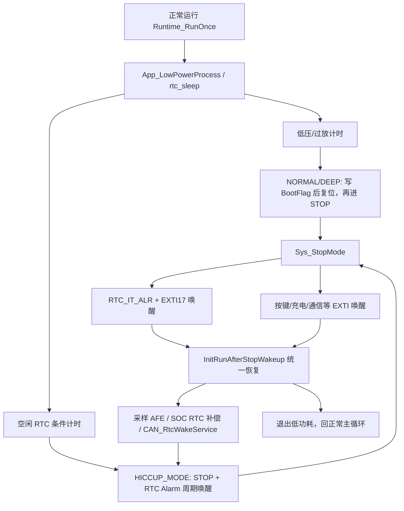

# RTC 待机休眠模块梳理与优化 2026-05-22

## 目标

当前项目低功耗不使用真正的 STM32 Standby 作为主路径，而是使用 STOP + RTC Alarm 周期唤醒。目标是让休眠逻辑更简单、更稳定：

- 进入 STOP 前只保留明确唤醒源。
- RTC STOP 唤醒只依赖 `RTC_IT_ALR + EXTI17`。
- STOP 返回后统一恢复外设，避免 CAN、ADC、IIC、Timer 某一路没有恢复。
- 低压/过放深休眠优先级最高，不被工厂模式、通信或普通空闲策略挡住。

## 当前状态机



## 入口条件

### 1. 过放/低压深休眠

位置：`rtc_sleep.c / BQ769x0_SleepMode_Ctrl()`

优先级最高：

- `VCellMin <= LOW_POWER_FORCE_DEEP_SLEEP_MV`
- 且充电电流低于 `LOW_POWER_DEEP_SLEEP_ICHG_LIMIT`
- 持续 `LOW_POWER_FORCE_DEEP_SLEEP_SECONDS` 后进入 `DEEP_MODE`

这段判断在 MCU_WK、工厂老化、通信阻塞之前执行，因此工厂模式不能挡住过放休眠。

### 2. 普通空闲 RTC 休眠

满足以下条件才进入 `HICCUP_MODE`：

- 无明显充/放电电流。
- 未加热。
- MCU_WK 未保持有效。
- 工厂老化未运行。
- 没有新的外部通信活动。
- AFE 处于允许低功耗的状态。

达到 `sys_time.time_enter_rtc` 秒后进入 RTC STOP 周期休眠。

## 唤醒源

### RTC 周期唤醒

STOP 前由 `RTC_WKTimeConfig()` 配置：

- 关闭 `RTC_IT_SEC`。
- 清 `RTC_IT_ALR`、`RTC_FLAG_ALR`、`EXTI17` 和 `RTCAlarm_IRQn` pending。
- 设置 Alarm 为 `RTC_GetCounter() + wake_seconds`。
- 只使能 `RTC_IT_ALR`。

因此 STOP 期间的周期唤醒来源是 `RTC_IT_ALR + EXTI17`，不是 `RTC_IT_SEC`。秒中断只在正常运行态由 `RTC_RestoreRunInterrupts()` 恢复。

### 外部唤醒

进入 STOP 前根据模式配置：

- `PA0 / GPIO_CHG_IN`：充电接入。
- `PA9 / PIN_SW`：开关。
- `PB12 / PIN_INT_WK_CMNT`：通信唤醒。
- `PB13 / PIN_MCU_WK`：MCU wake。
- 可选串口 RX EXTI。

退出 STOP 后调用 `RTC_DisableStopWakeup()` 和 `LowPower_DisableWakeupExti()` 清理唤醒配置与 pending，避免 stale pending 影响下一次低功耗。

## 本次优化

### 1. STOP 后统一恢复路径

优化前：

- RTC Alarm 唤醒走 `InitRtcWakeupCheck()`，只恢复 Delay、SCI、AFE IIC、E2PROM IIC。
- 非 RTC 唤醒走 `InitRunAfterStopWakeup()`，恢复 IO、ADC、CAN、Timer 等完整运行环境。

这会导致 RTC 周期唤醒后做 CAN 服务时，存在 CAN/ADC/Timer 恢复不完整的风险。

优化后：

- `rtc_sleep_restore_after_stop()` 始终调用 `InitRunAfterStopWakeup()`。
- `InitRtcWakeupCheck()` 也复用 `InitRunAfterStopWakeup()`。
- `rtc_sleep_restore_for_run()` 不再重复初始化，只负责清 RTC wake 标志。

收益：

- 唤醒恢复路径只有一条。
- CAN RTC 服务前一定执行完整外设恢复。
- 后续调试 RTC 唤醒问题时，不需要同时维护两套恢复逻辑。

### 2. RTC Alarm pending 清理增强

`RTC_ClearAlarmPending()` 现在同时清理：

- `RTC_IT_ALR`
- `RTC_FLAG_ALR`
- `EXTI17`
- `RTCAlarm_IRQn`

`RTC_RestoreRunInterrupts()` 额外清 `RTC_IRQn` pending，再恢复 `RTC_IT_SEC`。这样运行态秒中断和 STOP 态 Alarm 唤醒的边界更清楚。

### 3. 运行态不保持低功耗 EXTI 常开

`InitRunAfterStopWakeup()` 不再重新调用 `InitWakeUp_Base()`。低功耗 EXTI 只在进入 STOP 前配置，STOP 后由恢复路径清 pending。这样可以减少运行态残留 pending bit 影响下一次 STOP 的概率。

## CAN 与 RTC 周期

RTC 唤醒周期由 `RTC_GetWakeupPeriodSeconds()` 获取，底层使用 `Can_GetIdleRtcPeriodSeconds()`：

- CAN 总线活跃：1 秒唤醒。
- CAN 总线不活跃：10 秒唤醒。
- 若看门狗窗口更短，会按安全窗口截断。

每次 RTC Alarm 唤醒且没有异常时：

1. 累计本次 RTC 休眠秒数。
2. 更新 AFE 采样和异常状态。
3. 执行 `SOC_ApplyRtcRelaxationCompensation()`。
4. 执行 `Can_RtcWakeService(elapsed_seconds)`。
5. 继续下一轮 STOP。

如果发生充电、按键、通信、保护异常、电流活动或 AFE 异常，则退出 RTC 低功耗，回正常主循环。

## 保留边界

- 没有改 SOC 算法，只保留原 RTC 静置补偿调用。
- 没有改 CAN 业务帧调度，只保证 RTC 唤醒服务前完整恢复外设。
- 没有改 BootFlag 的 BKP_DR2/BKP_DR3 双寄存器校验机制。
- 没有改过放休眠阈值和计时策略。

## 验证结果

`FD_Release` 构建：

```text
Program Size: Code=55048 RO-data=3332 RW-data=936 ZI-data=5464
0 Error(s), 0 Warning(s)
```

项目检查：

```text
Project check summary:
  OK:       116
  Warnings: 0
  Errors:   0
```

## 上板测试清单

1. 空闲无充放电：达到 `sys_time.time_enter_rtc` 后进入 RTC STOP。
2. RTC Alarm 唤醒：每次唤醒后 CAN 供电、发送和再次休眠都正常。
3. CAN 有设备：RTC 周期应收敛到 1 秒。
4. CAN 无设备：RTC 周期应收敛到 10 秒。
5. RTC 休眠中接入充电器：应退出低功耗并标记充电唤醒。
6. RTC 休眠中按开关：短按显示 SOC，长按退出休眠。
7. 单体低压/过放：即使工厂模式或通信状态存在，也必须优先进入深休眠。
8. 调试器连接：RTC 初始化不能卡死在同步等待，异常时应走超时恢复。
