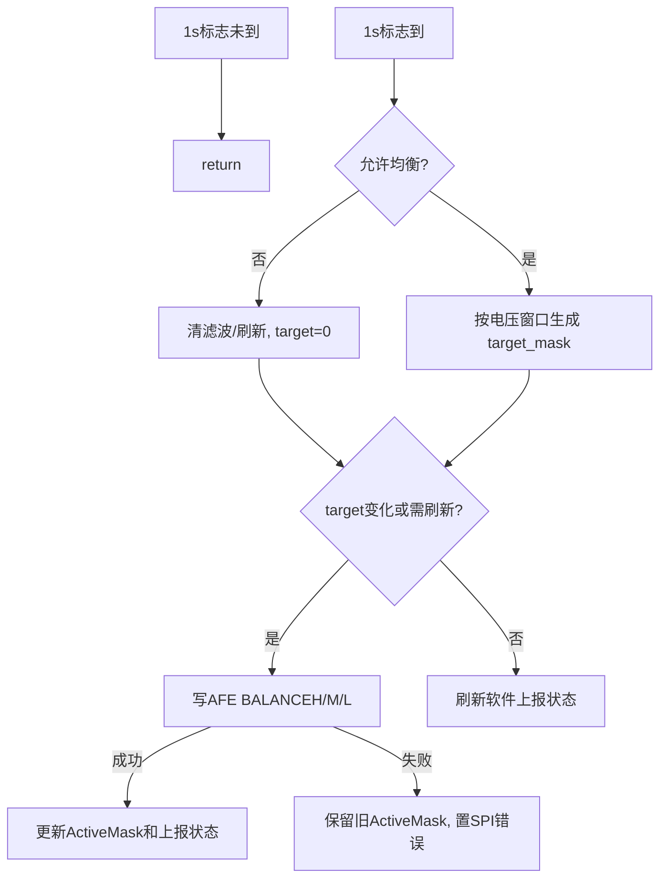

# 均衡逻辑梳理

生成日期：2026-05-19

## 1. 模块边界

均衡模块集中在：

- `103 + 309/Project/Source/Cell_balance.c`
- `103 + 309/Project/Source/Cell_balance.h`

外部依赖：

- 电压、电流和故障信息来自 `g_stCellInfoReport`。
- 均衡参数来自 `OtherElement`。
- AFE 写寄存器使用 `sh36735_write_reg_u8()`。
- SPI 错误状态通过 `System_ERROR_UserCallback()` 维护。
- 上报状态写回 `g_stCellInfoReport.balance_status`、`u16BalanceFlag1`、`u16BalanceFlag2`。

主循环中 `App_CellBalance()` 在 EEPROM 处理之后、睡眠和 SOC 之前执行。模块自身只在 `b1Sys1000msFlag2` 置位时运行，因此均衡决策周期是 1 s。

## 2. 参数来源

均衡使用 `OtherElement` 的前三个字段：

| 参数 | 默认值（三元配置） | 说明 |
| --- | --- | --- |
| `u16Balance_OpenVoltage` | 4100 mV | 单体电压低于该值不允许均衡 |
| `u16Balance_OpenWindow` | 30 mV | 均衡开启压差窗口 |
| `u16Balance_CloseWindow` | 20 mV | 已开启均衡后的关闭窗口 |

上位机写 OtherElement 均衡参数后，会置 `u32E2P_OtherElement1_WriteFlag` 对应位，由 EEPROM 模块保存。

## 3. 运行状态

模块公开状态：

- `g_enBalanceState`：当前只在 `BALANCE_ST_OFF` 和 `BALANCE_ST_ODD_ON` 间更新，未实际区分奇偶轮换。
- `g_u16CBnFLAG_ToUpper`：低 16 串均衡状态，兼容旧上报。
- `g_u8CBn_StatusFlag`：有任意均衡开启时为 1。
- `g_u8CBn_AFECloseFlag`：无均衡开启时为 1。

内部状态：

- `s_u32CB_ActiveMask`：当前已写入 AFE 的均衡 mask，最多 20 bit。
- `s_u8CB_FilterCnt[20]`：每串开启滤波计数。
- `s_u8CB_RefreshCnt`：均衡持续开启时的刷新计数。

## 4. 允许条件

`CB_IsBalanceAllowed()` 同时满足以下条件才允许均衡：

1. `System_OnOFF_Func.bits.b1OnOFF_Balance == 1`。
2. `SeriesNum` 大于 0，且最多按 20 串处理。
3. `VCellMin` 在 1000-5000 mV。
4. `g_stCellInfoReport.unMdlFault_Third.all == 0`，即无三级保护。
5. 无 AFE1 通信错误、无 SPI 错误、无 CBC 放电错误。
6. `Ichg <= 1.0 A` 且 `IDischg <= 1.0 A`，因为内部阈值 `CB_BALANCE_CURRENT_LIMIT = 10`，单位 A*10。
7. `VCellMin >= u16Balance_OpenVoltage`。
8. 当前压差满足窗口：
   - 没有活动均衡时，使用 `u16Balance_OpenWindow`。
   - 已有活动均衡时，使用 `u16Balance_CloseWindow`。
   - 如果关闭窗口为 0 或大于开启窗口，则回退使用开启窗口。

任一条件不满足时：

- 清空每串滤波计数；
- 清空刷新计数；
- 目标 mask 置 0；
- 若当前 AFE mask 非 0，则写 AFE 关闭全部均衡。

## 5. 目标串选择

`CB_BuildTargetMask()` 按当前 `VCellMin` 做参考：

1. 遍历 0 到 `SeriesNum - 1`，最多 20 串。
2. 每串必须满足 `VCell[i] >= u16Balance_OpenVoltage`。
3. 每串电压必须满足 `VCell[i] >= VCellMin + balance_window`。
4. 对已经开启的串，窗口使用关闭窗口，满足条件即继续保持。
5. 对尚未开启的串，窗口使用开启窗口，并要求连续 3 次 1 s 周期满足条件后才置位。
6. 条件不满足时，该串滤波计数清零。
7. 超出有效串数的滤波计数全部清零。

这相当于：

- 开启：压差超过开启窗口并稳定 3 s。
- 保持：已经开启后只要压差仍超过关闭窗口就继续保持。
- 关闭：低于关闭窗口或不满足允许条件时关闭。

## 6. AFE 写入

`CB_AfeWriteBalanceMaskU24()` 把 20 bit mask 拆成三个寄存器：

- `AFE_BALANCEH = mask[23:16]`
- `AFE_BALANCEM = mask[15:8]`
- `AFE_BALANCEL = mask[7:0]`

写入策略：

- 最多重试 3 次。
- 每次按 H、M、L 顺序写。
- 三个寄存器都写成功后清 `ERROR_SPI` 并返回成功。
- 失败后延时 1 ms 再重试。
- 3 次都失败则置 `ERROR_SPI`，本次不更新 `s_u32CB_ActiveMask`。

当前写入成功后没有读回校验，软件状态默认相信 AFE 写入成功。

## 7. 主状态机

`App_CellBalance()` 的每 1 s 流程：

刷新机制：

- `target_mask != s_u32CB_ActiveMask` 时立即写 AFE。
- 如果当前有均衡开启，即使 mask 未变化，也每 3 个周期刷新一次 AFE 寄存器。
- 当前无均衡且目标也为 0 时，只刷新软件状态，不重复写 AFE。

## 8. 软件状态上报

`CB_UpdateSoftwareStatus()` 会：

- 按 `SeriesNum` 生成有效 mask，避免超出串数的位上报。
- 写 `g_stCellInfoReport.balance_status`。
- 写 `u16BalanceFlag1` 和 `u16BalanceFlag2`。
- 更新 `g_u16CBnFLAG_ToUpper`。
- 更新 `g_u8CBn_StatusFlag` 和 `g_u8CBn_AFECloseFlag`。
- 把每串状态写入 `sys_time.bal_cell[i]`。

因此对外协议和运行统计都应以 `g_stCellInfoReport.balance_status` 为最终软件状态。

## 9. 强制关闭

`CellBalance_ForceOff()` 用于外部强制关闭：

1. 写 AFE 三个均衡寄存器为 0。
2. 写成功后清滤波计数、刷新计数和活动 mask。
3. 同步软件上报状态为 0。
4. 若写失败，返回失败并保留原软件状态。

当前搜索到的主路径中，常规关闭主要由 `App_CellBalance()` 自身在不允许均衡时把目标 mask 置 0 完成。

## 10. 与保护和休眠的关系

均衡与保护关系：

- 任意三级保护存在时禁止均衡。
- AFE1 通信错误、SPI 错误、CBC 放电错误时禁止均衡。
- 均衡寄存器写失败会置 SPI 错误，下一周期会禁止均衡并尝试写 0；如果写 0 也失败，软件状态会保留旧 mask。

均衡与电流关系：

- 充电电流或放电电流大于 1.0 A 时禁止均衡。
- 因此当前策略偏向静置或小电流均衡，不支持大电流充电均衡。

均衡与休眠关系：

- `App_CellBalance()` 在 `App_SleepDeal()` 前执行。
- 模块没有直接读取休眠状态，是否进入休眠后的 AFE 均衡关闭依赖休眠流程或下一次均衡周期的允许条件。

## 11. 当前风险和维护建议

1. `g_enBalanceState` 只置 `BALANCE_ST_ODD_ON` 或 `BALANCE_ST_OFF`，枚举里的 `EVEN_ON/MONITOR/INIT` 当前没有实际状态机含义。
2. 均衡寄存器写成功后没有读回校验；如果 AFE NACK 外的异常导致写入内容不一致，软件状态会显示已开启。
3. 写 H/M/L 三个寄存器不是原子操作，中间失败可能导致 AFE 端保留部分旧值；失败后下一周期会因 SPI 错误禁止均衡，但是否已真正关闭取决于后续写 0 是否成功。
4. 允许条件只检查三级保护，不检查一二级告警；如果产品希望二级保护也禁止均衡，需要在 `CB_IsBalanceAllowed()` 增加条件。
5. 当前按 `SeriesNum` 最多 20 串处理，硬件/AFE 串数调整时必须同步确认 `SeriesNum`、AFE 寄存器位序和上报协议。
6. 均衡没有直接检查温度条件，温度异常只有上升到三级保护后才会禁止均衡；如需高温提前停均衡，应加独立温度门限。
