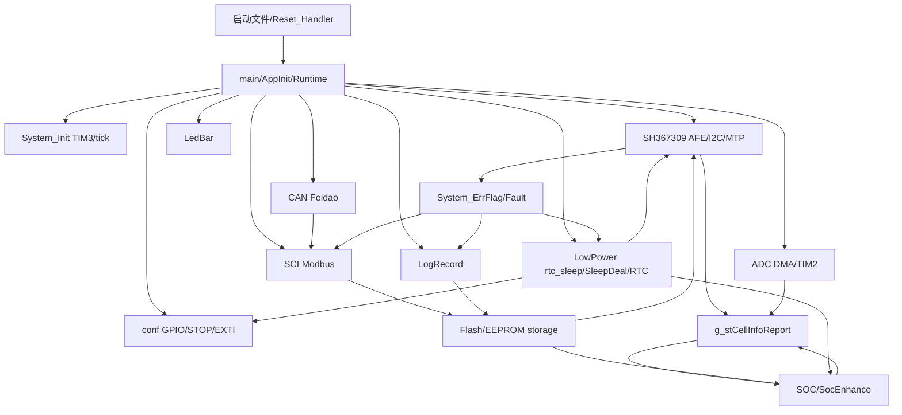

# 06 模块关系

状态：基于当前源码调用关系和全局数据流整理。参考 `00_project_symbol_index.md` 的函数/变量索引。

## 目录
- [模块关系图](#模块关系图)
- [模块职责表](#模块职责表)
- [主要耦合点](#主要耦合点)

## 模块关系图

## 模块职责表

| 模块 | 文件 | 职责 | 对外接口 | 关键变量 | 被谁调用/调用谁 | 数据输入/输出 | 重构建议 |
| --- | --- | --- | --- | --- | --- | --- | --- |
| main调度层 | `main.c`、`Runtime.c` | 启动后固定顺序调度 cooperative tasks | AppInit_Boot, Runtime_RunOnce | g_st_SysTimeFlag | 所有业务模块 | tick标志和全局状态 | 保留；适合继续保持薄调度层 |
| 系统时间/延时/看门狗 | `System_Init.c` | TIM3 10ms节拍、SysTick阻塞延时、IWDG feed | InitTimer, SysTime_LatchTaskFlags, SysTime_Take200msTaskPeriod, IWDG_Feed | g_st_SysTimeFlag, s_st_SysTimePending | Runtime、ADC、AFE、SOC、Log | ISR/主循环共享 | 保留；可减少裸全局但不要改变节拍语义 |
| BSP/GPIO/低功耗IO | `conf.c`、`conf_gpio.h` | 运行IO、STOP前IO、唤醒EXTI、STOP恢复 | InitIO, IOstatus_*, InitWakeUp_*, Sys_StopMode, InitRunAfterStopWakeup | sys_time | SleepDeal, rtc_sleep_port | GPIO/EXTI/ADC/CAN/USART耦合 | 建议拆清“运行态IO”和“STOP准备/恢复”边界 |
| AFE驱动层 | `I2C_AFE1.c`、`SH367309_Func.c`、`SH367309_DataDeal.c` | SH367309 I2C/MTP、保护参数写回、MOS位控制、硬件状态读取 | InitAFE1, MTPRead, MTPWrite, SH367309_UpdataAfeConfig, App_SH367309 | SH367309_Reg_Store, AFE_PARAM_WRITE_Flag | DataDeal, EEPROM, Sci, Flash, MosStartup | 参数/保护/MOS/SOC电流共同依赖 | 复杂高，重构需先保留寄存器写顺序 |
| 采样数据层 | `DataDeal.c`、`ADC.c` | AFE电压温度电流和MCU ADC结果转换为报告数据 | App_AFEGet, DataLoad_*, App_AnlogCal | g_stCellInfoReport, s_data, s_adc | SOC, SCI, CAN, Log, LowPower | 单位和协议字段耦合 | 建议优先文档化单位，再收敛命名 |
| 保护逻辑层 | `SH367309_Func.c`、`DataDeal.c`、`System_Monitor.c`、`Fault.c` | AFE故障转MCU故障、系统错误标志、事件记录 | Fault_ChangeToMCU, System_ERROR_UserCallback, FaultWarnRecord2 | System_ErrFlag, Fault_record_Third2, g_stCellInfoReport.unMdlFault_Third | Log, SCI, LowPower, LED | 错误flag布局敏感 | 保留协议兼容字段；可减少副作用命名不清函数 |
| MOS控制层 | `MosStartup.c`、`SH367309_Func.c`、`DataDeal.c` | 启动MOS策略、AFE MOS位写入、过温/充电逻辑 | MosStartup_ApplyInitialState, SH367309_DriverMos_Ctrl, open_ctlc, close_ctlc | SH367309_Reg_Store, System status | AFE init, Flash IAP, new_todo_logi | 保护/老化/充电/熔断耦合 | 建议拆出策略表，但不要改变默认MOS时序 |
| SOC计算层 | `SOC.c`、`SocEnhance.c` | 净电流、库仑积分、OCV/尾段/满电/静置校准、快照保存、显示平滑 | InitData_SOC, App_SOC, SOC_IntEnhance_Ctrl | SOC_Enhance_Element, s_soc, s_saved_soc | DataDeal, ADC, EEPROM, rtc_sleep_port, SCI | 状态多但顺序明确 | 重构优先保持顶层顺序，逐步私有化状态 |
| 通信协议层/SCI | `Sci_Upper.c` | Modbus帧解析、读写寄存器、参数副作用 | InitUSART_CommonUpper, App_CommonUpper, Sci_HostReadWords, Sci_HostWriteWords | SCI端口状态, g_u8SCITxBuff, u8FlashUpdateFlag | USART ISR, CAN app bridge, EEPROM, SOC, AFE | 协议地址和业务副作用耦合 | 高风险，先建立寄存器映射表再改 |
| CAN模块 | `Can_HDX.c`、`CanFeidaoFrames.c` | CAN周期上报、APP命令、TX队列、IAP/老化命令 | InitCan, App_Can, USB_LP_CAN1_RX0_IRQHandler | s_tx, s_runtime, s_app | Runtime, SCI bridge, FactoryAging | ISR队列和低功耗busy耦合 | 可保持s_tx/s_runtime/s_app三块 |
| 参数存储模块 | `EEPROM.c`、`Flash.c` | 内部Flash双槽/日志式存储、RW参数、AFE参数、SOC、日志、老化 | InitE2PROM, StorageFlash_* | OtherElement, PRT_E2ROMParas, storage busy | SCI, SOC, Log, FactoryAging | Flash busy影响低功耗 | 保留；把旧EEPROM命名逐步改成Storage更清晰 |
| 日志模块 | `LogRecord.c` | 启动/休眠/故障事件记录和协议读取 | LogRecord_Request*, App_LogRecord, LogEvent_Record | s_log_record, su32_Interval_S_Tcnt | Runtime, rtc_sleep_port, SCI | Flash写和时间计数耦合 | 保留；可明确事件枚举/去重策略 |
| LED模块 | `LedBar.c` | 按键、SOC显示、睡眠预览、1ms扫描 | LedBar_Init, APP_LedBar, TIM4_IRQHandler | s_ledbar | Runtime, SleepDeal, LowPower | ISR和主循环共享帧 | 中风险；注意原子切帧 |
| 低功耗模块 | `rtc_sleep.c`、`rtc_sleep_port.c`、`SleepDeal.c`、`LowPowerSleep.c`、`RTC.c` | 运行期STOP/HICCUP、reset-sleep、唤醒恢复、RTC秒/闹钟 | rtc_sleep, LowPower_Request, SleepDeal_Continue, IsSleepStartUp | g_stLowPowerRtcStatus, s_sleep, s_rtc, g_irq_t | Runtime, CAN, SCI, ADC, AFE, LED | 跨模块最多 | 重构优先画状态机，不要直接删状态变量 |

## 主要耦合点

- `g_stCellInfoReport` 同时是采样结果、协议上报、SOC输入、日志/低功耗判断来源，重构时不能直接改变字段布局和单位。
- `OtherElement` 同时保存均衡、睡眠、SOC、采样电阻等配置，SCI写入会触发 AFE 写回和 SOC 重载。
- `Can_HDX.c` 通过 `Sci_HostReadWords/Sci_HostWriteWords` 复用Modbus寄存器语义，CAN APP协议和SCI寄存器桥强耦合。
- 低功耗blocker调用 `Sci_IsAnyPortBusy()`、`Can_IsBusy()`、`StorageFlash_IsBusy()`、`LedBar_IsActiveForLowPower()`，其中 `Can_IsBusy()` 有更新 `last_ext_comm_cnt_can` 的副作用。
- `new_todo_logi()` 名称无法体现职责，但实际影响充电/MOS/认证熔断/低功耗，是后续重命名或拆分的高价值入口。
