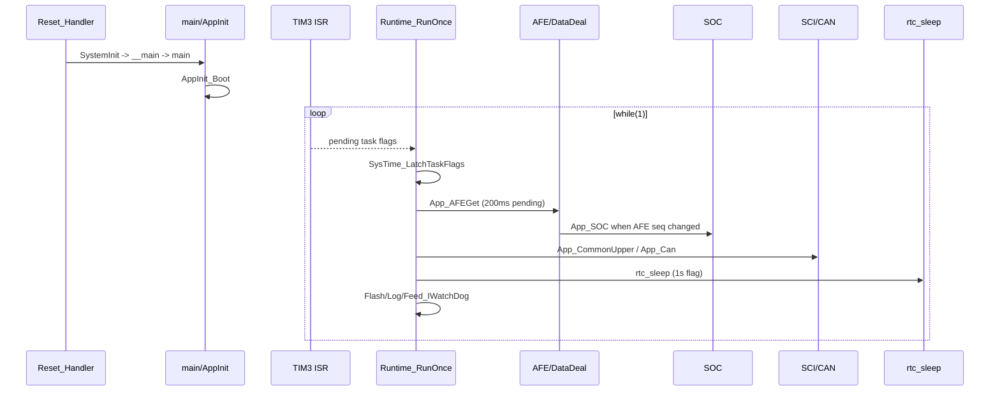

# 08 运行时序文档

状态：按系统真实运行阶段整理，覆盖上电、初始化、主循环、采样保护、通信、低功耗、唤醒和异常。

## 目录
- [阶段时序总表](#阶段时序总表)
- [正常运行时序图](#正常运行时序图)
- [低功耗与唤醒时序](#低功耗与唤醒时序)
- [异常处理时序](#异常处理时序)

## 阶段时序总表

| 阶段 | 入口 | 文件 | 行为 | 注意事项 |
| --- | --- | --- | --- | --- |
| 1 上电复位 | 向量表取SP和Reset_Handler | startup_stm32f10x_hd.s | 进入SystemInit/__main | 若向量表/地址错误则无法进入App |
| 2 C环境 | __main | ARM runtime | 初始化.data/.bss后调用main | 不可见于源码，依赖Keil runtime |
| 3 main入口 | main() | main.c | AppInit_Boot -> while Runtime_RunOnce | main不返回 |
| 4 硬件初始化 | AppInit_InitDevice | AppInit.c | 时钟/延时/睡眠恢复/GPIO/NVIC/SCI/存储/AFE/CAN/ADC/SOC/TIM3/IRQ | 顺序是关键边界 |
| 5 参数加载 | InitE2PROM | EEPROM.c/Flash.c | 默认值 -> Flash RW参数 -> AFE参数 -> 日志 -> 升级策略 | 失败置System_ErrFlag并尝试默认保存 |
| 6 AFE初始化 | InitAFE1 | I2C_AFE1.c/SH367309_* | I2C脚、CTLC、AFE reset/ready/config、初始MOS、电流零点 | 可能阻塞 |
| 7 通信初始化 | InitUSART_CommonUpper, InitCan | Sci_Upper.c/Can_HDX.c | USART1/Modbus、CAN1/滤波/NVIC/队列 | SCI2/3当前未见启用 |
| 8 SOC初始化 | InitData_SOC | SOC.c/SocEnhance.c | 从OtherElement和Flash快照建立s_soc并发布报告 | 电压无效时走默认SOC |
| 9 进入主循环 | Runtime_RunOnce | Runtime.c | 三段任务固定顺序循环 | cooperative，无RTOS |
| 10 周期采样 | TIM3->App_AFEGet | System_Init.c/DataDeal.c | 200ms消费AFE采样，10ms/100ms/1s供其他任务 | pending最多5个周期，溢出计数 |
| 11 保护判断 | App_SH367309/new_todo_logi | SH367309_Func.c/DataDeal.c | AFE硬件状态 -> 故障flag/MOS/熔断/低功耗请求 | 副作用集中 |
| 12 MOS控制 | MosStartup/SH367309_DriverMos_Ctrl/open_ctlc | MosStartup.c/SH367309_Func.c/DataDeal.c | 启动初始MOS、过温关断、IAP关MOS、睡眠AFE sleep | 硬件时序敏感 |
| 13 通信收发 | USART ISR/App_CommonUpper/CAN ISR/App_Can | Sci_Upper.c/Can_HDX.c | Modbus/CAN APP读写参数和上报 | 协议兼容高风险 |
| 14 LED显示 | APP_LedBar/TIM4 ISR | LedBar.c | 按键、SOC、睡眠预览、1ms扫描 | ISR共享状态 |
| 15 存储/日志 | StorageFlash/App_LogRecord/soc_save | Flash.c/LogRecord.c/SocEnhance.c | 参数/SOC/日志/老化进度保存 | Flash busy阻止低功耗 |
| 16 低功耗判断 | rtc_sleep lp_select | rtc_sleep.c | 每秒检查blocker和idle/vlow/force计数 | 读取通信/LED/Flash/故障 |
| 17 进入低功耗 | SleepDeal_Continue或rtc_sleep_run_hiccup_cycle | SleepDeal.c/rtc_sleep.c/rtc_sleep_port.c | reset-sleep写BKP后MCU_RESET；HICCUP进入STOP并周期RTC唤醒 | 两条路径不同 |
| 18 唤醒恢复 | IsSleepStartUp或RtcSleep_PortRestoreAfterStop | SleepDeal.c/conf.c/rtc_sleep_port.c | reset-sleep启动时等待合法唤醒；STOP恢复重配IO/ADC/SCI/CAN/TIM3 | 恢复后继续运行或复位 |
| 19 异常/故障处理 | HardFault等/System_ERROR_UserCallback | stm32f10x_it.c/System_Monitor.c | BKP记录fault reason，非debug复位；业务错误置System_ErrFlag | 错误会影响日志/通信/低功耗 |


## 正常运行时序图



## 低功耗与唤醒时序

```text
运行态每秒 rtc_sleep
├── lp_select 计算 block reason
├── mode=NO_SLEEP: 返回主循环
├── mode=NORMAL/DEEP: Log sleep -> SleepDeal_Continue -> BKP flag -> AFE sleep -> MCU_RESET
└── mode=HICCUP: Prepare RTC STOP -> Sys_StopMode -> RTC/EXTI唤醒 -> RestoreAfterStop -> 判断异常
    ├── 纯RTC周期唤醒且无异常: SOC_ApplyRtcRelaxationCompensation -> 继续STOP
    └── 外部/异常唤醒: 记录last sleep seconds -> LowPower_Request(NO_SLEEP) -> 回主循环
```

## 异常处理时序

- Cortex fault：`IrqDebug_Count` -> `IrqDebug_SetPhase(FAULT)` -> `Fault_SaveReason(BKP)` -> `_DEBUG_` 下停住，否则 `NVIC_SystemReset()`。
- AFE/ADC/Flash业务错误：通过 `System_ERROR_UserCallback()` 写 `System_ErrFlag`，再由通信、日志、低功耗blocker读取。
- CAN/SCI帧错误：通常只设置协议错误响应，不直接复位；但IAP命令会置 `u8FlashUpdateFlag` 并在后台复位。
