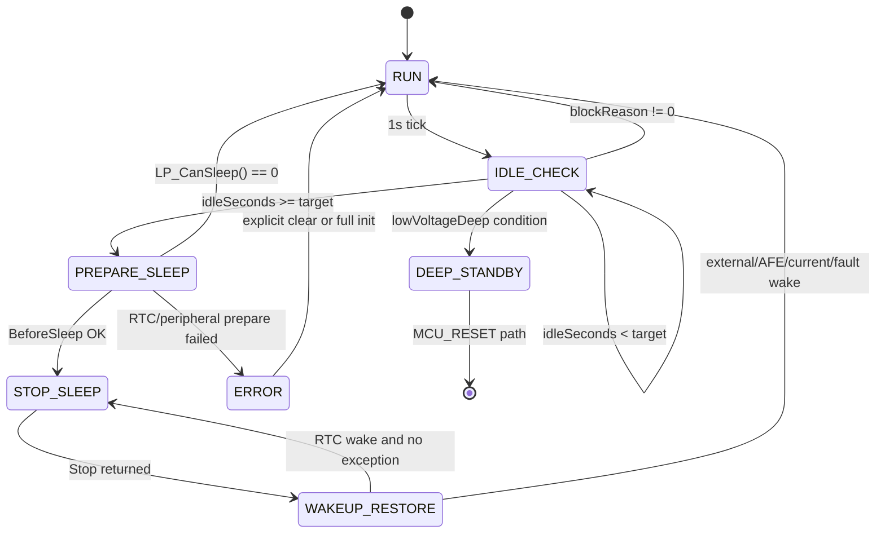

# RTC 低功耗框架 API 与状态机设计

## 约束和定位

本文属于第二阶段设计文档，只定义 `app_lowpower` 对外 API、状态机、阻塞原因位图以及与现有 `g_stLowPowerRtcStatus` 的兼容关系，不修改源码、不编译、不提交。

当前项目已经存在可工作的 RTC Stop 主链路，后续实现不应推翻该链路，而应在外层收敛成统一 API：

- 主循环入口：`103 + 309/Project/Source/Runtime.c:23` 的 `Runtime_RunIoAndPowerTasks()` 调用 `App_LowPowerProcess()`。
- 现有低功耗任务：`103 + 309/Project/Source/rtc_sleep.c:231` 的 `App_LowPowerProcess()` 直接调用 `rtc_sleep()`。
- 现有状态记录：`103 + 309/Project/Source/rtc_sleep.h:50` 的 `struct LOW_POWER_RTC_STATUS`，全局实例在 `103 + 309/Project/Source/rtc_sleep.c:14`。
- 现有 Stop 周期睡眠：`103 + 309/Project/Source/rtc_sleep.c:303` 的 `rtc_sleep_run_hiccup_cycle()`。
- Stop 进入和时钟恢复：`103 + 309/Project/Source/conf/conf.c:374` 的 `Sys_StopMode()`，返回后调用 `cpu_frequency_conf()`。
- Stop 后外设恢复：`103 + 309/Project/Source/conf/conf.c:392` 的 `InitRunAfterStopWakeup()`。
- RTC Alarm 周期配置：`103 + 309/Project/Source/RTC.c:408` 的 `RTC_WKTimeConfig()`，唤醒周期来自 `RTC_GetWakeupPeriodSeconds()`。

第一版目标仍是 `Stop + RTC 周期唤醒`。不做 CAN/USART Stop 唤醒，不改 Modbus/CAN 协议，不改 SOC/AFE/Flash/LED 业务规则。

## 模块边界

建议第三阶段新增四个模块，但第一版只让 `app_lowpower` 对业务层可见：

- `app_lowpower.c/.h`：统一状态机、阻塞原因、睡眠准入、对旧接口兼容。
- `bsp_rtc.c/.h`：封装 F1 `RTC Alarm + EXTI17`，底层先调用现有 `Init_RTC()`、`RTC_WKTimeConfig()`、`RTC_DisableStopWakeup()`、`RTC_GetLastWakeupPeriodSeconds()`。
- `bsp_power.c/.h`：封装 Stop 前后处理，底层先调用 `IOstatus_RTCMode()`、`InitWakeUp_RTCMode()`、`Sys_StopMode()`、`LowPower_DisableWakeupExti()`。
- `bsp_clock.c/.h`：封装 Stop 后时钟恢复，第一版底层沿用 `cpu_frequency_conf()`，后续再拆出专用恢复逻辑。

兼容策略：

- 保留 `App_LowPowerProcess()`、`LowPower_Request()`、`LowPower_ClearToSleepFlag()`、`LowPower_IsToSleepPending()`、`entersleep()` 这些旧入口。
- 第三阶段可先让 `App_LowPowerProcess()` 调 `LP_Task()`；旧 `entersleep(HICCUP_MODE)` 等接口只写入兼容请求，不直接绕过新状态机。
- 不修改旧 `struct LOW_POWER_RTC_STATUS` 前 7 个字段含义，避免影响 Keil Watch、旧调试脚本和已有代码。
- 新的 `uint32_t` 阻塞位图由 `LP_GetBlockReason()` 输出，旧 `g_stLowPowerRtcStatus.blockReason` 只保留一个优先级最高的摘要原因。

## API 设计

### `void LP_Init(void)`

语义：

- 初始化低功耗框架运行态。
- 清空内部状态、清空阻塞位图、清空本轮休眠秒数。
- 设置默认状态为 `LP_STATE_RUN`。
- 同步旧 `g_stLowPowerRtcStatus`：`mode = NO_SLEEP`、`readyToSleep = 0`、`blockReason = LOW_POWER_RTC_BLOCK_NONE`、`rtcWake = RtcSleep_PortIsRtcWake()`、`delaySeconds = 0`、`delayTargetSeconds = RtcSleep_PortGetIdleDelayTargetSeconds()`、`elapsedSeconds = 0`。

输入输出：

- 输入：无。
- 输出：无函数返回值；输出体现在内部状态、`LP_GetBlockReason()` 和 `g_stLowPowerRtcStatus`。

调用方：

- 建议由 `AppInit_Boot()` 在 `Init_RTC()` 之后调用。当前 `Init_RTC()` 位于 `103 + 309/Project/Source/AppInit.c:66`。

被调用方：

- `RtcSleep_PortIsRtcWake()`，当前在 `103 + 309/Project/Source/rtc_sleep_port.c:136`。
- `RtcSleep_PortGetIdleDelayTargetSeconds()`，当前返回 `sys_time.time_enter_rtc`，见 `103 + 309/Project/Source/rtc_sleep_port.c:11`。

失败/阻塞处理：

- 初始化阶段不进入低功耗。
- 若 RTC 初始化失败，不在 `LP_Init()` 内死等；由底层 `Init_RTC()` 的 safe wait 结果决定，框架将状态保持为 `RUN`，后续 `LP_CanSleep()` 应置 `LP_BLOCK_RTC_UNREADY` 扩展位。第一版如果不新增该位，可映射到 `LP_BLOCK_IWDG_UNSAFE` 或 `LP_BLOCK_AFE_BUSY` 之外的内部错误位，但不进入 Stop。

### `void LP_Task(void)`

语义：

- 低功耗状态机主任务。
- 只在运行态主循环调用，不在中断中调用。
- 每次调用先同步运行态任务标志；只有 `RtcSleep_PortIsOneSecondTick()` 为真时推进休眠倒计时，保持当前项目每秒判断的节奏。现有依据是 `rtc_sleep()` 在 `103 + 309/Project/Source/rtc_sleep.c:414` 先判断 `RtcSleep_PortIsOneSecondTick()`。

输入输出：

- 输入：无。
- 输出：无函数返回值；可能更新状态机、阻塞位图、旧 `g_stLowPowerRtcStatus`，也可能进入 Stop 并返回。

调用方：

- 当前由 `Runtime_RunIoAndPowerTasks()` 间接调用，见 `103 + 309/Project/Source/Runtime.c:23`。
- 第三阶段建议 `App_LowPowerProcess()` 改成兼容壳，内部调用 `LP_Task()`。

被调用方：

- `LP_CanSleep()`：收集阻塞原因。
- `LP_BeforeSleep()`：进入 Stop 前保存和收口。
- `LP_EnterStop(seconds)`：执行 Stop。
- `LP_AfterWakeup()`：Stop 返回后恢复和业务同步。

失败/阻塞处理：

- 若 `LP_CanSleep()` 返回 0，状态回到 `LP_STATE_RUN`，`delaySeconds` 清零或保持原策略延迟，`readyToSleep = 0`。
- 通信忙、Flash 忙、IWDG 不安全等只阻塞本轮，不触发复位。
- 对过放深睡，保留当前 `DEEP_MODE` 复位式路径，不在 `LP_Task()` 内直接改成硬件 Standby。

### `uint8_t LP_CanSleep(void)`

语义：

- 统一低功耗准入检查。
- 返回 1 表示允许进入本轮 Stop 或复位式深睡准备；返回 0 表示禁止。
- 每次调用必须刷新 `LP_GetBlockReason()` 返回值，并把优先级最高的阻塞原因映射到 `g_stLowPowerRtcStatus.blockReason`。

输入输出：

- 输入：无。
- 输出：`1` 可睡，`0` 不可睡；副作用是刷新阻塞位图和旧状态字段。

调用方：

- `LP_Task()` 的 `LP_STATE_IDLE_CHECK` 和 `LP_STATE_PREPARE_SLEEP`。
- `LP_EnterStop()` 在真正 Stop 前再调用一次，防止检查到进入 Stop 之间出现通信、Flash、AFE 状态变化。

被调用方和依据：

- 充放电电流：`RtcSleep_PortGetChargeCurrentMa()`、`RtcSleep_PortGetDischargeCurrentMa()`，当前在 `103 + 309/Project/Source/rtc_sleep_port.c:26` 和 `:31`。
- MCU 唤醒/按键类阻塞：`RtcSleep_PortIsMcuWakeActive()`，当前读 `GPIO_MCU_WK`，见 `103 + 309/Project/Source/rtc_sleep_port.c:46`。
- 工厂老化：`RtcSleep_PortIsFactoryAgingActive()`，底层为 `FactoryAging_IsActive()`，见 `103 + 309/Project/Source/rtc_sleep_port.c:51`。
- 外部通信计数：`RtcSleep_PortGetExternalCommCounter()` 读取 `RTC_ExtComCnt`，见 `103 + 309/Project/Source/rtc_sleep_port.c:56`；串口收到字节会递增该计数，见 `103 + 309/Project/Source/Sci_Upper.c:1478`。
- 串口忙：`Sci_IsAnyPortBusy()`，见 `103 + 309/Project/Source/Sci_Upper.c:1678`。当前低功耗准入尚未统一调用它，第三阶段需要接入。
- CAN 忙：`Can_IsBusy()`，见 `103 + 309/Project/Source/Can_HDX.c:865`；CAN 睡前收口用 `Can_PrepareSleep()`，见 `103 + 309/Project/Source/Can_HDX.c:882`。
- AFE 忙/故障阻塞：`RtcSleep_PortIsAfeSleepBlocked()`，底层 `RtcSleep_AfePortIsSleepBlocked()` 读取 SH367309 状态，见 `103 + 309/Project/Source/rtc_sleep_afe_sh367309.c:11`。
- Flash 忙：当前没有统一 `StorageFlash_IsBusy()`；Flash 写入集中在 `StorageFlash_SavePair()` 一类函数中 `FLASH_Unlock()` 到 `FLASH_Lock()` 窗口，见 `103 + 309/Project/Source/Flash.c:532` 到 `:547`。第三阶段应先新增 busy 观测点，再把它接入 `LP_BLOCK_FLASH_BUSY`。
- 升级 pending：`AppUpgrade_IsIapRequested()` 已在 `InitAreaSelect()` 中用于复位跳转判断，见 `103 + 309/Project/Source/Flash.c:1102`。
- LED active：当前有 `LedBar_SetSleep()`、`LedBar_PrepareForStop()`，见 `103 + 309/Project/Source/LedBar.c:817` 和 `:982`；尚无统一 `LedBar_IsActive()`，第三阶段若接入 `LP_BLOCK_LED_ACTIVE` 应新增只读接口。
- IWDG 安全窗口：当前 `Init_IWDG()` 在 `__FUNC_RTC__` 下使用 `IWDG_Prescaler_256` 和 `Reload 0x0FFF`，见 `103 + 309/Project/Source/System_Init.c:33`；`RTC_GetWakeupPeriodSeconds()` 中 IWDG 裁剪逻辑被注释，见 `103 + 309/Project/Source/RTC.c:375`。

失败/阻塞处理：

- 任一硬阻塞位存在时返回 0。
- `LP_BLOCK_COMM`、`LP_BLOCK_FLASH_BUSY`、`LP_BLOCK_UPGRADE`、`LP_BLOCK_IWDG_UNSAFE` 是第一版硬阻塞。
- `LP_BLOCK_LED_ACTIVE` 默认建议硬阻塞，直到显示窗口结束或 `LedBar_PrepareForStop()` 已执行。
- `LP_BLOCK_FAULT` 对严重故障硬阻塞；对过放/低压类应转入 `DEEP_MODE` 复位式睡眠路径，而不是普通 Stop。

### `uint32_t LP_GetBlockReason(void)`

语义：

- 返回当前低功耗阻塞原因位图。
- 位图允许多个原因同时存在，用于调试、后续 Modbus/CAN 诊断和 Keil Watch。

输入输出：

- 输入：无。
- 输出：`uint32_t` 位图；0 表示无阻塞。

调用方：

- 调试读取。
- 后续可选映射到上位机只读寄存器，但第一版不改协议。

被调用方：

- 无底层调用，仅返回 `app_lowpower` 内部缓存。

失败/阻塞处理：

- 不触发任何硬件动作。
- 若状态机进入 `LP_STATE_ERROR`，返回值必须保留触发错误的最后阻塞位，不应在下一次普通查询中自动清零。

### `void LP_SetWakeupPeriod(uint32_t seconds)`

语义：

- 设置下一次 RTC Stop 周期唤醒目标秒数。
- `seconds == 0` 时按 1 秒处理。
- 若 IWDG 已启用，必须裁剪到安全窗口内。当前工程在 `__FUNC_RTC__` 下标称 IWDG 约 26.2 秒；未校准 LSI 时按最坏频率估算后，第一版建议最大允许 Stop 周期不超过 10 秒。

输入输出：

- 输入：`seconds`，目标 RTC 唤醒周期。
- 输出：无函数返回值；实际生效值通过内部 `s_lpWakeupPeriodSeconds` 或后续 `LP_GetLastSleepSeconds()`/调试字段观察。

调用方：

- 初始化阶段可设置默认值。
- `LP_Task()` 在进入 `LP_STATE_PREPARE_SLEEP` 前可根据 `Can_GetIdleRtcPeriodSeconds()` 更新。当前 `Can_GetIdleRtcPeriodSeconds()` 返回 `FEIDAO_CAN_RTC_PERIOD_SECONDS`，见 `103 + 309/Project/Source/Can_HDX.c:901`。

被调用方：

- 第一版可只保存内部变量，由 `LP_EnterStop()` 传入底层。
- 若沿用旧 `RTC_WKTimeConfig()`，需要让 `RTC_GetWakeupPeriodSeconds()` 能读取该内部值或继续由 `Can_GetIdleRtcPeriodSeconds()` 决定，二者不能产生冲突。

失败/阻塞处理：

- 如果裁剪后仍不满足 IWDG 安全关系，置 `LP_BLOCK_IWDG_UNSAFE`，但不直接复位。
- 不允许把超长周期强行配置给 `RTC_WKTimeConfig()`。

### `void LP_EnterStop(uint32_t seconds)`

语义：

- 执行一次 `Stop + RTC Alarm` 周期睡眠。
- 该函数是动作函数，不负责长时间循环；是否连续睡眠由 `LP_Task()` 的状态机决定。

输入输出：

- 输入：`seconds`，本次 RTC 唤醒周期。
- 输出：无函数返回值；Stop 返回后更新最后休眠秒数、RTC wake 标志、状态机状态。

调用方：

- 仅 `LP_Task()` 在 `LP_STATE_STOP_SLEEP` 调用。
- 不建议业务模块直接调用，避免绕过阻塞检查。

被调用方和现有映射：

- `LP_CanSleep()`：Stop 前二次确认。
- `LP_SetWakeupPeriod(seconds)`：裁剪周期。
- `LP_BeforeSleep()`：保存 SOC、CAN、老化进度并准备 GPIO/RTC。
- `RtcSleep_PortEnterStop()`：现有封装在 Stop 前后喂狗，见 `103 + 309/Project/Source/rtc_sleep_port.c:118`。
- `Sys_StopMode()`：实际调用 `PWR_EnterSTOPMode(PWR_Regulator_LowPower, PWR_STOPEntry_WFI)`，见 `103 + 309/Project/Source/conf/conf.c:374`。
- `LP_AfterWakeup()`：Stop 返回后恢复。

失败/阻塞处理：

- Stop 前二次 `LP_CanSleep()` 失败时不进入 Stop，状态回 `RUN`，`readyToSleep = 0`。
- RTC 配置失败时不进入 Stop，置内部错误位并回 `RUN`。
- Stop 返回但 `RtcSleep_PortIsRtcWake()` 为 0 时，按异常/外部唤醒处理，清 `readyToSleep`，回 `RUN`。
- Stop 返回且是 RTC 唤醒时，记录 `RTC_GetLastWakeupPeriodSeconds()`，再进入 `WAKEUP_RESTORE`。

### `void LP_BeforeSleep(void)`

语义：

- 进入 Stop 前的统一收口。
- 必须只做可重复、可中断恢复的动作。

输入输出：

- 输入：无。
- 输出：无函数返回值；副作用是保存快照、关闭或准备外设、配置 RTC wake。

调用方：

- `LP_EnterStop()`。
- 复位式 `DEEP_MODE` 路径可复用其中的保存部分，但是否调用 Stop 准备由状态机决定。

被调用方和依据：

- `LowPowerSleep_SaveCoreState()`：当前会调用 `Can_PrepareSleep()`、`SOC_SaveSnapshotBeforeSleep()`、`FactoryAging_SaveProgressBeforeSleep()`，见 `103 + 309/Project/Source/LowPowerSleep.c:5`。
- `Init_RTC()`：现有 RTC 初始化，见 `103 + 309/Project/Source/RTC.c:437`。
- `IOstatus_RTCMode()`：RTC Stop GPIO 收口，见 `103 + 309/Project/Source/conf/conf.c:297`。
- `InitWakeUp_RTCMode()`：配置普通唤醒源并调用 `RTC_WKTimeConfig()`，见 `103 + 309/Project/Source/conf/conf.c:268`。
- `ADC_StopForLowPower()`：Stop 前停 ADC，当前在 `Conf_PrepareStopEntry()` 中调用，见 `103 + 309/Project/Source/conf/conf.c:114`。
- `LedBar_SetSleep(1)` 和 `LedBar_PrepareForStop()`：当前 Stop 前已有调用，见 `103 + 309/Project/Source/conf/conf.c:116` 和 `:294`。

失败/阻塞处理：

- Flash 保存失败不能继续进入 Stop，应置 `LP_BLOCK_FLASH_BUSY` 或内部错误位并回 `RUN`。
- AFE 进入 sleep 或状态读取异常不能继续普通 Stop，应置 `LP_BLOCK_AFE_BUSY`。
- CAN 队列清空失败或仍 busy 时置 `LP_BLOCK_COMM`，不进入 Stop。

### `void LP_AfterWakeup(void)`

语义：

- Stop 返回后的统一恢复。
- 顺序必须是：系统时钟恢复完成后，再恢复 RTC 中断、GPIO、ADC、通信、CAN、TIM、LED、AFE IIC、业务状态。

输入输出：

- 输入：无。
- 输出：无函数返回值；副作用是恢复外设、更新休眠秒数、同步 SOC/AFE/MOS 状态。

调用方：

- `LP_EnterStop()` 返回后立即调用。

被调用方和依据：

- `Sys_StopMode()` 返回前已经调用 `cpu_frequency_conf()`，见 `103 + 309/Project/Source/conf/conf.c:382` 到 `:384`。
- `InitRunAfterStopWakeup()` 恢复 `RTC_RestoreRunInterrupts()`、`InitIO_rtc()`、`InitADC()`、`AppInit_InitSci()`、`InitCan()`、`InitTimer()`、`initAFE1_IIC()`，见 `103 + 309/Project/Source/conf/conf.c:392` 到 `:420`。
- SOC 休眠补偿：`RtcSleep_PortApplySocRtcRest()` 调 `SOC_ApplyRtcRelaxationCompensation()`，见 `103 + 309/Project/Source/rtc_sleep_port.c:166`。
- AFE/MOS 重同步：`RtcSleep_AfePortHasAfeWake()` 中调用 `SystemRuntime_SetMosStatus()` 和 `Fault_ChangeToMCU()`，见 `103 + 309/Project/Source/rtc_sleep_afe_sh367309.c:74`。
- CAN RTC 服务：`Can_RtcWakeService()`，见 `103 + 309/Project/Source/Can_HDX.c:906`。

失败/阻塞处理：

- 如果外设恢复失败，状态置 `LP_STATE_ERROR`，不立即再次进入 Stop。
- 如果 AFE 读取异常或发现故障，退出低功耗循环回 `RUN`，让保护任务接管。
- 如果 CAN RTC 服务超时，保留 `g_stCanLowPowerStatus.u8LastRtcWakeTimeout`，本轮回 `RUN` 或延迟下一次 Stop。

### `uint32_t LP_GetLastSleepSeconds(void)`

语义：

- 返回最近一次 Stop 的 RTC 休眠秒数。
- 用于 SOC 静置时间、日志、诊断和后续上位机可观测性。

输入输出：

- 输入：无。
- 输出：最近一次 Stop 休眠秒数；未睡眠时为 0。

调用方：

- `LP_AfterWakeup()` 后的 SOC 补偿逻辑。
- 后续诊断读取。

被调用方：

- 第一版可直接返回 `RTC_GetLastWakeupPeriodSeconds()`，当前函数在 `103 + 309/Project/Source/RTC.c:402`。
- 若状态机需要累计多轮 RTC hiccup，可沿用 `rtc_sleep.c` 当前的 `s_u32RtcSleepElapsedSeconds` 思路，见 `103 + 309/Project/Source/rtc_sleep.c:25`。

失败/阻塞处理：

- 如果本次不是 RTC 唤醒，返回 0 或保留上次值由状态机决定；建议返回本次值 0，避免 SOC 把外部唤醒误算成静置。

## 状态机定义

建议状态枚举：

```c
typedef enum {
    LP_STATE_RUN = 0,
    LP_STATE_IDLE_CHECK,
    LP_STATE_PREPARE_SLEEP,
    LP_STATE_STOP_SLEEP,
    LP_STATE_WAKEUP_RESTORE,
    LP_STATE_DEEP_STANDBY,
    LP_STATE_ERROR
} LP_STATE;
```

状态语义：

| 状态 | 语义 | 允许的主要动作 |
| --- | --- | --- |
| `LP_STATE_RUN` | 正常运行 | 清 `readyToSleep`，等待 1 秒节拍 |
| `LP_STATE_IDLE_CHECK` | 空闲准入检查 | 调 `LP_CanSleep()`，更新阻塞位图和倒计时 |
| `LP_STATE_PREPARE_SLEEP` | 睡前二次确认和收口 | 调 `LP_BeforeSleep()` |
| `LP_STATE_STOP_SLEEP` | 执行 Stop | 调 `LP_EnterStop(seconds)` |
| `LP_STATE_WAKEUP_RESTORE` | 唤醒恢复 | 调 `LP_AfterWakeup()`、SOC/AFE/CAN 服务 |
| `LP_STATE_DEEP_STANDBY` | 复位式深睡准备 | 沿用 `SleepDeal_Continue(DEEP_MODE)`，暂不改硬件 Standby |
| `LP_STATE_ERROR` | 低功耗流程异常 | 禁止再次入睡，等待主循环恢复或复位策略 |

## 状态转换条件



转换规则：

- `RUN -> IDLE_CHECK`：`RtcSleep_PortIsOneSecondTick()` 为真。现有 `rtc_sleep()` 已按该条件运行。
- `IDLE_CHECK -> RUN`：`LP_CanSleep()` 返回 0。必须刷新 `g_stLowPowerRtcStatus.blockReason`，并保持 `mode = NO_SLEEP` 或保留外部请求但 `readyToSleep = 0`。
- `IDLE_CHECK -> PREPARE_SLEEP`：无阻塞，且空闲秒数达到 `RtcSleep_PortGetIdleDelayTargetSeconds()`。当前项目对应 `rtc_sleep.c:221` 达到 `sys_time.time_enter_rtc` 后 `entersleep(HICCUP_MODE)`。
- `IDLE_CHECK -> DEEP_STANDBY`：低压深睡条件满足。当前项目已有 `LOW_POWER_FORCE_DEEP_SLEEP_MV = 2800mV`、60 秒强制深睡逻辑，见 `rtc_sleep.c:7` 和 `rtc_sleep.c:154`。
- `PREPARE_SLEEP -> RUN`：睡前二次检查发现通信、Flash、AFE、IWDG 等阻塞。
- `PREPARE_SLEEP -> STOP_SLEEP`：RTC、GPIO、ADC、CAN、LED 收口完成。
- `STOP_SLEEP -> WAKEUP_RESTORE`：`PWR_EnterSTOPMode()` 返回。
- `WAKEUP_RESTORE -> STOP_SLEEP`：RTC 周期唤醒且 `isException()` 为假。当前循环依据是 `rtc_sleep_run_hiccup_cycle()` 返回 `true` 后继续 while，见 `rtc_sleep.c:453`。
- `WAKEUP_RESTORE -> RUN`：发生电流、AFE、故障、电压异常或非 RTC 唤醒。当前 `isException()` 会检查 AFE 数据、电流、AFE wake 和紧急电压，见 `rtc_sleep.c:241`。
- `DEEP_STANDBY`：第一版名字保留为状态机概念，底层仍是当前 `SleepDeal_Continue(DEEP_MODE)` 写 BootFlag、AFE sleep、`MCU_RESET()`，见 `SleepDeal.c:83`。

## 阻塞原因位图

建议位图：

```c
#define LP_BLOCK_NONE        (0UL)
#define LP_BLOCK_CHARGE      (1UL << 0)
#define LP_BLOCK_DISCHARGE   (1UL << 1)
#define LP_BLOCK_COMM        (1UL << 2)
#define LP_BLOCK_KEY         (1UL << 3)
#define LP_BLOCK_AFE_BUSY    (1UL << 4)
#define LP_BLOCK_FLASH_BUSY  (1UL << 5)
#define LP_BLOCK_UPGRADE     (1UL << 6)
#define LP_BLOCK_FAULT       (1UL << 7)
#define LP_BLOCK_LED_ACTIVE  (1UL << 8)
#define LP_BLOCK_IWDG_UNSAFE (1UL << 9)

/* 项目扩展位，保留给当前工程已有约束 */
#define LP_BLOCK_FACTORY_AGING (1UL << 10)
#define LP_BLOCK_MCU_WAKE      (1UL << 11)
#define LP_BLOCK_RTC_UNREADY   (1UL << 12)
```

位图来源：

| 位 | 当前依据 | 第一版处理 |
| --- | --- | --- |
| `LP_BLOCK_CHARGE` | `RtcSleep_PortGetChargeCurrentMa() > 10mA`，当前逻辑见 `rtc_sleep.c:132` | 阻塞普通 Stop；低压深睡按现有 `LOW_POWER_DEEP_SLEEP_ICHG_LIMIT` 处理 |
| `LP_BLOCK_DISCHARGE` | `RtcSleep_PortGetDischargeCurrentMa() > 10mA`，当前逻辑见 `rtc_sleep.c:132` | 阻塞普通 Stop |
| `LP_BLOCK_COMM` | `RTC_ExtComCnt` 变化、`Sci_IsAnyPortBusy()`、`Can_IsBusy()` | 硬阻塞，不改协议 |
| `LP_BLOCK_KEY` | `GPIO_MCU_WK` 或按键显示窗口 | 阻塞普通 Stop |
| `LP_BLOCK_AFE_BUSY` | `RtcSleep_AfePortIsSleepBlocked()` | 硬阻塞 |
| `LP_BLOCK_FLASH_BUSY` | 第三阶段新增 Flash busy 只读接口 | 硬阻塞 |
| `LP_BLOCK_UPGRADE` | `AppUpgrade_IsIapRequested()` | 硬阻塞 |
| `LP_BLOCK_FAULT` | `g_stCellInfoReport.unMdlFault_Third.all`、AFE wake/fault | 严重故障退出低功耗 |
| `LP_BLOCK_LED_ACTIVE` | 第三阶段新增 LED active 只读接口，当前有 `LedBar_SetSleep()`/`LedBar_PrepareForStop()` | 阻塞直到显示窗口结束 |
| `LP_BLOCK_IWDG_UNSAFE` | RTC 周期大于 IWDG 安全窗口 | 硬阻塞或裁剪周期 |
| `LP_BLOCK_FACTORY_AGING` | `FactoryAging_IsActive()` | 阻塞普通 Stop，保留现有老化策略 |
| `LP_BLOCK_MCU_WAKE` | `RtcSleep_PortIsMcuWakeActive()` | 阻塞普通 Stop |
| `LP_BLOCK_RTC_UNREADY` | RTC 初始化、Alarm 配置、EXTI17 配置失败 | 阻塞 Stop |

## 与旧 `g_stLowPowerRtcStatus` 的兼容字段

旧结构：

```c
struct LOW_POWER_RTC_STATUS {
  uint8_t mode;
  uint8_t readyToSleep;
  uint8_t blockReason;
  uint8_t rtcWake;
  uint16_t delaySeconds;
  uint16_t delayTargetSeconds;
  uint32_t elapsedSeconds;
};
```

兼容规则：

| 旧字段 | 新框架写入规则 |
| --- | --- |
| `mode` | `LP_STATE_STOP_SLEEP` 前写 `HICCUP_MODE`；深睡路径写 `DEEP_MODE`；正常运行写 `NO_SLEEP`。保留 `NORMAL_MODE` 只兼容旧复位式睡眠。 |
| `readyToSleep` | `PREPARE_SLEEP` 和 `STOP_SLEEP` 期间为 1；任一阻塞、异常唤醒、回到 RUN 时清 0。 |
| `blockReason` | 由 `LP_GetBlockReason()` 的位图按优先级映射成旧 `enum LOW_POWER_RTC_BLOCK_REASON`。 |
| `rtcWake` | 读取 `RtcSleep_PortIsRtcWake()`；进入 Stop 前清 0，RTC Alarm 唤醒后置 1。 |
| `delaySeconds` | 当前空闲累计秒数；阻塞时按现有策略清 0。 |
| `delayTargetSeconds` | `RtcSleep_PortGetIdleDelayTargetSeconds()`，当前来自 `sys_time.time_enter_rtc`。 |
| `elapsedSeconds` | 本次或连续 RTC Stop 累计秒数，用于 SOC 静置补偿。 |

旧 `blockReason` 摘要映射优先级：

| 新位图 | 旧摘要 |
| --- | --- |
| `LP_BLOCK_CHARGE` 或 `LP_BLOCK_DISCHARGE` | `LOW_POWER_RTC_BLOCK_CURRENT` |
| `LP_BLOCK_KEY` 或 `LP_BLOCK_MCU_WAKE` | `LOW_POWER_RTC_BLOCK_MCU_WAKE` |
| `LP_BLOCK_FACTORY_AGING` | `LOW_POWER_RTC_BLOCK_FACTORY_AGING` |
| `LP_BLOCK_COMM` | `LOW_POWER_RTC_BLOCK_EXT_COMM` |
| `LP_BLOCK_AFE_BUSY` 或 `LP_BLOCK_FAULT` | `LOW_POWER_RTC_BLOCK_AFE_NOT_IDLE` |
| `LP_BLOCK_FLASH_BUSY`、`LP_BLOCK_UPGRADE`、`LP_BLOCK_LED_ACTIVE`、`LP_BLOCK_IWDG_UNSAFE`、`LP_BLOCK_RTC_UNREADY` | `LOW_POWER_RTC_BLOCK_RESERVED_2` |
| 无阻塞 | `LOW_POWER_RTC_BLOCK_NONE` |

说明：

- 不建议把旧 `blockReason` 扩成位图；旧字段是 `uint8_t`，当前代码按单值使用。
- 新增诊断应读取 `LP_GetBlockReason()`，旧字段只服务兼容和快速观察。
- 如果第三阶段确实需要把位图放入 `struct LOW_POWER_RTC_STATUS`，只能追加在结构末尾，不改变现有字段顺序。

## 与旧函数的关系

| 旧函数 | 新框架关系 |
| --- | --- |
| `App_LowPowerProcess()` | 保留名称，内部调用 `LP_Task()`。 |
| `rtc_sleep()` | 第一版可作为实现参考逐步迁移；完成后不再直接作为状态机主入口。 |
| `LowPower_Request(mode)` | 保留为兼容请求入口，仅设置目标模式/请求，不直接进入 Stop。 |
| `entersleep(mode)` | 保留为 `LowPower_Request(mode)` 的兼容壳。 |
| `LowPower_ClearToSleepFlag()` | 清新状态机的 sleep request，并同步旧 `readyToSleep = 0`。 |
| `LowPower_IsToSleepPending()` | 返回新状态机是否处于 `PREPARE_SLEEP`/`STOP_SLEEP`。LED 当前依赖该函数，见 `LedBar.c:1040`。 |
| `RtcSleep_Port*()` | 第一版继续作为业务适配层，`app_lowpower` 优先复用，不直接散落访问全局变量。 |

## 最小实现顺序建议

1. 新增 `app_lowpower.h`，定义 `LP_STATE`、阻塞位、API 原型。
2. 新增 `app_lowpower.c`，先复用现有 `RtcSleep_Port*()`、`Sys_StopMode()`、`InitRunAfterStopWakeup()`、`RTC_WKTimeConfig()`。
3. 让 `App_LowPowerProcess()` 调 `LP_Task()`，保留旧函数名。
4. 接入 `Sci_IsAnyPortBusy()`、`Can_IsBusy()` 到 `LP_BLOCK_COMM`。
5. 增加 Flash busy 只读接口，再接入 `LP_BLOCK_FLASH_BUSY`。
6. 恢复 IWDG 周期安全裁剪，把超出安全窗口映射到 `LP_BLOCK_IWDG_UNSAFE`。
7. 增加 LED active 只读接口，再接入 `LP_BLOCK_LED_ACTIVE`。
8. 文档和测试同步更新后，再考虑把 `rtc_sleep.c` 内部旧状态机逐步收敛到 `app_lowpower`。

## 不在第二阶段实现的内容

- 不改任何 `.c/.h` 源码。
- 不改 `Runtime.c`、`RTC.c`、`conf.c`、`rtc_sleep.c`。
- 不编译、不烧录、不提交。
- 不改变 CAN/Modbus 协议和上位机寄存器。
- 不把 `DEEP_MODE` 改成硬件 Standby。
- 不做 CAN/USART Stop 唤醒。
