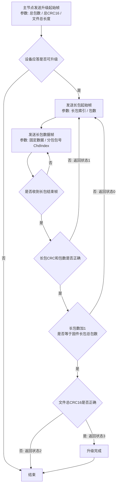

# 飞道 CAN 通信协议 V1.6 解析

来源文件：`飞道CAN通信协议V1.6(1).pdf`  
解析日期：2026-05-21  
重点范围：电池通信部分、固件升级部分。本文也保留总线参数、CAN ID 编码、节点定义和其他业务域概览，便于后续做 BMS 固件适配。

## 0. 来源页码索引

| 内容 | PDF 页码 |
|---|---|
| 版本变更记录 | 第 1 页 |
| CAN 扩展帧结构、总线参数 | 第 2 页 |
| CAN ID 编码、节点定义、控制码定义 | 第 3 页 |
| 仪表通信部分 | 第 4~8 页 |
| 控制器通信部分 | 第 9~11 页 |
| 电池通信部分 | 第 12~13 页 |
| IOT 通信部分 | 第 14~17 页 |
| 固件升级报文定义 | 第 18~19 页 |
| 固件升级流程图 | 第 20 页 |
| CRC16 算法 | 第 21~22 页 |

## 1. 协议总体结论

飞道协议基于 `CAN 2.0B` 扩展帧，使用 `29bit CAN ID` 携带发送节点、接收节点、控制码、命令码和命令子码。数据区固定为标准 CAN 的 `0~8 bytes`，常规状态帧多为周期发布，升级数据通过协议自定义的长数据起始、长数据传输、长数据结束三类控制码完成分包。

对 BMS 固件而言，需要重点实现三类能力：

1. 周期广播电池状态，节点为 `SrcID=0x14`，通常 `DstID=0x1F` 广播。
2. 按协议上报电压、电流、SOC、SOH、容量、MOS/充放电状态、故障码、版本、生产日期、设备 ID 和厂商代码。
3. 作为升级从节点时，响应升级起始帧，接收长包数据，校验每个长包 CRC16，再在全部文件接收完成后校验文件总 CRC16 并反馈升级结果。

协议原文存在几处需要实现前确认的问题：

- 第 2 页 `1.2` 写“字节排列 LSB first”，但第 7 页仪表详细说明又写“所有模块数据收发采用大端模式”。多字节字段到底按 little-endian 还是 big-endian 发送，需要和飞道或对端实车报文确认。
- 第 18 页升级表格和第 20 页流程图的 `Index` 不一致：表格使用升级起始 `Index=0x04`、长包 `Index=0x05`；流程图写升级起始 `Index=0x05`、长包 `Index=0x06`。
- 第 19 页固件升级 B-1 设备应答表格方向疑似写反，表格写 `{主节点}->{从节点}`，但说明写“从节点都需应答一次”，流程也应由从节点返回主节点。
- 第 13 页电池异常状态表中 `0x0B DMOSP` 原文备注为“充电 MOS 故障”，按名称更像“放电 MOS 故障”，需确认。
- 第 12 页多个 `U32` 字段取值范围写成 `0-2^16-1`，字段位宽和范围不匹配，实际应按 `U32` 可表示范围或业务限定处理。

## 2. CAN 基础参数

| 项目 | 协议定义 |
|---|---|
| 链路层 | CAN 总线 |
| 应用层 | 飞道 CAN 通讯接口协议 |
| CAN ID 类型 | 29bit 扩展帧 |
| 帧类型 | 数据帧，`IDE=1`，`RTR=0` |
| 默认波特率 | `250 kbit/s` |
| CAN 数据长度 | `0~8 bytes` |
| 最大站点数 | 30 |
| 终端电阻 | 电池、控制器需要加 `120R` |

## 3. CAN ID 编码

`29bit CAN ID` 被拆成 5 个字段：

| 位段 | 字段 | 长度 | 含义 |
|---|---|---:|---|
| `ID[28..24]` | `SrcID` | 5bit | 发送节点 |
| `ID[23..19]` | `DstID` | 5bit | 接收节点 |
| `ID[18..16]` | `CtrlCMD` | 3bit | 控制码 |
| `ID[15..8]` | `Index` | 8bit | 命令码 |
| `ID[7..0]` | `ChdIndex` | 8bit | 命令子码 |

推荐封装：

```c
#define FD_CAN_ID(src, dst, ctrl, index, chd) \
    ((((uint32_t)(src)   & 0x1FU) << 24) | \
     (((uint32_t)(dst)   & 0x1FU) << 19) | \
     (((uint32_t)(ctrl)  & 0x07U) << 16) | \
     (((uint32_t)(index) & 0xFFU) <<  8) | \
     (((uint32_t)(chd)   & 0xFFU) <<  0))
```

节点定义：

| 节点 | 节点值 |
|---|---:|
| IOT | `0x10` |
| 控制器 | `0x12` |
| 仪表 | `0x13` |
| 电池 | `0x14` |
| 广播 | `0x1F` |

控制码定义：

| `CtrlCMD` | 含义 |
|---:|---|
| `0x00` | 点对点写 / 发布报文 |
| `0x01` | 点对点读 |
| `0x02` | 正常应答命令 |
| `0x03` | 出错应答命令 |
| `0x04` | 点对点长数据起始 |
| `0x05` | 点对点长数据传输，`ChdIndex` 作为包号，`0~255` |
| `0x06` | 长数据结束 |
| `0x07` | 告警命令 |

协议备注：`0x00~0x06` 只适用于点对点，不适用于发布和告警报文。实际表格中部分 `0x00` 帧使用广播目的地址，因此实现时建议把 `CtrlCMD=0x00` 同时看作发布/写帧。

## 4. 业务域概览

### 4.1 仪表通信

仪表节点为 `0x13`，主要向控制器、IOT 或广播发送车辆控制、仪表状态、车型、版本、功能配置、设备唯一标识和力矩控制帧。关键报文包括：

| 方向 | `CtrlCMD/Index/ChdIndex` | 周期 | 内容 |
|---|---|---:|---|
| 仪表 -> 广播 | `0x00/0x00/0x00` | 100ms | 控制器工作、灯、刹车、启动方式、巡航、限速、喇叭、转把、转向灯、助推、控制方式、转把百分比、挡位、轮径、设定速度、助推速度 |
| 仪表 -> IOT | `0x00/0x00/0x01` | 100ms | 仪表开关机、蓝牙、配对、车辆卫士、电磁阀、故障代码、附件状态、控制器相关状态 |
| 仪表 -> IOT | `0x00/0x00/0x02` | 500ms | 无感开机/关机 DB 值 |
| 仪表 -> IOT | `0x00/0x00/0x03` | 5000ms | 仪表型号、车型型号，ASCII |
| 仪表 -> 广播 | `0x00/0x00/0x04` | 5000ms | 协议版本、软件版本、硬件版本 |
| 仪表 -> IOT | `0x00/0x00/0x05` | 5000ms | 功能配置、配件连接位置 |
| 仪表 -> IOT | `0x00/0x00/0x06` | 5000ms | 设备唯一标识码 |
| 仪表 -> 广播 | `0x00/0x00/0x07` | 可变 | 力矩、当前指令周期、控制器可变指令帧周期 |

仪表段给出的挡位编码：`Byte4[7..4]` 为最高挡位，`Byte4[3..0]` 为当前挡位，例如 `0x52` 表示最高 5 挡、当前 2 挡。轮径单位为 `0.1 inch`。

### 4.2 控制器通信

控制器节点为 `0x12`，主要向广播发布车灯、巡航、限速、车速、人体/电机参数、故障、版本和设备 ID。

| 方向 | `CtrlCMD/Index/ChdIndex` | 周期 | 内容 |
|---|---|---:|---|
| 控制器 -> 广播 | `0x00/0x01/0x00` | 可变 | 灯、巡航、限速、启动方式、助推、高温、ECO、实时/平均/最大车速 |
| 控制器 -> 广播 | `0x00/0x01/0x01` | 100ms | 转把百分比、人的扭矩、踏频、功率 |
| 控制器 -> 广播 | `0x00/0x01/0x02` | 100ms | 电机转速、温度、功率 |
| 控制器 -> 广播 | `0x00/0x01/0x03` | 1000ms | 霍尔、转把、控制器、电机、缺相、助力传感器、通信、力矩传感器故障 |
| 控制器 -> 广播 | `0x00/0x01/0x04` | 1500ms | 协议版本、软件版本、电机参数、控制器厂家编号 |
| 控制器 -> 广播 | `0x00/0x01/0x05` | 5000ms | 设备唯一标识码 |

### 4.3 IOT 通信

IOT 节点为 `0x10`。协议中 IOT 部分包括两类：

| 表 | 方向 | 用途 |
|---|---|---|
| 表 6-1 | IOT -> 仪表 | IOT 收到服务器消息后，下发给仪表的数据 |
| 表 6-2 | IOT -> 广播 | IOT 主动上报控制消息 |

IOT 报文复用大量仪表控制字段，包括灯、限速、巡航、转把、转向灯、无感启动、单位、车辆卫士、电磁锁、推行模式、油门 6km/h、挡位、无感开关机 DB 值、协议版本和软件版本。

## 5. 电池通信部分

电池节点固定为 `SrcID=0x14`，目的节点为广播 `DstID=0x1F`。所有电池状态帧使用 `CtrlCMD=0x00`，`Index=0x02`，通过 `ChdIndex` 区分子帧。

### 5.1 电池报文总表

| `ChdIndex` | CAN ID 字段 | DLC | 周期 | 报文名称 | 主要内容 |
|---:|---|---:|---:|---|---|
| `0x00` | `0x14/0x1F/0x00/0x02/0x00` | 8 | 1000ms | 实时电压电流 | 实时电压、实时电流 |
| `0x01` | `0x14/0x1F/0x00/0x02/0x01` | 8 | 5000ms | 能量容量 | 实时容量、设计容量，单位 `mWh` |
| `0x02` | `0x14/0x1F/0x00/0x02/0x02` | 8 | 1000ms | 充电/SOC/温度 | 充电状态、SOC、电池温度、剩余充电时间、电池类型 |
| `0x03` | `0x14/0x1F/0x00/0x02/0x03` | 8 | 5000ms | SOH/循环 | 健康状态、循环次数 |
| `0x04` | `0x14/0x1F/0x00/0x02/0x04` | 8 | 5000ms | 版本 | 协议版本、软件版本 |
| `0x05` | `0x14/0x1F/0x00/0x02/0x05` | 8 | 5000ms | 工作/异常/容量 | 工作状态、异常状态、完全充电容量、当前剩余容量、设计容量，单位 `mAh` |
| `0x06` | `0x14/0x1F/0x00/0x02/0x06` | 8 | 5000ms | 设备唯一标识码 | `U64` |
| `0x07` | `0x14/0x1F/0x00/0x02/0x07` | 8 | 5000ms | 厂商代码 | `U64`，ASCII 厂商代码 |
| `0x08` | `0x14/0x1F/0x00/0x02/0x08` | 8 | 5000ms | 设计容量/生产时间 | 设计容量、生产年月日 |

按封装宏计算，典型电池广播 CAN ID 为：

| `ChdIndex` | 扩展 CAN ID |
|---:|---:|
| `0x00` | `0x149F0200` |
| `0x01` | `0x149F0201` |
| `0x02` | `0x149F0202` |
| `0x03` | `0x149F0203` |
| `0x04` | `0x149F0204` |
| `0x05` | `0x149F0205` |
| `0x06` | `0x149F0206` |
| `0x07` | `0x149F0207` |
| `0x08` | `0x149F0208` |

### 5.2 `ChdIndex=0x00` 实时电压电流

| Byte | 类型 | 字段 | 单位 | 说明 |
|---|---|---|---|---|
| `Byte1~Byte4` | `U32` | 实时电压 | `mV` | 协议范围写 `0~2^16-1`，但类型为 `U32` |
| `Byte5~Byte8` | `U32` | 实时电流 | `mA` | 协议未说明符号，若 BMS 有充放电方向，需要和对端约定正负或方向字段 |

实现注意：

- 如果实际电流需要区分充电/放电，协议表仅给 `U32 mA`，不能表达负数。建议结合 `ChdIndex=0x02` 的充电状态、`ChdIndex=0x05` 的工作状态，或和对端确认是否存在偏移编码。
- 电压字段为整包电压，不是单串电压。

### 5.3 `ChdIndex=0x01` 实时容量/设计容量

| Byte | 类型 | 字段 | 单位 |
|---|---|---|---|
| `Byte1~Byte4` | `U32` | 实时容量 | `mWh` |
| `Byte5~Byte8` | `U32` | 设计容量 | `mWh` |

这里是能量容量 `mWh`，不是电荷容量 `mAh`。若固件内部只有 `mAh`，可按近似额定电压换算：

```text
mWh = mAh * nominal_pack_voltage_mV / 1000
```

如果对端 App/仪表直接展示容量，建议优先使用项目定义的额定能量，避免由于实时电压波动导致设计容量变化。

### 5.4 `ChdIndex=0x02` 充电状态、SOC、温度、电池类型

| Byte/Bit | 类型 | 字段 | 范围 | 单位 | 定义 |
|---|---|---|---|---|---|
| `Byte1[1..0]` | `U2` | 充电状态 | `0~2` | - | `0` 未充电；`1` 充电中；`2` 充电完 |
| `Byte1[7..2]` | `U6` | 保留 | - | - | 置 0 |
| `Byte2` | `U8` | 电量百分比 | `0~100` | `%` | SOC |
| `Byte3` | `S8` | 电池温度 | `-40~125` | `degC` | 电池温度 |
| `Byte4~Byte5` | `U16` | 剩余充电时间 | `0~65535` | 分钟 | 无法估算时建议填 `0` 或约定无效值 |
| `Byte6[1..0]` | `U2` | 电池类型 | `0~1` | - | `0` 主电池；`1` 副电池 |
| `Byte6[7..2]` | `U6` | 保留 | - | - | 置 0 |
| `Byte7~Byte8` | `U16` | 保留 | - | - | 置 0 |

实现注意：

- SOC 必须限制到 `0~100`。
- 温度是 `S8`，发送前要做饱和处理，避免低温或传感器异常溢出。
- 充电完成应来自 BMS 充满条件或充电 MOS/电流状态，不建议仅以 SOC=100 判断。

### 5.5 `ChdIndex=0x03` SOH 和循环次数

| Byte | 类型 | 字段 | 单位 |
|---|---|---|---|
| `Byte1` | `U8` | 健康状态 SOH | `%` |
| `Byte2~Byte3` | `U16` | 循环次数 | 次 |
| `Byte4~Byte8` | - | 保留 | - |

SOH 建议限制到 `0~100`。如果项目内部 SOH 有最低显示值或工厂默认值，应在协议层明确是否发送真实估算值还是显示值。

### 5.6 `ChdIndex=0x04` 版本信息

| Byte | 类型 | 字段 | 说明 |
|---|---|---|---|
| `Byte1` | `U8` | 协议版本号 | `10 -> V1.0` |
| `Byte2` | `U8` | 软件版本号 | `10 -> V1.0` |
| `Byte3~Byte8` | `U40` | 保留 | 原文写 `U40 Byte3-Byte8 48`，位数标注有误，应按 6 bytes 保留 |

版本编码为一字节，`10` 表示 `V1.0`。按这个规则，`V1.6` 可编码为 `16`，但实际是否支持小版本大于 9 需要和对端确认。

### 5.7 `ChdIndex=0x05` 工作状态、异常状态和 mAh 容量

| Byte | 类型 | 字段 | 单位 | 说明 |
|---|---|---|---|---|
| `Byte1` | `U8` | 工作状态 | - | 位定义见下表 |
| `Byte2` | `U8` | 异常状态 | - | 枚举定义见下表 |
| `Byte3~Byte4` | `U16` | 完全充电容量 | `mAh` | Full Charge Capacity |
| `Byte5~Byte6` | `U16` | 当前剩余容量 | `mAh` | Remaining Capacity |
| `Byte7~Byte8` | `U16` | 电池设计容量 | `mAh` | Design Capacity |

电池工作状态位定义：

| Bit | 定义 |
|---:|---|
| 0 | `0` 放电 MOS 关闭；`1` 放电 MOS 打开 |
| 1 | `0` 充电 MOS 关闭；`1` 充电 MOS 打开 |
| 2 | `0` 充电器没有连接；`1` 充电器连接 |
| 3 | `0` 电池没有充电；`1` 电池充电 |
| 4 | `0` 电池没有放电；`1` 电池放电 |
| 5~7 | 保留 |

电池异常状态枚举：

| 值 | 故障状态 |
|---:|---|
| `0x00` | 没有故障 |
| `0x01` | `DOC2P` 放电过流二级保护 |
| `0x02` | `DOC1P` 放电过流一级保护 |
| `0x03` | `CUTP` 低温充电保护 |
| `0x04` | `COTP` 充电高温保护 |
| `0x05` | `DOTP` 放电高温保护 |
| `0x06` | `UVP` 欠压保护 |
| `0x07` | `OVP` 过压保护 |
| `0x08` | `COCP` 充电过流保护 |
| `0x09` | `DUTP` 放电低温保护 |
| `0x0A` | `CMOSP` 充电 MOS 故障 |
| `0x0B` | `DMOSP` 原文写“充电 MOS 故障”，疑似应为放电 MOS 故障 |
| `0x0C` | 短路保护 |
| `0x0D` | 压差保护 |
| `0x0E~0xFF` | 保留 |

实现注意：

- 协议只有一个异常状态字节，无法同时表达多个故障。BMS 内部若有多故障并发，需要定义优先级，例如短路、过压/欠压、过流、温度、MOS、压差。
- `Byte1` 工作状态可以表达 MOS 和充放电运行态，建议和 `Byte2` 故障码保持一致。例如欠压保护时放电 MOS 应关闭。
- `mAh` 容量帧和 `mWh` 容量帧同时存在，二者不要混用。

### 5.8 `ChdIndex=0x06` 设备唯一标识码

| Byte | 类型 | 字段 |
|---|---|---|
| `Byte1~Byte8` | `U64` | 设备唯一标识码 |

如 MCU 唯一 ID 超过 8 bytes，建议做截断、哈希或取低 64bit，并保证量产一致性。

### 5.9 `ChdIndex=0x07` 厂商代码

| Byte | 类型 | 字段 |
|---|---|---|
| `Byte1~Byte8` | `U64` | ASCII 厂商代码 |

不足 8 bytes 建议右侧补 `0x00` 或空格，需和对端确认。文档只写 ASCII，没有规定补齐方式。

### 5.10 `ChdIndex=0x08` 设计容量和生产时间

| Byte | 类型 | 字段 | 单位 |
|---|---|---|---|
| `Byte1~Byte2` | `U16` | 电池设计容量 | `mAh` |
| `Byte3~Byte5` | `U24` | 保留 | - |
| `Byte6` | `U8` | 生产时间：年 | 年 |
| `Byte7` | `U8` | 生产时间：月 | 月 |
| `Byte8` | `U8` | 生产时间：日 | 日 |

生产年份的基准未说明。常见做法有两种：

- 直接发送 `year - 2000`，例如 2026 年发送 `26`。
- 直接发送完整年份低 8 位，但这种方式不可读且容易歧义。

建议接入前确认。若无法确认，推荐按 `year - 2000` 实现，并在协议适配层注释说明。

## 6. 固件升级部分

### 6.1 升级角色

协议用 `{主节点}` 和 `{从节点}` 表示升级双方。流程图明确写“IOT 发送升级起始帧”，因此典型场景可理解为：

- 主节点：IOT，节点 `0x10`。
- 从节点：被升级设备，例如电池 `0x14`、仪表 `0x13` 或控制器 `0x12`。

BMS 作为被升级对象时，应使用 `{从节点}=0x14`，并把应答发回 `{主节点}=0x10`。

### 6.2 升级起始帧 A-0

表格定义：

| 方向 | `CtrlCMD/Index/ChdIndex` | DLC | 字段 |
|---|---|---:|---|
| 主节点 -> 从节点 | `0x00/0x04/0x00` | 8 | 长包总包数、总 CRC16、文件总长度 |

数据区：

| Byte | 类型 | 字段 | 单位 | 说明 |
|---|---|---|---|---|
| `Byte1~Byte2` | `U16` | 长包总包数 | 包 | 需要设备应答 |
| `Byte3~Byte4` | `U16` | 总 CRC16 校验值 | - | 整个固件文件 CRC16 |
| `Byte5~Byte8` | `U32` | 文件总长度 | 字节 | 固件文件实际长度 |

流程图定义与表格不同：升级起始帧写为 `Index=0x05`。实现前必须确认以表格为准还是以流程图为准。

### 6.3 升级起始应答 A-1

| 方向 | `CtrlCMD/Index/ChdIndex` | DLC | 字段 |
|---|---|---:|---|
| 从节点 -> 主节点 | `0x02/0x04/0x01` | 8 | 状态、保留 |

数据区：

| Byte | 类型 | 字段 | 定义 |
|---|---|---|---|
| `Byte1` | `U8` | 状态 | `0` 不可升级；`1` 升级就绪 |
| `Byte2~Byte8` | `U56` | 保留 | 置 0 |

BMS 判断“升级就绪”至少应检查：

- 当前不处于禁止升级的保护/充放电状态，或满足产品定义的升级安全条件。
- Flash 写入区域、固件长度、长包总数合法。
- 当前应用能够进入 bootloader 或 IAP 接收状态。
- 电源电压满足升级期间擦写 Flash 的最低要求。

### 6.4 固件数据长包 B-0

每个长包由三类帧组成：

1. 长包起始帧：描述当前长包索引和本长包包含多少个 8-byte 数据帧。
2. 长包数据帧：每帧 8 bytes 固件数据，不足 8 bytes 补 `0x00`。
3. 长包结束帧：给出本长包 CRC16。

表格定义：

| 方向 | `CtrlCMD/Index/ChdIndex` | DLC | 含义 |
|---|---|---:|---|
| 主节点 -> 从节点 | `0x04/0x05/0x00` | 8 | 长包起始帧 |
| 主节点 -> 从节点 | `0x05/0x05/0x00~0xFF` | 8 | 固件数据帧，`ChdIndex` 为数据帧包号 |
| 主节点 -> 从节点 | `0x06/0x05/0x00` | 8 | 长包结束帧 |

流程图定义与表格不同：长包起始/数据帧写为 `Index=0x06`。建议实现时把 `Index` 做成可配置项或兼容识别 `0x05/0x06`，但正式产品应以对端确认为准。

长包起始帧数据区：

| Byte | 类型 | 字段 | 说明 |
|---|---|---|---|
| `Byte1~Byte2` | `U16` | 长包索引数 | 当前第几个长包 |
| `Byte3~Byte4` | `U16` | 长包数据帧数 | 当前长包内数据帧数量，默认 256 帧 |
| `Byte5~Byte8` | `U32` | 保留 | 置 0 |

固件数据帧数据区：

| Byte | 类型 | 字段 | 说明 |
|---|---|---|---|
| `Byte1~Byte8` | `U64` | 固件数据 | 不足 8 bytes 补 `0x00` |

长包结束帧数据区：

| Byte | 类型 | 字段 | 说明 |
|---|---|---|---|
| `Byte1~Byte2` | `U16` | 长包总 CRC16 校验 | 当前长包 CRC16 |
| `Byte3~Byte8` | `U48` | 保留 | 置 0 |

默认 `256` 个数据帧组成一个长包，即 `256 * 8 = 2048 bytes`。最后一个长包可少于 256 帧。

### 6.5 长包/升级结果应答 B-1

协议说明：每次长包传输完成，从节点都需要应答一次；所有数据传输完成后，从节点需要额外再应答一次升级完成或失败。

表格中方向写为 `{主节点}->{从节点}`，但按语义应为 `{从节点}->{主节点}`。

| 方向 | `CtrlCMD/Index/ChdIndex` | DLC | 字段 |
|---|---|---:|---|
| 从节点 -> 主节点 | 表格写 `0x04/0x05/0x00` | 8 | 状态、预留 |

数据区：

| Byte | 类型 | 字段 | 定义 |
|---|---|---|---|
| `Byte1` | `U8` | 状态 | 见下表 |
| `Byte2~Byte8` | `U56` | 预留 | 置 0 |

状态定义：

| 值 | 含义 | 主节点处理 |
|---:|---|---|
| `0` | 长包传输成功 | 继续发送下一个长包 |
| `1` | 长包 CRC 校验失败 | 重发当前长包 |
| `2` | 文件总校验错误 | 升级失败，不能跳转新固件 |
| `3` | 升级完成 | 升级成功，可按产品策略复位/跳转 |
| `0xFF` | 其他错误 | 升级失败或进入错误处理 |

### 6.6 流程图解析

流程图表达的升级状态机如下：



流程要点：

- 长包 CRC 错误时，只重传当前长包，不必从文件头重传。
- 每个长包成功后返回 `状态0`，主节点继续下一个长包。
- 当最后一个长包接收成功后，先做文件总 CRC16；文件总 CRC 正确才返回 `状态3`。
- 文件总 CRC 错误返回 `状态2`，此时不能启动新固件。

### 6.7 CRC16 算法

协议给出了查表法 CRC16，初始高低字节均为 `0xFF`，查表过程等价于常见 Modbus CRC16 查表形式。原文代码存在大小写/变量名错误，例如 `Const`、`ucCRCLo/uCCRCLo` 混用，不能直接编译。

建议实现时不要原样复制 PDF 代码，而是按算法语义重写并做向量测试：

```c
uint16_t fd_crc16(const uint8_t *data, uint32_t len)
{
    uint8_t crc_hi = 0xFF;
    uint8_t crc_lo = 0xFF;

    while (len-- > 0U) {
        uint8_t index = (uint8_t)(crc_lo ^ *data++);
        crc_lo = (uint8_t)(crc_hi ^ CRCHi[index]);
        crc_hi = CRCLo[index];
    }

    return (uint16_t)(((uint16_t)crc_hi << 8) | crc_lo);
}
```

需要确认 CRC 覆盖范围：

- 长包 CRC：通常应覆盖本长包所有固件有效数据帧的 8-byte 数据区。最后一包补 `0x00` 是否纳入 CRC，需要按主节点工具确认。
- 文件总 CRC：通常应覆盖原始固件文件有效长度，不应覆盖补齐字节。

## 7. BMS 适配建议

### 7.1 协议层模块边界

建议在 BMS 工程中拆出独立协议适配层：

```text
fd_can_protocol.c/.h
  - CAN ID encode/decode
  - endian put/get helpers
  - battery frame pack
  - upgrade frame parse/pack

fd_bms_report.c/.h
  - 从 BMS runtime snapshot 取电压、电流、SOC、SOH、温度、容量、故障
  - 按 1000ms / 5000ms 调度电池广播帧

fd_iap_slave.c/.h
  - 升级起始判断
  - 长包接收缓存
  - CRC16 校验
  - Flash 擦写/提交/回滚
```

### 7.2 电池周期帧调度

推荐最小调度：

| 周期 | 发送帧 |
|---:|---|
| 1000ms | `0x149F0200` 实时电压电流；`0x149F0202` 充电/SOC/温度 |
| 5000ms | `0x149F0201`、`0x149F0203`、`0x149F0204`、`0x149F0205`、`0x149F0206`、`0x149F0207`、`0x149F0208` |

如果总线负载或低功耗要求较高，可以把 5000ms 帧分散到 5 秒窗口内轮询发送，避免同一时刻连续占用总线。

### 7.3 故障码优先级建议

由于协议只能发一个异常码，建议按危险程度排序：

1. `0x0C` 短路保护
2. `0x07` OVP 过压保护
3. `0x06` UVP 欠压保护
4. `0x01/0x02` 放电过流
5. `0x08` 充电过流
6. `0x04/0x05/0x03/0x09` 温度保护
7. `0x0A/0x0B` MOS 故障
8. `0x0D` 压差保护
9. `0x00` 无故障

实际优先级应和产品安全策略一致。

### 7.4 升级安全策略

BMS 作为升级从节点时，建议至少具备：

- 升级前检查：电池电压、Flash 空间、固件长度、长包总数、当前保护状态。
- 接收过程超时：起始帧后长时间无数据、长包中断、结束帧缺失都要退出升级态。
- 长包缓存：按 2048 bytes 一包设计缓存或边收边写 staging 区。
- 写 Flash 策略：先写备用区，文件总 CRC 正确后再标记新固件有效。
- 断电恢复：升级中断不能破坏当前可运行固件。
- 版本/目标检查：升级文件应包含目标设备类型、硬件版本或应用 magic，避免把控制器/仪表固件写入 BMS。

## 8. 待确认清单

正式开发前建议向协议提供方确认以下问题：

1. 多字节字段到底使用 `LSB first` 还是大端模式。
2. 固件升级 `Index` 以表格为准还是以流程图为准。
3. 升级 B-1 应答的 CAN ID 字段，特别是 `SrcID/DstID/CtrlCMD` 是否应为从节点返回主节点。
4. `U32` 字段范围写 `0~2^16-1` 是否为文档错误。
5. 实时电流 `U32` 如何表达充放电方向。
6. 生产年份 `Byte6` 的编码基准。
7. 设备唯一标识码和厂商代码不足/超过 8 bytes 时的补齐或截断规则。
8. CRC16 的覆盖范围是否包含最后一包补齐的 `0x00`。
9. `0x0B DMOSP` 的中文说明是否应为放电 MOS 故障。
