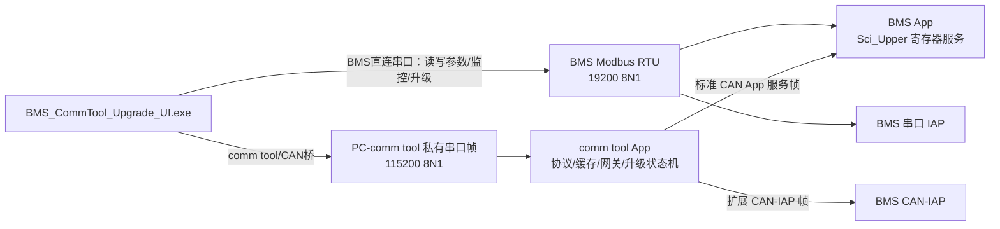
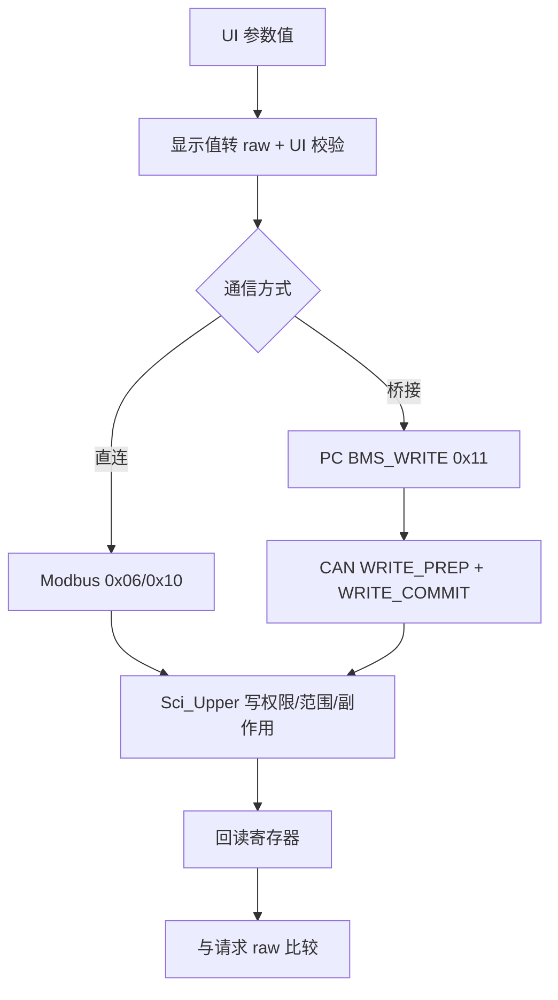
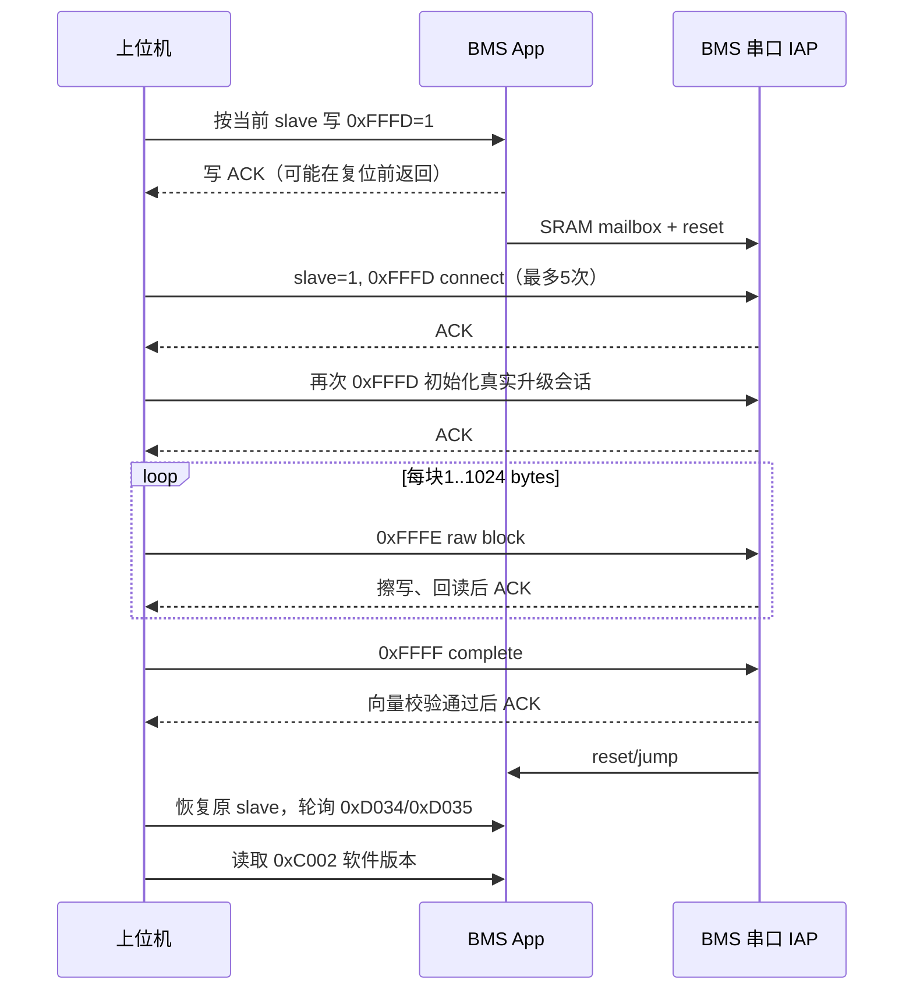

# BMS 新上位机完整设计、协议与维护手册

> 文档状态：CURRENT
>
> 源码验证：FULL（按本文“源码依据”所列当前文件逐项核对）
>
> 适用程序：`dist/BMS_CommTool_Upgrade_UI.exe`
>
> 最后更新时间：2026-06-22
>
> 维护原则：本文与源码冲突时以当前源码为准；修改外部协议、寄存器、Flash 地址或升级流程时必须同步更新本文。

## 1. 文档范围

本文是当前新上位机的统一维护入口，覆盖：

- 用户界面全部功能和使用步骤；
- `BMS直连串口` 与 `comm tool/CAN桥` 两种通信架构；
- PC 与 comm tool 串口协议；
- comm tool 与 BMS App CAN 服务协议；
- BMS Modbus RTU 读写协议；
- BMS 参数的地址、显示换算、写入和回读规则；
- 直连串口 IAP 与 CAN-IAP 的完整升级流程；
- comm tool 固件缓存、线程互斥、日志、诊断、构建发布和维护回归要求。

本文描述的是 `tools/comm_tool_upgrade_ui.py` 当前实际行为，不把旧上位机、历史开发日志或计划中的功能当作现状。

## 2. 源码依据

| 层级 | 当前可信源码 |
| --- | --- |
| 图形上位机 | `tools/comm_tool_upgrade_ui.py` |
| PC 串口公共协议及 CLI | `tools/comm_tool_host.py` |
| comm tool 命令分发 | `firmware/comm_tool_f103ret6/source/app/ct_app.c` |
| comm tool PC 帧协议 | `firmware/comm_tool_f103ret6/source/app/ct_protocol.c/.h` |
| comm tool Modbus 透传 | `firmware/comm_tool_f103ret6/source/app/ct_modbus_bridge.c/.h` |
| comm tool CAN 桥 | `firmware/comm_tool_f103ret6/source/app/ct_can_gateway.c/.h` |
| comm tool 升级状态机 | `firmware/comm_tool_f103ret6/source/app/ct_upgrade_manager.c/.h` |
| comm tool 固件缓存 | `firmware/comm_tool_f103ret6/source/app/ct_flash_store.c/.h` |
| BMS Modbus/寄存器访问 | `103 + 309/Project/Source/Sci_Upper.c/.h` |
| BMS App CAN 服务 | `103 + 309/Project/Source/Can_HDX.c` |
| BMS App 进入 IAP | `103 + 309/Project/Source/AppUpgrade.c`、`Flash.c` |
| BMS IAP 参考工程 | `E:\work\a002\new 030\IAP 103CB` |

相关分协议文档仍可用于专项查阅：

- `docs/protocol/COMM_TOOL_SERIAL_PROTOCOL.md`
- `docs/protocol/BMS_CAN_SERVICE_PROTOCOL.md`
- `docs/protocol/BMS_CAN_IAP_PROTOCOL.md`
- `docs/protocol/modbus_register_map.md`
- `docs/protocol/uart_protocol.md`

## 3. 软件交付物和入口

| 项目 | 路径/值 |
| --- | --- |
| 用户固定 EXE | `dist/BMS_CommTool_Upgrade_UI.exe` |
| GUI 源码 | `tools/comm_tool_upgrade_ui.py` |
| 公共协议/CLI | `tools/comm_tool_host.py` |
| 启动脚本 | `tools/start_comm_tool_upgrade_ui.ps1` |
| 打包脚本 | `tools/build_comm_tool_upgrade_ui_exe.ps1` |
| 默认 BMS App bin | `103 + 309/Project/Users/Objects/FD_Release.bin` |
| 默认 CSV 目录 | `logs/` |

用户上位机只能继续使用 `BMS_CommTool_Upgrade_UI.exe` 这个名称。修改上位机源码后必须重新打包并覆盖 `dist/BMS_CommTool_Upgrade_UI.exe`，不能另建平行 EXE。

## 4. 总体架构



两条路径的关键统一点：

1. 直连模式直接调用 BMS Modbus `0x03/0x06/0x10`。
2. 桥接模式把 PC 的 `BMS_READ/BMS_WRITE` 转成 BMS CAN App 服务帧。
3. BMS CAN App 服务最终调用 `Sci_HostReadWords()` / `Sci_HostWriteWords()`，所以读写权限、范围、副作用与 Modbus 共用同一套 `Sci_Upper.c` 规则。
4. 升级数据路径不同：直连模式不经过缓存，桥接模式先写 comm tool Flash 缓存，再由 comm tool 执行 CAN-IAP。

## 5. 两种通信方式

| 项目 | comm tool/CAN桥 | BMS直连串口 |
| --- | --- | --- |
| PC 串口默认值 | `115200 8N1`，无流控 | `115200 8N1`，无流控；PC 直接接 BMS 时手工改 `19200` |
| PC 下一级设备 | comm tool | BMS App/IAP |
| BMS 选择 | `BMS地址 0..15` | `Modbus地址 1..247`，常用值 1 |
| IAP 目标 | `IAP节点 1..127`，常用值 1 | IAP 固定 Modbus 地址 1 |
| CAN 默认值 | `250000 bit/s` | 不使用 CAN |
| 参数读写 | PC 私有帧 → CAN App 服务 → `Sci_Host*` | Modbus RTU → `Sci_Upper` |
| 一键升级 | 缓存 + CAN-IAP | 直连串口 IAP |
| 使用缓存升级 | 支持 | 不支持 |
| CAN 诊断 | 支持 | 不支持 |
| 实时监控/CSV/日志/参数 | 支持 | 支持 |
| 老化启停/重置/时长 | 支持 | 支持，走寄存器 |

切换通信方式时，UI 默认保持 `115200`。这是为了兼容经 comm tool UART1→USART2 的直连透传路径；如果 PC 直接接 BMS App/IAP 串口，需要手工把波特率改为 `19200`。

从 comm tool 固件 `0.2.3` 开始，`BMS直连串口`还支持一条“经 comm tool 透明转发”的物理路径：

```text
PC 上位机直连模式(Modbus RTU) --115200 8N1--> comm tool 串口1/PC UART
comm tool USART2(PA2=TX, PA3=RX) --19200 8N1--> BMS Modbus 口
```

这条路径的上位机功能仍选择 `BMS直连串口`，协议仍是原始 Modbus RTU；差异只是 PC 不是直接接 BMS，而是接 comm tool 串口1，由 comm tool 把 Modbus 请求经 USART2 发给 BMS，再把 BMS 应答原样返回 PC。由于同一 UART 不能同时工作在两个波特率，直连模式 UI 默认波特率为 `115200`；PC 直接接 BMS 时仍需要手工改为 `19200`。

## 6. 用户界面完整功能

### 6.1 实时监控

- 32 路单体电压；`0` 和 `61001` 视为不存在，不参与最大、最小和平均值计算。
- 总压、充电电流、放电电流、净电流、SOC、SOH、剩余容量、满电容量、出厂容量、循环次数。
- 10 路温度、最高温度、最低温度、MOS 温度。
- 一级告警、二级告警、三级保护、均衡字。
- 扩展实时窗口可用时显示充电 MOS、放电 MOS、加热、冷凝和功能字。
- 页面底部固定显示 BMS 序列号、硬件版本、软件版本。
- 支持开始/停止周期监控，间隔限制为 `1..60 s`。
- 点击停止监控后，主界面实时数据置 0，单体电压区域不显示旧电压。
- 周期监控通信异常时，主界面实时数据置 0，单体电压区域不显示旧电压；长期 CSV 不写入这次失败读数。
- 支持长期 CSV 记录，记录间隔限制为 `2..3600 s`，文件编码为 `UTF-8 with BOM`，便于 Excel 打开。

实时数据优先读 `0xD000` 起 88 words；如果目标固件不支持扩展长度，则回退到 63 words，并缓存本次连接的能力。产品信息从 `0xC002` 读 48 words，成功后缓存 30 秒。

### 6.2 实时数据

以表格显示实时监控中的总压、电流、SOC、SOH、容量、循环、告警字、有效单体电压和温度。`读取一次` 与主实时监控复用相同读数逻辑。

### 6.3 存储信息

- 从 `0xC008` 读取 100 个事件记录 word。
- 当前 UI 分成 5 次、每次 20 words 连续读取，每段最多重试 3 次，重试间隔 0.3 秒。
- 每个 word 高字节为事件号，低字节为相对时间编码。
- 相对时间：`0=NA`，`171=1min以内`，`1..24` 表示小时，`25..168` 显示为天和小时，其它值显示溢出。

### 6.4 参数设置

- SH309 AFE 保护参数：`0x2400..0x2417`，24 words。
- SH309 MOS 过温参数：`0x2132..0x2136`，5 words。
- 其它参数：`0x2300..0x231F`，32 words，其中当前 UI 展示 27 个已定义字段。
- `读取保护参数`、`读取其它参数`、`一键读取`。
- 仅把用户修改过的字段标为 dirty，写入前弹窗列出变更。
- SH309 两个参数块采用“读完整块 → 合并修改 → 整块写回 → 整块回读验证”，避免覆盖同块其它字段。
- 其它参数逐个写入并回读验证。
- `MOS过温重置` 写入当前项目 UI 默认值。
- `保护点重置` 依次写 `0x1006=1` 和 `0x1002=1`，然后重新读取 SH309 参数。

### 6.5 系统状态

- comm tool 固件/协议/CAN/缓存信息，仅桥接模式有实际设备数据。
- comm tool 缓存地址、大小、CRC16、CRC32、有效标志。
- CAN 发送、接收、丢包、错误寄存器和最后收发 ID 诊断，仅桥接模式可用。

### 6.6 其它功能

- 选择并校验 BMS App bin。
- 设置 CAN 波特率、BMS App 地址和 IAP 节点。
- 写一次 SOC：写 `0x1005`，范围 `0..100`。
- 老化模式开启、关闭、累计时间重置、剩余时间读取、总时长设置。
- 读取/写入 comm tool 缓存。
- 一键升级、使用缓存升级、读取 BMS 状态、进入 IAP。
- 高级寄存器读写，地址 `0x0000..0xFFFF`，一次 `1..120` words。

## 7. 上位机内部设计

### 7.1 模块职责

| 模块/类 | 职责 |
| --- | --- |
| `UpgradeUi` | 主窗口、功能编排、参数校验、升级流程、事件处理 |
| `DirectBmsModbusClient` | BMS 直连 Modbus RTU 和旧串口 IAP 帧 |
| `CommToolClient` | PC 与 comm tool 私有串口协议、序号和 ACK 匹配 |
| `BmsMonitorWindow` | 独立实时监控窗口 |
| `comm_tool_host.py` | 协议常量、帧编码、CRC、bin 校验和命令行维护入口 |

### 7.2 线程和串口互斥

- Tk 主线程只更新 UI，不执行长串口事务。
- 普通操作使用一个 daemon worker；同一时刻只允许一个普通任务。
- 实时监控使用独立 live worker。
- 两类 worker 共用 `serial_lock`；任何时刻只能有一个线程打开和操作目标串口。
- worker 通过 `queue.Queue[UiEvent]` 返回结果，主线程每 80 ms 消费事件。
- 普通任务开始后禁用按钮和输入框，避免运行参数中途变化。
- 实时监控遇到普通任务占用串口时不并发抢占，延后下一次轮询。
- 开始升级前自动停止实时监控和 CSV 记录，升级完成后不自动恢复，防止升级期间串口混帧。

### 7.3 连接目标缓存

桥接模式连接键为 `(mode, CAN bitrate, IAP node, BMS CAN address)`；直连模式连接键为 `(mode, COM, baud, Modbus slave)`。目标变化后会清除实时窗口能力缓存和产品信息缓存。

## 8. BMS 直连 Modbus RTU 协议

### 8.1 通用规则

- BMS App/IAP 物理串口默认 `19200 8N1`，无流控；但上位机 `BMS直连串口`模式默认显示 `115200`，用于经 comm tool 透传。
- UI 默认 slave 为 1，可输入 `1..247`；实际值必须与 BMS 配置一致。
- 地址、数量、寄存器值均为网络序/大端。
- CRC 为 CRC16-Modbus，初值 `0xFFFF`，多项式反射值 `0xA001`，帧尾低字节在前。
- 当前 UI 一次最多读写 120 words。

### 8.2 读寄存器 `0x03`

请求：

```text
[slave:1][03][addr_hi][addr_lo][count_hi][count_lo][crc_lo][crc_hi]
```

正常响应：

```text
[slave:1][03][byte_count:1][word0_hi][word0_lo]...[crc_lo][crc_hi]
```

UI 严格校验 slave、功能码、`byte_count == count * 2` 和 CRC。

### 8.3 单寄存器写 `0x06`

当 `count=1` 且地址 `<0x2000` 时，UI 使用 `0x06`：

```text
请求/正常响应：
[slave][06][addr_hi][addr_lo][value_hi][value_lo][crc_lo][crc_hi]
```

典型入口包括 `0x1005` 写 SOC、`0x1008` 重置老化时间、`0x1009` 设置老化时长、`0x1102/0x1103` 功能启停。

### 8.4 多寄存器写 `0x10`

地址 `>=0x2000` 或一次写多个 word 时使用：

```text
请求：
[slave][10][addr_hi][addr_lo][count_hi][count_lo][byte_count]
[word0_hi][word0_lo]...[crc_lo][crc_hi]

正常响应：
[slave][10][addr_hi][addr_lo][count_hi][count_lo][crc_lo][crc_hi]
```

### 8.5 异常响应

```text
[slave][func | 0x80][exception_code][crc_lo][crc_hi]
```

当前 BMS 内部错误含义：

| code | 含义 |
| --- | --- |
| `0x01` | 地址非法 |
| `0x02` | CRC 错误 |
| `0x03` | 数据非法 |
| `0x04` | 命令/当前状态非法 |
| `0x05` | 只读区域拒绝写 |
| `0x06` | 只写区域拒绝读 |
| `0x07` | 无权限 |
| `0x08` | 未知/内部处理失败 |

## 9. PC 与 comm tool 串口协议

### 9.1 帧格式

默认 `115200 8N1`，无流控。除 CRC 字节发送顺序外，所有多字节业务字段均为小端。

| offset | 长度 | 字段 | 说明 |
| --- | ---: | --- | --- |
| 0 | 2 | `magic` | 固定字节 `55 AA`，数值 `0xAA55` |
| 2 | 1 | `version` | 当前 `1` |
| 3 | 1 | `flags` | 响应 bit0=`ACK` |
| 4 | 2 | `seq` | PC 从 1 递增，0 跳过；响应原样回显 |
| 6 | 1 | `cmd` | 命令号 |
| 7 | 1 | `status` | 请求为 0；响应为状态码 |
| 8 | 2 | `length` | payload 字节数，最大 512 |
| 10 | N | `payload` | 命令数据 |
| 10+N | 2 | `crc16` | 覆盖 header+payload，低字节在前 |

响应必须同时满足：版本一致、CRC 正确、`seq` 相同、`cmd` 相同、ACK 标志存在、`status=0`。不匹配的其它帧会被跳过。

### 9.2 状态码

| status | 含义 |
| --- | --- |
| `0x00` | OK |
| `0x01` | CRC_ERROR |
| `0x02` | UNSUPPORTED |
| `0x03` | BAD_PARAM |
| `0x04` | BAD_STATE，升级中禁止当前命令 |
| `0x05` | FLASH_ERROR |
| `0x06` | CAN_TIMEOUT |
| `0x07` | BMS_ERROR，BMS 拒绝、地址/范围/权限错误或内部处理失败 |

### 9.3 当前命令和 payload

| cmd | 名称 | 请求 payload | 成功响应 payload |
| --- | --- | --- | --- |
| `0x01` | `GET_INFO` | 空 | 24 bytes，见下文 |
| `0x02` | `SET_CAN` | `bitrate:u32 node:u8 app_addr:u8 reserved:u16` | 空 |
| `0x10` | `BMS_READ` | `addr:u16 count:u16` | `count` 个 `u16_le` |
| `0x11` | `BMS_WRITE` | `addr:u16 count:u16 words[count]:u16_le` | 空 |
| `0x12` | `BMS_AGING_CTRL` | `action:u8` | `state:u8 remaining_hours:u8` |
| `0x13` | `BMS_AGING_STATUS` | 空 | `state:u8 remaining_minutes:u16_le` |
| `0x14` | `BMS_AGING_SET_HOURS` | `hours:u16_le` | `state:u8 remaining_hours:u8 applied_hours:u16_le` |
| `0x20` | `FW_BEGIN` | `app_addr:u32 size:u32 crc16:u16 crc32:u32` | 空 |
| `0x21` | `FW_DATA` | `offset:u32 data[n]` | 空 |
| `0x22` | `FW_END` | `size:u32 crc16:u16 crc32:u32` | 空 |
| `0x23` | `FW_INFO` | 空 | `app_addr:u32 size:u32 crc16:u16 crc32:u32 valid:u8` |
| `0x30` | `ENTER_IAP` | 空 | 空 |
| `0x31` | `UPGRADE` | 空 | 空，实际进度异步查询 |
| `0x32` | `UPGRADE_STATUS` | 空 | 13 bytes，见下文 |
| `0x33` | `UPGRADE_ABORT` | 空 | 空 |
| `0x40` | `RAW_CAN_TX` | 协议号已保留 | 当前 `ct_app.c` 未分发，实际返回 `UNSUPPORTED` |
| `0x41` | `CAN_DIAG` | `clear:u8` | 64 bytes |
| `0x42` | `DEBUG_LOG` | `max_entries:u8 clear_after_read:u8` | 6-byte header + N×12-byte entry |

`GET_INFO` 响应：

| offset | 长度 | 含义 |
| --- | ---: | --- |
| 0 | 4 | `protocol, fw_major, fw_minor, fw_patch` |
| 4 | 4 | CAN bitrate |
| 8 | 4 | 缓存基地址，当前 `0x08018000` |
| 12 | 4 | 缓存容量 |
| 16 | 4 | flags；当前 bit0 表示 debug log 是否启用 |
| 20 | 1 | IAP node |
| 21 | 1 | BMS App CAN address |
| 22 | 2 | reserved |

`UPGRADE_STATUS` 响应：

```text
state:u8 percent:u8 last_error:u8 written:u32 total:u32 expect_seq:u16
```

状态为 `0=IDLE, 1=RUNNING, 2=DONE, 3=ERROR, 4=ABORTED`。

`CAN_DIAG` 响应：

| offset | 长度 | 含义 |
| --- | ---: | --- |
| 0 | 4 | `tx_count` |
| 4 | 4 | `tx_ok` |
| 8 | 4 | `tx_fail` |
| 12 | 4 | `tx_timeout` |
| 16 | 4 | `rx_count` |
| 20 | 4 | `rx_drop` |
| 24 | 4 | `last_esr` |
| 28 | 4 | `last_tsr` |
| 32 | 4 | `last_msr` |
| 36 | 4 | `last_rf0r` |
| 40 | 4 | `last_tx_id` |
| 44 | 4 | `last_rx_id` |
| 48 | 1 | `last_tx_ide` |
| 49 | 1 | `last_tx_dlc` |
| 50 | 1 | `last_tx_status` |
| 51 | 1 | `last_rx_ide` |
| 52 | 1 | `last_rx_dlc` |
| 53 | 8 | `last_rx_data` |
| 61 | 1 | 当前 IAP node |
| 62 | 1 | 当前 BMS App CAN address |
| 63 | 1 | reserved |

`DEBUG_LOG` 响应 header：`enabled:u8 count:u8 capacity:u8 entry_size:u8 dropped:u16_le`。随后每条 12 bytes：`seq:u16_le tick_ms:u32_le module:u8 event:u8 value0:u16_le value1:u16_le`。Release 默认关闭记录，Debug profile 默认启用；`clear_after_read!=0` 表示编码响应后清空环形日志。

升级期间 comm tool 只允许 `GET_INFO`、`FW_INFO`、`UPGRADE_STATUS`、`UPGRADE_ABORT`、`CAN_DIAG`、`DEBUG_LOG`；其它命令返回 `BAD_STATE`。

### 9.6 原始 Modbus 透传到 USART2

comm tool App `0.2.3` 新增 `ct_modbus_bridge.*`，让 PC 侧同一串口同时具备两类入口：

- `55 AA` 开头的帧按上文 PC-comm tool 私有协议处理，不进入 Modbus 透传。
- 非私有帧按 Modbus RTU 解析；只接受 BMS 当前使用的 `0x03`、`0x06`、`0x10`。
- 请求 CRC16-Modbus 正确后，原样写入 USART2；USART2 硬件固定为 `PA2=TX`、`PA3=RX`、`19200 8N1`。
- BMS 正常应答或异常应答 CRC 正确后，原样通过 PC UART 返回上位机。
- PC 侧 UART 仍保持 comm tool 默认 `115200 8N1`，所以 UI 直连模式默认波特率就是 `115200`，可直接用于经 comm tool 透传。
- 直连串口 IAP 的 `0x10 / 0xFFFE` 数据块允许 `byte_count=0`，真实数据长度取 count 字段，最大支持 1024 bytes；桥接缓冲上限按 1040-byte RTU 帧设计。
- PC 请求帧间隔超时 100 ms；BMS 应答字节间隔超时 100 ms；单次 BMS 应答总等待 3000 ms。超时不构造代理异常帧，上位机按串口超时处理。

安全边界：App 运行态下，PC 原始 Modbus `0xFFFD` 优先透传给 BMS，不再作为 comm tool 自身串口 IAP 入口处理。否则 BMS 直连 IAP 的进入命令会误触发 comm tool 自身复位。comm tool 自身升级仍保留 CAN App `ENTER_IAP` 入口和 IAP 固件侧串口升级能力。

## 10. comm tool 与 BMS App CAN 服务协议

### 10.1 CAN ID 和通用帧

使用标准帧：

| 方向 | ID |
| --- | --- |
| comm tool → BMS App | `(app_can_addr << 7) | 0x60` |
| BMS App → comm tool | `(app_can_addr << 7) | 0x61` |

请求固定 8 bytes：

```text
A5 5A cmd arg0 arg1 arg2 crc_hi crc_lo
```

响应固定 8 bytes：

```text
5A A5 cmd status value0 value1 crc_hi crc_lo
```

CAN 服务帧中的 CRC16 按高字节、低字节发送，这一点与 Modbus RTU 帧尾顺序相反。

### 10.2 命令

| cmd | 名称 | arg0..2 | 成功返回 value0..1 |
| --- | --- | --- | --- |
| `0x01` | `GET_STATUS` | `00 00 00` | SOC, SOH |
| `0x02` | `ENTER_IAP` | `C3 3C app_can_addr` | `08 48` |
| `0x03` | `READ_REG` | `addr_hi addr_lo 00` | `value_hi value_lo` |
| `0x04` | `WRITE_PREP` | `addr_hi addr_lo value_hi` | 地址回显 |
| `0x05` | `WRITE_COMMIT` | `addr_hi addr_lo value_lo` | `00 00` |
| `0x06` | `READ_BLOCK` | `addr_hi addr_lo count` | `count 00`，随后数据帧 |
| `0x07` | `AGING_START` | `A9 51 app_can_addr` | state, remaining_hours |
| `0x08` | `AGING_STOP` | `A9 50 app_can_addr` | state, remaining_hours |
| `0x09` | `AGING_RESET_TIME` | `A9 5A app_can_addr` | state, remaining_hours |
| `0x0A` | `AGING_SET_HOURS` | `A9 hours app_can_addr` | state, remaining_hours |

块读数据仍使用响应 ID：

```text
5A A5 86 seq value_hi value_lo crc_hi crc_lo
```

### 10.3 读流程

1. comm tool 清理遗留 CAN RX 帧。
2. 发 `READ_BLOCK`，范围 `1..120` words。
3. BMS 返回 ACK，其中 `value0=count`。
4. BMS 逐 word 返回 `0x86` 数据帧，`seq` 从 0 开始。
5. comm tool 允许乱序到达，按 `seq` 去重和组装；总等待上限 6 秒。
6. 如果目标不支持块读且数量 `<=4`，comm tool 回退为逐寄存器 `READ_REG`；大于 4 不回退。
7. comm tool 把结果转换成 PC 协议的小端 word 数组。

### 10.4 写流程

每个 word 都分成两次 CAN 事务：

1. `WRITE_PREP(addr, value_hi)`，等待 ACK。
2. `WRITE_COMMIT(addr, value_lo)`，等待 ACK。
3. 多 word 写按地址递增逐个执行。
4. BMS App 在主循环调用 `Sci_HostWriteWords()`，复用 Modbus 的权限、范围、持久化和副作用处理。

App 服务请求每 100 ms 可重发一次；普通寄存器 ACK 等待 1 秒，进入 IAP 等待 5 秒，老化命令等待 2 秒。

## 11. BMS 参数读写设计

### 11.1 统一调用链



### 11.2 显示值和 raw 换算

| kind | 显示 | 写入 raw |
| --- | --- | --- |
| `u16` | `raw` | 输入整数 |
| `temp` | `raw / 10 - 40` ℃ | `(℃ + 40) * 10`，四舍五入 |
| `x10` | `raw / 10` | 显示值 × 10，四舍五入 |
| `ms10` | `raw * 10` ms | 显示 ms ÷ 10，四舍五入 |

转换后的 raw 必须在 `0..65535`。

### 11.3 SH309 AFE 参数 `0x2400..0x2417`

| 地址 | 字段 | kind/单位 |
| --- | --- | --- |
| `0x2400` | 单节过压 | u16/mV |
| `0x2401` | 过压恢复 | u16/mV |
| `0x2402` | 过压延时 | ms10/ms |
| `0x2403` | 单节低压 | u16/mV |
| `0x2404` | 低压恢复 | u16/mV |
| `0x2405` | 低压延时 | ms10/ms |
| `0x2406` | 一级充电过流 | x10/A |
| `0x2407` | 一级充电过流延时 | ms10/ms |
| `0x2408` | 二级充电过流 | x10/A |
| `0x2409` | 二级充电过流延时 | ms10/ms |
| `0x240A` | 一级放电过流 | x10/A |
| `0x240B` | 一级放电过流延时 | ms10/ms |
| `0x240C` | 二级放电过流 | x10/A |
| `0x240D` | 二级放电过流延时 | ms10/ms |
| `0x240E` | 充电高温 | temp/℃ |
| `0x240F` | 充电高温恢复 | temp/℃ |
| `0x2410` | 充电低温 | temp/℃ |
| `0x2411` | 充电低温恢复 | temp/℃ |
| `0x2412` | 放电高温 | temp/℃ |
| `0x2413` | 放电高温恢复 | temp/℃ |
| `0x2414` | 放电低温 | temp/℃ |
| `0x2415` | 放电低温恢复 | temp/℃ |
| `0x2416` | 短路电流 | u16/A |
| `0x2417` | 短路延时 | u16/µs |

### 11.4 SH309 MOS 过温参数 `0x2132..0x2136`

| 地址 | 字段 | kind/单位 |
| --- | --- | --- |
| `0x2132` | MOS过温1 | temp/℃ |
| `0x2133` | MOS过温2 | temp/℃ |
| `0x2134` | MOS过温3 | temp/℃ |
| `0x2135` | MOS恢复 | temp/℃ |
| `0x2136` | 延时 | u16/10ms |

UI 的 `MOS过温重置` 显示默认值依次为 `75, 85, 95, 80, 100`。

### 11.5 其它参数 `0x2300..0x231F`

| 地址 | 字段 | kind/单位 |
| --- | --- | --- |
| `0x2300` | 均衡开启电压 | u16/mV |
| `0x2301` | 均衡开启压差 | u16/mV |
| `0x2302` | 均衡关闭压差 | u16/mV |
| `0x2308` | 充电短路范围 | x10/A |
| `0x2309` | 放电短路范围 | x10/A |
| `0x230A` | 短路延时 | x10/ms |
| `0x230B` | 短路电流 | x10/A |
| `0x230C` | SOC曲线选择 | u16/raw |
| `0x230D` | 永久密码 | u16/raw |
| `0x230E` | 限流压差 | u16/mV |
| `0x230F` | 限流电流 | x10/A |
| `0x2310` | 正常休眠电压 | u16/mV |
| `0x2311` | 正常休眠时间 | u16/min |
| `0x2312` | 过放休眠电压 | u16/mV |
| `0x2313` | 过放休眠时间 | u16/min |
| `0x2314` | 充电电流过滤 | x10/A |
| `0x2315` | 放电电流过滤 | x10/A |
| `0x2316` | RTC唤醒时间 | u16/min |
| `0x2317` | RTC休眠时间 | u16/min |
| `0x2318` | 容量 | x10/Ah |
| `0x2319` | 循环次数 | u16/次 |
| `0x231A` | SOC_100电压 | u16/mV |
| `0x231B` | SOC_0电压 | u16/mV |
| `0x231C` | 电池串数 | u16/串 |
| `0x231D` | 采样电阻 | u16/mΩ |
| `0x231E` | 采样电阻数 | u16/个 |
| `0x231F` | 预充时间 | u16/s |

`0x2303..0x2307` 当前未在 UI 定义；高级寄存器功能可以访问，但不能绕过板端权限和范围校验。

### 11.6 SH309 写入保护

- 写 AFE 块前必须已经读取完整 24-word 块、`0x231D` 采样电阻和 `0x231E` 采样电阻数。
- 写 MOS 块前必须已经读取完整 5-word 块。
- 采样电阻参数不能与 SH309 AFE 过流/短路参数同批写；应先写系统参数，再重新读取保护参数。
- UI 校验过压 ≥ 过压恢复、低压 ≤ 低压恢复、高温 ≥ 高温恢复、低温 ≤ 低温恢复。
- 二级过流和短路电流可选值根据采样电阻实时换算，必须从当前组合框列表选择。
- 所有正常参数写入后都回读；不一致立即报错，不显示虚假成功。

## 12. 实时数据、产品信息和老化协议

### 12.1 `0xD000` 实时窗口

当前 UI 使用的主要 word 偏移：

| 偏移 | 内容 | 换算 |
| --- | --- | --- |
| 0..31 | 单体 1..32 | mV，0/61001 无效 |
| 32..36 | 最大/最小/位置/压差 | 原始 word |
| 37 | 总压 | raw/100 V |
| 38..46 | 温度 1..9 | raw/10-40 ℃ |
| 47 | MOS 温度（`MOS_TEMP1`） | raw/10-40 ℃ |
| 48..49 | 最高/最低温度 | raw/10-40 ℃ |
| 50..51 | 充电/放电电流 | raw/10 A |
| 52..53 | SOC/SOH | % |
| 54..56 | 当前/满电/出厂容量 | 主界面按 raw×10 mAh；摘要按 raw/100 Ah |
| 57 | 循环次数 | 次 |
| 58..60 | 一级/二级/三级故障字 | bit 字段 |
| 61..62 | 均衡低/高字 | bit 字段 |
| 84 / `0xD115` | 系统状态低字，扩展窗口存在时 | bit2 充电MOS，bit3 放电MOS，bit8 加热，bit9 冷凝 |
| 86 / `0xD117` | 功能字，扩展窗口存在时 | bit 字段 |

实时监控优先读取 `0xD000` 的 88 字完整窗口；若整窗口读取失败，会退回 `0xD000` 的 63 字基础窗口，并补读 `0xD115` 的 4 个状态/功能字，保证系统状态灯仍按真实状态字显示。若补读状态字也失败，通信成功的快照进入兼容显示：充/放电 MOS 按充/放电电流是否大于 0 判断，加热和冷凝显示 `off`；灰色 `--` 只用于未通信、停止监控或通信异常清屏。

`读取BMS状态` 单独读取 `0xD034/0xD035`，即 SOC/SOH。

故障字 bit 显示表（bit0..bit15）依次为：单体过压、单体欠压、总压过压、总压欠压、充电过流、放电过流、充电高温、放电高温、充电低温、放电低温、压差过大、温差过大、SOC低、MOS过温、保留1、保留2。

### 12.2 `0xC002` 产品信息

- 固定读取 48 words = 96 bytes。
- 数据按每个 word 高字节在前还原字节流。
- 三个字段依次为 32-byte 序列号、32-byte 硬件版本、32-byte 软件版本。
- 尾部 `0x00`、`0xFF` 和空格被去除，ASCII 非法字节忽略。

### 12.3 老化功能

| 操作 | 桥接模式 | 直连模式 |
| --- | --- | --- |
| 开启 | PC `0x12 action=0x51` → CAN `0x07` | 写 `0x1102=7` |
| 关闭并提前完成 | PC `0x12 action=0x50` → CAN `0x08` | 写 `0x1103=7` |
| 重置累计时间 | PC `0x12 action=0x5A` → CAN `0x09` | 写 `0x1008=0x005A` |
| 设置总时长 | PC `0x14 hours` → CAN `0x0A` | 写 `0x1009=hours` |
| 读取剩余时间 | PC `0x13` 等待 `0x14F80208` 广播 | 读 `0xC080` 5 words |

时长范围固定为 `1..168 h`。直连 `0xC080` 布局：

```text
state, remaining_minutes, remaining_seconds_hi, remaining_seconds_lo, duration_hours
```

桥接读取来自扩展 CAN 广播 `0x14F80208`：byte2 为 state，byte3..4 为大端 remaining_minutes。comm tool 最多等待 6.5 秒，因此点击后不是立即返回属于正常现象。

### 12.4 事件记录编号

| ID | 事件 | ID | 事件 |
| ---: | --- | ---: | --- |
| 0 | NA | 11 | 放电过流保护 |
| 1 | BMS开机 | 12 | 充电低温保护 |
| 2 | BMS休眠 | 13 | 放电低温保护 |
| 3 | 均衡开启 | 14 | 充电高温保护 |
| 4 | 保留4 | 15 | 放电高温保护 |
| 5 | 保留5 | 16 | 压差过大保护 |
| 6 | 单节过压保护 | 17 | 短路保护 |
| 7 | 总压过压保护 | 18 | AFE1报错 |
| 8 | 充电过流保护 | 19 | AFE2报错 |
| 9 | 单节低压保护 | 20 | EEPROM报错 |
| 10 | 总压低压保护 |  |  |

## 13. 固件文件与 Flash 安全边界

上位机在发送前检查：

1. 文件存在且至少 8 bytes。
2. App 基地址固定 `0x08004800`，绝不允许用该程序把 BMS App 当作 `0x08000000` 镜像。
3. 初始 MSP 位于 `0x20000000..0x20010000`。
4. ResetHandler Thumb bit 为 1，去掉 Thumb bit 后位于当前 App 镜像范围。
5. CAN-IAP 通用镜像不得越过 `0x08020000`。
6. 直连串口 IAP 进一步限制不得越过 `0x0801F800`，可用 App 空间为 `0x1B000` bytes。

仓库烧录安全规则保持不变：裸 `FD_Release.bin` 只能从 `0x08004800` 写入，不能写到 `0x08000000` 覆盖 IAP。

## 14. comm tool 缓存下载协议

桥接模式一键升级先执行：

1. 计算整包 CRC16-Modbus 和 CRC32。
2. `FW_BEGIN(0x08004800, size, crc16, crc32)`；comm tool 擦除并初始化缓存元数据。
3. 按默认 496 bytes 分块发送 `FW_DATA(offset, data)`；496 + 4-byte offset = 500-byte payload，低于 512 上限。
4. `FW_END(size, crc16, crc32)`；comm tool 回读校验缓存，校验失败时 `valid=0`。
5. 上位机调用 `FW_INFO`，要求地址、大小、CRC16、CRC32 和 `valid=1` 全部与本地文件一致。
6. 只有缓存验证通过才允许进入 CAN-IAP。

`使用缓存升级` 仍要求用户选择本地 bin；它只是在缓存信息与本地文件完全一致时跳过串口下载，不允许盲目升级未知缓存。

### 14.1 PA6 离线触发缓存升级

comm tool App `0.2.3` 新增 PA6 离线升级按键：

- 硬件：`PA6` 配置为上拉输入，低电平有效。
- 触发条件：低电平稳定超过 60 ms，且本机 Flash 缓存中存在有效 BMS App 包。
- 缓存限制：只接受 `app_addr=0x08004800` 的 BMS App 包；如果缓存无效、大小为 0 或缓存的是 comm tool 自身 App，按键不会启动升级。
- 目标参数：使用当前运行时 `IAP node` 和 `BMS App CAN address`。这些值来自上位机 `SET_CAN`，断电后回到默认 `node=1`、`app_can_addr=0`。
- 执行动作：调用同一套 `CtUpgrade_StartWithAppAddress()` 状态机，从缓存通过 CAN-IAP 发给 BMS；不会重新从 PC 下载。
- 防重复：一次按下只触发一次；松开后再次按下才会重试。

典型使用：

1. PC 连接 comm tool，选择 `comm tool/CAN桥`，设置 CAN 波特率、BMS 地址和 IAP 节点。
2. 选择 BMS App bin，点击 `写入缓存`，确认缓存地址、大小、CRC16、CRC32、`valid=1`。
3. 断开 PC 或关闭上位机，comm tool 保持供电并连接目标 CAN 总线。
4. 按下 PA6，让输入为低电平超过 60 ms。
5. comm tool 从缓存启动 CAN-IAP；LED 仍按 App 心跳闪烁，具体进度只能通过重新连接上位机读取 `UPGRADE_STATUS` 或查看 CAN 总线。

批量边界：PA6 只是脱离 PC 后复用现有 CAN-IAP 帧发送逻辑，不提供设备枚举或逐台结果统计。如果同一 CAN 总线上有多台 BMS 同时响应同一 App CAN 地址/IAP node，所有设备必须收到完全相同帧并保持相同 ACK 行为；否则 ACK 冲突或个别失败无法被 comm tool 精确区分。量产批量升级应先在夹具上验证 CAN 拓扑、节点一致性和失败处置流程。

### 14.3 comm tool App/IAP 看门狗

comm tool App 和 comm tool IAP 默认启用 IWDG，配置位于 `ct_config.h`：

- `CT_WATCHDOG_ENABLE=1`：默认启用。
- `CT_WATCHDOG_RELOAD_VALUE=1875`：IWDG prescaler 256，按 40 kHz LSI 典型值约 12 秒。
- App 在 `Board_Init()` 后启动 IWDG，主循环喂狗。
- IAP 只在确认停留 IAP 后启动 IWDG；正常直接跳 App 前不启动。
- Flash 擦页、Flash 半字写入、串口响应延迟、CAN 发送等待等阻塞点必须保留喂狗，避免正常升级被误复位。
- 不允许在真实死循环或无界异常等待中补喂狗，否则看门狗失去恢复卡死的意义。

## 15. 直连串口 IAP 协议和流程

### 15.1 专用帧

直连 IAP 复用 `0x10` 外形，但 `0xFFFE` 有历史兼容特例。

连接/完成帧：

```text
[slave=1][10][addr=FFFD或FFFF][declared_length=0001][byte_count=02][00 00][crc]
```

数据帧：

```text
[slave=1][10][addr=FFFE][raw_byte_length:u16_be][byte_count=00]
[raw bytes，1..1024][crc_lo][crc_hi]
```

这里长度字段表示原始字节数，不是标准 Modbus 寄存器数量；`byte_count=0` 是旧协议约定。正常 ACK 仍为标准 8-byte 写回显：

```text
[slave][10][addr_hi][addr_lo][length_hi][length_lo][crc_lo][crc_hi]
```

NACK 是 5 bytes：`[slave][90][code][crc_lo][crc_hi]`。

### 15.2 完整时序



细节：

- App 进入 IAP 后等待 1 秒，IAP slave 固定切换为 1。
- 连接检测最多 5 次，间隔 0.5 秒，单次 ACK 超时 3 秒。
- 第一个连接 ACK 可能来自地址恰好为 1 的 App，因此等待后必须第二次连接，确保从第 0 块建立全新会话。
- 分块大小 1024 bytes；最后一块可不足 1024。
- 数据块没有块序号。任一块 ACK 超时或 NACK 后严禁原地重发，否则 IAP 写指针可能错位；UI 立即停止并要求从连接和第 0 块重新升级。
- 完成后恢复原 App slave，最多等待约 15 秒确认 SOC/SOH，再读取软件版本。
- 当前串口 IAP 无公开整包 CRC 字段；完整性依赖每帧 Modbus CRC、Flash 半字回读和最终 App 向量校验。

## 16. CAN-IAP 协议和流程

### 16.1 CAN ID

全部为扩展帧：

| 方向 | ID |
| --- | --- |
| comm tool → BMS IAP 控制 | `0x14F8F000 | node` |
| BMS IAP → comm tool ACK/NACK | `0x14F8F100 | node` |
| comm tool → BMS IAP 数据 | `0x14000000 | (seq << 8) | node` |

### 16.2 控制命令

多字节字段为大端。

| cmd | 8-byte payload |
| --- | --- |
| `HELLO=0x01` | `01 version node FF FF FF FF FF` |
| `START=0x02` | `02 version size:u32 crc16:u16` |
| `COMMIT=0x03` | `03 block_seq:u16 block_len:u16 block_crc:u16 FF` |
| `END=0x04` | `04 frame_count:u16 crc16:u16 FF FF FF` |
| `ABORT=0x05` | `05 reason FF FF FF FF FF FF` |
| `ACK=0x79` | `79 cmd state expect_seq:u16 code FF FF` |
| `NACK=0x1F` | `1F cmd code/state expect_seq:u16 code FF FF` |

成功必须满足 ACK 的原命令匹配且 byte5 `code=0`；byte2 是 IAP 状态，不应误当错误码。

### 16.3 comm tool 升级状态机

1. 先向 IAP 节点快速发 HELLO，700 ms 窗口内每 250 ms 重试；若目标本来就在 IAP，可直接继续。
2. 未收到 HELLO ACK 时，按 BMS App CAN 地址发 `ENTER_IAP`。
3. 等待 1200 ms 启动窗口。
4. 在 8 秒内每 250 ms 重发 HELLO，仍失败则 `last_error=0x02`。
5. 发 START，包含缓存 size 和整包 CRC16，等待 2 秒 ACK。
6. 每块最多 256 bytes，即 32 个 8-byte 数据帧；不足 8 bytes 的最后帧以 `0xFF` 补齐，但 block CRC 只覆盖真实长度。
7. 数据帧 `seq` 从 0 全局递增；每块后发 COMMIT，包含 block_seq、真实 block_len、block_crc，等待 2 秒 ACK。
8. BMS IAP 只有块 CRC 正确才写 Flash，并在写入后回读校验。
9. 全部完成后发 END，包含总 frame_count 和整包 CRC16，等待 5 秒 ACK。
10. IAP 校验整包 CRC、MSP、ResetHandler 和 App 范围后才标记有效并启动 App。
11. 上位机每 250 ms 查询 `UPGRADE_STATUS`，总等待上限 180 秒；完成后再等待 BMS App 状态恢复。

START 后 BMS IAP 会清除 App 有效状态；升级中断后设备应停留在 IAP，必须重新执行完整升级。当前 PC `UPGRADE_ABORT(0x33)` 只让 comm tool 本地升级状态机停止，没有向 BMS IAP 发送 CAN `ABORT(0x05)`，因此不能把“已终止”理解为 BMS 已恢复原 App。

常见 `last_error`：

| error | 含义 |
| --- | --- |
| `0x01` | 缓存无效、地址不允许或目标类型不匹配 |
| `0x02` | HELLO 失败 |
| `0x03` | START 发送/ACK 失败 |
| `0x04` | 读取缓存块失败 |
| `0x05` | CAN 数据帧发送失败 |
| `0x06` | COMMIT 发送/ACK 失败 |
| `0x07` | END 发送/ACK 失败 |
| `0x21` | BMS App ENTER_IAP 失败 |
| `0x22` | 状态机落入非法 phase |

### 16.4 多设备安全要求

- 上位机在线单目标升级时，`BMS地址` 必须唯一，App 阶段只允许选中的 BMS 响应并进入 IAP。
- 上位机在线单目标升级时，IAP 阶段 `node` 也必须唯一。
- PA6 离线批量升级允许夹具把多台同型号 BMS 接到同一 CAN-IAP 帧流，但 comm tool 仍无法枚举设备或区分单台失败；必须保证多台设备 ACK 行为一致，并在量产夹具上验证失败处置。
- 设置目标时 UI 限制 BMS 地址 `0..15`、IAP node `1..127`。

## 17. 使用步骤

### 17.1 首次连接检查

1. 关闭可能占用串口的其它程序。
2. 打开 `dist/BMS_CommTool_Upgrade_UI.exe`。
3. 在实时监控页选择通信方式和 COM 口。
4. 桥接模式使用 115200，并确认 CAN 波特率、BMS 地址和 IAP 节点；PC 直接接 BMS 的直连模式使用 19200；经 comm tool UART1→USART2 透传的直连模式使用 115200，并确认 Modbus 地址。
5. 点击 `开始监控` 或在 `实时数据` 页点击 `读取一次`。
6. 直连模式应读出实时数据和产品信息；桥接模式应经 comm tool 读出 BMS 实时数据。

### 17.2 读取和写入参数

1. 先点击 `读取保护参数`、`读取其它参数` 或 `一键读取`。
2. 修改界面中的目标字段，确认 dirty 数量。
3. SH309 过流/短路值必须从组合框选择；若要改采样电阻，先单独改系统参数并写入，再重新读取保护参数。
4. 点击 `写入修改`，核对确认框。
5. 只有写入和回读完全一致才显示成功。

高级寄存器写入不提供参数语义保护，只适合已知地址的开发调试；不得以“能写成功”代替参数边界验证。

### 17.3 实时监控和 CSV

1. 点击 `开始监控`，建议间隔 2 秒或更慢。
2. 设置记录间隔和文件后点击 `开始记录`；记录会自动启动监控。
3. Excel 打开 CSV 时可能锁定文件；记录期间不要用独占方式打开。
4. 停止监控会同步停止记录，并清空主界面实时显示。
5. 开始升级会自动停止监控和记录。

### 17.4 桥接模式一键升级

1. 只选择从 `0x08004800` 链接生成的 `FD_Release.bin`。
2. 设置正确的 BMS 地址、IAP 节点和 CAN 波特率，点击 `应用设置`。
3. 点击 `校验文件`，确认向量、大小和 CRC。
4. 点击 `一键升级`。
5. 观察阶段：写入缓存 → 缓存校验 → 进入 CAN-IAP → 块传输 → END → App 恢复。
6. 成功后再次读取产品信息，确认软件版本。

若使用 `使用缓存升级`，必须选择与缓存完全相同的本地 bin；UI 会比较地址、大小、CRC16、CRC32、valid 后才启动。

### 17.5 PA6 离线缓存升级

1. 桥接模式下先点击 `写入缓存`，确认缓存有效。
2. 设置并应用目标 CAN 波特率、BMS 地址和 IAP 节点；如果随后不断电，这些运行时参数会用于 PA6 离线升级。
3. 断开 PC 后保持 comm tool 和 BMS 供电，确认 CAN 连接和终端电阻。
4. 按下 PA6，低电平保持超过 60 ms。
5. 升级过程中不要再次按键、断电或改变 CAN 总线。
6. 如需确认结果，重新连接上位机后读取 `UPGRADE_STATUS` 和 BMS 产品软件版本。

如果 comm tool 断电重启后再按 PA6，CAN 参数恢复默认值：`250000 bit/s`、`IAP node=1`、`BMS App CAN address=0`。

### 17.6 直连串口一键升级

1. 选择 `BMS直连串口`，确认 App 当前 Modbus 地址。PC 直接接 BMS 时用 19200；经 comm tool UART1→USART2 透传时，PC 侧波特率手工改为 115200。
2. 选择并校验 `FD_Release.bin`。
3. 点击 `一键升级`；不要手工先点多次 `进入IAP`。
4. 升级过程中禁止断电、拔串口或启动其它通信工具。
5. 任一数据块失败后重新执行完整一键升级，不能只重发失败块。
6. 完成后确认 App 恢复和软件版本。

## 18. 启动、测试和发布

### 18.1 源码启动

```powershell
py -3.9 -m pip install pyserial
py -3.9 tools\comm_tool_upgrade_ui.py
```

可选参数：

| 参数 | 说明 |
| --- | --- |
| `--port COM4` | 可选，指定初始串口；不传时串口栏保持空白，由用户手动选择 |
| `--baud 115200` | 初始波特率；不传时按 mode 选择默认值 |
| `--bin path` | 初始 BMS App bin |
| `--mode comm_tool` | 初始桥接模式 |
| `--mode direct_bms` | 初始直连模式 |
| `--slave 1` | 初始 Modbus 地址 |
| `--self-test` | 运行协议和 UI 基础自测后退出 |

启动脚本：

```powershell
.\tools\start_comm_tool_upgrade_ui.ps1 -Baud 115200
```

### 18.2 修改后的最小验证

```powershell
py -3.9 -m py_compile tools\comm_tool_host.py tools\comm_tool_upgrade_ui.py
py -3.9 tools\comm_tool_upgrade_ui.py --self-test
```

自测覆盖参数定义数量、显示/raw 换算、Modbus CRC、直连 IAP 连接/1024-byte 数据/NACK、App 区边界、两种连接键和 CSV 列数。

### 18.3 打包发布

```powershell
powershell -ExecutionPolicy Bypass -File tools\build_comm_tool_upgrade_ui_exe.ps1 -Clean
```

要求：

- 打包前关闭正在运行的 `BMS_CommTool_Upgrade_UI.exe`，否则 Windows 会锁文件。
- 输出必须为 `dist/BMS_CommTool_Upgrade_UI.exe`。
- 修改用户上位机源码后不得只提交 Python 源码而不更新 EXE。

## 19. 故障定位

| 现象 | 优先检查 |
| --- | --- |
| 串口打不开 | COM 是否正确、是否被其它程序占用、驱动是否正常 |
| PC 直接接 BMS 直连全部超时 | 是否误用 115200、Modbus 地址是否一致、A/B 线和地是否正确；直接接 BMS 应用 19200 |
| 经 comm tool 透传直连全部超时 | 是否手工改成了 19200；经 comm tool 透传时 PC 侧必须用 115200，BMS 侧 USART2 固定 19200 |
| 桥接 GET_INFO 超时 | PC 是否连接到 comm tool 通信 UART、应为 115200、App/IAP 串口配置是否一致 |
| 桥接读 BMS 返回 CAN_TIMEOUT | CAN 波特率、终端电阻、BMS 地址、BMS 是否低功耗、RX/TX 计数 |
| PA6 按下无反应 | 缓存是否 valid、缓存地址是否 `0x08004800`、PA6 是否真正拉低、是否在升级运行中、断电后 CAN 参数是否恢复默认 |
| 桥接读少量寄存器成功、大块失败 | BMS App 是否支持 READ_BLOCK、总线拥塞、`0x86` 数据帧是否丢失 |
| 写参数返回 BMS_ERROR/异常 0x07 | `PROJECT_CFG_HOST_WRITE_ENABLE`、地址范围、值范围、只读属性 |
| SH309 提示缺少完整参数 | 先读取保护参数；不得在未知块内容时整块写 |
| 读取老化时间等待较久 | 桥接模式依赖 5 秒周期的 `0x14F80208`，命令最长约 6.5 秒 |
| CAN 升级 `error=0x21` | BMS App 地址不对、App 未响应 ENTER_IAP、总线上地址不唯一 |
| CAN 升级 `error=0x02` | IAP 未启动、IAP node 不一致、多个相同 node、CAN 时序/接线 |
| CAN 升级 `error=0x06` | 块数据丢失、block CRC 不一致、Flash 写入或回读失败 |
| 直连 IAP 首次连接有 ACK 后失败 | App slave=1 的 ACK 与 IAP ACK 混淆；确认使用当前含“双连接”逻辑的 EXE |
| 直连某块超时 | 不重发该块；重新执行完整升级 |
| 升级完成但版本未变化 | 确认选择的 bin、`0xC002` 软件版本内容、App 是否真实复位恢复 |
| CSV 写入失败 | 文件是否被 Excel 锁定、目录权限、磁盘空间 |

桥接模式出现问题时先读 `CAN诊断`：关注 `tx_count/tx_ok/tx_fail/tx_timeout`、`rx_count/rx_drop`、`ESR`、最后收发 ID，以及当前 BMS 地址和 IAP node。

## 20. 当前限制和明确边界

- 图形上位机面向 BMS App，不提供 comm tool 自身固件升级按钮；comm tool 自升级兼容协议属于固件/CLI 维护能力。
- `RAW_CAN_TX(0x40)` 只有命令号定义，当前 comm tool App 未实现分发。
- 直连模式没有 comm tool 缓存和 CAN 诊断。
- 直连串口 IAP 无块序号和公开整包 CRC，不支持失败块安全重传。
- 桥接 `读取老化时间` 使用固定广播 ID `0x14F80208`，不带 BMS App 地址；同一 CAN 总线存在多个广播源时无法按目标地址区分。
- `UPGRADE_ABORT` 当前只停止 comm tool 本地发送，不会恢复 BMS App；START 后失败或终止必须重新完整升级。
- 当前 UI 不暴露校准区和完整 `0x2100` 通用保护表；必要时只能经高级寄存器访问，并承担语义和安全校验责任。
- 上位机限制一次最多 120 words，不能用单次操作跨越未定义窗口。
- comm tool 的 CAN 参数是运行时设置，不应假设断电后仍保持上次 UI 值。
- PA6 离线升级没有本地屏幕、蜂鸣器或逐台结果记录；它只触发缓存 CAN-IAP。批量升级失败定位需要重新接上位机读取状态或接 CAN 分析工具。
- comm tool App 运行态下，PC 原始 Modbus `0xFFFD` 会透传给 BMS，不再用于 comm tool 自身串口进入 IAP；这是为了保证 BMS 直连串口 IAP 不误复位 comm tool。

## 21. 维护修改映射

| 要修改的内容 | 首要文件 | 同步验证 |
| --- | --- | --- |
| UI 页面、按钮、用户流程 | `tools/comm_tool_upgrade_ui.py` | self-test、py_compile、重打 EXE |
| PC-comm tool 帧/命令 | `tools/comm_tool_host.py`、`ct_protocol.*`、`ct_app.c` | 双端常量、字节序、最大 payload、兼容性 |
| PC 原始 Modbus 透传 | `ct_modbus_bridge.*`、`board_uart.*` | `55 AA` 私有帧隔离、0x03/0x06/0x10、1024-byte IAP 块、USART2 PA2/PA3 |
| CAN App 服务 | `ct_can_gateway.*`、BMS `Can_HDX.c` | ID、CRC 顺序、重试、`Sci_Host*` |
| BMS 寄存器 | `Sci_Upper.c/.h` | 两种通信模式、参数 UI、本文地址表 |
| 参数换算/边界 | `comm_tool_upgrade_ui.py`、BMS 参数结构与范围表 | 显示/raw 往返、整块回读 |
| CAN-IAP | `ct_upgrade_manager.*`、`ct_can_gateway.*`、BMS IAP | 中断恢复、块 CRC、总 CRC、单目标唯一/PA6 批量边界 |
| PA6 离线升级 | `ct_app.c`、`board.c/.h`、`ct_upgrade_manager.*` | 按键低电平去抖、缓存有效性、运行时 CAN 目标、批量边界 |
| 直连串口 IAP | `DirectBmsModbusClient`、BMS App 进入 IAP、BMS IAP | 旧帧兼容、双连接、失败块策略 |
| Flash 布局 | App scatter、IAP、`ct_config.h`、bin 校验 | `0x08004800` 安全边界、断电恢复 |
| 构建发布 | `build_comm_tool_upgrade_ui_exe.ps1` | 固定 EXE 名和 dist 覆盖 |

## 22. 协议变更回归清单

任何通信或升级改动至少验证：

1. 两种模式都能连接、读 `0xD000`、读 `0xC002`。
2. 两种模式都能读写一个普通参数并回读一致。
3. SH309 完整块合并写不会覆盖未修改项。
4. 写 SOC、老化启停/重置/时长在两种模式行为一致。
5. 事件日志 100 words 分段读取完整。
6. 桥接缓存 CRC16/CRC32 与本地一致。
7. CAN-IAP 完成后能读 SOC/SOH 和软件版本。
8. 直连串口 IAP 完成后能读 SOC/SOH 和软件版本。
9. 非法向量、错误 App 地址、越界镜像在发送前被拒绝。
10. 经 comm tool 透传直连：PC 侧 115200、USART2 侧 19200 下，`0x03/0x06/0x10` 和直连 IAP 块可完整往返。
11. PA6 离线升级：有效 BMS App 缓存可触发；无效缓存、错误 app_addr、升级运行中不会重复触发。
12. 升级期间监控/记录不抢占串口，失败不会显示成功。
13. 打包后的 `dist/BMS_CommTool_Upgrade_UI.exe` 与源码版本一致。
