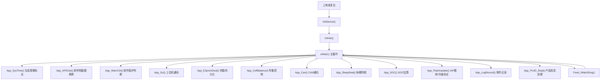
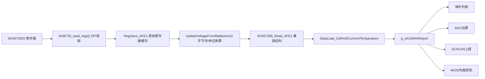
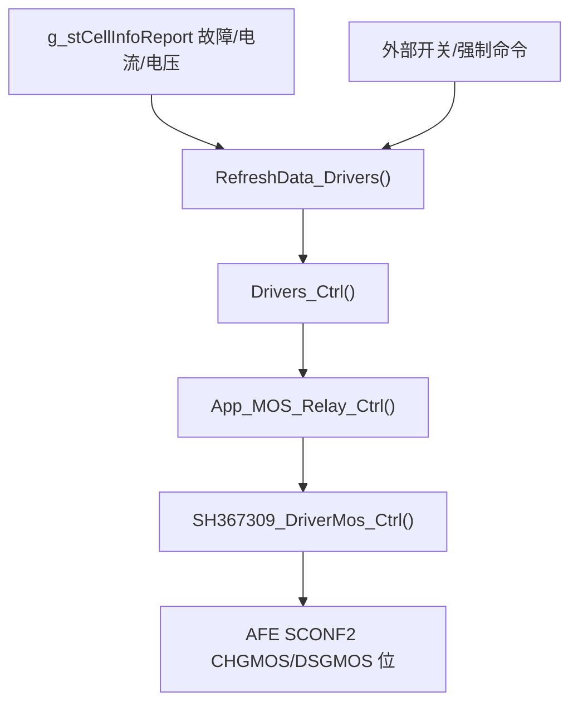

# 主项目逻辑梳理（103 + 309）

生成日期：2026-05-18  
主项目目录：`103 + 309`  
官方参考例程：`SH3673520+STM32F072CBT6 DemoCode V1.2_20241227`

本文档从工程结构、运行入口、周期调度、核心数据流、模块职责、官方例程差异和风险索引几个角度梳理当前主项目。主项目以 STM32F103 系列为 MCU，当前正在把旧 SH367309/I2C 体系中的应用逻辑迁移到 SH3673520/SPI AFE 上，因此代码中存在新旧 AFE 路径并存的情况。

## 1. 工程快照

### 1.1 主工程与构建入口

- Keil 工程：`103 + 309/Project/Users/CommomSH367309_16series_103RCT6_C.uvprojx`
- 应用源码：`103 + 309/Project/Source`
- 启动与库代码：`103 + 309/Project/Users`、`103 + 309/Project/CMSIS`、`103 + 309/Project/STM32F10x_StdPeriph_Driver`
- 新 AFE SPI 驱动：`103 + 309/Project/Source/sh3520 driver`
- 旧 AFE/业务逻辑主体：`103 + 309/Project/Source/I2C_AFE1.c`、`DataDeal.c`、`SH367309_Func.c`、`SH367309_DataDeal.c`
- 实验驱动目录：`103 + 309/Project/Source/100ask driver`，当前未作为主路径集成进 Keil 工程。

### 1.2 当前关键编译宏

来自 `conf/conf.h`、`main.h`、`IO_Control.h` 等文件：

- `wdog_enable`：启用独立看门狗喂狗逻辑。
- `__FUNC__CAN__`：启用 CAN 通讯。
- `__FUNC__HEAT__`：加热/冷却功能当前关闭。
- `__FUNC_RTC__`：RTC 功能宏当前关闭，但工程仍保留 RTC/休眠相关代码。
- `AFE_TYPE sh36xx`：表示当前 AFE 类型走 SH36xx 系列路径。
- `_IAP`：应用运行在 IAP 后的偏移地址，系统向量表应偏移到 `0x08004800`。
- `_COMMOM_UPPER_SCI1`：上位机通讯使用 SCI1 公共协议路径。
- `_MOS_SAME_DOOR_NO_PRECHG`：当前 IO 输出模式为同口 MOS、无预充模式。
- `SOFT_SPI`：当前 SH3673520 SPI 通讯使用软件 SPI；硬件 SPI 文件在工程中存在但未启用。

### 1.3 重要硬件假设

- 应用起始地址：`FLASH_ADDR_APP_START = 0x08004800`。
- Flash 运行区中还使用 `0x0801F800`、`0x0801FC00`、`0x0803E000`、`0x0803E800` 等地址保存休眠、升级、AFE 偏移等标志或参数。
- 代码与工程命名指向 `STM32F103RCT6` 这类 256KB Flash 级别器件，但 Keil 工程设备配置存在 `STM32F103C8`、64KB IROM、128KB Flash 算法等不一致项，需要统一。
- 外部 EEPROM 通过软件 I2C 读写，主要保存校准、保护阈值、其他系统参数、SOC、事件记录等。

## 2. 总体运行模型

主程序在 `main.c` 中。整体逻辑是“初始化所有外设与业务数据，然后在 while(1) 中按时间标志调度任务”。系统没有 RTOS，所有业务模块都依赖 TIM3 中断产生的软件时基，并在主循环中轮询执行。

### 2.1 初始化入口

`main()` 的顺序：

1. `InitDevice()`：初始化系统时钟、延时、休眠启动判断、IO、NVIC、EEPROM、CAN、串口、MOS/继电器输出、SOC 数据、SPI 总线、AFE 寄存器、看门狗、TIM3。
2. `InitVar()`：从 EEPROM 参数恢复运行变量，设置串数、电流采样电阻相关系数、系统启动状态和事件记录标志。
3. 进入主循环。

### 2.2 初始化中最关键的业务动作

`InitDevice()` 中 AFE 初始化当前不是调用官方例程的封装函数，而是在 `main.c` 中直接写一组寄存器：

- `AFE_SCONF1`、`AFE_SCONF2`、`AFE_SCONF3`、`AFE_SCONF4`、`AFE_SCONF6`
- 过压、欠压、短路、过流、温度阈值寄存器
- MOS 控制位和泵控制位

这部分目前没有完整返回值判断，也没有形成“初始化后读回校验”的闭环。

## 3. 周期调度与时基

### 3.1 TIM3 中断

`System_Init.c` 中 `InitTimer()` 配置 TIM3 周期中断。`TIM3_IRQHandler()` 内部累加多个计数器，用于生成：

- 1ms 标志
- 10ms 分槽标志
- 50ms 标志
- 100ms 标志
- 200ms 分槽标志
- 1000ms 分槽标志

### 3.2 主循环时基转换

`App_SysTime()` 把中断中的累加计数转换为 `g_st_SysTimeFlag` 中的 bit 标志。业务模块不直接靠延时阻塞，而是在自己的入口中检查这些标志，例如：

- `App_AFEGet()`：主要使用 `b1Sys200msFlag3`。
- `App_CellBalance()`：主要使用 `b1Sys1000msFlag2`。
- `App_SOC()`：主要使用 `gu8_200msAccClock_Flag`。
- `App_SleepDeal()`：主要使用 `gu8_1000msAccClock_Flag`。
- EEPROM、CAN、通讯等模块也以主循环轮询加状态机方式运行。

## 4. 模块总览

| 模块 | 主要文件 | 职责 | 关键入口或数据 |
| --- | --- | --- | --- |
| 入口与初始化 | `main.c`、`System_Init.c` | 上电初始化、时基、主循环调度 | `main()`、`InitDevice()`、`InitVar()`、`App_SysTime()` |
| AFE SPI 驱动 | `sh3520 driver/*`、`bsp_spi_bus.*` | SH3673520 低层 SPI 读写、软件 SPI 时序 | `sh36735_read_regs()`、`sh36735_write_reg_u8()` |
| AFE 数据读取 | `I2C_AFE1.c/h`、`SH36735_reg.h` | 读取 SH3673520 寄存器块，换算 cell/temp/current 原始值 | `UpdateVoltageFromBqMaximo()`、`Registers_AFE1`、`SH367309_Read_AFE1` |
| 数据换算 | `DataDeal.c/h` | 电压、电流、温度、总压、最大最小值、MOS 控制前置处理 | `App_AFEGet()`、`DataLoad_*()`、`g_stCellInfoReport` |
| 软件保护 | `Fault.c/h` | 一级、二级、三级保护阈值判断和故障记录 | `App_WarnCtrl()`、`PRT_E2ROMParas` |
| AFE 硬件保护 | `SH367309_Func.c/h`、`AFE_PROTECT_param.c` | AFE 硬件故障位解析、清除、MOS 位控制 | `SH_AFE_ClearProtectFlag()`、`SH367309_DriverMos_Ctrl()` |
| MOS/继电器输出 | `IO_Control.c/h`、`IODrivers.c/h` | 充放电 MOS、继电器、外部开关与保护联动 | `App_MOS_Relay_Ctrl()`、`Driver_Element` |
| 均衡 | `Cell_balance.c/h`、`Balance.c/h` | 根据压差、电压、电流条件控制 AFE 均衡寄存器 | `App_CellBalance()`、`CB_AfeWriteBalanceMaskU24()` |
| SOC | `SOC.c/h`、`SocEnhance.c/h` | 容量积分、OCV/满空锚定、SOH、循环次数、SOC 持久化 | `InitData_SOC()`、`App_SOC()`、`SOC_Enhance_Element` |
| EEPROM 参数 | `EEPROM.c/h` | 外部 EEPROM 参数读取、默认值、分批写入 | `InitE2PROM()`、`App_E2promDeal()` |
| Flash/IAP | `Flash.c/h` | 应用偏移、升级标志、休眠标志、跳转 IAP | `App_FlashUpdate()`、`APP_To_IAP_Jump()` |
| 上位机通讯 | `Sci_Upper.c/h` | UART/RS485 Modbus-like 协议、参数读写、遥测上报 | `InitUSART_CommonUpper()`、`App_CommonUpper()` |
| CAN | `Can_HDX.c/h` | CAN 初始化、收发帧、故障恢复 | `InitCan()`、`App_Can()` |
| 休眠 | `SleepDeal.c/h`、`rtc_sleep.c/h` | 浅睡、深睡、低压休眠、唤醒恢复 | `IsSleepStartUp()`、`App_SleepDeal()` |
| 事件与产品信息 | `LogRecord.c/h`、`ProductionID.c/h` | 故障/事件记录、产品 ID、版本与 SN | `App_LogRecord()`、`App_ProID_Deal()` |
| 可选功能 | `Heat_Cool.c/h`、`ADC.c/h`、`LedBar.c/h` | 加热冷却、ADC 输入、灯条显示 | 当前主循环部分未启用 |

## 5. 核心数据对象

### 5.1 采样与遥测数据

- `Registers_AFE1`：按 SH3673520 寄存器布局保存从 AFE 读出的原始寄存器值。
- `SH367309_Read_AFE1`：旧命名结构，保存转换后的 cell、电流、温度、总压等 AFE 数据，当前被新 SH3673520 路径复用。
- `g_stCellInfoReport`：对外通讯和内部保护共用的核心快照，包含 cell 电压、最大最小电压、压差、总压、温度、电流、SOC、故障位、均衡状态等。

### 5.2 参数数据

- `PRT_E2ROMParas`：软件保护阈值和滤波时间，来自 EEPROM，默认值在 `Fault.h`。
- `OtherElement`：其他系统参数，包括串数、均衡阈值、睡眠阈值、SOC 标定值、采样电阻参数、预充时间等。
- `g_u16CalibCoefK[]`、`g_i16CalibCoefB[]`：电压、电流、温度等校准系数。
- `CopperLoss`：铜损补偿参数。

### 5.3 控制状态

- `Driver_Element`：MOS/继电器控制状态、强制控制标志、预充状态、虚拟电流等。
- `System_OnOFF_Func`、`System_ErrFlag`：系统功能开关和错误标志。
- `Sleep_Mode`、`Sleep_Status`：休眠模式与休眠状态机。
- `SOC_Enhance_Element`：SOC 算法运行数据、容量、循环次数、状态机等。
- `sys_time`：调试和系统状态集合，包含 CRC 错误计数、均衡通道、充电器/负载状态等。

## 6. AFE 采样链路

当前 AFE 采样链路如下：

### 6.1 低层读写

`sh36735_spi_proto.c` 提供：

- `sh36735_write_reg_u8(reg, val)`：写单字节寄存器。
- `sh36735_write_regs(reg, buf, n)`：连续写寄存器。
- `sh36735_read_regs(reg, buf, n)`：连续读寄存器。

官方 SH3673520 例程的 SPI 帧包含命令回显、地址回显、长度回显、数据、CRC、ACK 等校验点。主项目低层驱动只实现了部分校验，当前还存在写 ACK 取错字节的高风险问题，见后文风险索引。

### 6.2 寄存器读取

`UpdateVoltageFromBqMaximo()` 读取这些地址段：

- `0x40..0x46`：SCONF 配置区。
- `0x47..0x57`：阈值和保护配置区。
- `0x58..0x5C`：FLAG/BSTATUS 状态区。
- `0x5D..0x96`：温度、电芯、电流、总压、充电器电压等采样区。

读取后进行大端/小端转换，并换算为业务单位：

- Cell 电压：`code * 5 >> 5`，约等于 `code * 5 / 32`。
- 温度：通过 NTC 查表换算。
- 电流：从 `CADC` 原始值转换后交给 `DataLoad_Current()` 再做正负方向、比例和校准处理。
- 总压/充电器电压：`VTOP`、`VCHGR` 乘以 25。

### 6.3 新旧路径并存

虽然当前目标是 SH3673520，但大量命名仍为 SH367309：

- `I2C_AFE1.c` 中仍保留旧 I2C/TWI/MTP 读写代码。
- `SH367309_Func.c` 中仍保留旧 AFE 控制和保护清除逻辑。
- `SH367309_DataDeal.c` 中仍保留旧参数结构和 EEPROM/MTP 参数下发逻辑。
- 新 SH3673520 SPI 数据最终仍落到 `SH367309_Read_AFE1` 这个兼容结构中。

这使得功能可以较快迁移，但也带来边界不清、错误处理不一致和参数语义混用的问题。

## 7. 数据换算与保护链路

### 7.1 电芯电压

`App_AFEGet()` 在 200ms 分槽中调用 `UpdateVoltageFromBqMaximo()` 后执行：

1. `DataLoad_CellVolt()`：把 AFE cell 电压拷贝到 `g_stCellInfoReport.u16VCell[]`，并应用 AFE 总体系数和单体 K/B 校准。
2. `DataLoad_CellVoltMaxMinFind()`：计算最大电压、最小电压、最大最小序号、压差、总压，并应用 VBUS 校准。
3. 未使用的 cell 通道填入 `61001` 作为无效标记。

### 7.2 电流

`DataLoad_Current()` 根据 AFE CADC 符号位判断充电或放电方向：

- 符号位为 1 时作为充电电流。
- 符号位为 0 时作为放电电流。
- 小于等于 2 的电流被压为 0。
- 大于一定阈值后应用 K/B 校准。
- 最终输出到 `g_stCellInfoReport.u16Ichg`、`u16IDischg`，单位为 0.1A。

当前电流换算和官方例程的 `Gain/Offset + 多次平均` 算法不一致，且充放电方向的乘除顺序不完全对称，属于需要复核的风险点。

### 7.3 温度

`DataLoad_Temperature()` 当前选择 2 路电芯温度，另一路 MOS 温度来自 AFE 温度通道。函数会：

- 从 `SH367309_Read_AFE1.u16TempBat[]` 取温度。
- 应用温度 K/B 校准。
- 更新 `g_stCellInfoReport.i16TCell[]`、`i16Tmos`。
- 调用 `Monitor_TempBreak()` 判断温感断线。

### 7.4 软件保护

`Fault.c` 中实现一级、二级、三级保护，覆盖：

- 单体过压/欠压
- 总压过压/欠压
- 充电/放电过流
- 充电/放电高低温
- MOS 过温
- 压差
- SOC 低

保护结果进入 `g_stCellInfoReport.unMdlFault_First/Second/Third`，之后被通讯、MOS 控制、日志记录等模块消费。

### 7.5 AFE 硬件保护

`SH367309_Func.c` 读取和清除 AFE FLAG：

- `AFE_FLAG_OV`、`AFE_FLAG_UV`
- `AFE_FLAG_OCC`、`AFE_FLAG_OCD`
- `AFE_FLAG_SC`
- 温度相关硬件保护

`DataDeal.c` 中根据恢复条件清除对应 AFE 硬件保护标志，并在短路释放场景下控制 `CRLD_EN`。

## 8. MOS、继电器与外部控制

当前 `IO_Control.h` 选择 `_MOS_SAME_DOOR_NO_PRECHG`，即同口 MOS、无预充路径。整体链路：

关键点：

- MOS 实际控制最终落到 AFE `SCONF2` 的 `CHGMOS`、`DSGMOS` 位。
- `Driver_Element` 保存输出状态、预充状态、故障联动状态、强制控制状态等。
- 如果未来切换到继电器、有预充、分口模式，需要从 `IO_Control.h` 的模式宏开始统一检查。

## 9. 均衡链路

当前主循环调用 `Cell_balance.c` 中的 `App_CellBalance()`。

执行条件：

- 周期：约 1s 分槽。
- 放电电流大于 0 时关闭均衡。
- 最小电压低于 `OtherElement.u16Balance_OpenVoltage` 时关闭均衡。
- 最大最小压差低于 `OtherElement.u16Balance_OpenVolDif` 时关闭均衡。
- 连续满足条件后，选择电压高于最小值加窗口、且高于开启电压的 cell。

输出：

- 生成 24bit 均衡 mask。
- 通过 `CB_AfeWriteBalanceMaskU24()` 写 `AFE_BALANCEH/M/L`。
- 更新 `g_stCellInfoReport.u16Balance`、`u16BalanceState` 等状态。

风险：

- 均衡寄存器写入当前基本忽略 SPI 返回值。
- 软件 SPI 写 ACK 已存在风险时，均衡开启/关闭是否真正到达 AFE 无法保证。

## 10. SOC 链路

SOC 由 `SOC.c` 和 `SocEnhance.c` 负责。

### 10.1 初始化

`InitData_SOC()`：

- 从 `OtherElement` 复制电池容量、循环次数、SOC 表、满电/空电标定电压等参数。
- 调用 `soc_param_lib_init()` 读取 EEPROM 中的 SOC、循环次数和历史容量。
- 将初始 SOC/SOH/容量发布到 `g_stCellInfoReport`。

### 10.2 运行

`App_SOC()`：

- 约 200ms 进入一次。
- 从 `g_stCellInfoReport` 取电压、电流、温度等输入。
- 调用 `SOC_IntEnhance_Ctrl()` 完成状态判断、容量积分、满空锚定、SOH 与循环次数更新。
- 把结果写回 `g_stCellInfoReport.u8SOC`、`u8SOH`、容量和循环次数字段。

### 10.3 SOC 算法要点

- 通过连续多次电流方向判断切换充电、放电、静置状态。
- 充电和放电分别做 Ah 积分。
- 满电条件使用 `u16_SOC_100_Vol` 锚定。
- 空电条件使用 `u16_SOC_0_Vol` 或低压状态锚定。
- SOC、循环次数变化后触发 EEPROM 写入。

## 11. 参数持久化

### 11.1 外部 EEPROM

`EEPROM.c` 是主要参数持久化模块：

- 上电先读 `EEPROM_ADDR_PASS` 判断是否已有初始化标志。
- 已初始化：读取保护参数、校准参数、其他参数、热管理参数、事件记录、SOC 相关参数。
- 未初始化：写默认参数、产品 ID 默认值、SOC 工厂参数，然后写入初始化标志并复位。

写入不是一次性阻塞全量写，而是靠标志位在主循环中分批处理：

- `g_u8E2promWriteFlag_KB`
- `g_u8E2promWriteFlag_Prt`
- `g_u8E2promWriteFlag_Other`
- `g_u8E2promWriteFlag_Heat_Cool`
- 事件记录、SOC、产品信息等相关标志

这种设计能降低主循环卡顿，但要求每个模块正确设置写标志，并避免 AFE 采样与 EEPROM 写入抢占时序。

### 11.2 Flash

`Flash.c/h` 保存：

- IAP 和 APP 起始地址。
- APP 跳转 IAP 的升级标志。
- 睡眠模式标志。
- SH367309/AFE 相关 Flash 参数地址。

当前存在外部 EEPROM 16bit 地址接口误传 Flash 32bit 地址的风险，详见风险索引。

## 12. 通讯链路

### 12.1 上位机 SCI/RS485

`Sci_Upper.c/h` 负责 UART/RS485 上位机协议。协议形态接近 Modbus：

- `0x03`：读寄存器。
- `0x06`：写单寄存器。
- `0x10`：写多个寄存器。
- 另有 `0xA1`、`0xA2`、`0x04`、`0x05`、`0x06` 等客户端命令。

通讯读数据主要来自 `g_stCellInfoReport`。写参数时，通讯层更新 RAM 参数，并置 EEPROM 写标志，后续由 `App_E2promDeal()` 落盘。

重要地址区：

- `0xD000` 等只读状态区。
- `0x2000` 校准参数区。
- `0x2100` 保护参数区。
- `0x2200` 其他系统参数区。
- `0x2300` CAN/扩展参数区。

### 12.2 CAN

`Can_HDX.c/h` 当前被 `__FUNC__CAN__` 启用。

主要逻辑：

- `InitCan()` 初始化 CAN1 GPIO、NVIC、CAN 控制器、滤波器。
- `App_Can()` 检查 BusOff，按发送标志逐帧发送状态。
- 接收中断根据标准帧 ID 设置响应标志。
- 标准 ID `0x00..0x11` 表示不同状态或响应帧。

## 13. 休眠与唤醒

### 13.1 当前主路径

主循环调用 `SleepDeal.c` 中的 `App_SleepDeal()`。

主要条件：

- CRC/SPI 错误持续一定时间后进入深睡。
- 普通低功耗休眠取决于 `OtherElement.u16Sleep_TimeNormal`。
- 低压休眠取决于 `OtherElement.u16Sleep_TimeVlow`。
- 最小单体长期低于 2500mV 会触发深睡。
- 外部开关、负载、充电器状态会影响是否允许睡眠。

### 13.2 唤醒恢复

`IsSleepStartUp()` 在初始化早期运行：

- 读取 Flash 中的睡眠标志。
- 根据上次睡眠模式选择 IO 初始化和唤醒配置。
- 进入 Stop 模式或恢复系统时钟、外设和 IO 状态。

### 13.3 旁路代码

`rtc_sleep.c` 中还有 RTC/SOC 结合的休眠恢复逻辑，但当前 `__FUNC_RTC__` 未开启，且主路径仍以 `SleepDeal.c` 为主。后续若启用 RTC，需要重新梳理 `SleepDeal.c` 和 `rtc_sleep.c` 的职责边界。

## 14. 官方 SH3673520 例程对比

官方例程提供了更完整的 SH3673520 初始化和通讯校验闭环，主项目当前只吸收了部分低层 SPI 和寄存器读取思想。

主要差异：

| 主题 | 官方例程 | 主项目现状 |
| --- | --- | --- |
| SPI 写帧校验 | 校验 ACK、回显和 CRC，ACK 位于完整帧固定位置 | 写 ACK 读取位置疑似错误，回显校验不足 |
| SPI 读帧校验 | 命令、地址、长度、CRC、数据都有校验 | 当前主要校验 CRC，错误返回未被上层充分处理 |
| 初始化封装 | `RegisterInit()`、`RegisterCheck()`、`SH_AFE_SPICheck()` 形成闭环 | `main.c` 直接写寄存器，缺少统一读回检查 |
| 运行监控 | 周期调用 AFE monitor，并把 SPI/寄存器异常纳入错误路径 | `MonitorAFE()` 被注释，直接调用数据读取 |
| 电流计算 | 使用增益、偏移和多次平均 | 主项目用旧公式和 K/B 校准，方向公式不完全对称 |
| 错误传播 | 读取函数返回错误 bitmask | 主项目多处忽略返回值或返回固定 0 |
| 硬件抽象 | 面向 SH3673520 命名和寄存器 | 主项目大量复用 SH367309 命名和旧 I2C/MTP 逻辑 |

结论：主项目业务层比较完整，包括通讯、保护、SOC、EEPROM、均衡、休眠等，但 SH3673520 接入层仍处于迁移中间态。最需要优先完善的是 AFE SPI 可靠性、寄存器初始化校验、错误传播和串数配置一致性。

## 15. 风险索引

### P0：会直接导致 AFE 写入判断错误或采样数据无效的风险

1. `sh3520 driver/sh36735_spi_proto.c` 写寄存器 ACK 读取位置错误。当前代码在发送 CRC 后立刻取 `ack`，但官方例程中 ACK 是下一字节，期望值 `0xA5`。这会导致写成功/失败判断不可信，并影响 MOS、均衡、保护清除等所有 AFE 写操作。
2. `main.c` 中主动读取 cell 数据时把 `&g_stCellInfoReport.u16VCell[1]` 强转为 `uint8_t`，应为 `uint8_t *`。当前 Keil 已给出 pointer-to-smaller-integer 和 pointer type warning，运行时会把指针截断成单字节地址，属于明确 bug。
3. `I2C_AFE1.c` 中 `UpdateVoltageFromBqMaximo()` 忽略所有 `sh36735_read_regs()` 返回值，并固定返回 0。`DataDeal.c` 又直接使用该函数结果，导致 SPI 失败、CRC 失败、AFE 离线时仍可能消费旧数据或错误数据。

### P1：会造成参数、保护或硬件适配不一致的风险

4. `EEPROM.c` 中 `WriteEEPROM_Word_NoZone()`、`ReadEEPROM_Word_NoZone()` 接口是 16bit EEPROM 地址，但调用处传入 `FLASH_ADDR_SH367309_VALUE` 这类 32bit Flash 地址，编译器已有截断 warning。大概率应改为 EEPROM 地址宏 `E2P_ADDR_SH367309_VALUE`。
5. Keil 工程 MCU/Flash 配置不一致。工程中同时出现 `STM32F103C8`、64KB IROM、128KB Flash 算法、高密度启动文件、`103RCT6` 文件名、`0x0803E000` Flash 参数地址。若按 C8 或 64KB 器件烧录，会发生地址越界或运行异常。
6. AFE 初始化在 `main.c` 中硬编码寄存器值，缺少官方例程里的 `RegisterInit/RegisterCheck/SPICheck` 闭环。AFE 配置写失败时系统仍继续运行。
7. 串数配置不统一。`SNum` 固定为 19，`SeriesNum` 上电默认 16 并从 EEPROM 参数覆盖，`OtherElement_default` 又使用 `SNum`，AFE `SCONF4` 也写 `SNum`。16 串和 19 串版本容易出现采样、保护、均衡通道不一致。
8. `AFE_PROTECT_param.c` 中 `sh_decode_occ_occt()` 声明为非 void 但缺少 return，并且被采样链路周期调用。虽然未必立即崩溃，但属于未定义返回语义。

### P2：可靠性、维护性和长期演进风险

9. 电流计算与官方例程不一致，当前充放电方向公式乘除顺序不对称，也没有采用官方 Gain/Offset 和多样本平均策略，电流精度需要用实测校准确认。
10. `Cell_balance.c` 写 AFE 均衡寄存器时忽略返回值，重试逻辑被注释。若 SPI 写失败，系统可能误以为均衡已开启或已关闭。
11. 当前启用软件 SPI，硬件 SPI 文件存在但未纳入构建。软件 SPI 文件注释说明更偏调试用途，生产版本建议确认时序裕量、抗干扰能力和 CPU 占用。
12. SH367309 旧 I2C/MTP 代码与 SH3673520 新 SPI 代码混合在同一业务链路中，命名和职责容易误导后续维护。
13. `todo.c` 中存在大量临时代码/记录，不应作为正式功能依据。建议后续把待办迁入文档或 issue，并保持源码目录干净。
14. 部分中文注释存在编码混乱，后续文档化和审查时容易误读阈值含义。

## 16. 建议后续整改顺序

### 16.1 第一阶段：先保证 AFE 可靠读写

1. 修复 SPI 写 ACK 位置，并按官方例程补齐写回显、读回显、CRC 校验。
2. 修复 `main.c` 中 `uint8_t` 指针截断问题。
3. 让 `UpdateVoltageFromBqMaximo()` 返回真实错误码，并在 `App_AFEGet()` 中处理失败、计数、降级和休眠策略。
4. 恢复或重建 `MonitorAFE()`，至少覆盖 SPI 通讯检查、寄存器检查和关键状态检查。

### 16.2 第二阶段：统一 AFE 迁移边界

1. 新建或整理 `SH3673520` 命名的适配层，明确低层 SPI、寄存器读写、数据换算和保护清除职责。
2. 保留旧 SH367309 业务兼容结构时，在注释或文档中明确哪些字段仍被复用，哪些旧函数已经废弃。
3. 把 `main.c` 里的 AFE 寄存器初始化移入专门模块，并增加读回校验。

### 16.3 第三阶段：统一配置与参数

1. 统一 `SNum`、`SeriesNum`、`OtherElement.u16Sys_SeriesNum` 和 AFE `SCONF4` 的来源。
2. 统一 Keil 工程 MCU、启动文件、IROM、Flash 下载算法和 Flash 地址规划。
3. 修复 EEPROM/Flash 地址混用，给 EEPROM 地址和 Flash 地址增加类型或命名隔离。
4. 明确 16 串、19 串、不同电流规格、三元/铁锂等变体的配置入口。

### 16.4 第四阶段：提高验证能力

1. 把 Keil 编译 warning 作为审查清单，先清理指针截断、整数截断、非 void 不返回等高风险 warning。
2. 增加 AFE SPI 读写的台架测试记录，包括 CRC 错误、断线、写失败、寄存器读回不一致。
3. 针对 SOC、电流、均衡、保护阈值建立最小回归用例或调试脚本。
4. 把官方例程的关键寄存器表、初始化值和返回码语义同步到项目文档。

## 17. 维护建议

- 新增功能优先挂到清晰模块，不建议继续在 `main.c` 中直接堆 AFE 寄存器写操作。
- 与 SH3673520 直接相关的新代码建议使用 `sh3673520` 或 `sh36735` 命名，旧 `SH367309` 命名只作为兼容层保留。
- 所有 AFE 写操作都应具备返回值检查、错误计数和必要重试。
- 任何影响 MOS、均衡、保护阈值的参数写入，都应有读回确认或下一周期状态确认。
- 参数地址建议分为 EEPROM 地址、Flash 绝对地址、AFE 寄存器地址三类，避免同名宏跨空间误用。
- 文档和正式注释建议统一编码，减少乱码注释对维护判断的影响。

