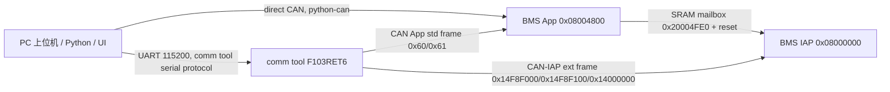

# CAN 通讯上位机对接修改文档

日期：2026-06-08

当前分支：`codex/d009-can-host-comm`

对接基准：`codex/d009-production-code`

## 1. 目标范围

本次对接的目标是让当前 BMS 项目支持 CAN 通讯上位机的完整通讯功能，并补齐配套升级链路：

- 正常 App 运行时，通过 CAN 上位机读取状态和寄存器。
- 正常 App 运行时，通过 CAN 上位机写参数，包含当前项目的保护参数写入规则。
- 通过 CAN App 服务让目标板进入 IAP。
- 通过 BMS CAN-IAP 协议完成 App 固件升级。
- 提供 PC direct-CAN 工具、PC 串口 comm tool 工具、原升级 UI、comm tool 固件、BMS IAP 工程。

本次实现按 d009 的 CAN App 服务帧和 CAN-IAP 帧格式对齐；进入 IAP 也按 d009 的 SRAM mailbox 方式实现，不把当前项目旧 `FLASH_ADDR_UPDATE_FLAG` 作为新的升级门闩。

## 2. 变更入口

本次 CAN 上位机对接主要由以下 3 个提交构成：

| 提交 | 作用 |
| --- | --- |
| `0937b3d Add d009 CAN host communication support` | BMS App CAN 服务、comm tool 固件、PC 工具、协议文档、原 UI 对接 |
| `cb6ea15 Add BMS CAN IAP bootloader project` | 当前主板配套 BMS CAN-IAP 工程 |
| `33d15db Harden BMS IAP upgrade guards` | BMS IAP 升级保护增强、PC 镜像 guard 测试 |

本轮又补充了 Python 工具模块化，详见 `docs/protocol/can-host-tool-modularization-20260608.md`。

## 3. 总体链路



两条上位机路径共用同一套 BMS 端协议：

- direct-CAN：PC 直接使用 `tools/can_bms_host.py` 发送 CAN 帧。
- comm tool：PC 使用 `tools/comm_tool_host.py` 或 `tools/comm_tool_upgrade_ui.py` 通过串口控制 `firmware/comm_tool_f103ret6/`，由 comm tool 转发 CAN。

## 4. BMS App 修改

### 4.1 CAN App 服务

文件：

- `103 + 309/Project/Source/Can_HDX.c`
- `103 + 309/Project/Source/Can_HDX.h`

新增 App 服务命令队列和处理函数：

- `Can_AppQueueCmd()`：CAN 接收侧只缓存命令帧。
- `Can_AppService()`：在 `App_Can()` 主循环中处理命令。
- `Can_AppHandleCmdData()`：解析命令、CRC、参数并调用串口寄存器桥。
- `Can_AppServiceReadBlock()`：块读数据按 `App_Can()` 的 10ms 调度逐个返回。
- `Can_AppServiceEnterIapDelay()`：`ENTER_IAP` ACK 后延时触发复位入口。

接收中断不直接操作 Flash、E2PROM 或串口缓存，避免在中断上下文做高风险动作。

### 4.2 CAN App 帧格式

标准帧 ID：

| 方向 | 标准帧 ID |
| --- | --- |
| 上位机/comm tool -> BMS App | `(CAN_ADRESS_STD_ID << 7) | 0x60` |
| BMS App -> 上位机/comm tool | `(CAN_ADRESS_STD_ID << 7) | 0x61` |

请求固定 8 字节：

| 字节 | 含义 |
| --- | --- |
| 0..1 | `A5 5A` |
| 2 | 命令 |
| 3..5 | 参数 |
| 6..7 | 前 6 字节 CRC16-Modbus，高字节在前 |

响应固定 8 字节：

| 字节 | 含义 |
| --- | --- |
| 0..1 | `5A A5` |
| 2 | 原命令，块读数据帧为 `0x86` |
| 3 | 状态码或块读序号 |
| 4..5 | 返回值 |
| 6..7 | 前 6 字节 CRC16-Modbus，高字节在前 |

### 4.3 已实现 App 命令

| 命令 | 名称 | 说明 |
| --- | --- | --- |
| `0x01` | `GET_STATUS` | 返回 SOC/SOH |
| `0x02` | `ENTER_IAP` | 写 SRAM mailbox，ACK 后延时复位进入 IAP |
| `0x03` | `READ_REG` | 读单个串口寄存器 |
| `0x04` | `WRITE_PREP` | 写单寄存器第一帧，暂存地址和高字节 |
| `0x05` | `WRITE_COMMIT` | 写单寄存器第二帧，校验地址后提交 |
| `0x06` | `READ_BLOCK` | 连续读 `1..120` 个寄存器，后续用 `0x86` 数据帧返回 |

文档 `docs/protocol/BMS_CAN_SERVICE_PROTOCOL.md` 中还定义了老化命令 `0x07..0x0A`。当前项目没有 d009 的 `FactoryAging` 模块，板端按当前分支实现返回明确状态，不依赖静默超时。

### 4.4 串口寄存器桥

文件：

- `103 + 309/Project/Source/Sci_Upper.c`
- `103 + 309/Project/Source/Sci_Upper.h`

新增桥接函数：

- `Sci_HostReadWords(UINT16 start, UINT16 count, UINT16 *words)`
- `Sci_HostWriteWords(UINT16 start, const UINT16 *words, UINT16 count)`
- `Sci_IsAnyPortBusy()`

CAN App 服务不重新定义寄存器地址，统一复用原串口协议寄存器表。读写前会检查 SCI1/SCI2/SCI3 是否正在收发，若串口忙则拒绝本次 CAN 访问，避免共享响应缓存冲突。

### 4.5 当前项目保护参数写入规则

当前项目保护参数和 d009 不一样，这是本次对接的重点差异。

当前项目主保护参数区：

- 起始：`RS485_CMD_ADDR_VCELL_OVP_FIRST`
- 文档地址：`0x2100..0x2140`
- 总数：65 word
- 分组：13 组，每组 5 word

`Sci_HostWriteWords()` 对落在保护参数区的写入不会直接裸写单个 word，而是：

1. 找到目标地址所在的 5-word 保护参数组。
2. 从当前 `PRT_E2ROMParas` 读出整组 5 个当前值。
3. 合并本次要修改的 word。
4. 调用原多寄存器写逻辑一次写回整组 5 word。

这样 CAN 上位机写单个保护参数时，仍保留当前项目原 `Sci_WrRegs_0x10_Protect()` 的组写入语义、写标志和副作用，不照搬 d009 的保护参数布局。

UI 侧 SH309 AFE 保护参数也按当前项目方式处理：

- `0x2400..0x2417`：先读整块，合并修改项，一次写回 24 个寄存器并回读校验。
- `0x2132..0x2136`：MOS 过温参数按整组处理。
- 二级过流和短路电流列表由当前 `0x231D` 采样电阻、`0x231E` 采样电阻数换算生成。

## 5. 进入 IAP 修改

文件：

- `103 + 309/Project/Source/Flash.c`
- `103 + 309/Project/Source/Flash.h`
- `103 + 309/Project/Source/Can_HDX.c`
- `103 + 309/Project/Source/Sci_Upper.c`

### 5.1 SRAM mailbox 含义

这里的 mailbox 不是 CAN 外设的发送 mailbox，而是 App 和 IAP 之间约定的一小段 SRAM 握手结构。

地址：`0x20004FE0`

内容：

| 字段 | 含义 |
| --- | --- |
| `magic` | 固定 `0x49415031` |
| `magic_inv` | `~magic` |
| `request` | 固定 `0x5AA55AA5` |
| `request_inv` | `~request` |
| `crc` | `magic ^ request ^ 0xA5A55A5A` |

IAP 上电后检查这组字段。校验通过则停留在 IAP；校验不通过且 App 向量有效，则跳转 App。

### 5.2 App 侧入口

新增：

- `AppUpgrade_RequestIap()`
- `AppUpgrade_IsIapRequested()`

`ENTER_IAP` 流程：

1. CAN App 收到 `0x02 ENTER_IAP`。
2. 校验参数 `C3 3C can_addr`。
3. 调用 `AppUpgrade_RequestIap()` 写 `0x20004FE0` SRAM mailbox。
4. 返回 ACK，返回值 `08 48` 提示 App 起始地址。
5. 延时 `CAN_APP_ENTER_IAP_DELAY_TICKS`。
6. 设置 `u8FlashUpdateFlag=1`，由现有 `App_FlashUpdate()` 关闭 MOS、再次确认 mailbox 后复位。

`u8FlashUpdateFlag` 仍保留为当前工程已有的复位调度入口，但进入 IAP 的可靠凭据已经变为 SRAM mailbox，不再依赖旧 Flash 标志页作为新升级门闩。

## 6. BMS CAN-IAP 工程

文件：

- `firmware/bms_iap_f103c8/README.md`
- `firmware/bms_iap_f103c8/source/iap/bms_iap.c`
- `firmware/bms_iap_f103c8/source/iap/bms_iap_config.h`
- `firmware/bms_iap_f103c8/source/iap/system_stm32f10x_iap.c`
- `firmware/bms_iap_f103c8/keil/BMS_CAN_IAP_F103C8.uvprojx`

地址规划：

| 区域 | 地址 |
| --- | --- |
| IAP | `0x08000000..0x080047FF` |
| App | `0x08004800..0x0801F7FF` |
| 运行标志页 | `0x0801F800..0x0801FFFF` |
| SRAM mailbox | `0x20004FE0` |

CAN-IAP 默认参数：

| 项 | 值 |
| --- | --- |
| CAN 波特率 | `250 kbit/s` |
| 默认节点 | `1` |
| 控制帧 | `0x14F8F000 | node` |
| ACK/NACK 帧 | `0x14F8F100 | node` |
| 数据帧 | `0x14000000 | (seq << 8) | node` |
| 块大小 | 32 帧，256 bytes |

升级流程：

1. `HELLO`
2. `START(size, crc16)`
3. 连续 8 字节数据帧
4. 每 256 bytes 发送一次 `COMMIT(block_seq, block_len, block_crc)`
5. `END(frame_count, crc16)`

保护设计：

- IAP 只在收到 `START` 或旧串口连接、准备擦除 App 首页后启用 IWDG。
- `START` 后擦除 App 首页，让旧 App 立即失效。
- 首个 App 页缓存到最后，整包 CRC 和向量表校验通过后才写入 MSP/ResetHandler。
- 每个块 `COMMIT` 前检查块 CRC，写入后回读校验。
- `END` 后检查整包 CRC、初始 MSP、ResetHandler、镜像长度和 App 区上限。
- 升级中断或校验失败时不跳 App，下次复位继续停留在 IAP。

## 7. comm tool 固件

文件：

- `firmware/comm_tool_f103ret6/source/app/ct_protocol.*`
- `firmware/comm_tool_f103ret6/source/app/ct_flash_store.*`
- `firmware/comm_tool_f103ret6/source/app/ct_can_gateway.*`
- `firmware/comm_tool_f103ret6/source/app/ct_upgrade_manager.*`
- `firmware/comm_tool_f103ret6/source/app/ct_self_iap.*`
- `firmware/comm_tool_f103ret6/source/app/ct_boot_control.*`
- `firmware/comm_tool_f103ret6/source/bsp/*`
- `firmware/comm_tool_f103ret6/source/iap/*`

模块职责：

| 模块 | 职责 |
| --- | --- |
| `ct_protocol.*` | PC 串口帧解析和 ACK 编码 |
| `ct_flash_store.*` | 固件缓存区、元数据和 CRC 校验 |
| `ct_can_gateway.*` | BMS App 标准帧和 CAN-IAP 扩展帧封装 |
| `ct_upgrade_manager.*` | 一键升级状态机，从缓存固件发送到 BMS IAP |
| `ct_self_iap.*` | comm tool 自身升级入口兼容 |
| `ct_boot_control.*` | comm tool App 到自身 IAP 的 SRAM mailbox |
| `bsp/*` | UART、CAN、tick、复位等板级适配 |

关键默认配置：

| 配置 | 值 |
| --- | --- |
| `CT_UART_DEFAULT_BAUD` | `115200` |
| `CT_COMM_UART_PORT` | `USART1`，重映射 `PB6/TX`、`PB7/RX` |
| `CT_CAN_DEFAULT_BITRATE` | `250000` |
| `CT_NODE_ID_DEFAULT` | `1` |
| `CT_BMS_APP_BASE_ADDR` | `0x08004800` |
| `CT_BMS_APP_LIMIT_ADDR` | `0x0801F800` |
| `CT_SELF_APP_BASE` | `0x08008000` |
| `CT_FW_CACHE_BASE` | `0x08018000` |

一键升级状态机具备以下保护：

- 先通过 BMS App CAN 地址发送 `ENTER_IAP`，只让目标板进入 IAP。
- App 复位后 8 秒内每 250ms 重发 `HELLO`，等待 IAP 启动窗口。
- `START`、`COMMIT`、`END` 均等待 IAP ACK/NACK。
- `UPGRADE_STATUS.last_error` 暴露阶段码，便于定位是 App 进入 IAP、HELLO、START、COMMIT 还是 END 失败。
- 支持 `UPGRADE_ABORT` 终止当前状态机。

## 8. PC 工具与 UI

命令行工具：

| 文件 | 作用 |
| --- | --- |
| `tools/can_bms_host.py` | direct-CAN 调试、寄存器读写、进入 IAP、CAN-IAP 分包和升级 |
| `tools/comm_tool_host.py` | PC 串口控制 comm tool，读写 BMS、下载缓存固件、一键升级 |
| `tools/comm_tool_reliability_test.py` | comm tool 通讯和升级可靠性测试入口 |
| `tools/iap_upgrade_guard_test.py` | PC 侧镜像地址和向量表 guard 测试 |
| `tools/comm_tool_upgrade_ui.py` | 原 BMS CommTool Upgrade UI 对接 |

辅助脚本：

| 文件 | 作用 |
| --- | --- |
| `tools/start_can_bms_host.ps1` | Windows direct-CAN 命令封装 |
| `tools/start_comm_tool_host.ps1` | Windows comm tool 串口命令封装 |
| `tools/start_comm_tool_upgrade_ui.ps1` | 启动 UI |
| `tools/build_comm_tool_upgrade_ui_exe.ps1` | 打包 UI EXE |
| `tools/set_comm_tool_uart.ps1` | 切换 comm tool App/IAP 串口配置 |

常用命令示例：

```powershell
py -3.9 tools\can_bms_host.py listen --interface pcan --channel PCAN_USBBUS1 --bitrate 250000
py -3.9 tools\can_bms_host.py app-read-block --address 0xD000 --count 63
py -3.9 tools\can_bms_host.py app-write-regs --address 0x2100 4200 4100 4000 3900 3800 --confirm-write-reg
py -3.9 tools\can_bms_host.py app-enter-iap --confirm-enter-iap
py -3.9 tools\can_bms_host.py upgrade-dry-run --bin BMS_Release.bin
```

```powershell
py -3.9 tools\comm_tool_host.py info --port COM4
py -3.9 tools\comm_tool_host.py set-can --port COM4 --can-bitrate 250000 --node-id 1 --app-can-addr 0
py -3.9 tools\comm_tool_host.py bms-read --port COM4 --address 0xD000 --count 63
py -3.9 tools\comm_tool_host.py bms-write --port COM4 --address 0x2100 4200 4100 4000 3900 3800
py -3.9 tools\comm_tool_host.py fw-download --port COM4 --bin BMS_Release.bin --confirm-app-address 0x08004800
py -3.9 tools\comm_tool_host.py upgrade --port COM4 --confirm-upgrade
```

## 9. 可靠性边界

当前实现的目标是避免升级失败导致设备停在不可控状态：

- 未进入升级前：IAP 不启动看门狗，App 向量有效则直接跳 App。
- App 请求进入 IAP：使用 SRAM mailbox 的 magic、反码、request、反码、CRC 校验，避免随机 RAM 误触发。
- 升级开始后：IAP 启动 IWDG，异常卡死会复位。
- `START` 后：旧 App 首页已擦除，复位后不会跳到半旧半新的 App。
- 写入过程中：以 256 bytes 为块，块 CRC 正确才写 Flash，写后回读。
- 完成时：整包 CRC 和向量表通过后才恢复 App 首页向量并允许跳 App。
- PC 和 IAP 均拒绝 BMS App 镜像超过 `0x0801F800`，避免擦掉运行标志页。

不能承诺的边界：

- CAN 总线物理层长期短路、收发器供电异常、节点 ID 冲突、两个相同 IAP 节点同时在线，这些外部条件无法由单板固件完全消除。
- 如果 IAP 本身未正确烧录或被擦除，App 进入 IAP 后无法由 IAP 兜底。
- 如果 App 镜像链接地址不是 `0x08004800`，PC 工具和 IAP 会拒绝升级，不会尝试强行修正。

## 10. 必须现场确认项

1. CAN 位时序统一。
   BMS IAP 和 comm tool 默认 `250 kbit/s`。当前 App 运行态 CAN 也需要以实测或最终配置确认和上位机一致。

2. 多设备唯一性。
   BMS App CAN 地址必须唯一；进入 IAP 后 IAP node 必须唯一。若多个设备已经同时停在同一个 IAP node，禁止直接升级。

3. BMS App 链接地址。
   App 必须链接到 `0x08004800`，bin 大小不得超过 `0x0801F800 - 0x08004800`。

4. 保护参数写入回归。
   写 `0x2100..0x2140` 任意单项后，应确认对应 5-word 组完整写入并回读一致。

## 11. 本地验证

本次工具模块化后执行的本地验证命令：

```bash
python3 -m py_compile tools/comm_tool_host.py tools/can_bms_host.py tools/comm_tool_upgrade_ui.py tools/comm_tool_reliability_test.py tools/iap_upgrade_guard_test.py tools/can_tool/*.py
python3 tools/iap_upgrade_guard_test.py
python3 tools/comm_tool_host.py --help
python3 tools/can_bms_host.py --help
```

这些验证覆盖 Python 入口导入、旧 UI/可靠性测试导入兼容、镜像地址和向量表 guard。硬件 CAN 收发、IAP 实机升级仍需在目标板和 CAN 工具上按第 10 节执行现场回归。
