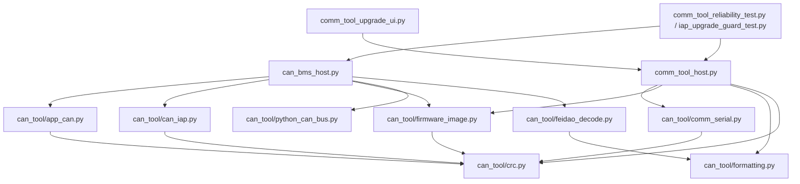

# CAN 通讯与升级工具模块化设计文档

日期：2026-06-08

当前分支：`codex/d009-can-host-comm`

## 1. 模块化目标

原 Python 工具的主要问题是 direct-CAN 工具和 comm tool 串口工具各自维护一份重复逻辑：

- CRC16-Modbus
- 固件镜像地址和向量表校验
- CAN-IAP 控制帧、数据帧和分块
- BMS App 标准帧命令封装
- 飞道广播解析
- comm tool 串口帧格式

本轮模块化目标：

- 将协议纯逻辑集中到 `tools/can_tool/`。
- 保留 `tools/can_bms_host.py` 和 `tools/comm_tool_host.py` 作为 CLI 入口。
- 保持旧 UI 和测试脚本从 `comm_tool_host.py` / `can_bms_host.py` 导入常量和函数的兼容性。
- 不引入新的运行时依赖。
- 不改变现有子命令、确认开关和用户可见流程。

## 2. 新模块结构

目录：`tools/can_tool/`

| 文件 | 职责 | 主要导出 |
| --- | --- | --- |
| `__init__.py` | 标记公共包 | 无业务逻辑 |
| `crc.py` | CRC16-Modbus | `crc16_modbus()` |
| `formatting.py` | 十六进制格式化、CAN ESR 解码、老化状态格式化、大小端工具 | `format_hex()`、`format_bytes()`、`decode_can_esr()`、`aging_state_name()` |
| `firmware_image.py` | 固件地址规划、App 向量表校验、分块和 dry-run 输出 | `load_image()`、`vector_summary()`、`print_image_plan()`、`iter_chunks()` |
| `comm_serial.py` | PC 到 comm tool 的 UART 帧协议和命令号 | `CommToolClient`、`encode_frame()`、`read_frame()`、`CMD_*` |
| `app_can.py` | BMS App 标准帧服务协议 | `build_app_command()`、`validate_app_ack()`、`app_std_id()`、`CAN_APP_*` |
| `can_iap.py` | BMS/comm tool CAN-IAP 扩展帧协议 | `build_iap_control_frames()`、`iter_iap_blocks()`、`print_upgrade_plan()` |
| `python_can_bus.py` | `python-can` 适配 | `open_bus()`、`make_message()`、`require_python_can()` |
| `feidao_decode.py` | 飞道周期广播解析 | `decode_feidao_broadcast()` |

依赖方向：



## 3. 入口兼容策略

### 3.1 `tools/comm_tool_host.py`

现在只保留串口工具的命令层：

- `list-ports`
- `info`
- `set-can`
- `fw-dry-run`
- `fw-download`
- `fw-info`
- `bms-read`
- `bms-write`
- `bms-write-soc`
- `bms-aging`
- `bms-aging-status`
- `bms-aging-set-hours`
- `enter-iap`
- `upgrade`
- `upgrade-status`
- `upgrade-abort`
- `can-diag`
- `debug-log`

它从公共模块导入并重新导出旧 UI 依赖的名字，例如：

- `CommToolClient`
- `CMD_BMS_READ`
- `CMD_BMS_WRITE`
- `CMD_FW_BEGIN`
- `CMD_UPGRADE`
- `BMS_APP_BASE_ADDR`
- `APP_FLASH_LIMIT`
- `crc16_modbus`
- `load_image`
- `vector_summary`

因此 `tools/comm_tool_upgrade_ui.py` 和 `tools/comm_tool_reliability_test.py` 不需要同步大改。

### 3.2 `tools/can_bms_host.py`

现在只保留 direct-CAN 的命令层：

- `detect`
- `listen`
- `app-read-status`
- `app-enter-iap`
- `app-read-reg`
- `app-read-block`
- `app-write-reg`
- `app-write-regs`
- `app-write-soc`
- `app-aging-start`
- `app-aging-stop`
- `app-aging-reset-time`
- `app-aging-set-hours`
- `upgrade-dry-run`
- `upgrade`

它复用公共模块中的 App CAN、CAN-IAP、镜像校验、python-can 和广播解析逻辑。

为了维持 direct-CAN 工具的安全边界，`can_bms_host.load_image()` 是一个薄 wrapper：

```python
def load_image(bin_path: Path, app_address: int) -> bytes:
    return _load_image(bin_path, app_address, allow_comm_tool=False)
```

这表示 direct-CAN 升级只允许 BMS App 地址 `0x08004800`，不会接受 comm tool 自身 App 地址 `0x08008000`。

## 4. 固件镜像模块

文件：`tools/can_tool/firmware_image.py`

### 4.1 地址常量

| 常量 | 值 | 含义 |
| --- | --- | --- |
| `BMS_APP_BASE_ADDR` | `0x08004800` | BMS App 起始地址 |
| `BMS_APP_FLASH_LIMIT` | `0x0801F800` | BMS App 写入上限 |
| `COMM_TOOL_APP_BASE_ADDR` | `0x08008000` | comm tool App 起始地址 |
| `COMM_TOOL_APP_FLASH_LIMIT` | `0x08018000` | comm tool App 写入上限 |
| `IAP_BASE_ADDR` | `0x08000000` | IAP 起始地址，PC 工具拒绝作为 App 地址 |
| `SRAM_BASE` | `0x20000000` | SRAM 起始 |
| `BMS_SRAM_LIMIT` | `0x20004FE0` | BMS App 初始 MSP 上限，避开 mailbox |
| `SRAM_LIMIT` | `0x20010000` | comm tool F103RET6 SRAM 上限 |

### 4.2 `load_image()` 校验

`load_image(path, app_address, allow_comm_tool=True)` 执行以下检查：

1. 拒绝 `0x08000000`，避免把 App 写到 IAP 区。
2. 检查地址是否为 BMS App 或 comm tool App 允许地址。
3. 检查文件存在且长度至少 8 字节。
4. 检查镜像末尾不超过对应 App 区上限。
5. 解析初始 MSP 和 ResetHandler。
6. MSP 必须位于 SRAM 范围内；BMS App 必须小于 `0x20004FE0`。
7. ResetHandler 必须是 Thumb 地址，且入口落在当前镜像范围内。

### 4.3 使用边界

- `comm_tool_host.py` 默认允许 BMS App 和 comm tool App 两种地址，因为 comm tool 支持缓存 BMS App，也支持另一台 comm tool 自升级。
- `can_bms_host.py` 禁止 comm tool App 地址，因为 direct-CAN 升级目标是 BMS IAP。
- `iap_upgrade_guard_test.py` 覆盖错误地址、非法 MSP、ResetHandler 越界和镜像越界。

## 5. CAN-IAP 模块

文件：`tools/can_tool/can_iap.py`

### 5.1 ID 规划

| 方向 | ID |
| --- | --- |
| host/comm tool -> IAP 控制帧 | `0x14F8F000 | node` |
| IAP -> host/comm tool ACK/NACK | `0x14F8F100 | node` |
| host/comm tool -> IAP 数据帧 | `0x14000000 | (seq << 8) | node` |

默认 node：`1`

### 5.2 控制帧

`build_iap_control_frames(image, node_id)` 生成：

| 命令 | 内容 |
| --- | --- |
| `HELLO` | 协议版本和节点 |
| `START` | 镜像大小和 CRC16 |
| `END` | 总帧数和 CRC16 |

`iter_iap_blocks(image, node_id, block_size=256)` 生成：

- 8 字节数据帧，`seq` 从 0 递增。
- 每 256 bytes 一个 `COMMIT` 控制帧。
- 最后一帧不足 8 字节时补 `0xFF`。

### 5.3 direct-CAN 升级流程

`tools/can_bms_host.py upgrade` 流程：

1. 校验 `--confirm-app-address 0x08004800`。
2. `load_image()` 校验镜像。
3. 打印 dry-run 计划。
4. 发送 `HELLO`。
5. 发送 `START`。
6. 发送数据帧和 `COMMIT`。
7. 发送 `END`。
8. 如 `--wait-ack` 打开，则每个控制阶段等待 ACK/NACK。

## 6. BMS App CAN 模块

文件：`tools/can_tool/app_can.py`

职责：

- 定义 App 服务命令号。
- 生成请求帧 payload。
- 校验 ACK magic 和 CRC。
- 统一计算标准帧 ID。

关键接口：

```python
app_std_id(base_id: int, can_address: int) -> int
build_app_command(cmd: int, arg0: int = 0, arg1: int = 0, arg2: int = 0) -> bytes
validate_app_ack(data: bytes) -> tuple[int, int, int, int]
```

写寄存器仍是两阶段：

1. `WRITE_PREP(addr_hi, addr_lo, value_hi)`
2. `WRITE_COMMIT(addr_hi, addr_lo, value_lo)`

连续写多个寄存器时，CLI 在同一个 CAN bus 会话里按地址递增循环调用单寄存器写。板端对保护参数区会自动扩展为当前项目的 5-word 组写入。

## 7. comm tool 串口模块

文件：`tools/can_tool/comm_serial.py`

职责：

- 定义 PC 与 comm tool 的 UART 帧格式。
- 定义 comm tool 命令号和状态码。
- 封装 `CommToolClient`。

帧格式：

| 字段 | 长度 | 说明 |
| --- | --- | --- |
| magic | 2 | `55 AA` |
| version | 1 | `01` |
| flags | 1 | bit0 为 ACK |
| seq | 2 | 请求递增序号 |
| cmd | 1 | 命令号 |
| status | 1 | 响应状态 |
| length | 2 | payload 长度 |
| payload | N | 命令数据 |
| crc16 | 2 | CRC16-Modbus |

`CommToolClient.command()` 保证：

- 请求 seq 自动递增，跳过 0。
- 只接受同 seq、同 cmd、ACK flag 置位的响应。
- 非 0 状态码转换为可读错误。
- 超时抛出 `TimeoutError`。

## 8. 格式化和广播解析模块

文件：

- `tools/can_tool/formatting.py`
- `tools/can_tool/feidao_decode.py`

`formatting.py` 提供：

- `format_hex()` / `format_bytes()`
- `decode_can_esr()`
- `aging_state_name()`
- `format_remaining_minutes()`
- `be_u16()` / `be_u32()` / `be_i32()` / `signed_i8()`

`feidao_decode.py` 解析扩展广播 `0x14F802xx`：

- `ch=0`：总压、电流
- `ch=1`：实际容量、设计容量
- `ch=2`：充电状态、SOC、温度、剩余充电时间
- `ch=3`：SOH、循环
- `ch=4`：协议版本、软件版本
- `ch=5`：工作状态、异常、容量
- `ch=8`：出厂容量、老化状态、剩余分钟、生产日期

## 9. python-can 适配模块

文件：`tools/can_tool/python_can_bus.py`

职责：

- 延迟导入 `python-can`，缺依赖时给出 Windows Python Launcher 安装提示。
- 兼容新旧 `python-can` 的 `can.Bus()` / `can.interface.Bus()` 参数。
- 统一构造标准帧和扩展帧 message。

这样 direct-CAN 入口不会在 `--help` 或导入测试时强制要求本机已安装 `python-can`。

## 10. 新增功能时的改法

### 10.1 新增一个 BMS App 命令

1. 在 `tools/can_tool/app_can.py` 增加 `CAN_APP_CMD_*` 常量。
2. 在 BMS App `Can_HDX.c` 增加同名命令处理。
3. 在 `tools/can_bms_host.py` 增加 CLI 子命令。
4. 如果 comm tool 也需要支持，在 `firmware/comm_tool_f103ret6/source/app/ct_can_gateway.*` 增加封装，在 `ct_app.c` 增加串口命令分发。
5. 更新 `docs/protocol/BMS_CAN_SERVICE_PROTOCOL.md`。

### 10.2 修改镜像地址或 Flash 分区

1. 先改固件侧配置：
   - BMS IAP：`firmware/bms_iap_f103c8/source/iap/bms_iap_config.h`
   - comm tool：`firmware/comm_tool_f103ret6/source/app/ct_config.h`
2. 再改 PC 工具：
   - `tools/can_tool/firmware_image.py`
3. 更新 Keil scatter/IROM 配置。
4. 更新 `docs/protocol/BMS_CAN_IAP_PROTOCOL.md`。
5. 运行 `tools/iap_upgrade_guard_test.py`。

### 10.3 修改 CAN 波特率

1. BMS App `InitCan_CAN1()` 运行态位时序。
2. BMS IAP `bms_iap.c` / `bms_iap_config.h`。
3. comm tool `ct_config.h` 默认值和 `board_can.c` 位时序。
4. PC 工具默认 `--bitrate` 和 `set-can` 参数。
5. 现场用 `listen` 和 `CAN_DIAG` 确认收发错误计数。

### 10.4 UI 增加功能

优先从 `comm_tool_host.py` 已重新导出的兼容名字导入，避免 UI 直接依赖底层 `can_tool` 子模块。

适合 UI 直接调用的层：

- `CommToolClient`
- `CMD_*`
- `load_image`
- `vector_summary`
- `crc16_modbus`

不建议 UI 直接调用的层：

- `read_frame()`
- `encode_frame()`
- `python_can_bus.py`

## 11. 测试策略

本地无硬件测试：

```bash
python3 -m py_compile tools/comm_tool_host.py tools/can_bms_host.py tools/comm_tool_upgrade_ui.py tools/comm_tool_reliability_test.py tools/iap_upgrade_guard_test.py tools/can_tool/*.py
python3 tools/iap_upgrade_guard_test.py
python3 tools/comm_tool_host.py --help
python3 tools/can_bms_host.py --help
```

有 comm tool 硬件测试：

```powershell
py -3.9 tools\comm_tool_host.py info --port COM4
py -3.9 tools\comm_tool_host.py set-can --port COM4 --can-bitrate 250000 --node-id 1 --app-can-addr 0
py -3.9 tools\comm_tool_host.py can-diag --port COM4 --clear
py -3.9 tools\comm_tool_host.py bms-read --port COM4 --address 0xD000 --count 63
```

有 CAN 适配器 direct-CAN 测试：

```powershell
py -3.9 tools\can_bms_host.py detect
py -3.9 tools\can_bms_host.py listen --interface pcan --channel PCAN_USBBUS1 --bitrate 250000
py -3.9 tools\can_bms_host.py app-read-status
py -3.9 tools\can_bms_host.py app-read-block --address 0xD000 --count 63
```

升级前 dry-run：

```powershell
py -3.9 tools\can_bms_host.py upgrade-dry-run --bin BMS_Release.bin
py -3.9 tools\comm_tool_host.py fw-dry-run --bin BMS_Release.bin
```

真实升级最小回归：

1. 读 `0xD000` 状态，确认目标在线。
2. `fw-download` 下载缓存并 `fw-info` 确认 CRC。
3. `upgrade --confirm-upgrade`。
4. 轮询 `upgrade-status` 至完成。
5. 等待 App 重启，读 `0xD000` 和版本寄存器。
6. 读写一个非保护普通参数。
7. 读写一个保护参数，确认 5-word 组回读一致。

## 12. 风险控制规则

- 不允许绕过确认开关真实写 Flash。
- 不允许把 BMS App 写入 `0x08000000`。
- 不允许 BMS App 镜像超过 `0x0801F800`。
- 不允许 direct-CAN 工具接受 comm tool App 地址。
- 多设备升级前必须保证目标 App CAN 地址唯一。
- 多个设备已停留在相同 IAP node 时禁止升级。
- 保护参数写入必须回读校验，不能只看 ACK。

## 13. 当前验证结论

本轮模块化后，以下验证已通过：

- 所有 Python 入口和 `tools/can_tool/*.py` 语法编译通过。
- `tools/iap_upgrade_guard_test.py` 通过。
- `tools/comm_tool_host.py --help` 保持原命令列表。
- `tools/can_bms_host.py --help` 保持原命令列表。

未在本轮本机完成的验证：

- Keil 实际编译。
- 真实 CAN 总线收发。
- 实机 BMS IAP 升级。
- 原 UI EXE 打包和 Windows 实机运行。

这些需要在 Windows/Keil/CAN 硬件环境继续执行。
