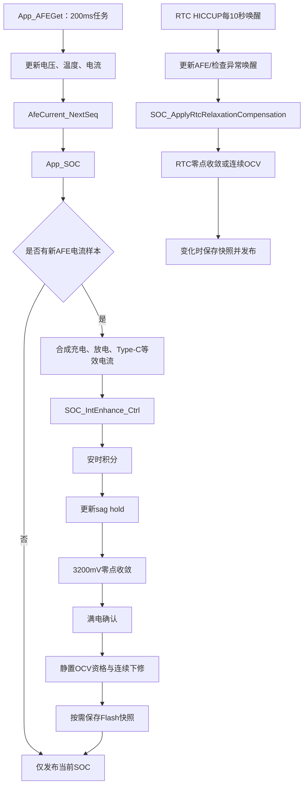
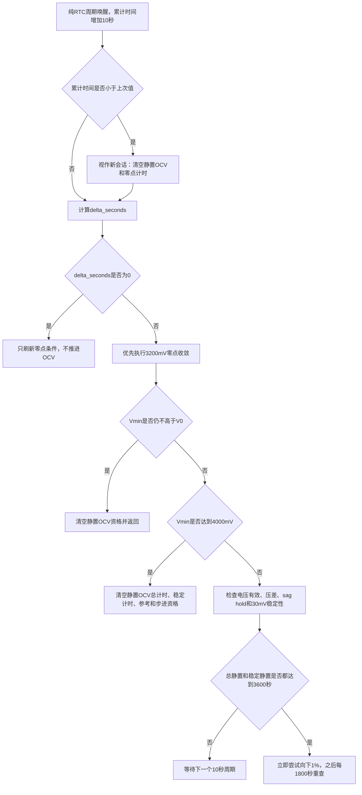

# SOC 模块完整逻辑梳理与约束核查

## 1. 文档范围

本文以源码提交 `d9ce7e9` 及当前工作区配置为事实来源，梳理以下内容。工作区已有的静置时间、预留容量、升级策略和满电门槛修改均按实际编译值记录；本轮新增修改是把RTC静置OCV限制为 `Vmin < 4000mV`，此前已把3200mV零点收敛周期设为5秒。

- SOC 的启动、恢复、运行调度和对外发布；
- 电流合成、安时积分、容量、SOH、循环和预留容量；
- 满电确认、静置 OCV、3200mV 零点收敛和 RTC 周期校准；
- Flash 快照、升级参数、上位机写入和运行中重新初始化；
- 所有能够改变 SOC 的入口；
- 两条目标约束是否已由当前源码保证：
  1. SOC 永远渐进变化，不允许跳变，任意两次变化间隔必须大于5秒；
  2. 静置时永远不允许 SOC 向上校准。

核心源码：

- `103 + 309/Project/Source/SOC.c`
- `103 + 309/Project/Source/SocEnhance.c`
- `103 + 309/Project/Source/rtc_sleep.c`
- `103 + 309/Project/Source/rtc_sleep_port.c`
- `103 + 309/Project/Source/DataDeal.c`
- `103 + 309/Project/Source/DataDeal.h`
- `103 + 309/Project/Source/Sci_Upper.c`
- `103 + 309/Project/Source/Flash.c`
- `103 + 309/Project/Source/EEPROM.c`
- `103 + 309/Project/Source/conf/Project_Config.h`
- `103 + 309/Project/Source/conf/Project_BuildGuard.h`

## 2. 核查结论

| 目标约束 | 当前结论 | 关键原因 |
| --- | --- | --- |
| SOC 不允许跳变 | **未保证** | 上位机 `SetSocOnce` 可一次写入任意0～100%；安时积分不经过1%限幅；同一个200ms周期内积分和电压校准可以叠加 |
| 任意两次 SOC 变化间隔大于5秒 | **未保证** | 普通运行3200mV零点收敛已改为每5秒下降1%，但安时积分每200ms运行且没有统一最小间隔门控；严格“大于5秒”也不包含恰好5秒 |
| 静置 OCV 不向上校准 | **已保证** | 连续 OCV 只有在 `current_soc > ocv_target` 且差值大于3%时才向下走1% |
| 静置状态下总 SOC 永远不增加 | **未保证** | `RELAX` 允许小于200mA的正向净电流参与积分；满电确认也允许在 `RELAX` 状态向100%上调 |

因此，两条需求若按字面理解，当前代码均没有完整满足。第二条只有在限定为“静置 OCV 校准器本身不得向上校准”时成立。

## 3. 总体调用关系



## 4. 调度与采样周期

### 4.1 普通运行

`App_AFEGet()` 由200ms任务标志驱动。每次有效执行依次读取电压、温度和电流，然后递增 AFE 样本序号，再调用 `App_SOC()`：

- `DataDeal.c:1192-1212`
- `SOC.c:64-81`

`App_SOC()` 只有发现 `AfeCurrent_GetSeq()` 发生变化时才调用 `SOC_IntEnhance_Ctrl()`；没有新样本时只重新发布旧 SOC。

SOC 积分内部固定假定本次样本覆盖 `SOC_TICK_MS = 200ms`。它没有使用真实经过时间。因此：

- 正常200ms采样时，积分时间正确；
- 如果任务丢周期或样本间隔拉长，下一次仍只积分200ms，丢失的时间不会补算；
- 如果未来采样频率变化而未同步修改 `SOC_TICK_MS`，积分比例会错误。

### 4.2 RTC HICCUP

RTC 周期固定为10秒：

- `RTC.c:36`：`RTC_WAKEUP_DEFAULT_SECONDS = 10`
- `RTC.c:388-406`：配置下一次 RTC Alarm

每次正常 RTC 唤醒后，低功耗状态机累计实际休眠秒数，并调用：

```c
SOC_ApplyRtcRelaxationCompensation(total_sleep_seconds, vcell_min, vcell_max);
```

对应源码：

- `rtc_sleep.c:242-277`
- `rtc_sleep_port.c:102-106`
- `SocEnhance.c:975-986`

当前低功耗状态机每1秒检查一次进入条件。低压深睡条件优先；没有低压深睡条件且所有阻塞都解除后，需要连续空闲 `sys_time.time_enter_rtc = 60秒` 才进入 `HICCUP_MODE`。当前暂存源码已经删除“SOC=0且Vmin低于V0时立即进入HICCUP”的快捷入口，因此SOC是否为0不改变这60秒等待。

HICCUP每轮执行顺序为：

1. 配置10秒后的RTC Alarm并进入STOP；
2. RTC Alarm唤醒后恢复AFE通信并更新电压、电流；
3. 若检测到电流唤醒、AFE异常唤醒、紧急电压或采样更新失败，则退出HICCUP，本轮不执行SOC RTC校准；
4. 只有无异常的纯RTC周期才把累计休眠时间增加10秒并调用SOC补偿；
5. 补偿后若累计HICCUP时间达到48小时，先完成本轮SOC处理，再进入深度休眠；
6. 深度休眠不再周期唤醒，因此不再执行SOC校准。

## 5. SOC 状态与单位

`SOC_STATE` 位于 `SocEnhance.c:69-91`。

| 字段 | 含义 | 单位/范围 |
| --- | --- | --- |
| `cap_factory_as10` | 工厂标称容量 | 0.1A·s |
| `cap_full_as10` | 考虑 SOH 后的满充容量 | 0.1A·s |
| `cap_now_as10` | SOC 实际使用的剩余可用容量 | 0.1A·s |
| `cycle_x100` | 循环次数 | 0.01 cycle |
| `dsg_acc_as10` | 未折算进完整循环的小计放电量 | 0.1A·s |
| `rem_mams` | 尚不足一个0.1A·s单位的积分余数 | mA·ms |
| `rest_soc_ticks` | 总静置资格计时 | 200ms/tick |
| `stable_rest_soc_ticks` | 稳定电压计时 | 200ms/tick |
| `long_rest_down_soc_ticks` | 连续 OCV 步进计时 | 200ms/tick |
| `full_ticks` | 满电确认计时 | 200ms/tick |
| `zero_ocv_ticks` | 3200mV零点确认计时 | 200ms/tick |
| `zero_ocv_step_ticks` | 零点连续收敛步进计时 | 200ms/tick |
| `sag_hold_ticks` | 大电流压降后的 OCV 阻塞计时 | 200ms/tick |
| `rest_ref_vmin/vmax` | 静置稳定性参考电压 | mV |
| `snapshot_flags` | 当前只使用 rebound hold 标志 | bit mask |
| `soc` | 内部/对外 SOC | `UINT8`，0～100整数百分比 |
| `soh` | SOH | `UINT8`，80～100整数百分比 |

对外 `g_stCellInfoReport.SocElement.u16Soc` 虽然是 `UINT16`，但值直接来自内部 `UINT8 s_soc.soc`，所以对外分辨率仍是1%。

## 6. 当前关键参数

参数来自 `Project_Config.h`，构建保护来自 `Project_BuildGuard.h`。

| 参数 | 当前值 | 作用 |
| --- | ---: | --- |
| `PROJECT_CFG_BAT_CHEMISTRY` | 0 | 三元锂 |
| `OtherElement.u16Soc_Ah` 默认值 | 270 | 27.0Ah |
| `PROJECT_CFG_SOC_RESERVE_CAPACITY_AH10` | 170 | 预留17.0Ah |
| `PROJECT_CFG_SOC_BOARD_SELF_CONSUMPTION_MA` | 15 | 普通运行板载自耗15mA |
| `PROJECT_CFG_SOC_FULL_CONFIRM_SECONDS` | 15秒 | 满电条件连续确认时间 |
| `PROJECT_CFG_SOC_FULL_CONFIRM_MIN_CELL_MARGIN_MV` | 80mV | 满电最低单体相对 `V100` 允许余量 |
| `PROJECT_CFG_SOC_FULL_CONFIRM_MAX_CELL_DELTA_MV` | 120mV | 满电确认最大单体压差 |
| `PROJECT_CFG_SOC_REST_OCV_SECONDS` | 3600秒 | 静置 OCV 首次资格时间 |
| `PROJECT_CFG_SOC_REST_DOWN_STEP_SECONDS` | 1800秒 | 资格取得后连续 OCV 步进周期 |
| `PROJECT_CFG_SOC_CALIBRATION_STEP_PERCENT` | 1% | 满电、静置 OCV、零点等自动校准器的单次步长 |
| `PROJECT_CFG_SOC_ZERO_CONFIRM_SECONDS` | 10秒 | `Vmin <= V0` 确认时间 |
| `PROJECT_CFG_SOC_ZERO_CONVERGE_STEP_SECONDS` | 5秒 | 普通运行零点收敛周期 |
| RTC静置 OCV 最高 `Vmin` | 4000mV | `Vmin >= 4000mV`时禁止RTC OCV并重置静置资格 |
| `PROJECT_CFG_SOC_SAG_HOLDOFF_SECONDS` | 30秒 | 大电流解除后的 rebound hold |
| `PROJECT_CFG_SOC_SAG_ALLOW_OFFSET_MV` | 50mV | `V0 + 50mV` 以下不再阻塞零点方向 |
| `OtherElement.u16Soc_V_100` | 4180mV | SOC 100%配置电压 |
| `OtherElement.u16Soc_V_0` | 3200mV | SOC 0%配置电压 |
| RTC HICCUP 唤醒周期 | 10秒 | 每次 RTC 周期采样和补偿 |
| RTC 转深度休眠时间 | 48小时 | HICCUP累计48小时后深睡 |

构建保护只强制自动校准单步为1%，没有统一的“任意 SOC 变化间隔大于5秒”保护。

## 7. 电流合成与工作模式

### 7.1 净电流

`SOC.c:47-56` 使用：

```text
discharge_a10 = reported_discharge_a10 + typec_battery_equivalent_a10
net_current_ma = (charge_a10 - discharge_a10) × 100
```

正值代表充电，负值代表放电。

Type-C 输出被折算为电池侧等效放电电流：

```text
Ibat = Iout × 5V / pack_voltage / DC-DC_efficiency
```

相关代码位于 `SOC.c:9-45`。

### 7.2 模式判定

`soc_direction()` 的阈值为200mA：

| 条件 | 模式 |
| --- | --- |
| `net_current_ma >= +200mA` | `SOC_MODE_CHG` |
| `net_current_ma <= -200mA` | `SOC_MODE_DSG` |
| `-200mA < net_current_ma < +200mA` | `SOC_MODE_RELAX` |

注意：板载自耗15mA不参与模式判定，只在后续积分时扣除。因此 `RELAX` 不是严格的零电流状态。

例如净充电电流为+100mA时：

- 模式仍是 `RELAX`；
- 实际积分电流为 `100mA - 15mA = +85mA`；
- 时间足够长时 SOC 会增加。

## 8. 容量、预留容量与 SOH

### 8.1 容量基数

工厂容量：

```text
cap_factory_as10 = u16Soc_Ah × 3600
```

当前27Ah产品：

```text
cap_factory_as10 = 270 × 3600 = 972000
```

SOH 容量：

```text
cap_full_as10 = cap_factory_as10 × SOH / 100
```

SOC 使用的可用容量：

```text
usable_capacity = cap_full_as10 - reserve_capacity
reserve_capacity = 170 × 3600 = 612000 = 17Ah
```

SOH=100%时，SOC 0～100%对应10Ah可用容量，而不是完整27Ah。

### 8.2 SOC换算

积分容量换算为 SOC 时使用四舍五入：

```text
soc = (cap_now × 100 + usable_capacity / 2) / usable_capacity
```

`soc_set(x)` 则反向把容量直接同步到整数百分比：

```text
cap_now = usable_capacity × x / 100
```

因此每次满电/OCV/手动校准都会丢弃此前的百分比内小数容量和积分余数，重新从整数 SOC 对应容量开始。

### 8.3 对外容量

`CapacityNow` 会把可用容量比例重新映射到完整 `cap_full_as10`，再转换为 `Ah × 100`。因此：

- SOC=100%时，对外仍报告约27Ah满容量；
- SOC=0%时，对外剩余容量为0；
- 预留的17Ah不作为用户可见剩余容量继续显示。

### 8.4 SOH与循环

循环量只按放电累计：

- 每放出工厂容量的1%，`cycle_x100` 增加1；
- `cycle_x100 / 100` 是完整循环数；
- 每100个完整循环，SOH下降1%；
- SOH最低80%。

当前预留17Ah时，显示SOC从100%放到0%只积分约10Ah，而一个完整循环仍按27Ah计算。因此一次100%→0%约增加 `10 / 27 = 0.37` 个内部循环；`cycle_x100`约增加37，但对外 `Cycle_times = cycle_x100 / 100` 只显示整数，初始为0时仍会显示0。未满1循环的余量会保存在Flash，后续放电继续累计，约累计27Ah放电后外部循环次数才增加1。

SOH下降时分母 `usable_capacity` 会变小，而 `cap_now_as10` 通常不会同比例缩小。这会导致某些SOH边界上，即使当前正在放电，整数 SOC 仍可能因为分母变化而上升1%。当前代码没有专门抑制这种反向变化。

## 9. 启动与快照恢复

初始化入口为 `InitData_SOC()` → `soc_param_lib_init()`。

### 9.1 有效V2快照

满足以下条件时认为基本字段有效：

- `u16SocNow <= 100`；
- `u16DsgSocInt <= 100`。

若快照中的 `u32CapFull` 与当前可用容量基数一致，且 `u32CapNow` 合法，则直接恢复容量并由容量重新计算 SOC。

若容量基数不一致，例如容量或预留参数变化，则退化为按快照 `u16SocNow` 恢复，并重新同步容量。

### 9.2 旧V1快照

`StorageFlash_LoadSocData()` 会把旧结构迁移到V2临时结构，但旧结构没有有效 `u32CapNow/u32CapFull`，所以最终按旧快照中的整数 `u16SocNow` 恢复。

### 9.3 无有效快照

若当前单体数据满足：

- Vmin/Vmax均在2000～5000mV；
- `Vmax >= Vmin`；
- 最大压差不超过300mV；

则使用当前一次 `Vmin` 查 OCV 表作为启动 SOC。这里不要求满足3600秒静置资格。

若查表结果为0%，启动先设置为1%，等待运行时3200mV连续确认后再按1%步进到0%。

若电压无效，则启动为固定60%。

### 9.4 运行中重新初始化

以下协议操作会调用 `InitData_SOC()`：

- 部分保护参数写入或恢复默认；
- SOC容量、循环数、V100、V0所在参数段写入；
- 部分参数复位流程。

重新初始化会清空所有静置、满电、零点和 sag 计时器，并立即重新加载快照后发布。正常情况下快照与当前整数 SOC 接近，但源码没有全局限速器保证重新初始化前后绝不跳变。

## 10. 安时积分

`soc_integrate()` 每个新 AFE 样本运行一次。

### 10.1 积分公式

```text
effective_current_ma = net_current_ma - board_self_consumption_ma
acc_mams = effective_current_ma × 200ms + rem_mams
delta_as10 = acc_mams / 100000
rem_mams = acc_mams % 100000
cap_now = clamp(cap_now + delta_as10, 0, usable_capacity)
soc = round(cap_now × 100 / usable_capacity)
```

普通运行即使外部电流为0，也会按15mA板载自耗缓慢下降。RTC休眠路径不会积分这15mA。

### 10.2 充电到100%的限制

如果旧 SOC 小于100%，安时积分计算结果达到100%，代码会强制保持99%，必须等待满电确认后才能到100%。

### 10.3 没有变化间隔限制

安时积分直接覆盖 `s_soc.soc = soc_from_cap()`，不经过 `SOC_CAL_STEP`，也不检查上次 SOC 变化时间。

以当前10Ah可用容量估算：

```text
1%容量约0.1Ah
1%变化时间约为 0.1Ah / I × 3600 = 360 / I(A) 秒
```

当放电电流高于约72A时，理论上1%变化时间已经小于5秒。源码允许的电流字段范围远高于此值，因此不能从软件上保证5秒最小间隔。

在极端最大电流下，一个200ms积分周期的容量变化甚至可能超过1%，导致对外 SOC 一次跨过多个百分点。

## 11. 满电确认

### 11.1 进入条件

满电确认要求：

- 当前模式不是 `SOC_MODE_DSG`，因此 `CHG` 和 `RELAX` 都允许；
- 电压数据有效，基础最大压差不超过300mV；
- `Vmax >= 4180mV`；
- `Vmax >= V100 - 80mV`；
- `Vmin >= V100 - 80mV`；
- 最大单体压差不超过120mV。

当前 `V100=4180mV` 时，关键条件为：

- `Vmax >= 4180mV`；
- `Vmin >= 4100mV`；
- `Vmax - Vmin <= 120mV`。

### 11.2 动作

条件连续满足15秒后：

- SOC最多向100%增加1%；
- 满电计数清零；
- 若仍满足条件，再等待15秒增加下一个1%；
- 条件任一周期不满足，15秒计数立即清零。

由于满电确认允许 `RELAX`，所以“只要处于静置模式就永远不允许 SOC 上升”与当前满电确认设计直接冲突。

## 12. 大电流 sag hold

当处于放电模式，且放电净电流大于约 `0.5C` 时：

```text
limit_a10 = ceil(u16Soc_Ah / 2)
```

当前27Ah产品阈值约为13.5A，超过阈值会：

- 把 `sag_hold_ticks` 刷新为30秒；
- 设置并持久化 `SOC_SNAPSHOT_FLAG_REBOUND_HOLD`。

大电流解除后，计时器按200ms逐步减到0。

sag hold 只在以下情况下阻塞普通静置 OCV：

- hold计时仍有效；
- 电压数据有效；
- `Vmin > V0 + 50mV`，当前即 `Vmin > 3250mV`。

当 `Vmin <= 3250mV` 时不再阻塞低端方向；3200mV零点收敛也不受 sag hold 阻塞。

若设备带着 rebound hold 标志重启，启动后固定恢复300秒 hold，而不是恢复关机前的剩余秒数。

## 13. 3200mV零点收敛

这是独立的0%电压边界状态机，不是已删除的 empty tail 分段校准。

### 13.1 条件

- 当前模式不是充电，即 `RELAX` 或 `DSG` 均可；
- Vmin/Vmax均在2000～5000mV；
- `Vmax >= Vmin`；
- `Vmin <= OtherElement.u16Soc_V_0`，当前为3200mV。

该条件只调用 `soc_voltage_valid()`，没有检查300mV或200mV最大压差。因此只要最低单体不高于3200mV，即使电池压差很大，也可以触发零点收敛。

### 13.2 普通运行节奏

- 条件连续满足10秒；
- 第10秒到达时下降1%；
- 此后每5秒继续下降1%；
- 直到0%；
- 进入充电、Vmin回升到V0以上或电压无效时，确认和步进计时全部清零。

每次零点校准调用只走1%，不会由30%直接置0%。当前周期是5秒；它满足“不小于5秒”，但仍不满足严格的“大于5秒”。

### 13.3 RTC节奏

RTC使用累计休眠秒数推进同一确认逻辑。即使一次唤醒携带10秒时间，单次函数调用仍最多下降1%。当前 RTC 每10秒唤醒一次，因此 RTC 路径实际最多每10秒下降1%。

## 14. 连续静置 OCV

### 14.1 普通运行资格

普通运行静置 OCV 要求：

- `SOC_MODE_RELAX`，即净电流绝对值小于200mA；
- `Vmin < 3700mV`；
- Vmin/Vmax均在2000～5000mV；
- 基础最大压差不超过300mV；
- 静置专用最大压差不超过200mV；
- 未被 sag hold 阻塞；
- 相对静置参考值的 `Vmin`、`Vmax` 波动均不超过30mV。

总静置计时和稳定计时都达到3600秒后取得资格。

电压波动超过30mV时：

- 更新参考电压；
- 稳定计时清零；
- OCV步进资格和步进计时清零；
- 总静置计时不清零，但仍必须重新累计完整3600秒稳定计时。

### 14.2 校准方向

每次重新读取实时 `Vmin` 查 OCV 表，只允许：

```c
if ((current_soc > ocv_target) &&
    ((current_soc - ocv_target) > 3))
{
    current_soc = step_toward(current_soc, ocv_target, 1);
}
```

因此普通静置 OCV：

- 只允许向下；
- OCV目标高于当前SOC时完全不动作；
- 当前SOC只比目标高1%～3%时也不动作；
- 不存在 OCV 电压回弹导致的向上校准。

### 14.3 校准节奏

- 稳定3600秒时立即尝试下降1%；
- 之后每1800秒重新读取最新 OCV 目标；
- 每次最多下降1%；
- 达到目标3%死区后停止变化，但仍会继续每1800秒重新检查；
- 条件破坏后可重新累计资格，不存在一次性 `fired` 锁。

### 14.4 RTC SOC校准总流程

RTC路径不执行安时积分、板载15mA自耗扣除、满电确认或普通运行的模式判定，只把通过异常唤醒检查的HICCUP周期视作 `SOC_MODE_RELAX`。每次调用使用HICCUP会话内累计休眠秒数计算本次增量：

```text
delta_seconds = current_rest_seconds - last_applied_rest_seconds
```

执行顺序固定如下：



### 14.5 RTC 3200mV零点收敛

零点路径先于4000mV上限和静置OCV执行，条件为：

- `Vmin/Vmax`均在2000～5000mV；
- `Vmax >= Vmin`；
- `Vmin <= V0`，当前即不高于3200mV；
- RTC调用固定按 `SOC_MODE_RELAX`，因此不会被充电模式拦截；实际充电/电流唤醒已由RTC外层异常检查负责退出HICCUP。

零点路径不检查200mV或300mV压差，也不受4000mV OCV上限影响。时间节奏为：

| 累计HICCUP时间 | 条件持续满足时的动作 |
| ---: | --- |
| 10秒 | 达到零点确认10秒，SOC向0下降1% |
| 20秒 | RTC又经过10秒；虽然配置步进周期为5秒，但单次调用最多下降1%，因此再下降1% |
| 后续每10秒 | 最多继续下降1%，直到0% |

因此普通运行的零点收敛是确认后每5秒1%，RTC受10秒唤醒粒度限制，实际是每10秒最多1%。一次调用即使携带大于10秒的增量也不会补做多步，超过一个步进周期的时间会在本次1%动作后丢弃。

只要 `Vmin`回升到V0以上或电压无效，零点确认和步进计时立即清零，然后才可能转入静置OCV判断。

### 14.6 RTC静置OCV资格条件

只有零点条件不成立时才检查RTC静置OCV。当前全部条件为：

- `PROJECT_CFG_SOC_REST_OCV_ENABLE = 1`；
- `Vmin < 4000mV`；等于4000mV也禁止校准；
- Vmin/Vmax均在2000～5000mV，且 `Vmax >= Vmin`；
- `Vmax - Vmin <= 200mV`；300mV通用限制仍存在，但200mV限制更严格；
- 未被大电流 `sag hold` 阻塞；
- Vmin和Vmax相对各自静置参考值的波动都不超过30mV；
- 总静置计时和稳定静置计时都达到3600秒。

4000mV限制使用OCV查表同一输入量 `Vmin`。当 `Vmin >= 4000mV` 时：

- 本轮不查OCV表、不修改SOC；
- 清空总静置计时、稳定计时、OCV ready状态、1800秒步进计时和电压参考；
- 本轮10秒已经被标记为已消费，不会在电压重新低于4000mV后补算；
- 电压回落后必须从头建立参考并重新累计完整静置资格。

普通运行仍要求 `Vmin < 3700mV`，RTC现在要求 `Vmin < 4000mV`。所以3700～3999mV区间只允许RTC路径累计和执行向下OCV；达到4000mV后两条路径都不校准。

### 14.7 RTC静置计时细节

RTC内部同时维护两套时间：

- `rest_soc_ticks`：满足4000mV上限后累计的总RTC静置时间，上限3600秒；
- `stable_rest_soc_ticks`：已经建立电压参考且持续稳定的时间，上限3600秒。

第一次有效RTC样本只建立 `rest_ref_vmin/rest_ref_vmax`，该次增量计入总静置时间，但不计入稳定时间。若进入HICCUP前普通运行已经建立有效参考和静置计数，则RTC会沿用已有状态，首次校准可能早于“进入HICCUP后3600秒”。若进入时没有任何已有参考，10秒周期下的典型时间线为：

| HICCUP累计时间 | 总静置 | 稳定静置 | 动作 |
| ---: | ---: | ---: | --- |
| 10秒 | 10秒 | 0秒 | 建立电压参考，不校准 |
| 3600秒 | 3600秒 | 3590秒 | 稳定时间仍不足，不校准 |
| 3610秒 | 3600秒封顶 | 3600秒 | 首次取得资格，立即尝试向下1% |
| 5410秒 | 3600秒 | 3600秒 | 再累计1800秒步进时间，重新读取实时OCV并最多向下1% |

若电压相对参考波动超过30mV，代码会更新参考、清零稳定时间和OCV步进资格，但不会清零已经累计的总静置时间；随后仍需重新累计完整3600秒稳定时间。与此不同，`Vmin >= 4000mV`会把总静置时间也一并清零。

### 14.8 RTC OCV校准动作

取得资格时立即用实时 `Vmin` 查OCV表。之后每1800秒再次读取最新 `Vmin`，不存在“只允许校准一次”的锁。每次只允许：

```text
当前SOC > OCV目标 + 3%  -> SOC下降1%
当前SOC <= OCV目标 + 3% -> 不动作
OCV目标高于当前SOC      -> 不动作
```

因此RTC OCV永远不会向上校准。单次RTC调用最多执行一个1%步进；即使调用间隔一次跨过多个1800秒周期，也不会追补多次。SOC实际发生变化时立即保存Flash快照并发布；只有计时器变化而SOC未变时不保存快照。

### 14.9 RTC边界与现有风险

1. `sag_hold_ticks`只在普通200ms运行路径递减，RTC补偿没有按休眠秒数递减它。若带着有效sag hold进入HICCUP，且 `Vmin > V0 + 50mV`，RTC OCV可能一直被阻塞，直到重新回到普通运行消耗该计时；低于该电压时sag不阻塞零点方向。
2. 新HICCUP会话通过“本次累计时间小于上次累计时间”识别。通常新会话第一次为10秒、上次大于10秒，可以正确复位；若上一次恰好也只运行到10秒，新会话第一次仍是10秒，则源码没有独立会话标识，第一次调用会得到 `delta_seconds = 0`，不能立即完成整套会话复位。
3. RTC不积分板载15mA自耗，也不运行满电确认；长时间HICCUP的SOC变化只来自3200mV零点路径或静置OCV向下校准。
4. 达到48小时的最后一个RTC周期会先执行一次SOC校准，再切入深度休眠；深度休眠后不再周期校准。

## 15. 三元锂 OCV 表

当前编译使用固定三元锂表，host写表接口已拒绝写入，因此运行时不能通过原SOC表写接口修改。

| 电压mV | SOC% | 电压mV | SOC% | 电压mV | SOC% |
| ---: | ---: | ---: | ---: | ---: | ---: |
| 4160 | 100 | 4100 | 95 | 4050 | 90 |
| 3995 | 85 | 3935 | 80 | 3880 | 75 |
| 3835 | 70 | 3795 | 65 | 3760 | 60 |
| 3725 | 55 | 3695 | 50 | 3670 | 45 |
| 3645 | 40 | 3615 | 35 | 3585 | 30 |
| 3555 | 25 | 3525 | 20 | 3480 | 15 |
| 3400 | 10 | 3300 | 5 | 3200 | 0 |

点间采用整数线性插值，最后再转为整数百分比。

## 16. 单次主循环内的执行顺序

`SOC_IntEnhance_Ctrl()` 的顺序固定为：

1. 判定 `CHG/DSG/RELAX`；
2. 安时积分并直接更新 SOC；
3. 更新 sag hold；
4. 执行3200mV零点校准；
5. 执行满电确认；
6. 根据零点/sag/本周期电压校准结果决定是否推进静置 OCV；
7. SOC、循环、SOH或标志发生变化时保存快照；
8. 发布 SOC/SOH/容量/循环。

这里没有“本周期已经由积分改变 SOC，其他校准器不得再次改变”的仲裁。

因此可能出现：

- 安时积分本周期先下降1%；
- 同一200ms周期恰好又到零点或静置 OCV 步进时刻；
- 校准器再下降1%；
- 对外一次看到下降2%。

满电方向同样可能发生积分上升和满电确认上升在同周期叠加。

## 17. 所有 SOC 写入入口

| 写入入口 | 方向 | 单次限制 | 时间限制 | 是否可能破坏两条目标 |
| --- | --- | ---: | --- | --- |
| 有效快照容量恢复 | 任意 | 无统一限制 | 初始化立即执行 | 是，运行中重初始化时可能跳变 |
| 有效快照整数SOC恢复 | 任意 | 无统一限制 | 初始化立即执行 | 是 |
| 无快照启动 OCV | 任意启动值；0被钳为1 | 无渐进过程 | 初始化立即执行 | 启动阶段直接确定显示值 |
| 无有效电压默认值 | 直接60% | 无渐进过程 | 初始化立即执行 | 启动/重初始化可能跳变 |
| 安时积分 | 上或下 | 不经过1%限幅 | 每个200ms新样本 | 是，未保证5秒；极端电流可跨多个百分点 |
| 充电积分达到100 | 上 | 从低于100时钳为99 | 每200ms | 防止积分直接到100，但不提供全局限速 |
| 满电确认 | 上 | 每次1% | 每15秒 | 单独满足5秒，但在RELAX也会上升，可与积分叠加 |
| 普通静置 OCV | 只下 | 每次1% | 首次3600秒，之后1800秒 | 单独满足5秒，且自身不向上；可与积分同周期叠加 |
| 普通3200mV零点 | 只下 | 每次1% | 确认10秒后每5秒 | 满足不小于5秒；不满足严格大于5秒 |
| RTC静置 OCV | 只下 | 每次1% | 当前每10秒唤醒，内部1800秒步进 | 当前RTC节奏满足5秒 |
| RTC3200mV零点 | 只下 | 每次唤醒最多1% | 当前每10秒 | 当前RTC节奏满足5秒 |
| `SOC_RequestCapacityReset` | 保持当前SOC | 显示SOC不变 | 命令立即执行 | 本身不跳SOC |
| `SOC_RequestSetOnce` | 任意 | 0～100直接写入 | 命令立即执行 | **最明确的任意跳变入口** |

唯一对外发布入口是 `SOC_PublishReportData()`，但它只是复制 `s_soc.soc`，没有显示层斜率限制。

## 18. 上位机手动设置

Modbus单寄存器地址 `0x1005` 对应 `RS485_CMD_ADDR_SET_ONCE_SOC`。

允许值为0～100，随后直接调用：

```c
SOC_RequestSetOnce(value);
```

该函数立即执行 `soc_set(value)`、保存快照并发布。

例如当前80%，写入0%，对外会立即从80%变为0%，没有确认、没有1%步进、没有5秒等待。这是“永远不允许跳变”当前最直接的反例。

## 19. Flash快照与升级策略

### 19.1 保存内容

V2快照保存：

- 当前整数SOC；
- 当前容量和可用容量基数；
- 循环数及未完成循环放电量；
- rebound hold标志；
- 格式版本和兼容字段。

### 19.2 保存时机

以下任一变化会尝试保存：

- 整数SOC变化；
- `cycle_x100`变化；
- `cap_full_as10`变化；
- snapshot flag变化。

睡眠前也会执行一次按需保存。

### 19.3 升级策略

当前升级策略：

- `PROJECT_CFG_UPGRADE_PARAM_POLICY_VERSION = 0x0715`；
- `PROJECT_CFG_UPGRADE_PARAM_RESET_SOC_CONFIG = 0`；
- `PROJECT_CFG_UPGRADE_PARAM_RESET_SOC_SNAPSHOT = 0`；
- `PROJECT_CFG_UPGRADE_PARAM_UPDATE_OTHER_ELEMENT = 1`；
- 当Flash中的策略版本不是 `0x0715` 时，一次性覆盖全部32个 `OtherElement` 字段，其中SOC配置写为容量27Ah、循环次数1、`V100=4180mV`、`V0=3200mV`；
- 已保存SOC快照不重置。

因此升级后SOC配置会按升级策略更新，但整数SOC快照继续保留。若新配置导致快照容量基数不一致，初始化会按快照中的整数SOC重新同步容量，而不是直接恢复旧的绝对容量，也不会主动重置为60%。

## 20. SOC与低功耗

当前暂存的 `rtc_sleep.c` 已删除“SOC=0且Vmin低于V0时直接申请HICCUP”的快捷路径。SOC是否为0不再单独决定进入HICCUP；只要没有命中低压深睡分支并且现有低功耗阻塞全部解除，就统一连续空闲60秒后申请 `HICCUP_MODE`。

现有阻塞包括：

- 充电器存在或充电电流达到阈值；
- 放电电流超过1A；
- 串口/CAN通信忙；
- 按键/MCU唤醒有效；
- Flash忙；
- 固件升级；
- 故障；
- LED活动；
- 外部通信计数变化。

低压深睡判断优先于普通60秒HICCUP：

- `Vmin <= 2800mV` 且充电电流低，连续10分钟后强制深睡；
- 配置低压条件满足指定分钟数后深睡；
- HICCUP累计48小时后转深度休眠。

深度休眠期间没有周期 SOC 校准；只有 HICCUP RTC 周期仍会执行连续 OCV。

## 21. 约束一：连续变化和大于5秒间隔

### 21.1 当前不满足

当前至少存在五类反例：

1. 普通3200mV零点收敛每5秒下降1%，只满足“不小于5秒”，不满足严格“大于5秒”；
2. `SetSocOnce`可立即从任意值跳到0～100任意目标；
3. 安时积分每200ms运行，没有最小变化间隔；
4. 极端电流下一个200ms周期可能跨过多个整数百分点；
5. 积分与零点、满电或静置 OCV 可在同一200ms调用内叠加两次变化。

源码只有“自动电压校准单次1%”保护，不是“所有SOC写入单次1%且间隔大于5秒”保护。

### 21.2 若要严格满足，应采用统一发布限速

建议把“内部估算值”和“用户显示值”拆开：

```text
安时积分/满电/OCV/手动命令/恢复 -> target_soc
                                  |
                                  v
                       统一SOC发布斜率限制器
                                  |
                                  v
                             display_soc
```

统一限制器应成为运行期唯一能够修改对外 SOC 的位置：

- 任意一次最多变化1%；
- 任意两次变化间隔统一大于5秒；
- 若“大于5秒”按严格数学含义执行，应使用至少6秒，而不是5秒；
- 普通运行用系统时间戳；
- RTC用累计休眠秒数；
- 积分与校准只能更新目标，不能在同周期重复修改显示SOC；
- `SetSocOnce`也只能更新目标，不能绕过限制器；
- 需要明确上电首次显示和Flash恢复是否属于“变化间隔”约束。

当前把 `PROJECT_CFG_SOC_ZERO_CONVERGE_STEP_SECONDS` 改为5，只约束零点状态机自身，仍无法解决手动设置、安时积分和同周期叠加问题；若严格要求“大于5秒”，该参数本身也应至少为6。

## 22. 约束二：静置不允许向上校准

### 22.1 若限定为静置 OCV 校准器

当前已经满足。普通和RTC连续 OCV都只在当前SOC高于OCV目标超过3%时向下1%，不存在向上分支。

### 22.2 若指 `SOC_MODE_RELAX` 期间总SOC不得上升

当前不满足：

1. `RELAX`允许小于200mA的正向净充电电流，扣除15mA自耗后仍可能为正并抬高SOC；
2. 满电确认条件使用 `mode != SOC_MODE_DSG`，因此 `RELAX`状态可以每15秒向100%增加1%；
3. 上位机手动设置不检查当前模式，可以在静置时直接上调；
4. 运行中重新初始化可能重新发布快照/默认/启动OCV值；
5. SOH容量基数下降时，容量分母变化可能使整数SOC上升1%。

### 22.3 与满电确认的需求冲突

如果“静置时永远不允许总SOC向上”按字面严格执行，则零净电流、单体已满电的场景也不能通过满电确认从99%到100%，这与“保留满电确认”存在产品定义冲突。

需要在后续实现前固定一种口径：

- 口径A：只禁止静置 OCV 向上，满电确认允许作为唯一静置上升例外；
- 口径B：`RELAX`期间任何原因都不允许上升，满电确认必须要求明确充电模式；
- 口径C：引入独立 `FULL_CONFIRM` 状态，不把满电末端视为普通静置。

从用户体验和现有“必须保留满电确认”的要求看，口径A或C更容易兼容当前设计；但若“永远不允许”是硬性安全约束，则只能采用口径B并接受静置满电不能补到100%的行为。

## 23. 其他值得注意的边界

1. 普通静置 OCV 要求 `Vmin < 3700mV`，RTC要求 `Vmin < 4000mV`；3700～3999mV只允许RTC OCV，达到4000mV时RTC会重置全部静置资格。
2. 3200mV零点只检查电压基本合法，不检查单体压差，单个异常低单体可能触发整包SOC归零。
3. `RELAX`定义基于±200mA阈值，不等于物理零电流。
4. 普通积分固定使用200ms，不补偿调度延迟或丢周期。
5. OCV表4160mV已经映射100%，但运行期安时积分仍不能从低于100直接到100，必须通过 `Vmax >= 4180mV` 的满电确认。
6. 普通运行扣除15mA板载自耗，RTC休眠不扣除，因此长时间RTC不通过安时积分消耗容量。
7. 自动静置 OCV有3%死区；例如当前53%、目标50%时不校准，只有当前至少54%才下降。
8. Flash保存失败不会阻止运行SOC变化，只会导致下次重启可能恢复到更旧快照。
9. RTC的sag hold计时不会随休眠秒数递减，可能长期阻塞高于 `V0 + 50mV` 的RTC OCV。

## 24. 建议补充的验证场景

| 场景 | 目的 |
| --- | --- |
| 30%且3200mV持续40秒 | 验证确认10秒后每5秒下降1% |
| 积分恰好跨百分比时同时触发零点步进 | 验证一次主循环可能下降2% |
| 99%满电且净电流为0 | 验证 `RELAX` 满电确认可以上升到100% |
| `RELAX`下+100mA持续足够时间 | 验证静置模式总SOC可以因积分上升 |
| 写0x1005从80%设置到0% | 验证手动命令立即跳变 |
| 大于72A放电 | 验证安时积分变化间隔可小于5秒 |
| SOH从100%跨到99%的循环边界 | 验证放电过程中是否出现SOC反向+1% |
| RTC在3200mV周期唤醒 | 验证每10秒最多下降1% |
| RTC在3995mV稳定休眠 | 验证低于4000mV时仍可在完整静置资格后向下OCV |
| RTC在4000mV及以上持续休眠 | 验证不校准且高压时间不计入后续静置资格 |
| 大压差且Vmin低于3200mV | 验证零点逻辑不受压差限制 |

## 25. 最终结论

当前SOC算法已经做到：

- empty tail 已完全删除；
- 普通静置 OCV 和 RTC OCV 都只向下，不向上；
- 满电确认、普通静置 OCV 和零点电压校准单次都按1%变化；
- 3200mV连续确认后不会从高SOC直接置0；
- RTC中仍可持续重新读取 OCV 目标并校准；
- RTC静置OCV在 `Vmin >= 4000mV` 时禁止校准并重置资格；
- 无低压深睡条件且安全阻塞解除后，统一等待60秒进入RTC HICCUP。

但当前尚未做到：

- 所有SOC写入入口统一最多变化1%；
- 任意两次SOC变化统一间隔大于5秒；
- 防止积分与校准在同一200ms周期叠加；
- 防止手动设置直接跳变；
- 防止 `RELAX` 状态下因小充电电流或满电确认使总SOC上升。

因此，若两条约束要成为可验证的全局不变量，必须增加统一SOC目标/显示仲裁和时间限速，不能只调整现有某一个 OCV 参数。
