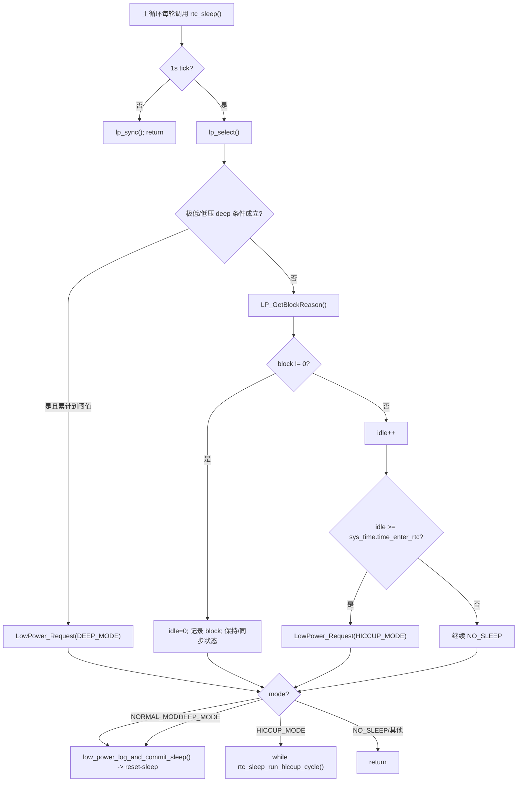

# 低功耗状态机与阻塞条件冻结表

状态：部分验证。本文基于当前源码整理低功耗运行路径，作为后续重构前确认资料，不修改源码。

## 目录

- [范围](#范围)
- [低功耗入口](#低功耗入口)
- [状态变量](#状态变量)
- [运行期状态机](#运行期状态机)
- [blocker 表](#blocker-表)
- [HICCUP STOP 路径](#hiccup-stop-路径)
- [Reset Sleep 路径](#reset-sleep-路径)
- [唤醒判断](#唤醒判断)
- [外部请求低功耗的入口](#外部请求低功耗的入口)
- [高风险耦合点](#高风险耦合点)
- [重构前确认问题](#重构前确认问题)

## 范围

| 模块 | 文件 | 说明 |
| --- | --- | --- |
| 运行期低功耗状态机 | `103 + 309/Project/Source/rtc_sleep.c` | `rtc_sleep()`, blocker, HICCUP STOP |
| 低功耗 port 层 | `103 + 309/Project/Source/rtc_sleep_port.c` | 读取采样/IO/RTC/AFE/SOC，封装 STOP 与恢复 |
| reset-sleep/BootFlag | `103 + 309/Project/Source/SleepDeal.c` | 写 BKP flag，AFE sleep，MCU reset，上电后继续 STOP 等待 |
| AFE 唤醒判断 | `103 + 309/Project/Source/rtc_sleep_afe_sh367309.c` | STOP 后更新 AFE 数据、检测电流/MOS/故障 |
| LED 长按入口 | `103 + 309/Project/Source/LedBar.c` | 长按直接进入 `low_power_log_and_commit_sleep(DEEP_MODE)` |
| 采样/异常入口 | `103 + 309/Project/Source/DataDeal.c` | 充电检测、AFE monitor 可请求低功耗 |

## 低功耗入口

主循环中低功耗检查固定在 SCI/模拟校准后、CAN 处理前：

```text
Runtime_RunIoAndPowerTasks
├── AppInit_ServiceSci
├── App_AnlogCal
├── rtc_sleep
└── App_Can
```

含义：

| 顺序点 | 影响 |
| --- | --- |
| SCI 先于 `rtc_sleep()` | 本轮串口帧会先被处理，`Sci_IsAnyPortBusy()` 再参与 blocker 判断 |
| `rtc_sleep()` 先于 `App_Can()` | CAN RX ISR 入队后，主循环要到 `rtc_sleep()` 之后才执行 CAN APP 队列处理 |
| CAN busy 判断在 `rtc_sleep()` 内发生 | `Can_IsBusy()` 会消费 CAN 接收计数，影响下一次低功耗判断 |

## 状态变量

| 变量 | 类型 | 文件 | 含义 | 写入者 | 读取者 |
| --- | --- | --- | --- | --- | --- |
| `g_stLowPowerRtcStatus.mode` | `uint8_t` | `rtc_sleep.c` | 当前低功耗请求状态：`NORMAL/HICCUP/DEEP/NO_SLEEP` | `LowPower_Request()`, `lp_select()`, wake path | `rtc_sleep()`, debug |
| `g_stLowPowerRtcStatus.rtc` | `uint8_t` | `rtc_sleep.c` | 当前/最近是否 RTC 唤醒 | `lp_sync()` | debug |
| `g_stLowPowerRtcStatus.comm` | `uint8_t` | `rtc_sleep.c` | 外部通信计数快照 | `LP_GetBlockReason()` | debug |
| `g_stLowPowerRtcStatus.idle` | `uint16_t` | `rtc_sleep.c` | 无 blocker 空闲累计秒 | `lp_idle()`, `lp_deep()`, `lp_select()` | debug |
| `g_stLowPowerRtcStatus.idleMax` | `uint16_t` | `rtc_sleep.c` | `sys_time.time_enter_rtc` 快照 | `lp_sync()` | debug |
| `g_stLowPowerRtcStatus.force` | `uint16_t` | `rtc_sleep.c` | 极低电压强制 deep 累计秒 | `lp_deep()` | debug |
| `g_stLowPowerRtcStatus.vlow` | `uint32_t` | `rtc_sleep.c` | 低压 deep 条件累计秒 | `lp_deep()` | debug |
| `g_stLowPowerRtcStatus.block` | `uint32_t` | `rtc_sleep.c` | blocker bitmask | `lp_select()` | debug |
| `g_stLowPowerRtcStatus.sleep` | `uint32_t` | `rtc_sleep.c` | HICCUP 连续 STOP 累计睡眠秒 | `rtc_sleep_run_hiccup_cycle()` | SOC 补偿、debug |
| `g_stLowPowerRtcStatus.last` | `uint32_t` | `rtc_sleep.c` | 最近一次 HICCUP 结束累计秒 | `LP_RecordLastSleepSeconds()` | debug |
| `g_stLowPowerRtcStatus.cycles` | `uint32_t` | `rtc_sleep.c` | HICCUP 连续 RTC 唤醒次数 | `rtc_sleep_run_hiccup_cycle()` | debug |
| `g_irq_t` | `enum irqWakeup` | `rtc_sleep.c` | STOP 退出原因 | `isException()`, guess wake | wake callback/debug |
| `s_sleep.ext_comm` | `uint8_t` | `SleepDeal.c` | 串口外部通信计数 | `SleepDeal_RecordExternalComm()` | `LP_GetBlockReason()` |
| `s_sleep.boot_sleep` | `uint8_t` | `SleepDeal.c` | 本次启动是否来自 sleep flag | `IsSleepStartUp()` | 其他模块/调试 |
| `s_sleep.chg_wake` | `uint8_t` | `SleepDeal.c` | 是否由充电器唤醒 | `SleepDeal_MarkBootFromSleepChargerWakeup()` | 其他模块/调试 |

## 运行期状态机



关键点：

| 逻辑 | 当前实现 |
| --- | --- |
| `rtc_sleep()` 只在 1s tick 时做状态选择 | `RtcSleep_PortIsOneSecondTick()` 读 `g_st_SysTimeFlag.bits.b1Sys1000msFlag` |
| 极低电压优先 | `u16VCellMin <= 2800mV` 且充电电流 `<=5`，累计 60s 后请求 `DEEP_MODE` |
| 低压 deep 次优先 | `u16VCellMin <= OtherElement.u16Sleep_Vlow` 且充电电流 `<=5`，累计 `u16Sleep_TimeVlow * 60s` |
| blocker 存在则不累计 idle | `g_stLowPowerRtcStatus.idle=0` |
| 无 blocker 累计 idle | 达到 `sys_time.time_enter_rtc` 后请求 `HICCUP_MODE` |
| `NORMAL_MODE/DEEP_MODE` 走 reset-sleep | 记录日志后 `SleepDeal_Continue()` |
| `HICCUP_MODE` 走运行期 STOP 循环 | 可能在 `while` 中连续 STOP，不返回主循环 |

## blocker 表

| bit | 宏 | 条件 | 当前数据源 | 副作用/注意 |
| --- | --- | --- | --- | --- |
| 0 | `LP_BLOCK_CHARGE` | `RtcSleep_PortGetChargeCurrentMa() > 10` | `g_stCellInfoReport.u16Ichg` | 函数名写 `Ma`，实际返回 `A*10` |
| 1 | `LP_BLOCK_DISCHARGE` | `RtcSleep_PortGetDischargeCurrentMa() > 10` | `g_stCellInfoReport.u16IDischg` | 函数名写 `Ma`，实际返回 `A*10` |
| 2 | `LP_BLOCK_COMM` | `Sci_IsAnyPortBusy() != 0` 或 `Can_IsBusy() != 0` | SCI runtime/CAN runtime | `Can_IsBusy()` 会更新 `sys_time.last_ext_comm_cnt_can` |
| 3 | `LP_BLOCK_KEY` | `RtcSleep_PortIsMcuWakeActive() != 0` | `GPIO_MCU_WK/PIN_MCU_WK` | GPIO 极性需结合硬件确认 |
| 4 | `LP_BLOCK_EXT_COMM` | `SleepDeal_GetExternalCommCounter()` 与快照不同 | `s_sleep.ext_comm` | SCI RXNE ISR 每收字节调用 `SleepDeal_RecordExternalComm()` |
| 5 | `LP_BLOCK_FLASH_BUSY` | `StorageFlash_IsBusy()` 或 `u8FlashUpdateE2PROM != 0` | Flash/IAP 状态 | 防止写 Flash 期间睡眠 |
| 6 | `LP_BLOCK_UPGRADE` | `u8FlashUpdateFlag != 0` | SCI/CAN IAP 请求 | 升级期间阻止低功耗 |
| 7 | `LP_BLOCK_FAULT` | `g_stCellInfoReport.unMdlFault_Third.all != 0` | 保护/AFE/SOC fault | 故障位未清会一直阻止 |
| 8 | `LP_BLOCK_LED_ACTIVE` | `LedBar_IsActiveForLowPower() != 0` | LED runtime | 防止显示窗口被睡眠打断 |
| 9 | `LP_BLOCK_AGING` | `mode==NO_SLEEP && FactoryAging_IsActive()!=0` | 老化状态 | 老化期间阻止自动睡眠 |

## HICCUP STOP 路径

```text
rtc_sleep()
└── HICCUP_MODE
    └── while (rtc_sleep_run_hiccup_cycle())
        ├── rtc_sleep_prepare_rtc()
        │   ├── RtcSleep_PortPrepareRtcStop()
        │   │   ├── LowPowerSleep_SaveCoreState()
        │   │   ├── Init_RTC()
        │   │   ├── IOstatus_RTCMode()
        │   │   └── InitWakeUp_RTCMode()
        │   ├── RTC_ClearStopWakeup()
        │   └── g_irq_t = NO_IRQ
        ├── RtcSleep_PortEnterStop()
        │   └── Sys_StopMode()
        ├── RtcSleep_PortDisableStopWakeup()
        ├── if RTC wake: cycles++, sleep += elapsed
        ├── RtcSleep_PortRestoreAfterStop()
        │   └── InitRunAfterStopWakeup()
        ├── if RTC wake && !isException()
        │   ├── SOC_ApplyRtcRelaxationCompensation()
        │   └── return true
        └── else
            ├── LowPower_Request(NO_SLEEP)
            ├── guess/on wake source
            ├── LP_RecordLastSleepSeconds()
            ├── RtcSleep_PortAddRuntimeSeconds()
            ├── cycles=0; sleep=0
            └── return false
```

`isException()` 当前依次检查：

| 顺序 | 函数 | 当前行为 |
| --- | --- | --- |
| 1 | `RtcSleep_PortUpdateRtcData()` | 通过 AFE 更新电压/温度，失败则异常 |
| 2 | `RtcSleep_PortHasCurrentWake()` | `DataLoad_Current()` 后若充/放电电流非 0，则 `g_irq_t=current_wake` |
| 3 | `RtcSleep_PortHasAfeWake()` | 读 AFE MTP/BSTATUS，MOS 关闭或 fault 非 0 则异常 |
| 4 | `RtcSleep_PortIsEmergencyWakeVoltage()` | `u16VCellMin <= 2750mV` 则异常 |

## Reset Sleep 路径

`NORMAL_MODE` 和 `DEEP_MODE` 不走 HICCUP while 循环，而是记录日志后 reset：

```text
low_power_log_and_commit_sleep(NORMAL/DEEP)
└── RtcSleep_PortCommitResetSleep()
    ├── LogRecord_RequestSleep()
    ├── LogEvent_Record(BMS_SLEEP)
    └── SleepDeal_Continue()
        ├── LowPowerSleep_SaveResetState()
        ├── BootFlag_Write(FLASH_NORMAL/DEEP_SLEEP_VALUE)
        ├── InitAFE1_Sleep(0)
        ├── AFE_Sleep()
        └── MCU_RESET()
```

复位后启动阶段 `AppInit_InitDevice()` 早期调用 `IsSleepStartUp()`：

```text
IsSleepStartUp()
├── BootFlag_Read()
├── 根据 FLASH_*_SLEEP_VALUE 配置 IO 和唤醒源
├── do Sys_StopMode() while (!IsSleepWakeupValid())
├── IORecover_*Mode()
└── BootFlag_Clear()
```

`IsSleepWakeupValid()` 当前逻辑：

| 条件 | 行为 |
| --- | --- |
| 充电器唤醒有效 | 标记 `FLASH_SLEEP_CHARGER_WAKE_VALUE`，返回有效 |
| 按键未保持 | `LedBar_PrepareForStop()`，返回无效，继续 STOP |
| 按键保持超过 `DI1_LONG_PRESS_WAKE_10MS=50` | 返回有效 |
| 按键短按后显示窗口结束 | `LedBar_PrepareForStop()`，返回无效 |

## 唤醒判断

| 唤醒来源 | 当前枚举 | 设置位置 | 后续动作 |
| --- | --- | --- | --- |
| RTC 周期唤醒 | `NO_IRQ` 或保持默认 | `RTC_IsStopWakeup()` 为真且无异常 | 累计睡眠秒，SOC RTC rest 补偿，继续 STOP |
| 电流唤醒 | `current_wake` | `RtcSleep_AfePortHasCurrentWake()` | 退出 HICCUP，记录 last sleep |
| AFE MOS 关闭 | `chg_dsg_close` | `RtcSleep_AfePortHasAfeWake()` | 退出 HICCUP |
| AFE fault | `error_wake` | `RtcSleep_AfePortHasAfeWake()` | 退出 HICCUP |
| 应急低压 | 未显式设置，可能由 guess 补 | `RtcSleep_PortIsEmergencyWakeVoltage()` | 退出 HICCUP |
| CHG_IN | `PA0_irq` | `RtcSleep_PortGuessWakeupSource()` | 退出 HICCUP |
| SW key | `soc_key` | `RtcSleep_PortGuessWakeupSource()` | `RtcSleep_PortOnWakeupSource()` 请求 LED SOC 显示 |

## 外部请求低功耗的入口

| 入口 | 文件 | 请求模式 | 当前触发 |
| --- | --- | --- | --- |
| `LowPower_Request(DEEP_MODE)` | `DataDeal.c` | DEEP | 充电器检测状态从连接转断开 |
| `LowPower_Request(NORMAL_MODE)` | `DataDeal.c` | NORMAL | AFE monitor error 延时达到阈值 |
| `LowPower_Request(DEEP_MODE)` | `Sci_Upper.c` | DEEP | 上位机功能 id `0x0A` 打开 |
| `low_power_log_and_commit_sleep(DEEP_MODE)` | `LedBar.c` | DEEP reset-sleep | 长按键达到阈值 |
| `LowPower_Request(DEEP_MODE)` | `rtc_sleep.c` | DEEP | 极低电压/低压累计到阈值 |
| `LowPower_Request(HICCUP_MODE)` | `rtc_sleep.c` | HICCUP | 无 blocker idle 累计到阈值 |

## 高风险耦合点

| 耦合点 | 风险 |
| --- | --- |
| `Can_IsBusy()` 不是纯查询 | 会更新 `sys_time.last_ext_comm_cnt_can`，影响后续低功耗判断 |
| `RtcSleep_PortGetChargeCurrentMa()` 命名与单位不一致 | 返回 `u16Ichg`，实际单位是 `A*10`，后续阈值阅读容易出错 |
| `g_stCellInfoReport.unMdlFault_Third.all` 是 blocker | 故障位清除链路会直接影响能否睡眠 |
| `LedBar_IsActiveForLowPower()` 是 blocker | UI 显示策略与低功耗进入耦合 |
| HICCUP while 循环可能长期不返回主循环 | 低功耗优先，但通信/CAN/background task 会暂停 |
| reset-sleep 和 HICCUP STOP 是两条不同路径 | 一次性合并容易破坏 BootFlag/IO 恢复 |
| `__EnableLowPowerDebug__` 会影响 STOP/Standby 调试位 | 功耗实测前必须确认关闭 |

## 重构前确认问题

| ID | 问题 | 建议 |
| --- | --- | --- |
| LP-Q1 | `u16Ichg/u16IDischg > 10` 阈值实际是否表示 `>1.0A`？ | 统一文档为 `A*10`，不要按 mA 理解 |
| LP-Q2 | HICCUP 连续 STOP 是否是当前产品希望的用户体验？ | 若需要通信响应，需评估是否限制连续 STOP 轮数 |
| LP-Q3 | `LP_BLOCK_FAULT` 是否应阻止所有故障下的低功耗？ | 需要按故障等级确认 |
| LP-Q4 | LED active 是否必须阻止低功耗？ | 需确认显示体验优先级 |
| LP-Q5 | 工厂老化只在 `NO_SLEEP` 时阻塞是否符合需求？ | 需确认老化过程中是否可能已有 sleep mode |
| LP-Q6 | 充电器断开后直接 `LowPower_Request(DEEP_MODE)` 是否符合当前体验？ | 该路径在 `charger_detect_and_keyLogi_200ms()` 内，建议人工确认 |
| LP-Q7 | `SleepDeal_Continue(HICCUP_MODE)` 仍存在，但运行期 HICCUP 现在走 `rtc_sleep_run_hiccup_cycle()` | 需确认 reset-sleep 的 HICCUP flag 是否仍会被使用 |
