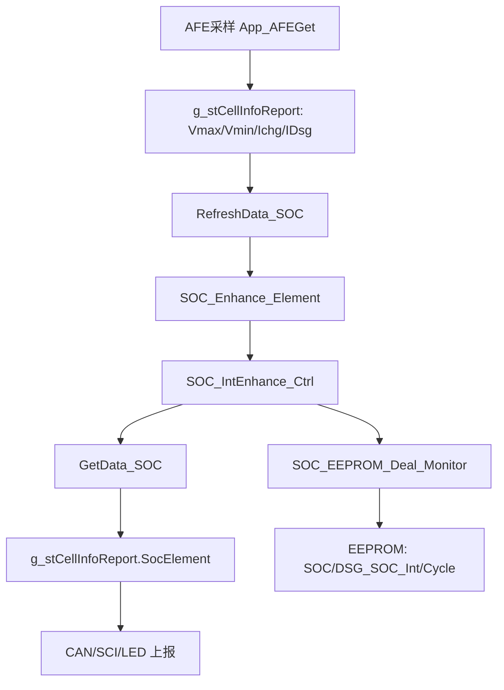

# SOC 完整逻辑梳理

生成日期：2026-05-19

## 1. 模块边界

SOC 模块由三层组成：

| 层级 | 主要文件 | 职责 |
| --- | --- | --- |
| 应用入口 | `103 + 309/Project/Source/SOC.c` | 从系统采样区取电压、电流，调用 SOC 内核，回写给上报区 |
| SOC 内核 | `103 + 309/Project/Source/SocEnhance.c` | 容量积分、OCV 查表、满空校准、静置修正、自耗补偿、EEPROM 保存 |
| 参数与通信 | `DataDeal.h`、`EEPROM.c`、`Sci_Upper.c`、`Can_HDX.c`、`LedBar.c` | 参数默认值、EEPROM 读写、上位机配置、CAN/LED 输出 |

主循环入口在 `main.c`：每轮按 `App_AFEGet()`、`App_WarnCtrl()`、通信、EEPROM、均衡、休眠、`App_SOC()` 的顺序执行。SOC 使用的是已经由 `App_AFEGet()` 刷新的 `g_stCellInfoReport` 数据，因此 SOC 自身不直接访问 AFE。

## 2. 数据流

关键输入：

- 单体电压最大/最小值：`g_stCellInfoReport.u16VCellMax`、`u16VCellMin`，单位 mV。
- 充放电电流：`g_stCellInfoReport.u16Ichg`、`u16IDischg`，单位 A*10。
- 容量与阈值参数：`OtherElement.u16Soc_Ah`、`u16Soc_Cycle_times`、`u16Soc_TableSelect`、`u16Soc_V_100`、`u16Soc_V_0`。
- SOC 曲线：`SOC_Table_Set` 或内置三元/铁锂表。

关键输出：

- `g_stCellInfoReport.SocElement.u16Soc`：百分比 SOC，0-100。
- `u8SOH`、`u16Capacity_Now`、`u16Capacity_Full`、`u16Cycle_times`。
- CAN 报文和 SCI 读取均从 `g_stCellInfoReport.SocElement` 取值。

## 3. 初始化逻辑

`InitData_SOC()` 在系统初始化和上位机修改 SOC 参数后调用：

1. 从 `OtherElement` 拷贝容量、循环、表选择、100%/0% 电压。
2. 拷贝 `SOC_Table_Set` 到 `SOC_Enhance_Element.SOC_Table_CanSet`。
3. 调用 `soc_param_lib_init()`。
4. 立即调用 `GetData_SOC()`，把初始结果写回系统上报区。

`soc_param_lib_init()` 的核心动作：

- `SOC_UpdateCapacityParam()` 把 `u16Soc_Ah` 转为内部容量基准。输入单位是 10*Ah，内部按 `As*10` 计。
- 读取 EEPROM 中的 `E2P_ADDR_SOC`、`E2P_ADDR_DSG_SOC_Int`、`E2P_ADDR_CYCLE_TIMES`。
- EEPROM SOC 合法时直接恢复，非法或大于 100 时走启动 OCV 查表；电压无效时默认 60%。
- `u32CapFull` 当前实现固定等于工厂容量，循环次数按 EEPROM 或默认值恢复。

启动 OCV 只依赖单体最小电压查表，前置校验为：

- `Vmin`、`Vmax` 在 2000-5000 mV；
- `Vmax >= Vmin`；
- 单体压差小于 600 mV。

## 4. 运行节拍

`App_SOC()` 只在 `gu8_200msAccClock_Flag` 置位时运行，实际 SOC 内核节拍是 200 ms。

单次 200 ms 的执行顺序：

1. `RefreshData_SOC()`：采集本次电压、电流快照。
2. `SOC_Run200msCalculation()`：按充电、放电、静置三种方向处理容量。
3. `soc_cali()`：满充/空放锚点校准。
4. `SOC_EEPROM_Deal_Monitor()`：SOC、放电积分、循环次数变化时写 EEPROM。
5. `SOC_RefreshData_Monitor()`：处理上位机触发的重新初始化或一次性设置 SOC。
6. `SOC_Result_Pass()`：每 5 次 SOC 调用向外发布一次结果，约 1 s 更新一次显示/上报区。
7. `GetData_SOC()`：把结果复制到 `g_stCellInfoReport.SocElement`，并应用系统固定 SOC 或清零覆盖。

## 5. 充放电识别

当前虚电流阈值在 `SocEnhance.c` 中固定：

- `SOC_VIRTUAL_CURRENT_CHG = 2`，即 `Ichg >= 0.2 A` 认为充电。
- `SOC_VIRTUAL_CURRENT_DSG = 2`，即 `IDsg >= 0.2 A` 认为放电。
- 两者都低于阈值时认为静置。

方向切换时会调用 `SOC_SetCalcDirection()`：

- 清空主容量变化缓存 `u32CapChange`；
- 清空充放电毫安毫秒余数；
- 清空自耗补偿累计量；
- 避免上一方向的积分余数污染下一方向。

## 6. 容量积分

内部容量单位是 `As*10`，这样 250 Ah 会表示为 `250 * 3600`。

充电路径：

1. 将 `Ichg(A*10)` 转为 mA：`Ichg * 100`。
2. 通过 `SOC_CurrentMaToCapDelta()` 按 200 ms 积分，余数保存在充电余数变量。
3. `SOC_ApplyCapacityDelta()` 增加 `u32CapNow`，上限为 `u32CapFull`。
4. 当累计容量变化换算出的百分比达到 1% 时，SOC 逐步增加。
5. 同时累加 `u32CapFull_Cal_As`，用于满充段容量统计。

放电路径：

1. 将 `IDsg(A*10)` 转为 mA：`IDsg * 100`。
2. 通过同一积分函数计算容量变化。
3. `SOC_ApplyCapacityDelta()` 扣减 `u32CapNow`，下限为 0。
4. 百分比达到 1% 时，SOC 逐步减少。
5. 放电容量同时进入 `SOC_AccumulateDischargeCycle()`，更新循环次数相关统计。

积分到百分比转换使用 64 位中间值，降低大容量包溢出风险。

## 7. 校准策略

### 7.1 端点电压缓慢牵引

`CorrectionTerminal_CV()` 负责接近满/空端点时的逐步牵引：

- 充电接近满电：
  - `Vmax` 在 `V100 - 100 mV` 到 `V100` 之间，且 SOC < 95%，默认持续 60 s 后每次 +1%。
  - `Vmax >= V100` 且 SOC < 100%，根据 SOC 高低默认使用 60 s 或 30 s 牵引。
  - `Vmax >= V100 + 50 mV`，默认持续 30 s 强制 +1%。
- 放电接近空电：
  - `Vmin` 在 `V0` 到 `V0 + 100 mV` 之间，且 SOC > 5%，默认持续 60 s 后每次 -1%。
  - `Vmin <= V0` 且 SOC > 0%，根据 SOC 高低默认使用 60 s 或 30 s 牵引。
  - `Vmin <= V0 - 50 mV`，默认持续 30 s 强制 -1%。
- 当 SOC 已低于等于 1%，但 `Vmin > V0`，会保持当前 SOC 并把容量对齐到当前百分比，避免过早归零。

### 7.2 满充/空放锚点校准

`soc_cali()` 是更强的锚点校准：

- 充电时，`Vmax >= V100` 且 `Vmin >= SOC_FULL_CELL_MIN_MV`，默认持续 30 s 后直接校准到 100%，并把 `CapNow` 对齐到 `CapFull`。
- 放电时，`Vmin <= V0` 且电压不低于 2000 mV，默认持续 30 s 后直接校准到 0%。
- 无电流时清除满充/空放校准延时。

`SOC_FULL_CELL_MIN_MV` 随电池类型变化：三元默认 4000 mV，铁锂默认 3300 mV。

### 7.3 静置 OCV 修正

`SOC_RestOcvCorrectionTick()` 只在无充放电电流时运行：

- 静置累计 1800 s 后开始修正。
- 静置路径永远不允许向上校准：即使满足满电电压，也不会直接置 100%，也不会按 OCV 向上加 SOC。
- 若满足空电锚点，直接置 0%；否则每 600 s 查一次 OCV 表，只有当前 SOC 高于 OCV SOC 超过 5% 时，才向下修正 1%。
- 静置修正只在有效电压和有效容量参数下执行。

### 7.4 上位机触发校准

`SOC_RefreshData_Monitor()` 处理 `u16_RefreshData_Flag`：

- `1`：按当前电压重新 OCV 启动估算。
- `2`：重置循环、容量参数和放电积分，保留当前 SOC 后重算容量。
- `3`：一次性设置 SOC 为 `u8_SetSocOnce`。
- 其他值：按当前 SOC 和容量参数重新对齐。

上位机写 SOC 参数、SOC 表、功能开关或一次性 SOC 时会触发这些路径。

## 8. 自耗补偿

当前已加入自耗补偿，默认配置：

- `SOC_SELF_CONSUME_ENABLE = 1`。
- `SOC_SELF_CONSUME_CURRENT_MA = 15`。

自耗只在静置方向执行，并且有独立累计变量：

- 使用 `s_u32SelfConsumeMaMs` 计算 15 mA 在 200 ms 内的微小容量变化。
- 使用 `s_u32SelfConsumeCapChange` 记录自耗引起的容量变化。
- 只扣减 `u32CapNow` 和最终 SOC，不写入主充放电 `u32CapChange`。
- 不参与循环次数、不触发满空校准、不改变 OCV/端点校准判断。

因此自耗只影响静置期间 SOC 的自然下降，不影响充放电积分、SOC 校准、循环统计和上位机校准逻辑。

## 9. EEPROM 保存

`SOC_EEPROM_Deal_Monitor()` 每个 SOC 周期检查：

- SOC 变化：写 `E2P_ADDR_SOC`。
- 放电积分变化：写 `E2P_ADDR_DSG_SOC_Int`。
- 循环次数变化：写 `E2P_ADDR_CYCLE_TIMES`。

保存通过 `SOC_DealEEPROM_Data(EEPROM_DATA_REFRESH)` 完成。读取时会校验 SOC 范围和循环次数范围，异常时回退到启动 OCV 或默认值。

## 10. 对外接口

- SCI 写保护参数和 SOC 表后会调用 `InitData_SOC()`。
- SCI 写 SOC 参数后调用 `InitData_SOC()`，并置 `u16_RefreshData_Flag = 2`。
- SCI 一次性设置 SOC 时置 `u16_RefreshData_Flag = 3`。
- CAN 输出 SOC、SOH、当前容量、满容量和循环次数。
- LED 电量条直接读取 `g_stCellInfoReport.SocElement.u16Soc`。

## 11. 当前风险和维护建议

1. `App_SOC()` 在主循环靠后执行，若 `App_AFEGet()` 因 SCI 发送或 EEPROM 写入跳过，本周期 SOC 会继续使用上一次采样数据。
2. `soc_param_lib_init()` 会调用 EEPROM 读，频繁通过上位机写参数触发时要确认 EEPROM 节拍不会阻塞 AFE 采样。
3. SOC 固定和 SOC 清零覆盖发生在 `GetData_SOC()`，只影响上报值，不改内核 `u8SOC_Now`，维护时不要把它当作真正校准。
4. 当前 `CorrectionTerminal_CC()` 为空，端点修正主要依赖 CV、电压锚点和 OCV 静置修正。
5. 自耗配置是编译期宏，不需要用户配置；后续若接入上位机配置，必须继续保持与主积分和校准计数隔离。
