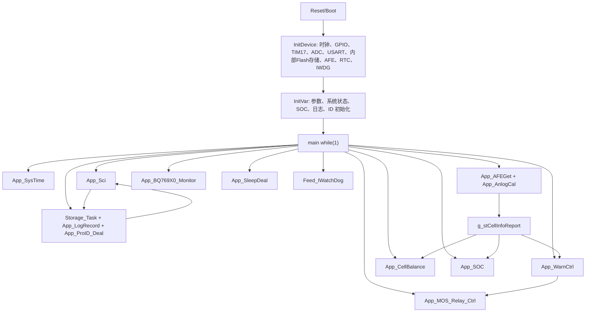

# 项目总说明

本文档用于长期保存当前固件工程的整体结构、MCU 资源、主流程和模块边界。工程源码以 Keil uVision 工程 `CommomBQ769x0_16series_030C8T6_C.uvprojx` 为入口，目标 MCU 为 `STM32F030C8`，应用场景为基于 `BQ769x0` AFE 的多串锂电池 BMS。

## 结论摘要

- MCU：`STM32F030C8`，Cortex-M0，Flash 64KB，SRAM 8KB。
- 工具链：Keil MDK + STM32F0 Standard Peripheral Library。
- 应用入口：[main.c](../Code/Source/main.c)。
- 默认电芯类型：`LIFEPO`。
- 默认串数配置：`SNum = 4`，但代码内保留 4 至 16 串映射能力。
- 默认通信：公共上位机协议 `Sci_Upper` 同时启用 `USART1` 与 `USART2`，波特率 `19200`。
- 核心外设：软件 I2C 访问 `BQ769x0`，ADC + DMA 采样温度，TIM17 提供 1ms/10ms/200ms 等系统节拍，IWDG 看门狗，内部 Flash 保存参数和记录。
- 模板 profile：`a002_f030_bq76940`，App 为 `0x08001C00..0x0800DFFF`，Storage 为 `0x0800E000..0x0800FFFF`，软件保护为主。
- 低功耗：当前源码只有 `SleepDeal` + `RTC` 路径，`IdleSleep` 旧说明已废止。

## 文档索引

### 全局说明

- [A002 模板改造状态](A002_REFACTOR_STATUS_2026-05-16.md)
- [MCU 资源与引脚分配](modules/00-mcu-resources.md)
- [构建配置与条件编译](modules/01-build-and-config.md)
- [主流程与任务调度](modules/02-main-flow.md)
- [系统初始化与时基](modules/03-system-init-timebase.md)
- [系统监控与启动门控](modules/04-system-monitor.md)

### AFE、采样与数据链路

- [AFE I2C 驱动](modules/05-afe-i2c-driver.md)
- [BQ769x0 监控与 AFE 故障处理](modules/06-bq769x0-monitor.md)
- [数据处理与电芯信息汇总](modules/07-data-deal.md)
- [ADC 与模拟量采样](modules/08-adc.md)
- [短路参数与过流阈值辅助](modules/25-pwm-short-current.md)

### 存储、通信与升级

- [内部 Flash 参数与记录存储](modules/09-eeprom.md)
- [Flash、IAP 与启动标志](modules/10-flash-iap.md)
- [公共上位机串口协议](modules/11-sci-upper.md)
- [客户串口协议](modules/12-uart-client.md)
- [I2C Slave 预留模块](modules/26-i2c-slave.md)

### BMS 控制逻辑

- [故障保护与告警](modules/13-fault-protection.md)
- [MOS/Relay 驱动控制](modules/14-io-control-drivers.md)
- [电芯均衡](modules/15-cell-balance.md)
- [SOC/SOH 估算](modules/16-soc.md)
- [历史睡眠状态机](modules/17-sleep-deal.md)
- [IdleSleep 废止说明](modules/18-idle-sleep.md)
- [RTC 与周期唤醒](modules/19-rtc.md)
- [充电器与负载检测](modules/20-charger-load.md)
- [加热与冷却控制](modules/21-heat-cool.md)

### 生产、日志与辅助模块

- [事件日志记录](modules/22-log-record.md)
- [生产 ID 与版本信息](modules/23-production-id.md)
- [SOC LED Bar](modules/24-led-bar.md)
- [公共工具函数](modules/27-pubfunc.md)
- [BSP 与软件 I2C 基础层](modules/28-bsp.md)
- [LED_Buzzer 历史模块](modules/29-led-buzzer-legacy.md)
- [STM32 驱动库与中断层](modules/30-stm32-driver-layer.md)
- [预留模板与未参与构建文件](modules/31-reserved-template-files.md)

## 总体架构

## 关键执行链路

1. `main()` 调用 `InitDevice()` 完成 MCU 外设、AFE、内部 Flash 存储、通信与看门狗初始化。
2. `InitVar()` 从内部 Flash 恢复保护参数、校准参数、SOC 参数、生产信息和历史记录。
3. 主循环通过 TIM17 产生的全局节拍标志调度各应用模块。
4. `DataDeal` 从 `BQ769x0` 和 ADC 获取电芯电压、电池包电压、电流、温度等基础数据。
5. `Fault` 基于保护参数判断告警和故障等级，更新 `Protect_Flag`、`Warn_Flag` 与故障记录。
6. `IO_Control` 与 `IODrivers_030` 根据故障、电流、外部命令和驱动拓扑决定 CHG/DSG MOS 或 Relay 状态。
7. `SOC` 使用 OCV 表、容量积分、校准参数和运行状态估算 SOC/SOH。
8. `Storage` facade、`Flash`、`LogRecord` 和 `ProductionID` 负责参数持久化、升级标志、事件记录和生产信息；旧 `EEPROM` 符号只作为逻辑地址兼容层，当前默认实际写入 MCU 内部 Flash 存储区。
9. `Sci_Upper` 向上位机暴露只读状态、参数读写、事件记录读取和升级入口。
10. `SleepDeal` 负责低功耗进入、唤醒源配置和唤醒原因记录；当前没有 `IdleSleep` 源码。

## 当前启用与预留能力

| 能力 | 默认状态 | 说明 |
| --- | --- | --- |
| BQ769x0 AFE | 启用 | 主数据采样与 MOS 控制依赖该模块。 |
| 公共上位机协议 `Sci_Upper` | 启用 | `USART1`、`USART2` 同时启用。 |
| 客户协议 `Uart_Client` | 未启用 | `_CLIENT_SCI1/_CLIENT_SCI2` 未定义。 |
| RTC | 源码存在，主流程部分启用 | `SleepDeal` 可配合 RTC 周期唤醒；部分 SOC 修正受 `__FUNC_RTC__` 控制。 |
| 加热控制 | 未启用 | `__FUNC__HEAT__` 未定义。 |
| SOC LED Bar | 未启用 | `__FUNC__LED__` 未定义，且资源与主 MOS/ADC 存在冲突。 |
| PWM | 未在主流程初始化 | 源码参与构建，但默认不调用。 |
| I2C Slave | 预留骨架 | 初始化与处理函数为空。 |
| LED_Buzzer | 历史模块 | Keil 工程中排除构建。 |

## 维护注意事项

- 该工程存在多个客户版本和历史兼容分支，判断实际功能时应以 `main.h` 宏、Keil 工程是否包含构建、以及 `main.c` 是否调用为准。
- 部分头文件中的引脚宏是历史遗留，例如 AFE I2C 头文件存在 PF6/PF7 宏，但当前实际 AFE I2C 由 `bsp_i2c_gpio1.c` 使用 PB10/PB11 实现。
- 多个条件功能复用了同一 GPIO。启用 `LED Bar`、`PWM`、`Heat`、`Client UART` 等功能前必须先检查 [MCU 资源与引脚分配](modules/00-mcu-resources.md) 中的冲突表。
- 存储写入采用分时服务模式。新增参数写入时应复用现有写入标志和 `Storage_Task()` 框架，避免在主循环中长时间阻塞；当前内部 Flash 配置还要评估擦写寿命。
- 保护、驱动、SOC、均衡都依赖 `g_stCellInfoReport`，新增数据字段时应同步检查通信协议映射、日志记录和内部 Flash 参数兼容性。
