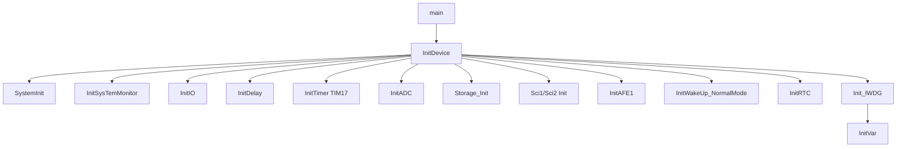
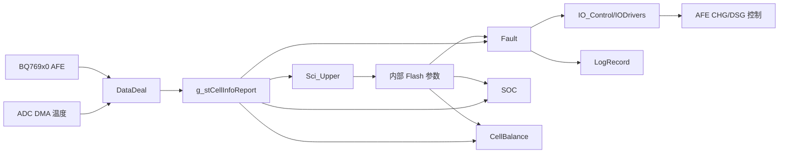

# 主流程与任务调度

## 入口函数

应用入口为 [main.c](../../Code/Source/main.c)。

```c
int main(void)
{
    InitDevice();
    InitVar();

    while (1)
    {
        ...
    }
}
```

`main()` 的设计是典型裸机超级循环结构：中断只负责接收、计时和唤醒，业务逻辑集中在主循环中按标志分时执行。

## 初始化顺序



`InitDevice()` 负责硬件资源与底层驱动，`InitVar()` 负责业务变量、内部 Flash 参数、状态机和记录恢复。

## 主循环调度顺序

| 顺序 | 函数 | 主要职责 |
| --- | --- | --- |
| 1 | `App_SysTime()` | 系统时间与软计数维护。 |
| 2 | `App_Sci()` | `PROJECT_FEATURE_RS485` 启用时运行，负责串口协议解析、回复、参数读写入口。 |
| 3 | `App_AFEGet()` | 分时读取 AFE 电压、电流、温度基础数据。 |
| 4 | `App_BQ769X0_Monitor()` | 监控 AFE 状态寄存器、MOS 状态和 AFE 故障。 |
| 5 | `App_WarnCtrl()` | 保护与告警判断。 |
| 6 | `App_MOS_Relay_Ctrl()` | CHG/DSG MOS 或 Relay 驱动决策。 |
| 7 | `App_AnlogCal()` | ADC 温度采样换算与滤波。 |
| 8 | `Storage_Task()` | 内部 Flash 参数分时写入和参数持久化；旧 `App_E2promDeal()` 仅保留兼容包装。 |
| 9 | `App_CellBalance()` | 电芯均衡策略与 AFE 均衡寄存器写入。 |
| 10 | `App_SOC()` | `PROJECT_FEATURE_SOC` 启用时运行，负责 SOC/SOH、容量与循环次数估算。 |
| 11 | `App_SleepDeal()` | `PROJECT_FEATURE_LOW_POWER` 启用时运行，是当前唯一低功耗主入口。 |
| 12 | `App_Heat_Cool_Ctrl()` | `PROJECT_FEATURE_HEAT` 启用时运行，加热/冷却控制。 |
| 13 | `APP_LedBar()` | `PROJECT_FEATURE_LEDBAR` 启用时运行，SOC LED 显示与按键。 |
| 14 | `App_ChargerLoad_Det()` | 充电器/负载检测与恢复。 |
| 15 | `App_FlashUpdateDet()` | 检测升级标志并复位。 |
| 16 | `App_LogRecord()` | 事件记录与故障日志保存。 |
| 17 | `App_ProID_Deal()` | 生产 ID、版本号读写服务。 |
| 18 | `Feed_IWatchDog()` | 喂独立看门狗。 |

## 任务节拍来源

`TIM17_IRQHandler()` 产生全局软件节拍标志。典型标志包括：

| 节拍 | 典型使用模块 |
| --- | --- |
| 1ms | ADC 换算、基础计时、部分驱动延时。 |
| 10ms | MOS/Relay 控制、通信超时、部分输入检测。 |
| 50ms | AFE 分时读取。 |
| 100ms | LED、部分驱动刷新。 |
| 200ms | SOC 算法。 |
| 1s | AFE 监控、均衡、日志、睡眠判断。 |

不同模块内部会再次检查 `System_FUNC_StartUp()` 或自身状态位，避免在启动阶段过早执行。

## 核心数据流



`g_stCellInfoReport` 是运行态核心数据结构，通信、保护、SOC、均衡和日志均依赖它。

## 设计判断

- 主循环函数顺序不是随意的：采样先于保护，保护先于驱动，驱动后再做存储、SOC、睡眠等低优先级任务。
- 内部 Flash 参数写入、AFE 读取和日志保存都采用分时处理，避免单次主循环阻塞过长。
- 低功耗逻辑放在主循环末尾，确保当轮关键控制和喂狗完成后再进入睡眠判断。
- 新增高优先级安全逻辑应放在采样之后、驱动之前；新增低优先级维护逻辑应放在喂狗前或低功耗前，并保证有超时保护。
- 当前模板源码没有 `IdleSleep.c` 或 `App_IdleSleep()`，不要按旧文档恢复第二套空闲睡眠路径。
