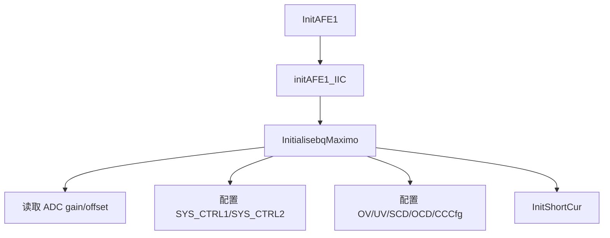

# AFE I2C 驱动

## 相关文件

- [I2C_AFE1.c](../../Code/Source/I2C_AFE1.c)
- [I2C_AFE1.h](../../Code/Include/I2C_AFE1.h)
- [bsp_i2c_gpio1.c](../../Code/Source/bsp/src/bsp_i2c_gpio1.c)
- [bqMaximo_Ctrl_G2553.h](../../Code/Include/bqMaximo_Ctrl_G2553.h)

## 模块职责

该模块负责通过软件 I2C 访问 `BQ769x0` AFE，完成寄存器读写、CRC 校验、初始化配置、电压/电流/温度寄存器读取和短路/过流阈值配置。

## 硬件资源

| 信号 | GPIO | 说明 |
| --- | --- | --- |
| AFE SCL | PB10 | 软件 I2C 时钟。 |
| AFE SDA | PB11 | 软件 I2C 数据。 |

`I2C_AFE1.h` 内保留的 PF6/PF7 I2C 宏属于历史遗留，当前实际初始化路径是 `initAFE1_IIC()` 调用 `bsp_InitI2C(GPIOB, GPIO_Pin_10, GPIO_Pin_11)`。

## 初始化流程

`InitAFE1(chg, dsg)` 会根据传入的 CHG/DSG 初始状态配置 AFE 的 MOS 控制位。

## 关键接口

| 接口 | 说明 |
| --- | --- |
| `InitAFE1()` | 初始化 AFE 软件 I2C 与 `BQ769x0` 寄存器。 |
| `I2C_ReadReg_Byte()` / `I2C_WriteReg_Byte()` | 单字节寄存器读写。 |
| `I2C_ReadReg_Group()` / `I2C_WriteReg_Group()` | 多字节寄存器读写。 |
| `UpdateVoltageFromBqMaximo_Partition()` | 分段读取电芯电压，降低单次阻塞时间。 |
| `UpdateCurrentFromBqMaximo()` | 读取 CC 电流原始值。 |
| `UpdateTemperatureFromBqMaximo()` | 读取 AFE 温度相关数据。 |
| `InitShortCur()` | 根据电流等级和参数配置 SCD/OCD 阈值。 |

## 分时读取策略

电芯电压读取采用 partition 策略，每次读取一部分寄存器，避免一次性读取全部电芯造成主循环长时间阻塞。`DataDeal` 以 50ms 级别调用该接口，逐步刷新完整电芯数据。

## 异常处理

- I2C 读写失败会反馈给上层 `MonitorAFE()`。
- AFE 通信异常达到阈值后会上报系统错误，并尝试唤醒/重新初始化 AFE。
- `BQ769X0_Func` 会定期读取 `SYS_STAT`，处理 `DEVICE_XREADY`、`OVRD_ALERT`、OV、UV、SCD、OCD 等 AFE 内部状态。

## 维护建议

- 修改 I2C 引脚时，优先修改 `bsp_i2c_gpio1.c` 的初始化路径，并同步更新资源表。
- 新增 AFE 寄存器访问应优先复用已有 CRC8 和 group read/write 接口。
- 不要在中断里直接访问 AFE I2C，软件 I2C 和寄存器访问应保持在主循环上下文。
