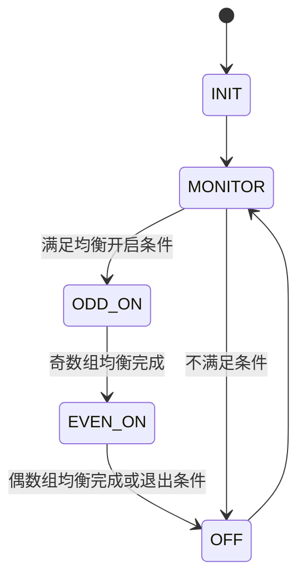

# 电芯均衡

## 相关文件

- [Cell_balance.c](../../Code/Source/Cell_balance.c)
- [Cell_balance.h](../../Code/Include/Cell_balance.h)
- [I2C_AFE1.c](../../Code/Source/I2C_AFE1.c)
- [DataDeal.c](../../Code/Source/DataDeal.c)

## 模块职责

`Cell_balance` 负责根据电芯电压、电流、压差和配置参数决定是否开启被动均衡，并通过 `BQ769x0` 的 `CELLBAL1/2/3` 寄存器控制各通道均衡。

## 状态机

## 开启条件

典型判断条件包括：

- 系统允许 Balance 功能启动。
- 当前电流小于均衡允许电流，默认约 1A 级别。
- 最低单体电压高于均衡开启电压。
- 单体压差超过均衡开启阈值。
- 无影响安全的高等级保护。

## 奇偶分组

为了避免相邻通道同时均衡造成热集中或 AFE 限制，模块按奇数组和偶数组交替开启。最终通过 AFE 均衡寄存器写入对应 cell balance bit。

## 串数映射

均衡通道必须与 `DataDeal` 中的 `SeriesSelect_AFE1` 保持一致。对于不同串数，逻辑电芯与 AFE 物理通道不是简单顺序关系。

`SeriesNum % 10 == 6` 时，代码中还会配置 PB7 `CB_6_16` 相关资源，属于特定串数/硬件版本路径。

## 与其他模块关系

| 模块 | 关系 |
| --- | --- |
| `DataDeal` | 提供单体电压、最大/最小电压和压差。 |
| `Storage` | 提供内部 Flash 中的均衡开启/关闭阈值参数。 |
| `I2C_AFE1` | 写入 AFE 均衡寄存器。 |
| `Fault` | 故障状态影响均衡是否允许。 |
| `LogRecord` | 均衡开启/关闭可记录事件。 |

## 维护建议

- 修改串数映射时必须同步验证均衡位映射。
- 均衡策略应保留滞回，避免压差在阈值附近导致频繁开关。
- 新增温度限制时建议在均衡状态机入口统一判断，而不是在寄存器写入处临时拦截。
