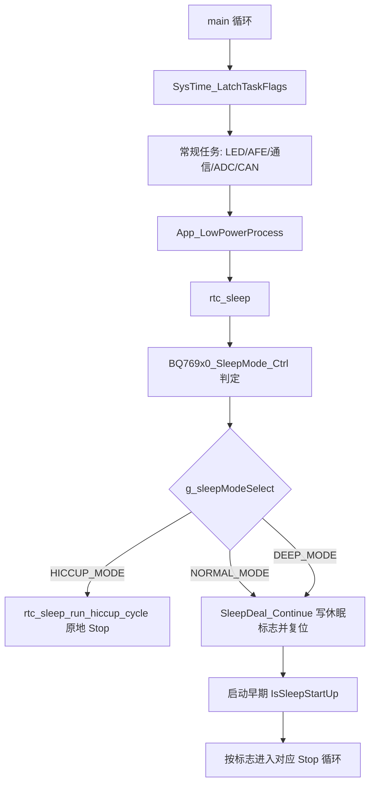

# 休眠低功耗逻辑梳理与优化建议

本文基于当前工作区源码梳理，不等同于已发布版本。当前仓库存在未提交改动，本文描述的是当前工作树状态。

## 结论

当前低功耗逻辑不是单一状态机，而是由两套机制拼接而成：

- 主循环运行期主要走 `rtc_sleep()` / `LowPower_Request()`，入口在 `main.c` 的 `App_LowPowerProcess()`。
- 普通休眠和深度休眠仍复用 `SleepDeal_Continue()` 写启动休眠标志、AFE 休眠、MCU 复位，再在启动早期由 `IsSleepStartUp()` 进入 Stop。
- RTC 打嗝休眠有两条路径：运行期 `rtc_sleep_run_hiccup_cycle()` 原地进入 Stop；复位后如果读到 HICCUP 启动标志，则 `IsSleepStartUp()` 也会进入 RTC Stop 循环。
- 空闲主循环 `__WFI()` 的轻量 Sleep 已实现为 `MainLoop_EnterIdleSleep()`，当前工作树已在主循环尾部调用。

因此，后续优化方向应优先收敛为“一套请求入口、一套模式提交、一套唤醒判定、一套 RTC 驱动”，再逐步删除旧分支。

## 本次优化记录

本阶段已完成以下低风险但影响明确的优化：

- `Init_RTC()` 改为先读取 `BKP_DR1`，只有首次初始化时才 `BKP_DeInit()`，避免反复清空 RTC 初始化标志、休眠启动标志和休眠 SOC 缓存。
- `RTC_WKTimeConfig()` 在设置新 Alarm 前先关闭 `RTC_IT_ALR`，统一清 `RTC_IT_ALR`、`RTC_FLAG_ALR` 和 `EXTI_Line17`，再重新打开 Alarm 中断。
- `RTCAlarm_IRQHandler()` 和 `RTC_IRQHandler()` 共用 Alarm 处理函数，统一清标志、累计 `sys_time.rtc_alm_cnt` 并置 `is_rtc_wakekup`。
- `DBGMCU_STOP` 仅在 `_DEBUG_` 下打开，避免非调试固件 Stop 电流被调试位抬高。
- `IsChargerWakeupActive()` 接回 PA0 实际电平判断，启动后休眠保持阶段可以正确响应充电唤醒。
- `SleepDeal_Normal_Select()` 修正放电电流休眠阈值，放电侧改用 `OtherElement.u16Sleep_VirCur_Dsg`，避免误用充电阈值。
- `SleepDeal_Forced()` 修正强制休眠空请求判定，只有三个强制位都未置位时才回到初始状态。
- `rtc_sleep_run_hiccup_cycle()` 去掉异常/外部唤醒退出路径中的重复 `Init()`，Stop 返回后只恢复一次外设。
- `rtc_sleep.c` 补齐本文件内缺失原型，并按 `AFE_TYPE` 收敛 BQ/SH 分支的条件编译；Keil 构建已降为 `0 Error(s), 0 Warning(s)`。

## 历史文档合并

以下旧文档内容已经合并到本文，后续以本文为准：

- `RTC_WaitForSynchro_卡死修复说明.md`
- `RTC_低功耗_修复说明.md`
- `RTC_低功耗现场调试清单.md`
- `103 + 309/Project/低功耗时基重构说明.md`
- `LEDBAR_SWITCH_SOC_DISPLAY.md`

合并后保留的重点包括：RTC 同步/备份域排查、LSE/LSI 检查、Alarm/EXTI17 清理顺序、Stop 后时钟恢复、TIM3/TIM4 时基边界、DI 短按显示 SOC/长按开机的现场验收点。

## 关键文件

| 文件 | 职责 |
| --- | --- |
| `103 + 309/Project/Source/main.c` | 主循环、空闲 Sleep 辅助函数、启动阶段 `IsSleepStartUp()` 调用 |
| `103 + 309/Project/Source/rtc_sleep.c` | 当前运行期低功耗主流程、HICCUP RTC 周期、唤醒原因判断 |
| `103 + 309/Project/Source/SleepDeal.c` | 旧休眠状态机、休眠标志、启动后 Stop 循环、有效唤醒判断 |
| `103 + 309/Project/Source/RTC.c` | RTC 初始化、Alarm 配置、唤醒周期计算、RTC 中断 |
| `103 + 309/Project/Source/conf/conf.c` | Stop 前 IO 状态、外部唤醒 EXTI、Stop 进入与时钟恢复 |
| `103 + 309/Project/Source/ADC.c` | Stop 前 ADC/TIM2/DMA 关闭 |
| `103 + 309/Project/Source/LedBar.c` | 休眠前 SOC 缓存、显示关闭、长按进入深度休眠 |
| `103 + 309/Project/Source/System_Init.c` | TIM3 10ms 调度时基、看门狗、低功耗调试配置 |
| `103 + 309/Project/Source/DataDeal.h` | 休眠参数结构体和默认值 |

## 主流程

代码定位：

- 主循环调用：`main.c:173` 到 `main.c:203`。
- 当前低功耗入口：`main.c:188` 调用 `App_LowPowerProcess()`。
- 轻量空闲 Sleep 已实现但未调用：`main.c:96` 到 `main.c:118`，调用点 `main.c:202` 被注释。
- 启动早期处理休眠启动标志：`main.c:216` 到 `main.c:218`。

## 休眠模式

| 模式 | 进入方式 | 当前处理 |
| --- | --- | --- |
| 空闲 Sleep | `MainLoop_EnterIdleSleep()` | 当前工作树已启用，仍需上板确认串口和任务调度时序 |
| `HICCUP_MODE` | `LowPower_Request(HICCUP_MODE)` | 运行期可原地进入 RTC Stop 周期；也可通过启动标志进入 |
| `NORMAL_MODE` | `LowPower_Request(NORMAL_MODE)` | 写 BKP 启动标志，AFE 休眠，MCU 复位，启动后进 Stop |
| `DEEP_MODE` | `LowPower_Request(DEEP_MODE)` | 写 BKP 启动标志，AFE 休眠，MCU 复位，启动后进 Stop |
| SleepOnExit | `Sys_SleepOnExitMode()` | 函数存在但未发现有效调用 |
| Standby | 注释代码 | 当前 `Sys_StandbyMode()` 相关调用被注释，实际走 Stop |

`LowPower_Request()` 只设置 `g_sleepModeSelect` 和 `Sleep_Mode` 强制位，真正进入休眠在后续 `rtc_sleep()` 分支内完成，见 `rtc_sleep.c:271` 到 `rtc_sleep.c:307`、`rtc_sleep.c:1024` 到 `rtc_sleep.c:1042`。

## 进入条件

| 触发来源 | 条件 | 目标模式 | 代码 |
| --- | --- | --- | --- |
| 自动 RTC 打嗝休眠 | 无错误、无明显充放电、无外部通信变化，`sys_time.enter_rtc_delay >= sys_time.time_enter_rtc` | `HICCUP_MODE` | `rtc_sleep.c:417` 到 `rtc_sleep.c:447` |
| 极低电压 | `VCellMin <= 2600` 且无充电，累计 60 秒 | `DEEP_MODE` | `rtc_sleep.c:390` 到 `rtc_sleep.c:398` |
| 低电压 | `VCellMin <= u16Sleep_Vlow` 且无充电，累计 `u16Sleep_TimeVlow * 60` 秒 | `DEEP_MODE` | `rtc_sleep.c:400` 到 `rtc_sleep.c:409` |
| AFE/EEPROM 故障 | AFE1、AFE2、EEPROM 通信/存储错误持续 5 分钟 | `NORMAL_MODE` | `DataDeal.c:452` 到 `DataDeal.c:490` |
| 充放电/负载相关异常 | 压差、过压、充电过流等计数到 300 | `NORMAL_MODE` | `ChargerLoadFunc.c:81` 到 `ChargerLoadFunc.c:115` |
| DI 长按 | LED 按键长按达到 3 秒 | `DEEP_MODE`，并立即 `SleepDeal_Continue()` | `LedBar.c:1424` 到 `LedBar.c:1432` |
| 上位机功能命令 | 功能位 `0x0A` | `DEEP_MODE` | `Sci_Upper.c:2193` 到 `Sci_Upper.c:2195` |

`sys_time.time_enter_rtc` 当前默认是 10，见 `conf.c:7` 到 `conf.c:10`。由于 `rtc_sleep()` 只在 1000ms 标志下运行，当前含义近似为秒，见 `rtc_sleep.c:1000` 到 `rtc_sleep.c:1008`。

## RTC 打嗝休眠细节

运行期 HICCUP 路径在 `rtc_sleep_run_hiccup_cycle()`：

1. `Init_RTC()` 初始化 RTC。
2. `IOstatus_RTCMode()` 关闭 LED 扫描、停止 ADC/TIM2/DMA，并把大部分 GPIO 配为模拟输入。
3. `InitWakeUp_RTCMode()` 配置外部唤醒和 RTC Alarm。
4. `Sys_StopMode()` 关闭 TIM3 后进入 Stop，返回后恢复系统时钟。
5. Stop 返回后关闭部分外部 EXTI 和 RTC Alarm 中断。
6. 若为 RTC 唤醒，累计 `sys_time.rtc_sleep_cnt`。
7. 只做 RTC 唤醒最小恢复，然后读取 AFE/电压/电流/故障。
8. 如果没有异常，更新 RTC 静置 SOC 后继续下一轮 Stop。
9. 如果有异常或非 RTC 唤醒，则完整恢复、退出低功耗并上报唤醒原因。

代码定位：

- RTC 周期主体：`rtc_sleep.c:789` 到 `rtc_sleep.c:849`。
- RTC 进入准备：`rtc_sleep.c:731` 到 `rtc_sleep.c:740`。
- RTC 唤醒后的最小恢复 / 完整恢复选择：`conf.c:494` 到 `conf.c:503`。
- Stop 入口和时钟恢复：`conf.c:440` 到 `conf.c:450`。

## 普通/深度休眠细节

`NORMAL_MODE` 和 `DEEP_MODE` 当前不是原地 Stop，而是：

1. `low_power_log_and_commit_sleep()` 记录休眠事件。
2. `SleepDeal_Continue()` 再次根据 `Sleep_Mode` 位选择最终模式。
3. `BootFlag_Write()` 写 BKP `DR2/DR3` 作为启动休眠标志。
4. `InitAFE1_Sleep(0)`、`AFE_Sleep()`。
5. `MCU_RESET()`。
6. 下次启动早期 `IsSleepStartUp()` 根据标志进入 Stop 循环。

代码定位：

- 模式提交：`rtc_sleep.c:256` 到 `rtc_sleep.c:268`。
- 旧提交函数：`SleepDeal.c:78` 到 `SleepDeal.c:151`。
- BKP 启动标志：`SleepDeal.c:708` 到 `SleepDeal.c:750`。
- 启动后按模式进入 Stop：`SleepDeal.c:752` 到 `SleepDeal.c:797`。

## 唤醒源

| 唤醒源 | 引脚/中断 | 配置位置 | 当前用途 |
| --- | --- | --- | --- |
| 充电输入 | PA0 / EXTI0 上升沿 | `conf.c:163` 到 `conf.c:176` | Base/Normal/RTC/Deep 都配置 |
| 开关输入 | PA9 / EXTI9 下降沿 | `conf.c:180` 到 `conf.c:193` | Base/Normal/RTC/Deep 都配置 |
| UART1 RX | PB7 / EXTI7 上升沿 | `conf.c:207` 到 `conf.c:221` | Normal/RTC 配置 |
| RS485 唤醒 | PB12 / EXTI12 上升沿 | `conf.c:240` 到 `conf.c:255` | Normal/RTC 配置 |
| RTC Alarm | EXTI17 + RTC Alarm | `RTC.c:179` 到 `RTC.c:203` | RTC 模式周期唤醒 |

注意：启动后 `IsSleepStartUp()` 的有效唤醒判断只接受充电或按键长按；其中 `IsChargerWakeupActive()` 当前实际返回 0，充电唤醒不会被该函数判为有效，见 `SleepDeal.c:11` 到 `SleepDeal.c:16`。运行期 HICCUP 路径则通过 `low_power_guess_wakeup_source()` 猜测 PA0、PA9、PB12、PB7，见 `rtc_sleep.c:754` 到 `rtc_sleep.c:787`。

## 外设低功耗处理

| 外设/资源 | Stop 前处理 | Stop 后恢复 |
| --- | --- | --- |
| TIM3 主调度时基 | `Sys_StopMode()` 关闭 TIM3 和 TIM3 时钟 | `InitRunAfterStopWakeup()` 完整恢复时调用 `InitTimer()` |
| 系统时钟 | Stop 前不重配 | Stop 返回后 `cpu_frequency_conf()` 调 `SystemInit()`、`SystemCoreClockUpdate()`、`InitDelay()` |
| ADC/TIM2/DMA | `ADC_StopForLowPower()` 关闭 TIM2、ADC1、DMA1_Channel1 和相关时钟 | 完整恢复时 `InitADC()` |
| LED 显示 | `LedBar_SetSleep(1u)` 关闭扫描、输出熄灭、GPIO 转模拟输入 | 完整恢复或显示需求时 `LedBar_Wakeup()` / `APP_LedBar()` |
| GPIO | RTC/普通/深度模式下大量配置为模拟输入，随后重新配置唤醒引脚 | 完整恢复时 `InitIO()` |
| AFE | 普通/深度提交前 `InitAFE1_Sleep(0)` 和 `AFE_Sleep()` | 完整初始化流程恢复 |

代码定位：

- ADC 关闭：`ADC.c:178` 到 `ADC.c:195`。
- LED Stop 准备：`LedBar.c:1061` 到 `LedBar.c:1091`。
- IO 低功耗态：`conf.c:272` 到 `conf.c:349`、`conf.c:351` 到 `conf.c:412`。
- 完整恢复：`conf.c:462` 到 `conf.c:492`。

## 参数现状

| 参数 | 当前含义 | 默认值来源 |
| --- | --- | --- |
| `sys_time.time_enter_rtc` | 自动进入 RTC 打嗝休眠前的空闲秒数 | `conf.c:8`，默认 10 |
| `OtherElement.u16Sleep_VNormal` | 正常休眠电压阈值 | `DataDeal.h:118` |
| `OtherElement.u16Sleep_TimeNormal` | 正常休眠等待分钟 | `DataDeal.h:119` |
| `OtherElement.u16Sleep_Vlow` | 低压休眠阈值 | `DataDeal.h:120` |
| `OtherElement.u16Sleep_TimeVlow` | 低压进入深度休眠等待分钟 | `DataDeal.h:121` |
| `OtherElement.u16Sleep_VirCur_Chg` | 充电虚拟电流阈值 | `DataDeal.h:122` |
| `OtherElement.u16Sleep_VirCur_Dsg` | 放电虚拟电流阈值 | `DataDeal.h:123` |
| `OtherElement.u16Sleep_RTC_WakeUpTime` | 结构体注释认为是 RTC 唤醒时间 | `DataDeal.h:124` |
| `OtherElement.u16Sleep_TimeRTC` | 当前代码实际用于 RTC Alarm 周期 | `RTC.c:219` 到 `RTC.c:255` |

这里存在命名/实现不一致：已有文档和 `RTC.c:263` 的旧注释指向 `u16Sleep_RTC_WakeUpTime`，但实际 `RTC_GetWakeupPeriodSeconds()` 读取的是 `u16Sleep_TimeRTC`。按 `OtherElement_default`，`u16Sleep_RTC_WakeUpTime` 默认 240，`u16Sleep_TimeRTC` 默认 3，见 `DataDeal.h:180` 到 `DataDeal.h:185`。

## 问题状态

### 已处理：RTC 初始化反复重置备份域

`RTC_ClockConfig()` 已改为接收 `need_full_init`。`Init_RTC()` 现在先开启 PWR/BKP 访问并读取 `BKP_DR1`，只有标志不匹配时才重置备份域和重新配置 RTC 时钟源。已有备份域时只恢复 RTC 同步、使能秒中断、清 Alarm/EXTI17 并重新配置中断。

### 已处理：RTC Alarm 标志处理分散

RTC Alarm 唤醒处理已收敛到统一函数。`RTCAlarm_IRQHandler()` 和 `RTC_IRQHandler()` 都通过同一入口清 `RTC_IT_ALR`、清 `EXTI_Line17`、累计 `sys_time.rtc_alm_cnt` 并置 `is_rtc_wakekup`，避免两个中断路径状态不一致。

### 已处理：非调试构建打开 Stop 调试位

`DBGMCU_STOP` 已限定在 `_DEBUG_` 下配置。量产构建不会因为该调试位额外抬高 Stop 电流。

### 已处理：启动后充电唤醒判断为空实现

`IsChargerWakeupActive()` 已从固定返回 0 改为读取 PA0 充电输入。这样 `IsSleepStartUp()` 的 Stop 保持阶段可以按实际充电信号退出休眠。

### 待处理：RTC 唤醒周期参数命名不一致

实际使用 `u16Sleep_TimeRTC`，结构体注释和旧注释指向 `u16Sleep_RTC_WakeUpTime`。如果上位机按注释配置 `u16Sleep_RTC_WakeUpTime`，固件不会按预期改变 RTC 周期。

建议下一步明确语义：

- `u16Sleep_RTC_WakeUpTime`：RTC 周期唤醒间隔。
- `u16Sleep_TimeRTC`：进入 RTC 模式前的等待时间，或废弃不用。

如果不需要两个参数，建议只保留一个公开参数，另一个改成保留位并在通信文档中同步。

### 待处理：当前同时维护 `g_sleepModeSelect` 和 `Sleep_Mode`

`LowPower_Request()` 写 `g_sleepModeSelect`，同时设置 `Sleep_Mode` 强制位；`SleepDeal_Continue()` 又根据 `Sleep_Mode` 再选一次模式。这会让“请求模式”和“最终提交模式”存在分叉可能。

建议让 `LowPower_Request(mode)` 记录唯一模式，`SleepDeal_Continue()` 改名为 `LowPower_CommitResetSleep(mode)`，只负责写标志、关 AFE 和复位，不再做模式仲裁。

### 待处理：启动后有效唤醒判断和运行期唤醒判断不统一

运行期 HICCUP 会通过 `low_power_guess_wakeup_source()` 识别外部唤醒源；复位后 `IsSleepStartUp()` 的 Stop 循环只通过 `IsSleepWakeupValid()` 判定是否放行，且充电判定函数当前返回 0。结果是同一个外部事件在两条路径里的行为可能不同。

建议把“唤醒源采样”和“是否允许退出休眠”拆成两个函数，并由 HICCUP、NORMAL、DEEP 共用。

### 待处理：空闲 Sleep 需要上板确认

`MainLoop_EnterIdleSleep()` 已经有待处理任务、串口忙、PRIMASK 和 SLEEPDEEP 清理保护；当前工作树已启用调用点。该项需要上板确认不会影响串口收发、日志输出和 TIM3 任务调度。

## 现场调试顺序

1. 先确认 ST-Link 还连得上，且非调试构建没有打开低功耗调试位。
2. 再确认 LSE / LSI 是否正常，`RTC_GetCounter()` 是否持续递增。
3. 再确认 `BKP_DR1` 是否保持 `RTC_BKP_DATA`，且 `Init_RTC()` 没有重复重置备份域。
4. 再确认 RTC Alarm 设置值是否正确，`RTC_IT_ALR` 是否打开。
5. 再确认 `RTC_IT_ALR`、`RTC_FLAG_ALR` 和 `EXTI_Line17` 都被清干净。
6. 最后确认 Stop 返回后 `cpu_frequency_conf()` 是否恢复系统时钟，串口和 TIM3 是否恢复正常。

## 时基边界

| 时基 | 来源 | 低功耗边界 |
| --- | --- | --- |
| 10ms | TIM3 中断 | BMS 主任务调度基准；进入 Stop 前关闭 TIM3 |
| 50ms / 100ms / 200ms / 1000ms | TIM3 软件分频 | 主循环锁存 `g_st_SysTimeFlag` 后消费 |
| 1ms LED 扫描 | TIM4 中断 | 只服务显示；`LedBar_SetSleep(1u)` 关闭 TIM4 和显示 GPIO |
| RTC Alarm | RTC + EXTI17 | 只服务 RTC Stop 周期唤醒 |

TIM3 只负责置位待处理标志，主循环开头调用 `SysTime_LatchTaskFlags()` 锁存快照。空闲 Sleep 判断应看中断侧待处理标志 `SysTime_HasPendingTaskFlags()` 和串口忙状态，而不是本轮已经锁存的 `g_st_SysTimeFlag`。

## DI / SOC 显示验收点

- 正常运行静置时 TIM4 关闭，`PIN_SEG_EN` 关闭，数码管不亮。
- 单击 DI1 后 SOC 立即显示，松开后约 5 秒熄灭。
- 长按 DI1 约 3 秒后进入深度休眠。
- 休眠中短按 DI1 后显示休眠前 SOC，约 5 秒后回睡。
- 休眠中长按 DI1 超过 3 秒后进入正常开机流程。

## 简化建议

建议按风险从低到高分阶段做：

1. 文档同步：统一 `u16Sleep_RTC_WakeUpTime` / `u16Sleep_TimeRTC` 的真实含义，同步上位机地址表。
2. 低风险代码清理：给 `DBGMCU_STOP` 加调试宏；启用或删除空闲 Sleep 辅助函数，避免半实现。
3. RTC 驱动修复：改造 `Init_RTC()` 为真正幂等，不再无条件 `BKP_DeInit()`。
4. Alarm 处理收敛：统一 RTC Alarm pending、EXTI17 pending、`is_rtc_wakekup` 的处理点。
5. 模式提交收敛：让 `LowPower_Request()` 成为唯一模式入口，拆掉 `SleepDeal_Continue()` 里的二次模式选择。
6. 唤醒判定收敛：运行期和启动后共用同一套唤醒源采样/有效性判断。
7. 删除旧状态机：在硬件验证通过后，逐步移除 `App_SleepDeal()` 未启用路径、`SleepDeal_Normal_L1()` 的 `#if 0` 旧逻辑、未用的 SleepOnExit/Standby 残留。

## 验证清单

每次改低功耗逻辑后建议至少覆盖：

- 正常上电：无休眠标志时能完整初始化。
- HICCUP 自动进入：无电流、无通信、无异常时 10 秒后进入 RTC Stop。
- RTC 连续回睡：RTC 唤醒后无异常时能连续回 Stop，`rtc_sleep_cnt` 按轮次增加。
- RTC 异常退出：有充/放电、电压异常、AFE 故障时能退出低功耗并恢复通信。
- 普通/深度休眠：写启动标志、复位、启动后进 Stop、有效唤醒后再复位恢复。
- DI 短按/长按：短按只显示休眠 SOC，长按 3 秒放行。
- PA0 充电唤醒：确认 `IsChargerWakeupActive()` 不再是空实现后再验收。
- UART1/RS485 唤醒：确认运行期 HICCUP 和复位后休眠路径行为一致。
- 看门狗开关：`wdog_enable` 打开时 RTC 周期是否被安全窗口截断，是否符合产品预期。
- 电流实测：确认 `DBGMCU_STOP`、LED 扫描、ADC/TIM2/DMA、GPIO 模拟输入均符合目标功耗。
