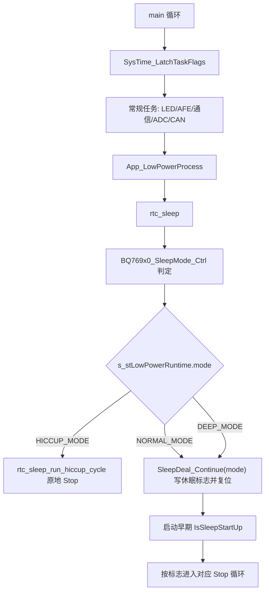

# 休眠低功耗逻辑梳理与优化建议

本文基于当前工作区源码梳理，不等同于已发布版本。当前仓库存在未提交改动，本文描述的是当前工作树状态。

最近复核日期：2026-05-14。

## 结论

当前低功耗逻辑不是单一状态机，而是由多套机制拼接而成：

- 主循环运行期主要走 `rtc_sleep()` / `LowPower_Request()`，入口在 `main.c` 的 `App_LowPowerProcess()`。
- 普通休眠和深度休眠复用 `SleepDeal_Continue(mode)` 写启动休眠标志、AFE 休眠、MCU 复位，再在启动早期由 `IsSleepStartUp()` 进入 Stop。
- RTC 打嗝休眠有两条路径：运行期 `rtc_sleep_run_hiccup_cycle()` 原地进入 Stop；复位后如果读到 HICCUP 启动标志，则 `IsSleepStartUp()` 也会进入 RTC Stop 循环。
- 空闲主循环 `__WFI()` 的轻量 Sleep 已实现为 `MainLoop_EnterIdleSleep()`，但当前源码调用点仍被注释，实际未启用。
- CAN 低功耗已接入 RTC 周期策略：有总线活动时 RTC 周期为 1s，无总线活动时为 10s，并在 RTC 唤醒短窗口内做发送或探测。

因此，当前优化方向已经推进到“一套请求入口、一套模式提交”；后续主要剩下唤醒判定和 RTC 驱动继续收口。

## 2026-05-14 当前源码复核

本次重新对照当前源码后，需要修正文档里的几处旧结论：

- `MainLoop_EnterIdleSleep()` 当前没有生效，`Runtime_RunOnce()` 尾部仍是 `// MainLoop_EnterIdleSleep();`。
- `rtc_sleep_run_hiccup_cycle()` 的异常/外部唤醒退出路径已拆成 RTC 短恢复和完整运行恢复，不再用两次通用 `Init()` 兜底。
- `RTC_IT_SEC` 在 `Init_RTC()` / `RTC_ClockConfig()` 中仍会被开启；本次已在进入 STOP 前由 `RTC_WKTimeConfig()` 显式关闭并清 pending，完整恢复运行态时再重新打开秒中断。
- STOP 前外部唤醒 EXTI pending 已由 `Sys_StopMode()` 统一清理，避免旧 pending 让 WFI 被忽略或刚进 STOP 就醒。
- `u16Sleep_RTC_WakeUpTime` / `u16Sleep_TimeRTC` 的结构体注释仍保留旧语义，但当前 RTC 周期实际由 `Can_GetIdleRtcPeriodSeconds()` 返回 1s/10s。
- 低功耗模式已经收敛为 `s_stLowPowerRuntime.mode`，旧 `Sleep_Mode` 位图和旧 `App_SleepDeal()` 状态机已删除。
- 运行期 HICCUP 唤醒源识别和复位后 `IsSleepStartUp()` 有效唤醒判断仍不是同一套策略。

当前能够确认仍然有效的方向：

- RTC Stop 主路径整体方向正确：`RTC_IT_ALR + EXTI_Line17 + RTCAlarm_IRQn` 是主要周期唤醒源。
- Stop 前已经处理 LED、ADC/TIM2/DMA、CAN 供电和大部分 GPIO 低功耗状态。
- `NORMAL_MODE` / `DEEP_MODE` 当前仍属于“写 BKP 标志 + AFE Sleep + MCU 复位 + 启动早期 Stop”的 reset sleep 路径，短期应保留兼容，长期可继续改名为更清晰的 reset-sleep executor。
- CAN 的 `Can_PrepareSleep()` / `Can_RtcWakeService()` 已经形成低功耗闭环，可以作为后续统一 `LowPowerManager` 的外设钩子样板。

## 历史优化记录

以下为此前阶段已完成且当前源码仍能看到的低功耗优化；未完全落地或本次复核发现仍有问题的内容，已移到“问题状态”：

- `Init_RTC()` 改为先读取 `BKP_DR1`，只有首次初始化时才 `BKP_DeInit()`，避免反复清空 RTC 初始化标志、休眠启动标志和休眠 SOC 缓存。
- `RTC_WKTimeConfig()` 在设置新 Alarm 前先关闭 `RTC_IT_ALR`，统一清 `RTC_IT_ALR`、`RTC_FLAG_ALR` 和 `EXTI_Line17`，再重新打开 Alarm 中断。
- `RTC_WKTimeConfig()` 进入 STOP 前关闭并清理 `RTC_IT_SEC`，STOP 周期只保留 `RTC_IT_ALR + EXTI17` 作为 RTC 唤醒路径。
- `LowPower_ClearWakeupPending()` 在 `Sys_StopMode()` 进入 WFI 前统一清 PA0、PA9、PB7、PB12、PB13 等外部唤醒线 pending，并清对应 NVIC pending。
- `LowPower_DisableWakeupExti()` 统一关闭 STOP 返回后的外部唤醒 EXTI，替代 `rtc_sleep.c` 里分散的 `exti_conf()` 关闭代码。
- `rtc_sleep_run_hiccup_cycle()` 已拆成 `rtc_sleep_restore_after_stop()` 和 `rtc_sleep_restore_for_run()`：RTC Alarm 唤醒先做短恢复检查异常，无异常则继续回睡；外部唤醒或异常退出时只走一次完整运行恢复。
- `RTCAlarm_IRQHandler()` 和 `RTC_IRQHandler()` 共用 Alarm 处理函数，统一清标志、累计 `sys_time.rtc_alm_cnt` 并置 `is_rtc_wakekup`。
- `DBGMCU_STOP` 仅在 `_DEBUG_` 下打开，避免非调试固件 Stop 电流被调试位抬高。
- `IsChargerWakeupActive()` 接回 PA0 实际电平判断，启动后休眠保持阶段可以正确响应充电唤醒。
- 旧 `SleepDeal_Normal_*()` / `SleepDeal_Forced()` / `App_SleepDeal()` 状态机已经删除，低功耗请求不再通过旧位图仲裁。
- `rtc_sleep.c` 补齐本文件内缺失原型，并按 `AFE_TYPE` 收敛 BQ/SH 分支的条件编译；Keil 构建已降为 `0 Error(s), 0 Warning(s)`。

## 历史文档合并

以下旧文档内容已经合并到本文，后续以本文为准：

- `RTC_WaitForSynchro_卡死修复说明.md`
- `RTC_低功耗_修复说明.md`
- `RTC_低功耗现场调试清单.md`
- `103 + 309/Project/低功耗时基重构说明.md`
- `LEDBAR_SWITCH_SOC_DISPLAY.md`

合并后保留的重点包括：RTC 同步/备份域排查、LSE/LSI 检查、Alarm/EXTI17 清理顺序、Stop 后时钟恢复、TIM3/TIM4 时基边界、DI 短按显示 SOC/长按开机的现场验收点。

## 关键文件

| 文件 | 职责 |
| --- | --- |
| `103 + 309/Project/Source/main.c` | 主循环、空闲 Sleep 辅助函数、启动阶段 `IsSleepStartUp()` 调用 |
| `103 + 309/Project/Source/rtc_sleep.c` | 当前运行期低功耗主流程、HICCUP RTC 周期、唤醒原因判断 |
| `103 + 309/Project/Source/SleepDeal.c` | 休眠启动标志、启动后 Stop 循环、有效唤醒判断、`SleepDeal_Continue(mode)` 复位式休眠提交 |
| `103 + 309/Project/Source/RTC.c` | RTC 初始化、Alarm 配置、唤醒周期计算、RTC 中断 |
| `103 + 309/Project/Source/conf/conf.c` | Stop 前 IO 状态、外部唤醒 EXTI、Stop 进入与时钟恢复 |
| `103 + 309/Project/Source/ADC.c` | Stop 前 ADC/TIM2/DMA 关闭 |
| `103 + 309/Project/Source/LedBar.c` | 休眠前 SOC 缓存、显示关闭、长按进入深度休眠 |
| `103 + 309/Project/Source/System_Init.c` | TIM3 10ms 调度时基、看门狗、低功耗调试配置 |
| `103 + 309/Project/Source/DataDeal.h` | 休眠参数结构体和默认值 |

## 主流程

代码定位：

- 主循环调用：`main.c:455` 到 `main.c:482`。
- 当前低功耗入口：`main.c:465` 调用 `App_LowPowerProcess()`。
- 轻量空闲 Sleep 已实现但未调用：`main.c:78` 到 `main.c:99`，调用点 `main.c:481` 被注释。
- 启动早期处理休眠启动标志：`main.c:512` 调用 `IsSleepStartUp()`。

## 休眠模式

| 模式 | 进入方式 | 当前处理 |
| --- | --- | --- |
| 空闲 Sleep | `MainLoop_EnterIdleSleep()` | 函数已实现但当前调用点注释，实际未启用；启用前需补充 CAN/Flash/串口忙判定并上板验证 |
| `HICCUP_MODE` | `LowPower_Request(HICCUP_MODE)` | 运行期可原地进入 RTC Stop 周期；也可通过启动标志进入 |
| `NORMAL_MODE` | `LowPower_Request(NORMAL_MODE)` | 写 BKP 启动标志，AFE 休眠，MCU 复位，启动后进 Stop |
| `DEEP_MODE` | `LowPower_Request(DEEP_MODE)` | 写 BKP 启动标志，AFE 休眠，MCU 复位，启动后进 Stop |
| SleepOnExit | `Sys_SleepOnExitMode()` | 函数存在但未发现有效调用 |
| Standby | 注释代码 | 当前 `Sys_StandbyMode()` 相关调用被注释，实际走 Stop |

`LowPower_Request()` 只写 `LOW_POWER_RUNTIME_STATE { mode, armed }` 中的 `mode`，真正进入休眠在后续 `rtc_sleep()` 分支内完成。显示侧通过 `LowPower_IsToSleepPending()` 读取 `armed`，不再读取旧 `Sleep_Mode` 位图。

## 进入条件

| 触发来源 | 条件 | 目标模式 | 代码 |
| --- | --- | --- | --- |
| 自动 RTC 打嗝休眠 | 无明显充放电、无加热、无外部通信变化、MCU_WK 不活跃、AFE 允许空闲，`sys_time.enter_rtc_delay >= sys_time.time_enter_rtc` | `HICCUP_MODE` | `rtc_sleep.c:431` 到 `rtc_sleep.c:510` |
| 极低电压 | `VCellMin <= 2600` 且无充电，累计 60 秒 | `DEEP_MODE` | `rtc_sleep.c:457` 到 `rtc_sleep.c:467` |
| 低电压 | `VCellMin <= u16Sleep_Vlow` 且无充电，累计 `u16Sleep_TimeVlow * 60` 秒 | `DEEP_MODE` | `rtc_sleep.c:469` 到 `rtc_sleep.c:479` |
| AFE/EEPROM 故障 | AFE1、AFE2、EEPROM 通信/存储错误持续 5 分钟 | `NORMAL_MODE` | `DataDeal.c:952` 到 `DataDeal.c:997` |
| 充放电/负载相关异常 | 压差、过压、充电过流等计数到 300 | `NORMAL_MODE` | `ChargerLoadFunc.c:81` 到 `ChargerLoadFunc.c:115` |
| DI 长按 | LED 按键长按达到 3 秒 | `DEEP_MODE`，并立即 `SleepDeal_Continue(DEEP_MODE)` | `LedBar.c` |
| 上位机功能命令 | 功能位 `0x0A` | `DEEP_MODE` | `Sci_Upper.c:2361` |

`sys_time.time_enter_rtc` 当前默认是 10，见 `conf.c:7` 到 `conf.c:10`。由于 `rtc_sleep()` 只在 1000ms 标志下运行，当前含义近似为秒，见 `rtc_sleep.c:1052` 到 `rtc_sleep.c:1060`。

## RTC 打嗝休眠细节

运行期 HICCUP 路径在 `rtc_sleep_run_hiccup_cycle()`：

1. `Init_RTC()` 初始化 RTC。
2. `IOstatus_RTCMode()` 关闭 LED 扫描、停止 ADC/TIM2/DMA，并把大部分 GPIO 配为模拟输入。
3. `InitWakeUp_RTCMode()` 配置外部唤醒和 RTC Alarm。
4. `Sys_StopMode()` 关闭 TIM3 后进入 Stop，返回后恢复系统时钟。
5. Stop 返回后统一关闭外部唤醒 EXTI 和 RTC Alarm 中断。
6. 若为 RTC 唤醒，累计 `sys_time.rtc_sleep_cnt`。
7. RTC Alarm 唤醒只做最小恢复，然后读取 AFE/电压/电流/故障；外部唤醒直接走完整运行恢复。
8. 如果没有异常，更新 RTC 静置 SOC 后继续下一轮 Stop。
9. 如果有异常或非 RTC 唤醒，则完整恢复、退出低功耗并上报唤醒原因。

代码定位：

- RTC 周期主体：`rtc_sleep.c:841` 到 `rtc_sleep.c:909`。
- RTC 进入准备：`rtc_sleep.c:774` 到 `rtc_sleep.c:792`。
- RTC 唤醒后的最小恢复 / 完整恢复选择：`conf.c:608` 到 `conf.c:617`。
- Stop 入口和时钟恢复：`conf.c:553` 到 `conf.c:562`。

## 普通/深度休眠细节

`NORMAL_MODE` 和 `DEEP_MODE` 当前不是原地 Stop，而是：

1. `low_power_log_and_commit_sleep()` 记录休眠事件。
2. `SleepDeal_Continue(mode)` 按传入模式写对应启动标志。
3. `BootFlag_Write()` 写 BKP `DR2/DR3` 作为启动休眠标志。
4. `InitAFE1_Sleep(0)`、`AFE_Sleep()`。
5. `MCU_RESET()`。
6. 下次启动早期 `IsSleepStartUp()` 根据标志进入 Stop 循环。

代码定位：

- 模式提交：`rtc_sleep.c:308` 到 `rtc_sleep.c:322`。
- 旧提交函数：`SleepDeal.c:82` 到 `SleepDeal.c:172`。
- BKP 启动标志：`SleepDeal.c:709` 到 `SleepDeal.c:753`。
- 启动后按模式进入 Stop：`SleepDeal.c:760` 到 `SleepDeal.c:812`。

## 唤醒源

| 唤醒源 | 引脚/中断 | 配置位置 | 当前用途 |
| --- | --- | --- | --- |
| 充电输入 | PA0 / EXTI0 下降沿 | `conf.c:220` 到 `conf.c:267`，Normal/RTC 中再次配置 | Base/Normal/RTC/Deep 都配置 |
| 开关输入 | PA9 / EXTI9 下降沿 | `conf.c:220` 到 `conf.c:267` | Base/Normal/RTC/Deep 都配置 |
| UART1 RX | PB7 / EXTI7 上升沿 | `conf.c:277` 到 `conf.c:293` | Normal/RTC 配置 |
| RS485 唤醒 | PB12 / EXTI12 上升沿 | `conf.c:327` 到 `conf.c:344` | Normal/RTC 配置 |
| MCU_WK | PB13 / EXTI13 上升沿 | `conf.c:346` 到 `conf.c:363` | Normal/RTC 配置，同时运行期会阻止进入 RTC |
| RTC Alarm | EXTI17 + RTC Alarm | `RTC.c:338` 到 `RTC.c:363` | RTC 模式周期唤醒 |

注意：启动后 `IsSleepStartUp()` 的有效唤醒判断只接受充电或按键长按；`IsChargerWakeupActive()` 当前读取 PA0 充电输入，见 `SleepDeal.c:13` 到 `SleepDeal.c:16`。运行期 HICCUP 路径则通过 `low_power_guess_wakeup_source()` 猜测 PA0、PA9 等，见 `rtc_sleep.c:806` 到 `rtc_sleep.c:839`。两条路径对 UART1/RS485/MCU_WK 等唤醒源的“是否退出休眠”策略仍不统一。

## 外设低功耗处理

| 外设/资源 | Stop 前处理 | Stop 后恢复 |
| --- | --- | --- |
| TIM3 主调度时基 | `Sys_StopMode()` 关闭 TIM3 和 TIM3 时钟 | `InitRunAfterStopWakeup()` 完整恢复时调用 `InitTimer()` |
| 系统时钟 | Stop 前不重配 | Stop 返回后 `cpu_frequency_conf()` 调 `SystemInit()`、`SystemCoreClockUpdate()`、`InitDelay()` |
| ADC/TIM2/DMA | `ADC_StopForLowPower()` 关闭 TIM2、ADC1、DMA1_Channel1 和相关时钟 | 完整恢复时 `InitADC()` |
| LED 显示 | `LedBar_SetSleep(1u)` 关闭扫描、输出熄灭、GPIO 转模拟输入 | 完整恢复或显示需求时 `LedBar_Wakeup()` / `APP_LedBar()` |
| GPIO | RTC/普通/深度模式下大量配置为模拟输入，随后重新配置唤醒引脚 | 完整恢复时 `InitIO()` |
| AFE | 普通/深度提交前 `InitAFE1_Sleep(0)` 和 `AFE_Sleep()` | 完整初始化流程恢复 |

代码定位：

- ADC 关闭：`ADC.c:223` 到 `ADC.c:240`。
- LED Stop 准备：`LedBar.c:1024` 到 `LedBar.c:1038`。
- IO 低功耗态：`conf.c:379` 到 `conf.c:451`、`conf.c:454` 到 `conf.c:524`。
- 完整恢复：`conf.c:575` 到 `conf.c:606`。

## 参数现状

| 参数 | 当前含义 | 默认值来源 |
| --- | --- | --- |
| `sys_time.time_enter_rtc` | 自动进入 RTC 打嗝休眠前的空闲秒数 | `conf.c:8`，默认 10 |
| `OtherElement.u16Sleep_VNormal` | 正常休眠电压阈值 | `DataDeal.h:160` |
| `OtherElement.u16Sleep_TimeNormal` | 正常休眠等待分钟 | `DataDeal.h:161` |
| `OtherElement.u16Sleep_Vlow` | 低压休眠阈值 | `DataDeal.h:162` |
| `OtherElement.u16Sleep_TimeVlow` | 低压进入深度休眠等待分钟 | `DataDeal.h:163` |
| `OtherElement.u16Sleep_VirCur_Chg` | 充电虚拟电流阈值 | `DataDeal.h:164` |
| `OtherElement.u16Sleep_VirCur_Dsg` | 放电虚拟电流阈值 | `DataDeal.h:165` |
| `OtherElement.u16Sleep_RTC_WakeUpTime` | 结构体注释认为是 RTC 唤醒时间 | `DataDeal.h:166` |
| `OtherElement.u16Sleep_TimeRTC` | 旧逻辑中用于 RTC 时间；当前运行期 RTC Alarm 周期已由 CAN 活跃状态决定 | 当前默认值仍在 `DataDeal.h` 中 |

这里存在命名/实现不一致：结构体注释仍把 `u16Sleep_RTC_WakeUpTime` 标成 RTC 唤醒时间，`u16Sleep_TimeRTC` 标成进入 RTC 时间；但当前 `RTC_GetWakeupPeriodSeconds()` 实际读取 `Can_GetIdleRtcPeriodSeconds()`，按 CAN 总线活动状态返回 1s 或 10s。按 `OtherElement_default`，`u16Sleep_RTC_WakeUpTime` 默认 240，`u16Sleep_TimeRTC` 默认 3，见 `DataDeal.h:216` 到 `DataDeal.h:228`。

## 问题状态

### 已处理：RTC 初始化反复重置备份域

`RTC_ClockConfig()` 已改为接收 `need_full_init`。`Init_RTC()` 现在先开启 PWR/BKP 访问并读取 `BKP_DR1`，只有标志不匹配时才重置备份域和重新配置 RTC 时钟源。已有备份域时只恢复 RTC 同步、使能秒中断、清 Alarm/EXTI17 并重新配置中断。

### 已处理：RTC Alarm 标志处理分散

RTC Alarm 唤醒处理已收敛到统一函数。`RTCAlarm_IRQHandler()` 和 `RTC_IRQHandler()` 都通过同一入口清 `RTC_IT_ALR`、清 `EXTI_Line17`、累计 `sys_time.rtc_alm_cnt` 并置 `is_rtc_wakekup`，避免两个中断路径状态不一致。

### 已处理：非调试构建打开 Stop 调试位

`DBGMCU_STOP` 已限定在 `_DEBUG_` 下配置。量产构建不会因为该调试位额外抬高 Stop 电流。

### 已处理：启动后充电唤醒判断为空实现

`IsChargerWakeupActive()` 已从固定返回 0 改为读取 PA0 充电输入。这样 `IsSleepStartUp()` 的 Stop 保持阶段可以按实际充电信号退出休眠。

### 待处理：RTC 唤醒周期参数命名不一致

结构体注释和旧注释仍指向 `u16Sleep_RTC_WakeUpTime` / `u16Sleep_TimeRTC`，但当前运行期 `RTC_GetWakeupPeriodSeconds()` 实际读取的是 `Can_GetIdleRtcPeriodSeconds()`：CAN 总线活跃返回 1s，非活跃返回 10s。因此，上位机修改这两个休眠参数不会改变当前 RTC Stop 周期。

建议下一步明确语义：

- 如果产品需要上位机可配置 RTC 周期，则把 `u16Sleep_RTC_WakeUpTime` 明确为基础 RTC 周期参数，再由 CAN 策略做上下限或动态覆盖。
- 如果产品固定采用 CAN 自适应 1s/10s，则把两个旧参数标成保留/兼容字段，避免现场误以为配置有效。

无论选择哪种方案，都要同步通信地址表和上位机说明。

### 已处理：`rtc_sleep_run_hiccup_cycle()` 退出路径重复恢复

当前 Stop 返回后不再调用通用 `Init()`。代码改为两级恢复：

- `rtc_sleep_restore_after_stop()`：RTC Alarm 唤醒只调用 `InitRtcWakeupCheck()`，外部唤醒直接调用 `InitRunAfterStopWakeup()`。
- `rtc_sleep_restore_for_run()`：只有 RTC Alarm 唤醒但检测到异常、需要退出低功耗时，才补一次完整运行恢复。

这样保留 RTC 短服务窗口，同时避免外部唤醒路径重复初始化 ADC、CAN、TIM、SCI 等外设。

### 已处理：STOP 前没有显式关闭 `RTC_IT_SEC`

`Init_RTC()` / `RTC_ClockConfig()` 仍在运行态开启 `RTC_IT_SEC`，但进入 STOP 的 `RTC_WKTimeConfig()` 已改成固定顺序：

- 关闭并清理 `RTC_IT_SEC`。
- 关闭 `RTC_IT_ALR`。
- 清 `RTC_IT_ALR`、`RTC_FLAG_ALR`、`EXTI_Line17`。
- 设置下一次 Alarm。
- 只重新开启 `RTC_IT_ALR`。

完整恢复运行态时由 `RTC_RestoreRunInterrupts()` 关闭 Alarm、清 pending，并重新打开 `RTC_IT_SEC`。

### 已处理：STOP 前外部 EXTI pending 没有统一清理

ST 官方低功耗资料要求进入 STOP 前清掉已挂起的 EXTI pending，否则可能出现 WFI 被忽略、刚进 STOP 立即唤醒、唤醒源误判等问题。当前 `Sys_StopMode()` 已在 `PWR_EnterSTOPMode()` 前调用 `LowPower_ClearWakeupPending()`，统一处理 PA0、PA9、PB7、PB12、PB13 等外部唤醒线及对应 NVIC pending。

### 已处理：低功耗模式提交收敛

旧 `g_sleepModeSelect` / `Sleep_Mode` 双状态已经收敛为 `s_stLowPowerRuntime.mode`。旧 `Sleep_Mode` 位图、`Sleep_Status` 枚举和 `App_SleepDeal()` 状态机已删除。

当前规则：

- `LowPower_Request(mode)` 是唯一休眠请求入口。
- `LowPower_IsToSleepPending()` 是显示侧判断待休眠的唯一入口。
- `SleepDeal_Continue(mode)` 只负责写启动休眠标志、关 AFE 并复位，不再做二次模式仲裁。

### 待处理：启动后有效唤醒判断和运行期唤醒判断不统一

运行期 HICCUP 会通过 `low_power_guess_wakeup_source()` 识别外部唤醒源；复位后 `IsSleepStartUp()` 的 Stop 循环只通过 `IsSleepWakeupValid()` 判定是否放行。当前充电和按键逻辑已经可用，但 UART1、RS485、MCU_WK 等唤醒源在不同路径里的“是否退出休眠”策略仍不统一。

建议把“唤醒源采样”和“是否允许退出休眠”拆成两个函数，并由 HICCUP、NORMAL、DEEP 共用。

### 待处理：空闲 Sleep 尚未启用

`MainLoop_EnterIdleSleep()` 已经有待处理任务、串口忙、PRIMASK 和 SLEEPDEEP 清理保护，但当前调用点仍被注释。该项要先决定是启用还是删除，避免长期保留半实现。

启用前建议补充：

- `Can_IsBusy()` 或 CAN 供电状态检查。
- Flash/EEPROM 写入忙检查。
- 日志/串口发送忙检查。
- 上板确认 TIM3 唤醒、串口收发、CAN 发送窗口不会被破坏。

## 现场调试顺序

1. 先确认 ST-Link 还连得上，且非调试构建没有打开低功耗调试位。
2. 再确认 LSE / LSI 是否正常，`RTC_GetCounter()` 是否持续递增。
3. 再确认 `BKP_DR1` 是否保持 `RTC_BKP_DATA`，且 `Init_RTC()` 没有重复重置备份域。
4. 再确认 RTC Alarm 设置值是否正确，`RTC_IT_ALR` 是否打开。
5. 再确认 `RTC_IT_ALR`、`RTC_FLAG_ALR` 和 `EXTI_Line17` 都被清干净。
6. 最后确认 Stop 返回后 `cpu_frequency_conf()` 是否恢复系统时钟，串口和 TIM3 是否恢复正常。

## 时基边界

| 时基 | 来源 | 低功耗边界 |
| --- | --- | --- |
| 10ms | TIM3 中断 | BMS 主任务调度基准；进入 Stop 前关闭 TIM3 |
| 50ms / 100ms / 200ms / 1000ms | TIM3 软件分频 | 主循环锁存 `g_st_SysTimeFlag` 后消费 |
| 1ms LED 扫描 | TIM4 中断 | 只服务显示；`LedBar_SetSleep(1u)` 关闭 TIM4 和显示 GPIO |
| RTC Alarm | RTC + EXTI17 | 只服务 RTC Stop 周期唤醒 |

TIM3 只负责置位待处理标志，主循环开头调用 `SysTime_LatchTaskFlags()` 锁存快照。空闲 Sleep 判断应看中断侧待处理标志 `SysTime_HasPendingTaskFlags()` 和串口忙状态，而不是本轮已经锁存的 `g_st_SysTimeFlag`。

## DI / SOC 显示验收点

- 正常运行静置时 TIM4 关闭，`PIN_SEG_EN` 关闭，数码管不亮。
- 单击 DI1 后 SOC 立即显示，松开后约 5 秒熄灭。
- 长按 DI1 约 3 秒后进入深度休眠。
- 休眠中短按 DI1 后显示休眠前 SOC，约 5 秒后回睡。
- 休眠中长按 DI1 超过 3 秒后进入正常开机流程。

## 简化建议

建议按风险从低到高分阶段做：

1. 文档同步：统一 `u16Sleep_RTC_WakeUpTime` / `u16Sleep_TimeRTC` 的真实含义，同步上位机地址表。
2. 低风险代码清理：本次已完成 `rtc_sleep_run_hiccup_cycle()` 退出路径重复恢复、STOP 前 `RTC_IT_SEC` 关闭、外部 EXTI pending 统一清理；后续只需结合电流实测确认。
3. 空闲 Sleep 决策：要么补齐忙判定后启用 `MainLoop_EnterIdleSleep()`，要么删除该半实现。
4. 模式提交收敛：已完成，`LowPower_Request()` 是唯一模式入口，`SleepDeal_Continue(mode)` 不再读取旧位图。
5. 唤醒判定收敛：运行期和启动后共用同一套唤醒源采样/有效性判断。
6. 外设钩子标准化：CAN、ADC、LED、AFE、SCI 都提供 `PrepareSleep` / `RestoreShortWake` / `RestoreRun` 三类钩子。
7. 删除旧状态机：已移除 `App_SleepDeal()` 未启用路径和 `Sleep_Mode` / `Sleep_Status` 残留；SleepOnExit/Standby 仍未启用，后续若确认无产品需求可继续删除。

## 验证清单

每次改低功耗逻辑后建议至少覆盖：

- 正常上电：无休眠标志时能完整初始化。
- HICCUP 自动进入：无电流、无通信、无异常时 10 秒后进入 RTC Stop。
- RTC 连续回睡：RTC 唤醒后无异常时能连续回 Stop，`rtc_sleep_cnt` 按轮次增加。
- RTC 异常退出：有充/放电、电压异常、AFE 故障时能退出低功耗并恢复通信。
- 普通/深度休眠：写启动标志、复位、启动后进 Stop、有效唤醒后再复位恢复。
- DI 短按/长按：短按只显示休眠 SOC，长按 3 秒放行。
- PA0 充电唤醒：确认 `IsChargerWakeupActive()` 读取到实际充电电平后能退出休眠。
- UART1/RS485 唤醒：确认运行期 HICCUP 和复位后休眠路径行为一致。
- 看门狗开关：`wdog_enable` 打开时 RTC 周期是否被安全窗口截断，是否符合产品预期。
- 电流实测：确认 `DBGMCU_STOP`、LED 扫描、ADC/TIM2/DMA、GPIO 模拟输入均符合目标功耗。
