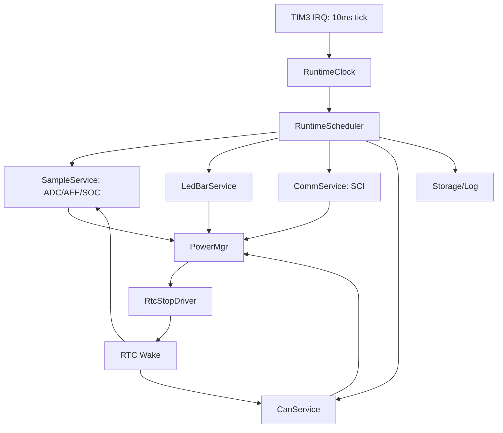

# 运行架构与时基重构方案

本文用于重新梳理当前工程的主循环、系统时基、任务调度、RTC 休眠和 CAN 通信边界，并给出可以逐步落地的重构方案。

当前结论：可以从根本重构，但不建议一上来同时改 CAN、RTC、SOC、LED 和 AFE。应先把“运行时基所有权”和“任务调度入口”收敛清楚，再把低功耗和 CAN 接入到新的运行框架中。

## 1. 目标需求

### 1.1 运行架构目标

1. 主循环要清晰：每个任务为什么运行、多久运行一次、是否允许丢 tick，要能从一个地方看清。
2. 时基要统一：TIM3 只负责产生系统 tick，任务是否到期由统一调度层判断。
3. 模块边界要清楚：AFE/ADC/SOC、SCI、CAN、LED、Flash、低功耗不能互相直接抢调度权。
4. 低功耗要可判定：系统能否进入 RTC 休眠，应由 Power Manager 根据统一的活动状态决定。
5. RTC 唤醒后要闭环：RTC Alarm 唤醒后，必须完成必要采样、SOC 休眠补偿、CAN 发送窗口，再决定继续睡或退出。
6. CAN 不能长期阻塞 RTC：CAN 发送失败、无 ACK、BusOff、对端不在线，都不能让系统一直进不了 RTC。
7. 文档和脚本要沉淀规则：时基、烧录地址、测试模式、量产隔离、CAN/RTC 规则不能只存在对话里。

### 1.2 本轮重构先后顺序

优先级应为：

1. 运行时基和任务调度。
2. 低功耗状态机。
3. CAN 通信服务化。
4. RTC 唤醒后的 CAN/SOC/采样闭环。

原因是：当前 CAN 问题本质上不是单个发送函数复杂，而是 CAN 状态机、RTC 休眠判定、主循环任务顺序和 tick 补偿互相耦合。

## 2. 当前运行架构

### 2.1 启动流程

当前 `main()` 启动流程：

```text
InitDevice()
InitVar()
Init_RTC()
while (1)
    SysTime_LatchTaskFlags()
    FactoryAging_Task()
    APP_LedBar()
    App_AFEGet()
    App_Sci()
    App_AnlogCal()
    App_LowPowerProcess()
    App_Can()
    StorageFlash_AppUseTest_Task()
    App_Heat_Cool_Ctrl()
    App_FlashUpdate()
    App_LogRecord()
    App_ProID_Deal()
    Feed_IWatchDog
```

代码位置：

- `103 + 309/Project/Source/main.c`
- `103 + 309/Project/Source/System_Init.c`
- `103 + 309/Project/Source/rtc_sleep.c`
- `103 + 309/Project/Source/Can_HDX.c`

### 2.2 当前时基

以当前源码为准，TIM3 是系统主时基：

```text
SystemCoreClock -> Timer_GetPrescalerFor100kHz()
TIM3 counter = 100 kHz
TIM3 Period = 999
TIM3 update = 10 ms
```

`TIM3_IRQHandler()` 每 10ms 调用一次 `SysTime_Post10msTick()`，并派生：

| 软件节拍 | 来源 |
| --- | --- |
| 10ms | 每次 TIM3 update |
| 50ms | 5 个 10ms |
| 100ms | 10 个 10ms |
| 200ms | 20 个 10ms |
| 1000ms | 100 个 10ms |

注意：如果旧文档里仍写 TIM3 为 1ms，应按当前源码修正为 10ms。

### 2.3 当前 tick 消费方式

当前工程不是统一调度，而是多个模块各自消费时间：

| 模块 | 当前调用方式 | 当前时基语义 | 问题 |
| --- | --- | --- | --- |
| `APP_LedBar()` | 主循环每轮调用 | 内部读取 10ms/100ms flag 和 raw tick | 模块内部自调度，逻辑分散 |
| `App_AFEGet()` | 主循环每轮调用 | 消费 `SysTime_Take200msTaskPeriod()` | 现已由 pending counter 触发，长阻塞时可记录 overflow |
| `App_SOC()` | `App_AFEGet()` 内调用 | 跟随 AFE 新样本 | 入口隐藏在 AFE 任务内部 |
| `App_Sci()` | 主循环每轮调用 | 串口状态机尽快服务 | 合理，但通信活动应统一上报 |
| `App_AnlogCal()` | 主循环每轮调用 | 读取累计 10ms tick，并补齐 elapsed tick | 当前写法较好，可保留思想 |
| `rtc_sleep()` | 主循环调用 | 只在 1000ms flag 下运行 | 低功耗判定近似按秒 |
| `App_Can()` | 主循环每轮调用 | 自己维护 CAN logical tick | CAN 又形成一套局部时钟 |
| RTC Stop | `rtc_sleep_run_hiccup_cycle()` 中进入 | TIM3 停止，RTC 秒数补偿 | 只有部分模块知道 Stop 经过时间 |

## 3. 当前主要问题

### 3.1 时基所有权分散

当前 `g_st_SysTimeFlag` 是全局变量，模块可以任意读取。它不是调度器，只是全局广播信号。

后果：

1. 任务周期散落在各模块内部。
2. 很难判断某个任务是否会丢周期。
3. RTC Stop 后哪些模块需要补偿时间不清楚。
4. 后续想调整任务周期时，需要全仓搜索全局 flag。

### 3.2 `g_200ms_task_flag` 容易丢周期

原先 AFE 任务由 `g_200ms_task_flag` 触发。该变量是 bool 语义：

```text
TIM3 ISR 到 200ms -> g_200ms_task_flag = true
主循环执行 App_AFEGet() -> 清 false
```

如果主循环被日志、Flash、I2C、串口或低功耗流程阻塞超过 200ms，多个 200ms 周期会被合并成一次，AFE/SOC 不会知道错过了几次。

本次已改为 `s_u8Sys200msPendingPeriods` pending counter：

```text
TIM3 ISR 到 200ms -> pending periods + 1
App_AFEGet() -> SysTime_Take200msTaskPeriod()
有 pending -> 处理一次 AFE/SOC
无 pending -> return
pending 超过上限 -> 记录 overflow count
```

第一版 pending 上限为 5，避免主循环长时间阻塞后无限补跑 I2C/AFE 采样。

### 3.3 低功耗状态机不唯一

当前低功耗由两套机制拼接：

| 路径 | 说明 |
| --- | --- |
| 运行期 HICCUP | `rtc_sleep_run_hiccup_cycle()` 原地进入 STOP，RTC 唤醒后判断是否继续睡 |
| NORMAL/DEEP | 写休眠标志、AFE 休眠、MCU reset，启动早期再进入 STOP |
| `SleepDeal.c` | 只承担启动休眠标志、启动后休眠恢复和 `SleepDeal_Continue(mode)` 复位式休眠提交 |

问题：

1. 低功耗模式已收敛为 `LOW_POWER_RUNTIME_STATE { mode, armed }`，旧 `Sleep_Mode` 位图和 `Sleep_Status` 状态机已删除。
2. HICCUP、NORMAL、DEEP 的唤醒判定不完全统一。
3. 运行期唤醒和 reset 后唤醒不是同一个判定函数。
4. CAN、RS485、MCU_WK、充电、按键分别在不同位置影响休眠。

### 3.4 CAN 与 RTC 休眠耦合过深

当前 CAN 同时承担：

1. 主循环周期广播。
2. 标准帧请求响应。
3. 对端是否在线的推断。
4. RTC 唤醒后的发送服务。
5. 是否阻止进入 RTC 的条件之一。

这导致 CAN 既是业务通信模块，又参与低功耗策略决策。结果是：

1. CAN busy 可能清零 `enter_rtc_delay`。
2. CAN 无 ACK 或对端不在线时，容易影响休眠进入。
3. RTC 唤醒后 CAN 发送失败时，系统到底继续睡还是退出不够直观。

### 3.5 文档与源码存在时基漂移

部分旧文档仍按旧 TIM3 配置描述 1ms 或旧行号。后续需要统一更新为：

```text
当前工程运行时基：TIM3 10ms
派生 flag：50ms / 100ms / 200ms / 1000ms
RTC Stop 期间：TIM3 停止，只有 RTC 秒数可信
```

## 4. 目标架构

### 4.1 总体结构

建议保持裸机，不引入 RTOS。重构为“统一 Runtime + 模块服务”的结构：

```text
TIM3_IRQHandler()
    RuntimeClock_Post10ms()

main loop
    Runtime_Dispatch()
    PowerMgr_Run()
    Runtime_Idle()
```

模块关系：



### 4.2 RuntimeClock

职责：

1. 只维护单调递增的 10ms tick。
2. 提供安全读取接口。
3. 提供 elapsed 计算接口。
4. Stop 前保存状态，Stop 后由 RTC 秒数补偿 wall time。

建议接口：

```c
typedef struct {
    UINT32 tick_10ms;
    UINT32 elapsed_10ms;
    UINT32 elapsed_seconds_from_rtc;
} RuntimeTimeSlice;

void RuntimeClock_Init(void);
void RuntimeClock_On10msIrq(void);
void RuntimeClock_Latch(RuntimeTimeSlice *slice);
void RuntimeClock_ApplyRtcSleepSeconds(UINT32 seconds);
UINT32 RuntimeClock_Now10ms(void);
```

### 4.3 RuntimeScheduler

职责：

1. 用任务表统一管理周期。
2. 每个任务明确周期、是否允许追赶、最大追赶次数。
3. 主循环只看到 `RuntimeScheduler_Run()`。

任务策略建议：

| 策略 | 含义 | 适用模块 |
| --- | --- | --- |
| `RUN_EVERY_LOOP` | 每轮都跑，内部非阻塞 | SCI、CAN 状态机 |
| `RUN_PERIODIC_DROP` | 周期到了跑一次，错过多个周期只跑一次 | LED 显示、日志 |
| `RUN_PERIODIC_CATCHUP_LIMITED` | 按 elapsed 补跑，但有最大上限 | ADC 计算、部分软件滤波 |
| `RUN_PERIODIC_SAMPLE` | 采样周期到了跑，若错过则记录 missed count | AFE/SOC |
| `RUN_ON_EVENT` | 事件触发 | Flash 写、参数保存、休眠请求 |

建议初始任务表：

| 任务 | 周期 | 策略 | 说明 |
| --- | --- | --- | --- |
| `Task_SciService` | every loop | `RUN_EVERY_LOOP` | 串口收发状态机 |
| `Task_CanService` | every loop + 10ms slice | `RUN_EVERY_LOOP` | CAN 上电/发送/超时状态机 |
| `Task_LedBar` | 10ms/100ms 内部拆分 | `RUN_PERIODIC_DROP` | 显示刷新和按键滤波 |
| `Task_AdcCalc` | 10ms | `RUN_PERIODIC_CATCHUP_LIMITED` | 替代 `App_AnlogCal()` 外层散调用 |
| `Task_AfeSample` | 200ms | `RUN_PERIODIC_SAMPLE` | 替代 `g_200ms_task_flag` |
| `Task_SocUpdate` | 跟随 AFE sample event | `RUN_ON_EVENT` | 保持 SOC 只消费新样本 |
| `Task_PowerMgr` | 1000ms + event | `RUN_PERIODIC_DROP` | 休眠条件判定 |
| `Task_Storage` | 1000ms/dirty event | `RUN_ON_EVENT` | Flash/参数/日志 |
| `Task_HeatCool` | 1000ms | `RUN_PERIODIC_DROP` | 温控慢任务 |

### 4.4 PowerMgr

PowerMgr 是低功耗唯一入口。它不应该直接散落在 CAN、LED、SCI、AFE 内部。

建议状态：

```text
ACTIVE
IDLE_COUNTING
PREPARE_RTC_STOP
RTC_STOP
RTC_WAKE_MINIMAL_RESTORE
RTC_WAKE_SERVICE
EXIT_LOW_POWER
RESET_SLEEP_COMMIT
```

PowerMgr 输入：

| 输入 | 来源 |
| --- | --- |
| 电流/电压/故障 | SampleService |
| 充电输入/按键/MCU_WK | BoardWakeSource |
| SCI 有效通信 | CommService |
| CAN 有效外部活动 | CanService |
| 出厂老化模式 | FactoryAging |
| 强制休眠请求 | LedBar / 上位机 / 保护逻辑 |

PowerMgr 输出：

| 输出 | 目标 |
| --- | --- |
| `CanService_PrepareSleep()` | 休眠前收口 CAN |
| `SampleService_PrepareSleep()` | 休眠前停止 ADC/TIM2/DMA |
| `SocService_SaveBeforeSleep()` | 休眠前保存 SOC 快照 |
| `RtcStopDriver_Enter()` | 进入 STOP |
| `CanService_RtcWakePublish()` | RTC 唤醒后发送 CAN |
| `SocService_ApplyRtcRest()` | RTC 静置补偿 |

### 4.5 CanService

CAN 重构目标不是“发送函数更短”，而是把 CAN 从低功耗策略里拆出来。

CanService 只回答三类问题：

1. 当前 CAN 是否有正在进行的硬件动作，是否需要最多等待一个短窗口。
2. RTC 唤醒后，本次需要发哪些帧，是否已完成或超时。
3. 是否检测到有效外部活动，供 PowerMgr 重置空闲计时。

建议规则：

| 场景 | 行为 |
| --- | --- |
| 正常运行，有对端 | 1s/5s 周期广播 |
| 正常运行，无对端 | 降频探测，不持续业务广播 |
| 准备 RTC 休眠 | 取消未开始 pending，短时间收口正在发送 mailbox |
| RTC Alarm 唤醒 | 打开 CAN 电源，发送本轮规定帧，成功或超时都关闭电源 |
| CAN 无 ACK | 记录，不阻止 RTC 继续睡 |
| CAN RX 有效请求 | 记录为外部活动，可重置空闲计时 |

重要边界：

```text
周期广播不等于外部通信活动。
只有 CAN RX 有效请求、有效 ACK 恢复、或指定上位机握手，才算外部通信活动。
```

这样才能避免“自己周期发 CAN”导致系统永远认为有通信而进不了 RTC。

## 5. 分阶段落地方案

### 阶段 0：文档与静态边界

目标：不改出货逻辑，先固定规则。

动作：

1. 新增本文档。
2. README 增加本文档入口。
3. 更新旧文档中明显错误的 TIM3 1ms 描述。
4. 明确当前源码主时基是 10ms。

验收：

1. 文档能解释当前 main loop。
2. 文档能解释 CAN 为什么会影响 RTC。
3. 文档能给出后续代码改动顺序。

本次已完成：

1. 新增本文档。
2. README 增加本文档入口。
3. 修正 `系统时钟系统梳理.md` 中 TIM3 1ms 的过期描述。

### 阶段 1：引入 RuntimeClock/RuntimeScheduler 空壳

目标：建立统一入口，但不改变任务行为。

建议新增：

```text
103 + 309/Project/Source/Runtime.c
103 + 309/Project/Source/Runtime.h
```

第一版只封装：

1. `SysTime_LatchTaskFlags()`。
2. `SysTime_Get10msTickCount()`。
3. 任务调用顺序保持与当前 main 一致。

验收：

1. 生成代码与旧逻辑时序等价。
2. `main.c` 主循环从散调用收敛为 `Runtime_RunOnce()`。
3. 不改 CAN、RTC、SOC 业务策略。

当前源码已完成这一阶段：`main.c` 主循环只调用 `Runtime_RunOnce()`，运行入口已拆到独立 `Runtime.c/.h`。量产路径内部按 `Runtime_RunFrontTasks()`、`Runtime_RunIoAndPowerTasks()`、`Runtime_RunBackgroundTasks()` 三段组织，任务顺序、周期、CAN/RTC/SOC 业务逻辑保持不变。

### 阶段 2：修正任务 tick 消费方式

目标：先解决时基不清和丢 tick。

动作：

1. 用 pending 计数替代 `g_200ms_task_flag`。
2. `App_AFEGet()` 改成明确的 200ms sample task。
3. `App_SOC()` 保持跟随 AFE sample event，不单独按时间空跑。
4. `App_AnlogCal()` 的 elapsed 10ms 补算思想保留，但由 RuntimeScheduler 决定调用时机。
5. 任务表写清楚 catch-up 上限，避免长时间阻塞后一次补跑太久。

验收：

1. AFE/SOC 周期不再依赖 bool flag。
2. ADC 计算不会因为外层调用周期变化而改变滤波时间常数。
3. 主循环卡顿后 missed tick 可统计。

本次已完成第一步：

1. `System_Init.c` 删除 `g_200ms_task_flag`，新增 `SysTime_Take200msTaskPeriod()`。
2. TIM3 每 200ms 向 pending counter 追加一个周期，pending 上限为 5。
3. 超出 pending 上限时累加 `SysTime_Get200msTaskOverflowCount()` 可读的 overflow 计数。
4. `App_AFEGet()` 改为消费 pending period；`App_SOC()` 仍跟随 AFE 新样本，不改变 SOC 算法。

### 阶段 3：收敛 PowerMgr

目标：低功耗只由一个状态机管理。

动作：

1. `LowPower_Request(mode)` 保留为唯一请求入口。
2. `LowPower_IsToSleepPending()` 作为显示侧判断待休眠的唯一接口。
3. `SleepDeal_Continue(mode)` 只负责 reset sleep 提交，不再做模式仲裁。
4. HICCUP、NORMAL、DEEP 共用 wake source 采样和退出判定。
5. `rtc_sleep_run_hiccup_cycle()` 改名并下沉为 `RtcStopDriver_RunCycle()`。

验收：

1. 同一个唤醒源在 HICCUP/NORMAL/DEEP 下判定一致。
2. 进入 RTC 休眠的阻断原因可枚举、可打印。
3. CAN 不再直接决定系统模式，只上报自身活动状态和硬件忙状态。

### 阶段 4：重构 CAN 与 RTC 唤醒闭环

目标：满足“进入低功耗后也要对外发送 CAN 报文”，同时 CAN 不阻止休眠。

动作：

1. `Can_RtcWakeService()` 改为明确返回结果：

```c
typedef enum {
    CAN_RTC_WAKE_TX_OK = 0,
    CAN_RTC_WAKE_TX_TIMEOUT,
    CAN_RTC_WAKE_TX_NO_ACK,
    CAN_RTC_WAKE_TX_BUS_OFF
} CAN_RTC_WAKE_RESULT;
```

2. PowerMgr 在 RTC 唤醒后调用：

```text
Sample minimal restore
SOC RTC compensation
CanService_RtcWakePublish(timeout)
CanService_PrepareSleep()
decide continue stop or exit
```

3. CAN 发送窗口必须有硬超时。
4. CAN 发送完成或失败后必须关闭 `GPIO_CMNT_EN`。
5. 无 ACK 不作为退出 RTC 的唯一理由。

验收：

1. RTC Alarm 每次唤醒后都有 CAN 发送窗口。
2. 有对端时能发出业务帧。
3. 无对端时发送失败不会阻止继续 RTC。
4. CAN busy 不会长期清零 `enter_rtc_delay`。
5. 示波器可看到 `GPIO_CMNT_EN`、CAN_TX、CANH/CANL 的 RTC 唤醒窗口。

### 阶段 5：删除旧分支和文档同步

目标：去掉历史兜底和重复路径。

动作：

1. 删除不再使用的旧 `SleepDeal` 仲裁分支。当前已完成。
2. 删除重复的 `App_SleepDeal()` 路径。当前已完成。
3. 更新低功耗、CAN、系统时基、README 文档。
4. 在 `tools/project_check.py` 增加静态检查：
   - 禁止恢复旧 `Sleep_Mode` / `Sleep_Status`。
   - 禁止新模块直接依赖 `g_st_SysTimeFlag`。
   - 检查 TIM3 10ms 配置注释和文档一致。

## 6. 建议代码文件规划

建议新增或重命名：

| 文件 | 职责 |
| --- | --- |
| `Runtime.h/.c` | RuntimeClock + RuntimeScheduler |
| `PowerMgr.h/.c` | 低功耗唯一状态机 |
| `WakeSource.h/.c` | 充电、按键、MCU_WK、RS485、UART 唤醒采样 |
| `CanService.h/.c` | CAN 周期广播、请求响应、RTC 唤醒发送窗口 |
| `SampleService.h/.c` | AFE/ADC/SOC 采样链路编排 |

过渡期保留：

| 文件 | 处理方式 |
| --- | --- |
| `System_Init.c` | 先保留 TIM3/Delay/IWDG，后续只导出 RuntimeClock 所需接口 |
| `rtc_sleep.c` | 逐步拆到 PowerMgr/RtcStopDriver |
| `SleepDeal.c` | 先作为 reset sleep adapter，最后删除或极简化 |
| `Can_HDX.c` | 第一阶段不拆，等 Runtime/PowerMgr 稳定后再服务化 |

## 7. 验证策略

### 7.1 静态验证

每次阶段性修改后执行：

```bash
python3 tools/project_check.py
python3 tools/soc_replay_test.py
python3 tools/run_soc_host_c_test.py
git diff --check
```

如果只改架构文档，不需要跑 MCU 编译；如果改 `main.c`、`System_Init.c`、`rtc_sleep.c`、`Can_HDX.c`，必须至少跑静态检查和 host SOC 测试。

### 7.2 上板验证

| 验收项 | 观测方法 |
| --- | --- |
| TIM3 10ms tick | GPIO 翻转或调试计数 |
| AFE 200ms 采样 | 观察 AFE I2C 周期 |
| ADC 计算补偿 | 改外层调用周期后看电流零点建立时间 |
| 自动进入 RTC | 空闲计时到达后进入 STOP |
| RTC 周期唤醒 | `rtc_alm_cnt` 增加，示波器看唤醒窗口 |
| RTC 唤醒 CAN | 看 `GPIO_CMNT_EN`、CAN_TX、CANH/CANL |
| 无 CAN 对端 | 不能长期阻止 RTC |
| 有 CAN 对端 | RTC 唤醒后能发出业务帧 |
| 外部按键/充电唤醒 | 能退出低功耗并上报原因 |

## 8. 推荐下一步

下一步不要直接大改 CAN。建议先做阶段 1：

1. 新增 `Runtime.h/.c`。
2. 把 `main.c` 主循环封装成 `Runtime_RunOnce()`。
3. 任务调用顺序先保持不变。
4. 文档和 README 同步。
5. 跑 `project_check.py` 和 `git diff --check`。

阶段 2 已完成 `g_200ms_task_flag` 到 pending counter 的第一步替换。后续继续把 AFE/SOC/ADC 的调用关系拆进正式 RuntimeScheduler。
